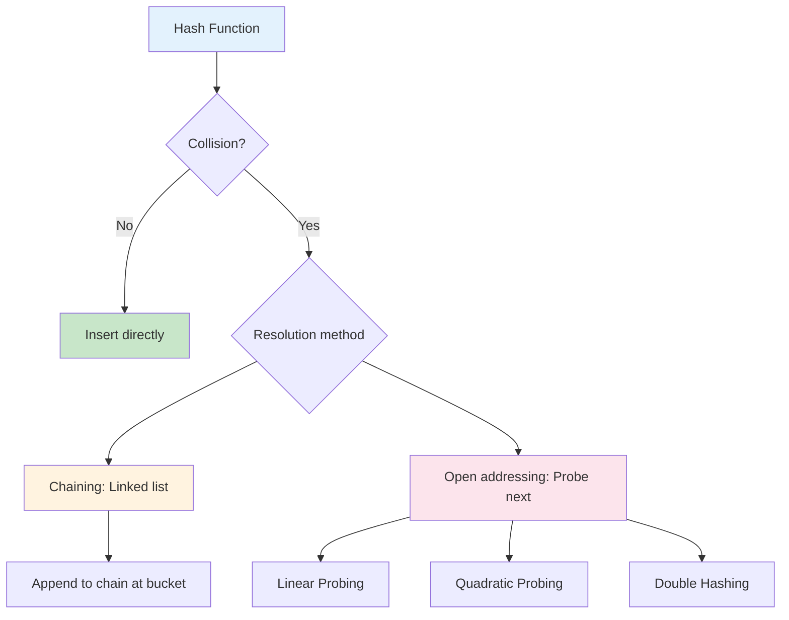
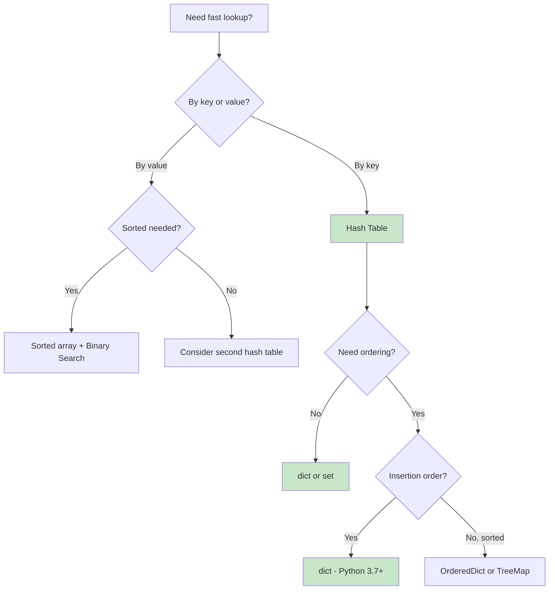
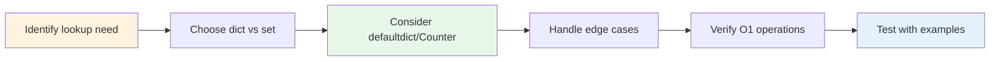

# Hash Tables

> **O(1) average-case lookups for key-value storage**

---

## Overview

A **hash table** (also known as hash map or dictionary) is a data structure that implements an associative array, mapping keys to values. It uses a **hash function** to compute an index into an array of buckets, from which the desired value can be found.

### What is a Hash Table?

Hash tables provide constant-time average-case complexity for insertions, deletions, and lookups, making them one of the most efficient data structures for key-value storage. The core idea involves two parts:

1. **Hash Function**: Transforms the search key into an array index
2. **Collision Resolution**: Handles cases where multiple keys hash to the same index

### How Hash Tables Work

```
Key "apple" --> hash("apple") --> 42 --> bucket[42] --> value "red"

               +--------+
    Key   -->  | Hash   |  --> Index --> +--------+--------+--------+
               | Function|               | Bucket | Bucket | Bucket |
               +--------+                |   0    |   1    |  ...   |
                                         +--------+--------+--------+
                                                    |
                                                    v
                                                  Value
```

**Key Characteristics:**
- **Key-Value Pairs**: Each entry consists of a unique key mapped to a value
- **Hash Function**: Converts keys to array indices (ideally with uniform distribution)
- **Buckets**: Array positions where values (or chains) are stored
- **Load Factor**: Ratio of entries to total buckets (n/m), affects performance

### When to Use Hash Tables

| Use Case | Why Hash Tables Work Well |
|----------|---------------------------|
| **Fast lookups by key** | O(1) average-case access |
| **Counting frequencies** | Increment counts in constant time |
| **Deduplication** | Sets provide O(1) membership testing |
| **Caching/Memoization** | Store computed results for reuse |
| **Graph adjacency lists** | Map nodes to their neighbors |
| **Two Sum style problems** | Find complements in O(n) |

### When to Consider Alternatives

| Limitation | Better Alternative |
|------------|-------------------|
| Need ordered iteration | Balanced BST (TreeMap) |
| Memory constrained | Array if keys are integers in small range |
| Range queries | Sorted array with binary search |
| Need minimum/maximum | Heap |
| Worst-case O(1) required | Perfect hashing (rare) |

---

## Document Structure

| Problem | Difficulty | Key Insight | Link |
|---------|------------|-------------|------|
| Two Sum | Easy | Complement lookup | [Link](./two-sum) |
| Contains Duplicate | Easy | Set membership | [Link](./contains-duplicate) |
| Valid Anagram | Easy | Character frequency | [Link](./valid-anagram) |
| First Non-Repeating Character | Easy | Count then scan | [Link](./first-non-repeating) |
| Ransom Note | Easy | Character availability | [Link](./ransom-note) |
| Maximum Profit (Best Time to Buy/Sell Stock) | Medium | Track min so far | [Link](./max-profit) |
| Group Anagrams | Medium | Sorted key grouping | [Link](./group-anagrams) |
| Longest Consecutive Sequence | Medium | Set for O(1) neighbor check | [Link](./longest-consecutive) |
| Subarray Sum Equals K | Medium | Prefix sum + hash map | [Link](./subarray-sum-k) |
| Top K Frequent Elements | Medium | Count + bucket sort/heap | [Link](./top-k-frequent) |
| LRU Cache | Medium | Hash map + doubly linked list | [Link](./lru-cache) |
| Design File System | Medium | Path to value mapping | [Link](./design-file-system) |
| Copy List with Random Pointer | Medium | Node mapping | [Link](./copy-random-list) |
| 4Sum II | Medium | Count pairs in two arrays | [Link](./four-sum-ii) |
| Longest Substring Without Repeating | Medium | Sliding window + set | [Link](./longest-substring) |
| Minimum Window Substring | Hard | Two hash maps for window | [Link](./minimum-window) |
| All O'one Data Structure | Hard | Hash map + doubly linked list | [Link](./all-oone) |
| Design HashMap | Easy | Implement hash table from scratch | [Link](./design-hashmap) |

---

## Hash Table Operations

| Operation | Average | Worst | Notes |
|-----------|---------|-------|-------|
| Insert | O(1) | O(n) | Worst case when all keys collide |
| Delete | O(1) | O(n) | Same collision scenario |
| Search | O(1) | O(n) | O(n) requires pathological hash function |
| Update | O(1) | O(n) | Search + overwrite |
| Resize | O(n) | O(n) | Rehash all elements |

### Load Factor and Performance

The **load factor** (alpha = n/m, where n = entries, m = buckets) critically affects performance:

| Load Factor | Effect |
|-------------|--------|
| alpha < 0.5 | Excellent performance, more memory |
| alpha ~ 0.7 | Good balance (common target) |
| alpha > 0.8 | Performance degrades, consider resize |
| alpha > 1.0 | Only possible with chaining |

**Python's dict** automatically resizes when load factor exceeds ~2/3, maintaining efficient operations.

---

## Collision Resolution

When two keys hash to the same index, we have a **collision**. There are two main strategies to handle this.

### Mermaid Diagram



### Chaining vs Open Addressing

| Aspect | Chaining (Separate) | Open Addressing (Closed) |
|--------|---------------------|--------------------------|
| **Structure** | Array of linked lists | Single array with probing |
| **Collision handling** | Append to chain | Find next open slot |
| **Load factor** | Can exceed 1.0 | Must stay below ~0.8 |
| **Memory** | Extra pointers overhead | More compact |
| **Cache performance** | Poor (pointer chasing) | Better (contiguous memory) |
| **Deletion** | Simple (remove from list) | Requires tombstones |
| **Implementation** | Easier | More complex |
| **Use case** | When load factor unknown | Memory-constrained systems |

### Chaining (Separate Chaining)

Each bucket contains a linked list of entries that hash to that index.

```python
# Chaining implementation sketch
class HashTableChaining:
    def __init__(self, size=16):
        self.buckets = [[] for _ in range(size)]

    def _hash(self, key):
        return hash(key) % len(self.buckets)

    def put(self, key, value):
        idx = self._hash(key)
        for i, (k, v) in enumerate(self.buckets[idx]):
            if k == key:
                self.buckets[idx][i] = (key, value)
                return
        self.buckets[idx].append((key, value))

    def get(self, key):
        idx = self._hash(key)
        for k, v in self.buckets[idx]:
            if k == key:
                return v
        return None
```

### Open Addressing

All elements stored in the array itself. When collision occurs, probe for next open slot.

**Linear Probing**: Check h(k), h(k)+1, h(k)+2, ...
- Simple but causes **clustering** (consecutive occupied slots)

**Quadratic Probing**: Check h(k), h(k)+1^2, h(k)+2^2, ...
- Reduces clustering but may not find empty slot even if one exists

**Double Hashing**: Use second hash function for step size
- h(k, i) = (h1(k) + i * h2(k)) % m
- Best distribution, most complex

```python
# Linear probing implementation sketch
class HashTableLinearProbing:
    def __init__(self, size=16):
        self.keys = [None] * size
        self.values = [None] * size
        self.size = size

    def _hash(self, key):
        return hash(key) % self.size

    def put(self, key, value):
        idx = self._hash(key)
        while self.keys[idx] is not None:
            if self.keys[idx] == key:
                self.values[idx] = value
                return
            idx = (idx + 1) % self.size  # Linear probe
        self.keys[idx] = key
        self.values[idx] = value
```

---

## Python dict & set Tips

Python's built-in `dict` and `set` are highly optimized hash tables. Master these for interviews.

### Built-in Hash Table Usage

```python
from collections import defaultdict, Counter
from typing import Dict, Set

# Basic dict operations
d: Dict[str, int] = {}
d['key'] = value           # Insert/update - O(1)
value = d['key']           # Access - O(1), raises KeyError if missing
value = d.get('key', 0)    # Access with default - O(1), no error
del d['key']               # Delete - O(1)
'key' in d                 # Membership - O(1)

# Set operations
s: Set[int] = set()
s.add(1)                   # Insert - O(1)
s.remove(1)                # Delete - O(1), raises KeyError if missing
s.discard(1)               # Delete - O(1), no error if missing
1 in s                     # Membership - O(1)
```

### defaultdict - Auto-initialize Missing Keys

```python
from collections import defaultdict

# Building adjacency list for graph
graph = defaultdict(list)
graph['a'].append('b')     # No KeyError, auto-creates empty list
graph['a'].append('c')
# graph = {'a': ['b', 'c']}

# Counting with defaultdict
word_count = defaultdict(int)
for word in words:
    word_count[word] += 1  # No need to check if key exists

# Grouping items
groups = defaultdict(list)
for item in items:
    groups[item.category].append(item)
```

### Counter - Frequency Counting

```python
from collections import Counter

# Count character frequencies
counts = Counter("abracadabra")
# Counter({'a': 5, 'b': 2, 'r': 2, 'c': 1, 'd': 1})

# Most common elements
counts.most_common(2)      # [('a', 5), ('b', 2)]

# Counter arithmetic
c1 = Counter("aab")
c2 = Counter("ab")
c1 - c2                    # Counter({'a': 1}) - subtract counts
c1 + c2                    # Counter({'a': 3, 'b': 2}) - add counts
c1 & c2                    # Counter({'a': 1, 'b': 1}) - intersection (min)
c1 | c2                    # Counter({'a': 2, 'b': 1}) - union (max)

# Check if anagram (useful pattern!)
Counter(s1) == Counter(s2) # True if anagrams
```

### Common Interview Patterns

```python
# Two Sum Pattern - O(n) with hash map
def two_sum(nums, target):
    seen = {}  # value -> index
    for i, num in enumerate(nums):
        complement = target - num
        if complement in seen:
            return [seen[complement], i]
        seen[num] = i
    return []

# Frequency Count Pattern
def find_majority(nums):
    counts = Counter(nums)
    for num, count in counts.items():
        if count > len(nums) // 2:
            return num
    return -1

# Grouping Pattern (Group Anagrams)
def group_anagrams(strs):
    groups = defaultdict(list)
    for s in strs:
        key = tuple(sorted(s))  # Sorted chars as key
        groups[key].append(s)
    return list(groups.values())

# Set for O(1) Lookup (Longest Consecutive Sequence)
def longest_consecutive(nums):
    num_set = set(nums)
    max_len = 0
    for num in num_set:
        if num - 1 not in num_set:  # Start of sequence
            length = 1
            while num + length in num_set:
                length += 1
            max_len = max(max_len, length)
    return max_len
```

### Hashable Requirements

Only **hashable** objects can be dictionary keys or set members:

```python
# Hashable (immutable) - CAN be keys
d[42] = "int"
d["hello"] = "string"
d[(1, 2, 3)] = "tuple"
d[frozenset([1, 2])] = "frozenset"

# NOT hashable (mutable) - CANNOT be keys
# d[[1, 2, 3]] = "list"      # TypeError!
# d[{1, 2, 3}] = "set"       # TypeError!
# d[{'a': 1}] = "dict"       # TypeError!

# Convert to hashable for use as key
tuple([1, 2, 3])             # (1, 2, 3)
frozenset({1, 2, 3})         # frozenset({1, 2, 3})
```

---

## When to Use Hash Tables

### Pattern Recognition

| If you see... | Think about... |
|--------------|----------------|
| "Find if exists" | Hash set for O(1) lookup |
| "Count occurrences" | Counter or defaultdict(int) |
| "Find pair that sums to" | Hash map for complement |
| "Group by property" | defaultdict(list) |
| "Remove duplicates" | Convert to set |
| "First/last occurrence" | Hash map storing index |
| "Subarray with sum K" | Prefix sum in hash map |
| "Longest substring with constraint" | Sliding window + hash map/set |
| "Design with O(1) operations" | Hash map + linked list |

### Decision Flowchart



---

## Google Interview Focus Areas

Based on recent Google SDE interview patterns (2025-2026), these hash table topics are most frequently tested:

### High Priority Topics

1. **Two Sum and Variants** - The classic complement lookup problem appears in multiple forms
2. **Frequency Counting** - First non-repeating character, top K frequent elements
3. **Grouping Problems** - Group anagrams, categorize by property
4. **Subarray Problems with Hash Maps** - Subarray sum equals K using prefix sums
5. **Design Questions** - LRU Cache, Design HashMap, All O(1) Data Structure

### Common Google Hash Table Questions

| Question Type | Example Problem | Key Insight |
|--------------|-----------------|-------------|
| Complement Lookup | "Find two numbers summing to target" | Store values in map, check for complement |
| Frequency Analysis | "Find first non-repeated character" | Count, then scan for count == 1 |
| String Matching | "Check if strings are anagrams" | Counter comparison |
| Subarray Sum | "Count subarrays with sum K" | prefix_sum - K in map |
| LRU Cache Design | "Implement cache with O(1) get/put" | Hash map + doubly linked list |
| File System Design | "Create/get paths in virtual FS" | Path string to value mapping |

### Real Interview Questions (Reported 2025-2026)

1. **Simple hashmap implementation** - Followed by questions about hash functions and collision handling
2. **File system design** (LC 1166) - Use HashMap to solve with follow-ups about performance
3. **HashMap vs Trie decision** - When to use each for dictionary storage
4. **Find pairs that add up to 10** - Classic two-sum variant
5. **Longest consecutive subsequence** - Use set for O(1) neighbor checking

### What Interviewers Look For

1. **Understanding Tradeoffs**
   - Why O(1) average but O(n) worst case?
   - When would you use TreeMap vs HashMap?
   - Memory vs time tradeoffs

2. **Hash Function Knowledge**
   - What makes a good hash function?
   - How does Python hash strings vs integers?
   - What happens with poor distribution?

3. **Implementation Details**
   - How does resizing work?
   - Explain chaining vs open addressing
   - How to handle deletions in open addressing?

4. **Code Quality**
   - Use appropriate Python idioms (Counter, defaultdict)
   - Handle edge cases (empty input, all duplicates)
   - Discuss complexity confidently

### Interview Strategy



---

## Practice Progression

### Week 1: Foundations

| Day | Focus | Problems |
|-----|-------|----------|
| 1 | Basic Operations | Two Sum, Contains Duplicate, Valid Anagram |
| 2 | Frequency Counting | First Non-Repeating Character, Ransom Note |
| 3 | Set Operations | Longest Consecutive Sequence, Intersection of Two Arrays |

### Week 2: Intermediate

| Day | Focus | Problems |
|-----|-------|----------|
| 4 | Grouping | Group Anagrams, Top K Frequent Elements |
| 5 | Prefix Sum + Hash | Subarray Sum Equals K, Contiguous Array |
| 6 | Sliding Window + Hash | Longest Substring Without Repeating, Minimum Window Substring |

### Week 3: Advanced & Design

| Day | Focus | Problems |
|-----|-------|----------|
| 7 | Design Problems | Design HashMap, LRU Cache |
| 8 | Complex Design | All O'one Data Structure, Design File System |
| 9 | Mixed Practice | Random selection from all patterns |

---

## Quick Reference Card

### Time Complexity Cheat Sheet

```
Insert:     O(1) average, O(n) worst
Lookup:     O(1) average, O(n) worst
Delete:     O(1) average, O(n) worst
Iterate:    O(n)
Resize:     O(n)
```

### Python Built-ins

```python
dict()              # Empty dictionary
set()               # Empty set (NOT {} which is dict!)
{k: v for k, v in pairs}  # Dict comprehension
{x for x in items}  # Set comprehension
defaultdict(list)   # Auto-initialize with empty list
defaultdict(int)    # Auto-initialize with 0
Counter(iterable)   # Frequency counter
```

### Common Mistakes to Avoid

| Mistake | Correct Approach |
|---------|------------------|
| `d[key]` on missing key | Use `d.get(key, default)` |
| Using mutable as key | Convert to tuple/frozenset |
| Modifying dict while iterating | Iterate over `list(d.keys())` |
| `{}` for empty set | Use `set()` |
| Forgetting hash collisions exist | Mention in complexity analysis |

---

## Resources

### Recommended Practice

- [LeetCode Hash Table Problems](https://leetcode.com/tag/hash-table/)
- [NeetCode Roadmap - Hashing Section](https://neetcode.io/roadmap)
- [Top 50 Hash Problems - GeeksforGeeks](https://www.geeksforgeeks.org/top-50-problems-on-hash-data-structure-asked-in-sde-interviews/)

### Further Reading

- [Hash Tables Interview Questions - GitHub](https://github.com/Devinterview-io/hash-table-data-structure-interview-questions)
- [Hash Tables Interview Tips - Interviewing.io](https://interviewing.io/hash-tables-interview-questions)
- [Google SDE Sheet - GeeksforGeeks](https://www.geeksforgeeks.org/google-sde-sheet-interview-questions-and-answers/)
- [Hash Table - Wikipedia](https://en.wikipedia.org/wiki/Hash_table)

---

*Last updated: January 2026*

*Hash tables are the workhorse of technical interviews. Their O(1) average-case operations make them essential for optimizing brute-force solutions. Master the patterns here, and you'll transform many O(n^2) algorithms into elegant O(n) solutions.*
