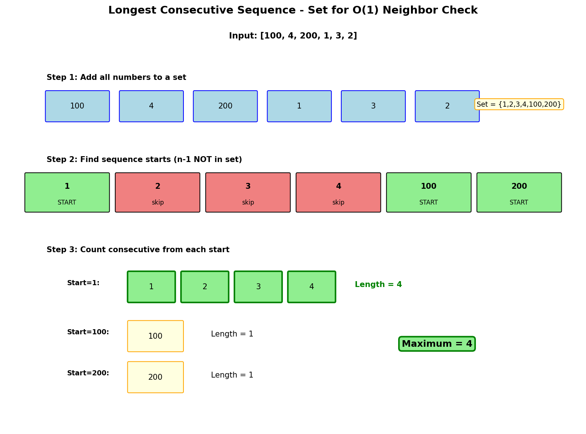

# Longest Consecutive Sequence

## Problem Statement

Given an unsorted array of integers `nums`, return the length of the longest consecutive elements sequence.

You must write an algorithm that runs in O(n) time.

**LeetCode:** [128. Longest Consecutive Sequence](https://leetcode.com/problems/longest-consecutive-sequence/)

## Examples

**Example 1:**
```
Input: nums = [100, 4, 200, 1, 3, 2]
Output: 4
Explanation: The longest consecutive elements sequence is [1, 2, 3, 4]. Therefore its length is 4.
```

**Example 2:**
```
Input: nums = [0, 3, 7, 2, 5, 8, 4, 6, 0, 1]
Output: 9
Explanation: The longest consecutive sequence is [0, 1, 2, 3, 4, 5, 6, 7, 8].
```

## Constraints

- `0 <= nums.length <= 10^5`
- `-10^9 <= nums[i] <= 10^9`

## Hash Set Approach



### Key Insight

For O(n) time, use a hash set for O(1) lookups. Only start counting from sequence starts (numbers with no predecessor in the set).

### Algorithm

1. Add all numbers to a hash set
2. For each number, check if it's a sequence start (n-1 not in set)
3. If it's a start, count consecutive numbers (n+1, n+2, ...)
4. Track the maximum length found

## Solution

```python
from typing import List

def longestConsecutive(nums: List[int]) -> int:
    """
    Find longest consecutive sequence.

    Time: O(n) - each number visited at most twice
    Space: O(n) - hash set storage
    """
    if not nums:
        return 0

    num_set = set(nums)
    max_length = 0

    for num in num_set:
        # Only start counting from sequence starts
        if num - 1 not in num_set:
            current_num = num
            current_length = 1

            # Count consecutive numbers
            while current_num + 1 in num_set:
                current_num += 1
                current_length += 1

            max_length = max(max_length, current_length)

    return max_length


# Alternative: Track visited numbers
def longestConsecutiveVisited(nums: List[int]) -> int:
    """
    Track visited numbers to avoid reprocessing.

    Time: O(n)
    Space: O(n)
    """
    if not nums:
        return 0

    num_set = set(nums)
    visited = set()
    max_length = 0

    for num in nums:
        if num in visited:
            continue

        length = 1
        visited.add(num)

        # Expand left
        left = num - 1
        while left in num_set:
            visited.add(left)
            length += 1
            left -= 1

        # Expand right
        right = num + 1
        while right in num_set:
            visited.add(right)
            length += 1
            right += 1

        max_length = max(max_length, length)

    return max_length
```

::: info Complexity: Time O(n) · Space O(n)
- **Time:** O(n) because each number is visited at most twice - once in the outer loop and once when extending a sequence
- **Space:** O(n) for storing all numbers in a hash set for O(1) lookups
:::

## Why O(n) Time?

The inner while loop might seem like it could cause O(n^2), but:
- Each number can only be the start of one sequence
- Each number is visited at most twice (once in outer loop, once in inner)
- Total iterations across all while loops = O(n)

## Complexity Analysis

| Approach | Time | Space |
|----------|------|-------|
| Hash Set | O(n) | O(n) |
| Sorting | O(n log n) | O(1) or O(n) |
| Union Find | O(n * α(n)) ≈ O(n) | O(n) |

## Sorting Approach (For Comparison)

```python
def longestConsecutiveSorting(nums: List[int]) -> int:
    """
    Sort and count consecutive.

    Time: O(n log n)
    Space: O(1) if in-place sort
    """
    if not nums:
        return 0

    nums.sort()

    max_length = 1
    current_length = 1

    for i in range(1, len(nums)):
        if nums[i] == nums[i - 1]:
            # Skip duplicates
            continue
        elif nums[i] == nums[i - 1] + 1:
            current_length += 1
        else:
            max_length = max(max_length, current_length)
            current_length = 1

    return max(max_length, current_length)
```

::: info Complexity: Time O(n log n) · Space O(1)
- **Time:** O(n log n) dominated by the sorting step, then O(n) for the linear scan
- **Space:** O(1) if sorting is done in-place, otherwise O(n) for sort buffer
:::

## Union-Find Approach

```python
class UnionFind:
    def __init__(self):
        self.parent = {}
        self.size = {}

    def find(self, x):
        if x not in self.parent:
            self.parent[x] = x
            self.size[x] = 1
        if self.parent[x] != x:
            self.parent[x] = self.find(self.parent[x])
        return self.parent[x]

    def union(self, x, y):
        px, py = self.find(x), self.find(y)
        if px == py:
            return
        if self.size[px] < self.size[py]:
            px, py = py, px
        self.parent[py] = px
        self.size[px] += self.size[py]

    def get_max_size(self):
        return max(self.size.values()) if self.size else 0


def longestConsecutiveUnionFind(nums: List[int]) -> int:
    """
    Union-Find approach.

    Time: O(n * α(n)) ≈ O(n)
    Space: O(n)
    """
    if not nums:
        return 0

    uf = UnionFind()
    num_set = set(nums)

    for num in nums:
        uf.find(num)  # Initialize
        if num - 1 in num_set:
            uf.union(num, num - 1)
        if num + 1 in num_set:
            uf.union(num, num + 1)

    return uf.get_max_size()
```

::: info Complexity: Time O(n) · Space O(n)
- **Time:** O(n * alpha(n)) which is effectively O(n) since inverse Ackermann function alpha(n) is nearly constant
- **Space:** O(n) for the Union-Find parent and size dictionaries plus the hash set
:::

## Edge Cases

1. **Empty array:** `[]` - Return 0
2. **Single element:** `[5]` - Return 1
3. **All same:** `[1,1,1]` - Return 1 (duplicates don't extend sequence)
4. **Negative numbers:** `[-1,0,1]` - Works correctly
5. **Large gaps:** `[1,100,200]` - Three sequences of length 1

## Variations

### Return the Sequence

```python
def longestConsecutiveSequence(nums: List[int]) -> List[int]:
    """Return the actual longest consecutive sequence."""
    if not nums:
        return []

    num_set = set(nums)
    max_length = 0
    best_start = None

    for num in num_set:
        if num - 1 not in num_set:
            current_num = num
            current_length = 1

            while current_num + 1 in num_set:
                current_num += 1
                current_length += 1

            if current_length > max_length:
                max_length = current_length
                best_start = num

    if best_start is None:
        return []

    return list(range(best_start, best_start + max_length))
```

### Count All Consecutive Sequences

```python
def countConsecutiveSequences(nums: List[int], min_length: int = 1) -> int:
    """Count number of consecutive sequences of at least min_length."""
    if not nums:
        return 0

    num_set = set(nums)
    count = 0

    for num in num_set:
        if num - 1 not in num_set:
            length = 1
            while num + length in num_set:
                length += 1
            if length >= min_length:
                count += 1

    return count
```

### Longest Consecutive Sequence in Matrix

```python
def longestConsecutiveMatrix(matrix: List[List[int]]) -> int:
    """
    Find longest consecutive sequence where consecutive
    numbers are adjacent (4-directionally).
    """
    if not matrix or not matrix[0]:
        return 0

    m, n = len(matrix), len(matrix[0])
    memo = {}

    def dfs(i, j, prev_val):
        if i < 0 or i >= m or j < 0 or j >= n:
            return 0
        if matrix[i][j] != prev_val + 1:
            return 0
        if (i, j) in memo:
            return memo[(i, j)]

        result = 1 + max(
            dfs(i+1, j, matrix[i][j]),
            dfs(i-1, j, matrix[i][j]),
            dfs(i, j+1, matrix[i][j]),
            dfs(i, j-1, matrix[i][j])
        )
        memo[(i, j)] = result
        return result

    max_len = 0
    for i in range(m):
        for j in range(n):
            # Check if this could be a sequence start
            val = matrix[i][j]
            is_start = True
            for di, dj in [(0,1),(0,-1),(1,0),(-1,0)]:
                ni, nj = i + di, j + dj
                if 0 <= ni < m and 0 <= nj < n and matrix[ni][nj] == val - 1:
                    is_start = False
                    break
            if is_start:
                max_len = max(max_len, 1 + max(
                    dfs(i+1, j, val),
                    dfs(i-1, j, val),
                    dfs(i, j+1, val),
                    dfs(i, j-1, val)
                ))

    return max_len
```

## Related Problems

::: details Binary Tree Longest Consecutive Sequence (LeetCode 298)
**Problem:** Find longest consecutive sequence path in binary tree (parent to child only).

**Key Insight:** DFS tracking current sequence length. Reset or extend at each node.

**Approach:** Pass expected value to children. If child matches, extend count; otherwise restart.

**Complexity:** Time O(n), Space O(h)
:::

::: details Binary Tree Longest Consecutive Sequence II (LeetCode 549)
**Problem:** Find longest consecutive sequence path that can go child-parent-child.

**Key Insight:** Track both increasing and decreasing paths from each node.

**Approach:** DFS returning (increasing_length, decreasing_length). Combine across root.

**Complexity:** Time O(n), Space O(h)
:::

::: details Longest Continuous Increasing Subsequence (LeetCode 674)
**Problem:** Find length of longest contiguous strictly increasing subarray.

**Key Insight:** Simple linear scan, reset count when sequence breaks.

**Approach:** Track current length, reset to 1 when current <= previous. Track max seen.

**Complexity:** Time O(n), Space O(1)
:::

::: details Maximum Consecutive Floors Without Special Floors (LeetCode 2274)
**Problem:** Find maximum number of consecutive floors without special floors.

**Key Insight:** Sort special floors, find max gap between consecutive special floors.

**Approach:** Sort special array. Max gap is max(special[i] - special[i-1] - 1) plus boundaries.

**Complexity:** Time O(n log n), Space O(1)
:::
