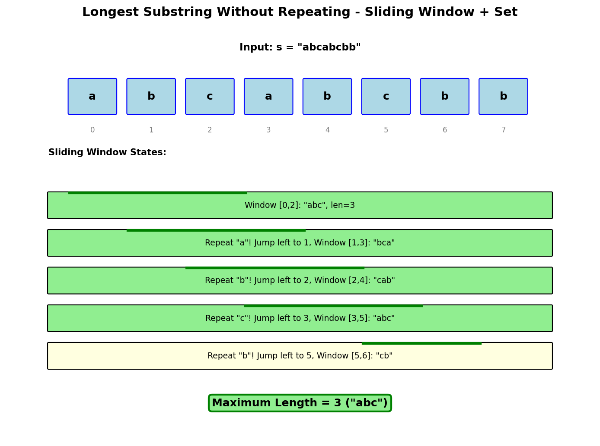

# Longest Substring Without Repeating Characters

## Problem Statement

Given a string `s`, find the length of the longest substring without repeating characters.

**LeetCode:** [3. Longest Substring Without Repeating Characters](https://leetcode.com/problems/longest-substring-without-repeating-characters/)

## Examples

**Example 1:**
```
Input: s = "abcabcbb"
Output: 3
Explanation: The answer is "abc", with the length of 3.
```

**Example 2:**
```
Input: s = "bbbbb"
Output: 1
Explanation: The answer is "b", with the length of 1.
```

**Example 3:**
```
Input: s = "pwwkew"
Output: 3
Explanation: The answer is "wke", with the length of 3.
Note that "pwke" is a subsequence, not a substring.
```

## Constraints

- `0 <= s.length <= 5 * 10^4`
- `s` consists of English letters, digits, symbols and spaces.

## Sliding Window with Hash Map



### Key Insight

Use a sliding window with a hash map to track character positions. When a repeat is found, jump the left pointer past the previous occurrence.

### Algorithm

1. Maintain a window `[left, right]` with no repeating characters
2. Use hash map to store each character's last seen index
3. When a repeat is found at `right`, move `left` to max(left, last_index + 1)
4. Track maximum window size

## Solution

```python
def lengthOfLongestSubstring(s: str) -> int:
    """
    Find longest substring without repeating characters.

    Time: O(n) - single pass
    Space: O(min(n, m)) where m is charset size
    """
    char_index = {}  # char -> last seen index
    max_length = 0
    left = 0

    for right, char in enumerate(s):
        # If char was seen and is within current window
        if char in char_index and char_index[char] >= left:
            left = char_index[char] + 1

        char_index[char] = right
        max_length = max(max_length, right - left + 1)

    return max_length
```

::: info Complexity: Time O(n) · Space O(min(n, m))
- **Time:** Single pass with O(1) hash map operations; left pointer only moves forward, never backward
- **Space:** Hash map stores at most min(n, m) entries where m is the character set size (e.g., 26 for lowercase, 128 for ASCII)
:::

```python
# Alternative: Using set (slightly different approach)
def lengthOfLongestSubstringSet(s: str) -> int:
    """
    Using set to track characters in current window.

    Time: O(2n) = O(n) - each char visited at most twice
    Space: O(min(n, m))
    """
    char_set = set()
    max_length = 0
    left = 0

    for right, char in enumerate(s):
        while char in char_set:
            char_set.remove(s[left])
            left += 1

        char_set.add(char)
        max_length = max(max_length, right - left + 1)

    return max_length
```

::: info Complexity: Time O(n) · Space O(min(n, m))
- **Time:** Each character is added and removed from set at most once - worst case 2n operations = O(n)
- **Space:** Set contains only characters in current window, bounded by charset size
:::

```python
# Optimized for ASCII (fixed array)
def lengthOfLongestSubstringASCII(s: str) -> int:
    """
    Optimized for ASCII characters using array.

    Time: O(n)
    Space: O(1) - fixed 128 array
    """
    # -1 means character not seen yet
    last_index = [-1] * 128
    max_length = 0
    left = 0

    for right, char in enumerate(s):
        idx = ord(char)
        if last_index[idx] >= left:
            left = last_index[idx] + 1

        last_index[idx] = right
        max_length = max(max_length, right - left + 1)

    return max_length
```

::: info Complexity: Time O(n) · Space O(1)
- **Time:** Single pass through string with O(1) array access per character
- **Space:** Fixed 128-element array regardless of input size (constant for ASCII charset)
:::

## Complexity Analysis

| Approach | Time | Space |
|----------|------|-------|
| Hash Map (jump) | O(n) | O(min(n, m)) |
| Hash Set (shrink) | O(n) | O(min(n, m)) |
| ASCII Array | O(n) | O(1) |

Where m is the size of the character set.

## Visual Walkthrough

For `s = "abcabcbb"`:

```
Step 1: a -> window [a], left=0, max=1
Step 2: b -> window [ab], left=0, max=2
Step 3: c -> window [abc], left=0, max=3
Step 4: a -> repeat! Jump left to 1, window [bca], max=3
Step 5: b -> repeat! Jump left to 2, window [cab], max=3
Step 6: c -> repeat! Jump left to 3, window [abc], max=3
Step 7: b -> repeat! Jump left to 5, window [cb], max=3
Step 8: b -> repeat! Jump left to 7, window [b], max=3
Result: 3
```

## Edge Cases

1. **Empty string:** `""` - Return 0
2. **Single character:** `"a"` - Return 1
3. **All same:** `"aaaa"` - Return 1
4. **All unique:** `"abcd"` - Return 4
5. **Spaces and symbols:** `"a b"` - Space counts as character

## Variations

### Return the Substring

```python
def longestSubstringWithoutRepeating(s: str) -> str:
    """Return the actual longest substring."""
    if not s:
        return ""

    char_index = {}
    max_length = 0
    max_start = 0
    left = 0

    for right, char in enumerate(s):
        if char in char_index and char_index[char] >= left:
            left = char_index[char] + 1

        char_index[char] = right

        if right - left + 1 > max_length:
            max_length = right - left + 1
            max_start = left

    return s[max_start:max_start + max_length]
```

::: info Complexity: Time O(n) · Space O(min(n, m))
- **Time:** Same as standard solution - single pass with O(1) hash operations
- **Space:** Hash map for character indices plus O(1) tracking variables
:::

### Longest Substring with At Most K Distinct Characters

```python
def lengthOfLongestSubstringKDistinct(s: str, k: int) -> int:
    """
    Find longest substring with at most k distinct characters.

    Time: O(n)
    Space: O(k)
    """
    from collections import defaultdict

    if k == 0:
        return 0

    char_count = defaultdict(int)
    max_length = 0
    left = 0

    for right, char in enumerate(s):
        char_count[char] += 1

        while len(char_count) > k:
            char_count[s[left]] -= 1
            if char_count[s[left]] == 0:
                del char_count[s[left]]
            left += 1

        max_length = max(max_length, right - left + 1)

    return max_length
```

::: info Complexity: Time O(n) · Space O(k)
- **Time:** Each character added/removed from window at most once; while loop amortizes to O(n) total
- **Space:** Hash map stores at most k+1 distinct characters before shrinking
:::

### Longest Substring with At Most Two Distinct Characters

```python
def lengthOfLongestSubstringTwoDistinct(s: str) -> int:
    """Special case of k=2."""
    return lengthOfLongestSubstringKDistinct(s, 2)
```

### Longest Repeating Character Replacement

```python
def characterReplacement(s: str, k: int) -> int:
    """
    Find longest substring where you can replace at most k characters
    to make all characters the same.

    Time: O(n)
    Space: O(1) - at most 26 characters
    """
    count = {}
    max_length = 0
    max_count = 0  # Count of most frequent char in window
    left = 0

    for right, char in enumerate(s):
        count[char] = count.get(char, 0) + 1
        max_count = max(max_count, count[char])

        # Window is invalid if we need to replace more than k chars
        while (right - left + 1) - max_count > k:
            count[s[left]] -= 1
            left += 1

        max_length = max(max_length, right - left + 1)

    return max_length
```

::: info Complexity: Time O(n) · Space O(1)
- **Time:** Single pass; max_count never decreases so window only shrinks by 1 at a time
- **Space:** At most 26 entries in count map for uppercase English letters
:::

### Minimum Window Substring (Different Problem)

```python
def minWindow(s: str, t: str) -> str:
    """
    Find minimum window in s containing all characters of t.
    See minimum-window.md for full solution.
    """
    pass  # Covered in separate file
```

## Interview Tips

1. **Clarify character set:** ASCII? Unicode? Lowercase only?
2. **Discuss trade-offs:** Hash map vs set approaches
3. **Explain the jump:** Why we can jump `left` directly
4. **Walk through example:** Show window sliding visually

## Common Mistakes

1. Not handling the case where repeat is outside current window
2. Off-by-one errors in window boundaries
3. Not updating max length at each step
4. Forgetting to handle empty string

## Related Problems

::: details Longest Substring with At Most Two Distinct Characters (LeetCode 159)
**Problem:** Find longest substring containing at most two distinct characters.

**Key Insight:** Sliding window with hash map tracking character counts. Shrink when more than 2 distinct.

**Approach:** Expand window, track char counts. When > 2 distinct, shrink from left until <= 2.

**Complexity:** Time O(n), Space O(1)
:::

::: details Longest Substring with At Most K Distinct Characters (LeetCode 340)
**Problem:** Find longest substring containing at most k distinct characters.

**Key Insight:** Generalization of the two distinct characters problem. Same sliding window approach.

**Approach:** Expand window, track distinct count. When > k, shrink from left removing chars with zero count.

**Complexity:** Time O(n), Space O(k)
:::

::: details Longest Repeating Character Replacement (LeetCode 424)
**Problem:** Find longest substring with same characters after at most k replacements.

**Key Insight:** Window is valid if (length - max_frequency) <= k. Track frequency of most common char.

**Approach:** Expand window, track max frequency. If replacements needed > k, shrink from left.

**Complexity:** Time O(n), Space O(1)
:::

::: details Minimum Window Substring (LeetCode 76)
**Problem:** Find minimum window in s containing all characters of t.

**Key Insight:** Use two hash maps: required counts and window counts. Track how many unique chars are satisfied.

**Approach:** Expand to find valid window, then shrink to find minimum. Track best window found.

**Complexity:** Time O(n), Space O(k)
:::

::: details Permutation in String (LeetCode 567)
**Problem:** Return true if s2 contains a permutation of s1.

**Key Insight:** Permutation has same character frequency. Use fixed-size sliding window equal to s1 length.

**Approach:** Compare frequency counts of window with s1 frequencies. Slide window checking for match.

**Complexity:** Time O(n), Space O(1)
:::
