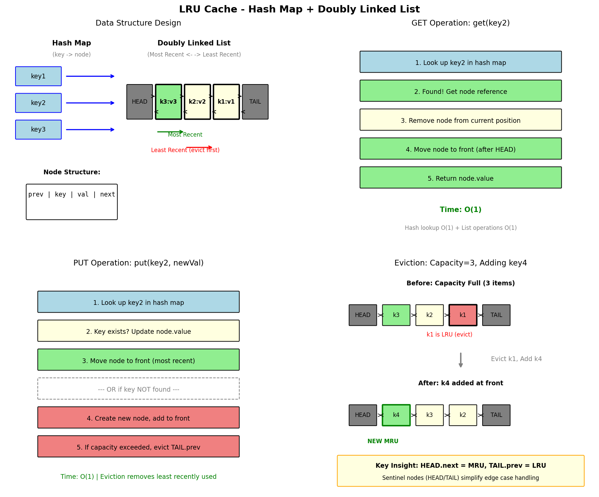

# LRU Cache

## Problem Statement

Design a data structure that follows the constraints of a Least Recently Used (LRU) cache.

Implement the `LRUCache` class:

- `LRUCache(int capacity)` Initialize the LRU cache with positive size capacity.
- `int get(int key)` Return the value of the key if the key exists, otherwise return -1.
- `void put(int key, int value)` Update the value of the key if the key exists. Otherwise, add the key-value pair to the cache. If the number of keys exceeds the capacity, evict the least recently used key.

The functions `get` and `put` must each run in **O(1)** average time complexity.

**LeetCode:** [146. LRU Cache](https://leetcode.com/problems/lru-cache/)

## Examples

**Example 1:**
```
Input:
["LRUCache", "put", "put", "get", "put", "get", "put", "get", "get", "get"]
[[2], [1, 1], [2, 2], [1], [3, 3], [2], [4, 4], [1], [3], [4]]

Output:
[null, null, null, 1, null, -1, null, -1, 3, 4]

Explanation:
LRUCache lRUCache = new LRUCache(2);
lRUCache.put(1, 1); // cache is {1=1}
lRUCache.put(2, 2); // cache is {1=1, 2=2}
lRUCache.get(1);    // return 1, cache is {2=2, 1=1}
lRUCache.put(3, 3); // evicts key 2, cache is {1=1, 3=3}
lRUCache.get(2);    // returns -1 (not found)
lRUCache.put(4, 4); // evicts key 1, cache is {3=3, 4=4}
lRUCache.get(1);    // return -1 (not found)
lRUCache.get(3);    // return 3, cache is {4=4, 3=3}
lRUCache.get(4);    // return 4, cache is {3=3, 4=4}
```

## Constraints

- `1 <= capacity <= 3000`
- `0 <= key <= 10^4`
- `0 <= value <= 10^5`
- At most `2 * 10^5` calls will be made to `get` and `put`.

## Hash Map + Doubly Linked List Approach



### Key Insight

- **Hash Map:** O(1) key lookup to find nodes
- **Doubly Linked List:** O(1) insertion/deletion to maintain recency order

### Data Structure

```
HashMap: key -> Node pointer

Doubly Linked List:
Head <-> Node(k1,v1) <-> Node(k2,v2) <-> ... <-> Tail
         (LRU)                              (MRU)
```

## Solution

```python
class ListNode:
    """Doubly linked list node."""
    def __init__(self, key: int = 0, val: int = 0):
        self.key = key
        self.val = val
        self.prev = None
        self.next = None


class LRUCache:
    """
    LRU Cache using HashMap + Doubly Linked List.

    Time: O(1) for get and put
    Space: O(capacity)
    """

    def __init__(self, capacity: int):
        self.capacity = capacity
        self.cache = {}  # key -> ListNode

        # Dummy head and tail for easier operations
        self.head = ListNode()
        self.tail = ListNode()
        self.head.next = self.tail
        self.tail.prev = self.head

    def _remove(self, node: ListNode) -> None:
        """Remove node from linked list."""
        node.prev.next = node.next
        node.next.prev = node.prev

    def _add_to_end(self, node: ListNode) -> None:
        """Add node to end (most recently used)."""
        node.prev = self.tail.prev
        node.next = self.tail
        self.tail.prev.next = node
        self.tail.prev = node

    def _move_to_end(self, node: ListNode) -> None:
        """Move existing node to end (mark as recently used)."""
        self._remove(node)
        self._add_to_end(node)

    def get(self, key: int) -> int:
        """Get value and mark as recently used."""
        if key not in self.cache:
            return -1

        node = self.cache[key]
        self._move_to_end(node)
        return node.val

    def put(self, key: int, value: int) -> None:
        """Add or update key-value pair."""
        if key in self.cache:
            # Update existing
            node = self.cache[key]
            node.val = value
            self._move_to_end(node)
        else:
            # Add new
            if len(self.cache) >= self.capacity:
                # Evict LRU (node after head)
                lru = self.head.next
                self._remove(lru)
                del self.cache[lru.key]

            # Add new node
            node = ListNode(key, value)
            self.cache[key] = node
            self._add_to_end(node)
```

::: info Complexity: Time O(1) · Space O(capacity)
- **Time:** O(1) for both get and put operations - hash map provides O(1) lookup, doubly linked list provides O(1) insertion/deletion
- **Space:** O(capacity) for storing at most capacity key-value pairs in the hash map and linked list
:::

## Using Python's OrderedDict

```python
from collections import OrderedDict

class LRUCacheOrderedDict(OrderedDict):
    """
    LRU Cache using OrderedDict.
    OrderedDict maintains insertion order and supports move_to_end.
    """

    def __init__(self, capacity: int):
        super().__init__()
        self.capacity = capacity

    def get(self, key: int) -> int:
        if key not in self:
            return -1
        self.move_to_end(key)
        return self[key]

    def put(self, key: int, value: int) -> None:
        if key in self:
            self.move_to_end(key)
        self[key] = value
        if len(self) > self.capacity:
            self.popitem(last=False)  # Remove first (LRU)
```

::: info Complexity: Time O(1) · Space O(capacity)
- **Time:** O(1) for get and put - OrderedDict internally uses hash map and doubly linked list
- **Space:** O(capacity) for storing the key-value pairs in the OrderedDict
:::

## Complexity Analysis

| Operation | Time | Space |
|-----------|------|-------|
| get | O(1) | - |
| put | O(1) | - |
| Space | - | O(capacity) |

## Why Doubly Linked List?

- **Singly Linked List:** Deletion requires O(n) to find previous node
- **Doubly Linked List:** Deletion is O(1) with direct node reference

## Edge Cases

1. **Capacity 1:** Only one element, frequent evictions
2. **Update existing key:** Should move to end (recently used)
3. **Get non-existent key:** Return -1, no state change
4. **Repeated access:** Should update recency each time

## Variations

### LRU Cache with TTL (Time-To-Live)

```python
import time

class LRUCacheWithTTL:
    """LRU Cache with expiration time."""

    def __init__(self, capacity: int, ttl: float):
        self.capacity = capacity
        self.ttl = ttl
        self.cache = OrderedDict()  # key -> (value, timestamp)

    def _is_expired(self, key: int) -> bool:
        if key not in self.cache:
            return True
        _, timestamp = self.cache[key]
        return time.time() - timestamp > self.ttl

    def _cleanup_expired(self) -> None:
        """Remove all expired entries."""
        expired = [k for k in self.cache if self._is_expired(k)]
        for k in expired:
            del self.cache[k]

    def get(self, key: int) -> int:
        if key not in self.cache or self._is_expired(key):
            if key in self.cache:
                del self.cache[key]
            return -1

        value, _ = self.cache[key]
        # Update timestamp and move to end
        self.cache[key] = (value, time.time())
        self.cache.move_to_end(key)
        return value

    def put(self, key: int, value: int) -> None:
        self._cleanup_expired()

        if key in self.cache:
            self.cache.move_to_end(key)

        self.cache[key] = (value, time.time())

        if len(self.cache) > self.capacity:
            self.cache.popitem(last=False)
```

### LFU Cache (Least Frequently Used)

```python
from collections import defaultdict

class LFUCache:
    """
    Least Frequently Used Cache.
    Evicts least frequently used; ties broken by LRU.
    """

    def __init__(self, capacity: int):
        self.capacity = capacity
        self.min_freq = 0
        self.key_to_val = {}
        self.key_to_freq = {}
        self.freq_to_keys = defaultdict(OrderedDict)

    def _update_freq(self, key: int) -> None:
        """Increment frequency of key."""
        freq = self.key_to_freq[key]
        self.key_to_freq[key] = freq + 1

        # Remove from current frequency list
        del self.freq_to_keys[freq][key]
        if not self.freq_to_keys[freq]:
            del self.freq_to_keys[freq]
            if self.min_freq == freq:
                self.min_freq += 1

        # Add to new frequency list
        self.freq_to_keys[freq + 1][key] = None

    def get(self, key: int) -> int:
        if key not in self.key_to_val:
            return -1

        self._update_freq(key)
        return self.key_to_val[key]

    def put(self, key: int, value: int) -> None:
        if self.capacity <= 0:
            return

        if key in self.key_to_val:
            self.key_to_val[key] = value
            self._update_freq(key)
            return

        if len(self.key_to_val) >= self.capacity:
            # Evict LFU (and LRU among ties)
            evict_key, _ = self.freq_to_keys[self.min_freq].popitem(last=False)
            del self.key_to_val[evict_key]
            del self.key_to_freq[evict_key]

        # Add new key
        self.key_to_val[key] = value
        self.key_to_freq[key] = 1
        self.freq_to_keys[1][key] = None
        self.min_freq = 1
```

### Thread-Safe LRU Cache

```python
import threading

class ThreadSafeLRUCache:
    """Thread-safe LRU Cache with locks."""

    def __init__(self, capacity: int):
        self.cache = LRUCacheOrderedDict(capacity)
        self.lock = threading.RLock()

    def get(self, key: int) -> int:
        with self.lock:
            return self.cache.get(key)

    def put(self, key: int, value: int) -> None:
        with self.lock:
            self.cache.put(key, value)
```

## Interview Tips

1. **Clarify requirements:** Thread safety? TTL? Eviction callback?
2. **Draw the data structure:** Visualize HashMap + DLL
3. **Walk through operations:** Show how get/put modify the structure
4. **Discuss alternatives:** OrderedDict, LinkedHashMap (Java)

## Common Mistakes

1. Not handling key update (should move to end)
2. Off-by-one errors with dummy nodes
3. Forgetting to update HashMap when evicting
4. Not moving node on get (only on put)

## Related Problems

::: details LFU Cache (LeetCode 460)
**Problem:** Least Frequently Used cache with O(1) get/put.

**Key Insight:** Track frequency of each key. Multiple lists for each frequency level.

**Approach:** Hash map for key lookup, frequency buckets with doubly linked lists, track min frequency.

**Complexity:** Time O(1) for get/put, Space O(capacity)
:::

::: details All O(1) Data Structure (LeetCode 432)
**Problem:** Design data structure for inc/dec/getMaxKey/getMinKey all in O(1).

**Key Insight:** Doubly linked list of frequency buckets, hash map for O(1) key lookup.

**Approach:** Each bucket contains keys with same count. Move keys between buckets on inc/dec.

**Complexity:** Time O(1) for all operations, Space O(n)
:::

::: details Design Twitter (LeetCode 355)
**Problem:** Design simplified Twitter with post, follow, getNewsFeed.

**Key Insight:** Merge k sorted lists for news feed. Hash maps for followers and tweets.

**Approach:** Each user has tweet list with timestamps. Merge-k algorithm for feed.

**Complexity:** getNewsFeed O(k log k) where k is following count
:::

::: details Insert Delete GetRandom O(1) (LeetCode 380)
**Problem:** Design data structure with O(1) insert, delete, and getRandom.

**Key Insight:** Array for O(1) random access, hash map for O(1) lookup. Swap-delete trick.

**Approach:** Store elements in array, map values to indices. Swap with last element for O(1) delete.

**Complexity:** Time O(1) for all operations, Space O(n)
:::
