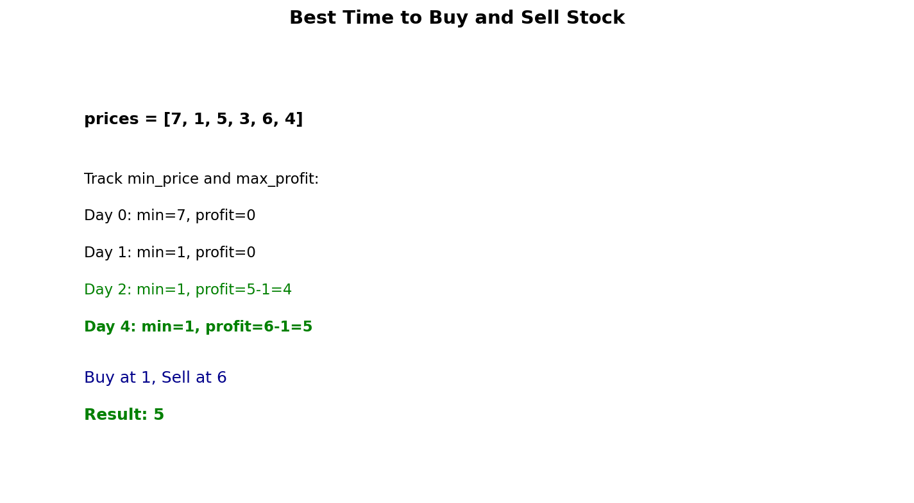

# Best Time to Buy and Sell Stock

## Problem Statement

You are given an array `prices` where `prices[i]` is the price of a given stock on the `i`th day.

You want to maximize your profit by choosing a single day to buy one stock and choosing a different day in the future to sell that stock.

Return the maximum profit you can achieve from this transaction. If you cannot achieve any profit, return `0`.

**LeetCode:** [121. Best Time to Buy and Sell Stock](https://leetcode.com/problems/best-time-to-buy-and-sell-stock/)

## Examples

**Example 1:**
```
Input: prices = [7,1,5,3,6,4]
Output: 5
Explanation: Buy on day 2 (price = 1) and sell on day 5 (price = 6), profit = 6-1 = 5.
Note that buying on day 2 and selling on day 1 is not allowed because you must buy before you sell.
```

**Example 2:**
```
Input: prices = [7,6,4,3,1]
Output: 0
Explanation: In this case, no transactions are done and the max profit = 0.
```

## Constraints

- `1 <= prices.length <= 10^5`
- `0 <= prices[i] <= 10^4`

## One Pass Approach



### Key Insight

Track the minimum price seen so far. At each day, calculate potential profit if we sold today, and update max profit.

### Algorithm

1. Initialize `min_price` to infinity, `max_profit` to 0
2. For each price:
   - Update `min_price` if current price is lower
   - Calculate profit if selling today: `price - min_price`
   - Update `max_profit` if this profit is higher
3. Return `max_profit`

## Solution

```python
from typing import List

def maxProfit(prices: List[int]) -> int:
    """
    Find maximum profit from single buy and sell.

    Time: O(n) - single pass
    Space: O(1) - constant space
    """
    min_price = float('inf')
    max_profit = 0

    for price in prices:
        if price < min_price:
            min_price = price
        elif price - min_price > max_profit:
            max_profit = price - min_price

    return max_profit


# Alternative: More explicit
def maxProfitExplicit(prices: List[int]) -> int:
    """Clearer variable naming."""
    if not prices:
        return 0

    min_price_so_far = prices[0]
    max_profit_so_far = 0

    for price in prices[1:]:
        # Could we have bought cheaper before?
        min_price_so_far = min(min_price_so_far, price)

        # What's the profit if we sell today?
        profit_if_sold_today = price - min_price_so_far

        # Update max profit
        max_profit_so_far = max(max_profit_so_far, profit_if_sold_today)

    return max_profit_so_far


# With buy/sell day tracking
def maxProfitWithDays(prices: List[int]) -> tuple:
    """
    Return (max_profit, buy_day, sell_day).

    Time: O(n)
    Space: O(1)
    """
    if len(prices) < 2:
        return (0, -1, -1)

    min_price = prices[0]
    min_day = 0
    max_profit = 0
    buy_day = -1
    sell_day = -1

    for i in range(1, len(prices)):
        if prices[i] < min_price:
            min_price = prices[i]
            min_day = i
        elif prices[i] - min_price > max_profit:
            max_profit = prices[i] - min_price
            buy_day = min_day
            sell_day = i

    return (max_profit, buy_day, sell_day)
```

::: info Complexity: Time O(n) · Space O(1)
- **Time:** O(n) for single pass through the prices array, tracking minimum and calculating profit at each step
- **Space:** O(1) using only constant extra variables regardless of input size
:::

## Complexity Analysis

| Approach | Time | Space |
|----------|------|-------|
| One Pass | O(n) | O(1) |
| Brute Force | O(n^2) | O(1) |

## Why This Works

The key observation is that we want to find:
- The minimum price before any given day (potential buy point)
- The maximum difference between a price and the minimum before it

By tracking `min_price` as we go, we ensure we're always considering the best possible buy point for any sell day.

## Edge Cases

1. **Single price:** `[5]` - Cannot make any transaction, return 0
2. **Decreasing prices:** `[5,4,3,2,1]` - No profit possible, return 0
3. **All same prices:** `[3,3,3,3]` - No profit, return 0
4. **Min at end:** `[5,4,3,2,1,10]` - Wait for price at end

## Variations

### Best Time to Buy and Sell Stock II (Multiple Transactions)

```python
def maxProfitII(prices: List[int]) -> int:
    """
    Multiple transactions allowed (but not simultaneous).
    Greedy: capture all upward movements.

    Time: O(n)
    Space: O(1)
    """
    max_profit = 0

    for i in range(1, len(prices)):
        if prices[i] > prices[i - 1]:
            max_profit += prices[i] - prices[i - 1]

    return max_profit
```

### Best Time to Buy and Sell Stock III (At Most 2 Transactions)

```python
def maxProfitIII(prices: List[int]) -> int:
    """
    At most 2 transactions.

    Time: O(n)
    Space: O(1)
    """
    buy1 = buy2 = float('inf')
    profit1 = profit2 = 0

    for price in prices:
        # First transaction
        buy1 = min(buy1, price)
        profit1 = max(profit1, price - buy1)

        # Second transaction (buy2 uses profit from first)
        buy2 = min(buy2, price - profit1)
        profit2 = max(profit2, price - buy2)

    return profit2
```

### Best Time to Buy and Sell Stock IV (At Most K Transactions)

```python
def maxProfitIV(k: int, prices: List[int]) -> int:
    """
    At most k transactions.

    Time: O(n*k)
    Space: O(k)
    """
    if not prices or k == 0:
        return 0

    n = len(prices)

    # If k >= n/2, it's like unlimited transactions
    if k >= n // 2:
        return sum(max(0, prices[i] - prices[i-1])
                   for i in range(1, n))

    # DP approach
    buy = [float('inf')] * (k + 1)
    profit = [0] * (k + 1)

    for price in prices:
        for i in range(1, k + 1):
            buy[i] = min(buy[i], price - profit[i - 1])
            profit[i] = max(profit[i], price - buy[i])

    return profit[k]
```

### With Cooldown

```python
def maxProfitWithCooldown(prices: List[int]) -> int:
    """
    After selling, must wait one day before buying again.

    Time: O(n)
    Space: O(1)
    """
    if len(prices) < 2:
        return 0

    sold = 0           # Max profit ending with sell
    held = -prices[0]  # Max profit holding stock
    rest = 0           # Max profit in cooldown

    for i in range(1, len(prices)):
        prev_sold = sold
        sold = held + prices[i]
        held = max(held, rest - prices[i])
        rest = max(rest, prev_sold)

    return max(sold, rest)
```

### With Transaction Fee

```python
def maxProfitWithFee(prices: List[int], fee: int) -> int:
    """
    Each transaction has a fee.

    Time: O(n)
    Space: O(1)
    """
    cash = 0            # Max profit not holding stock
    hold = -prices[0]   # Max profit holding stock

    for i in range(1, len(prices)):
        cash = max(cash, hold + prices[i] - fee)
        hold = max(hold, cash - prices[i])

    return cash
```

## Related Problems

::: details Best Time to Buy and Sell Stock II (LeetCode 122)
**Problem:** Maximum profit with unlimited transactions.

**Key Insight:** Collect every upward movement. Buy every valley, sell every peak.

**Approach:** Sum all positive differences between consecutive days.

**Complexity:** Time O(n), Space O(1)
:::

::: details Best Time to Buy and Sell Stock III (LeetCode 123)
**Problem:** Maximum profit with at most 2 transactions.

**Key Insight:** Track best profit from left and right separately, find optimal split point.

**Approach:** DP with states: buy1, sell1, buy2, sell2. Or split array approach.

**Complexity:** Time O(n), Space O(1)
:::

::: details Best Time to Buy and Sell Stock IV (LeetCode 188)
**Problem:** Maximum profit with at most k transactions.

**Key Insight:** Generalization of Stock III. DP with k transaction states.

**Approach:** dp[i][j] = max profit with i transactions on first j days. Use buy/sell states.

**Complexity:** Time O(nk), Space O(k)
:::

::: details Best Time to Buy and Sell Stock with Cooldown (LeetCode 309)
**Problem:** Maximum profit with cooldown day after selling.

**Key Insight:** Three states: hold, sold (cooldown), rest. State machine DP.

**Approach:** Track max profit in each state. sold -> rest, rest -> hold or rest, hold -> sold or hold.

**Complexity:** Time O(n), Space O(1)
:::

::: details Best Time to Buy and Sell Stock with Transaction Fee (LeetCode 714)
**Problem:** Maximum profit with transaction fee on each complete transaction.

**Key Insight:** Two states: cash (not holding) and hold (holding stock).

**Approach:** cash = max(cash, hold + price - fee), hold = max(hold, cash - price).

**Complexity:** Time O(n), Space O(1)
:::
