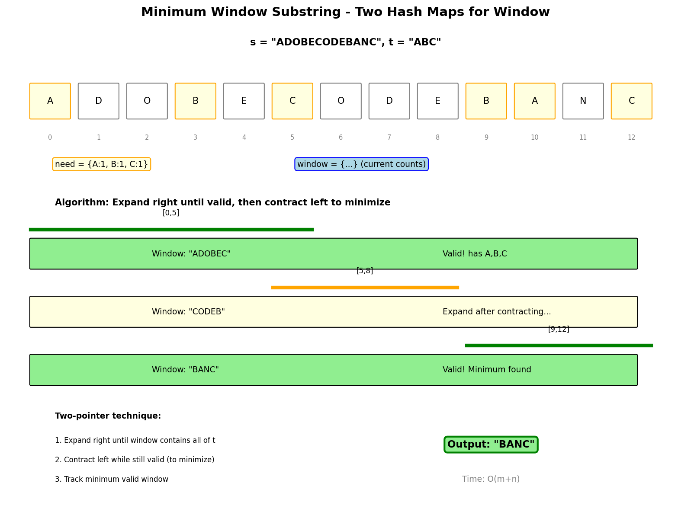

# Minimum Window Substring

## Problem Statement

Given two strings `s` and `t` of lengths `m` and `n` respectively, return the minimum window substring of `s` such that every character in `t` (including duplicates) is included in the window. If there is no such substring, return the empty string `""`.

The testcases will be generated such that the answer is unique.

**LeetCode:** [76. Minimum Window Substring](https://leetcode.com/problems/minimum-window-substring/)

## Examples

**Example 1:**
```text
Input: s = "ADOBECODEBANC", t = "ABC"
Output: "BANC"
Explanation: The minimum window substring "BANC" includes 'A', 'B', and 'C' from string t.
```

**Example 2:**
```text
Input: s = "a", t = "a"
Output: "a"
Explanation: The entire string s is the minimum window.
```

**Example 3:**
```text
Input: s = "a", t = "aa"
Output: ""
Explanation: Both 'a's from t must be included in the window.
Since the largest window of s only has one 'a', return empty string.
```

## Constraints

- `m == s.length`
- `n == t.length`
- `1 <= m, n <= 10^5`
- `s` and `t` consist of uppercase and lowercase English letters.

## Sliding Window Approach



### Key Insight

Use two pointers (sliding window) with hash maps to track character counts. Expand window until valid, then contract to find minimum.

### Algorithm

1. Count characters needed from `t`
2. Expand `right` pointer until window contains all chars from `t`
3. Contract `left` pointer while window is still valid
4. Track minimum valid window
5. Repeat until `right` reaches end

## Solution

```python
from collections import Counter

def minWindow(s: str, t: str) -> str:
    """
    Find minimum window substring containing all characters of t.

    Time: O(m + n) where m = len(s), n = len(t)
    Space: O(m + n) for hash maps
    """
    if not s or not t or len(s) < len(t):
        return ""

    # Count characters needed from t
    need = Counter(t)
    required = len(need)  # Number of unique chars needed

    # Current window character counts
    window = {}
    formed = 0  # Number of unique chars with required count

    # Result tracking
    min_len = float('inf')
    result = (0, 0)  # (start, end) indices

    left = 0
    for right, char in enumerate(s):
        # Expand window
        window[char] = window.get(char, 0) + 1

        # Check if current char satisfies requirement
        if char in need and window[char] == need[char]:
            formed += 1

        # Contract window while valid
        while formed == required:
            # Update result if smaller window found
            if right - left + 1 < min_len:
                min_len = right - left + 1
                result = (left, right)

            # Remove leftmost character
            left_char = s[left]
            window[left_char] -= 1

            if left_char in need and window[left_char] < need[left_char]:
                formed -= 1

            left += 1

    return "" if min_len == float('inf') else s[result[0]:result[1] + 1]


# Alternative: Track have vs need count
def minWindowSimpler(s: str, t: str) -> str:
    """Simpler tracking with have/need counts."""
    if not t or not s:
        return ""

    need = Counter(t)
    have = 0
    need_count = len(need)

    result = ""
    result_len = float('inf')
    left = 0
    window = {}

    for right in range(len(s)):
        char = s[right]
        window[char] = window.get(char, 0) + 1

        if char in need and window[char] == need[char]:
            have += 1

        while have == need_count:
            # Update result
            if (right - left + 1) < result_len:
                result = s[left:right + 1]
                result_len = right - left + 1

            # Shrink window
            window[s[left]] -= 1
            if s[left] in need and window[s[left]] < need[s[left]]:
                have -= 1
            left += 1

    return result
```

::: info Complexity: Time O(m + n) · Space O(m + n)
- **Time:** O(m + n) where m = len(s), n = len(t) - each character visited at most twice (once by right, once by left pointer)
- **Space:** O(m + n) for hash maps storing character counts from both strings
:::

## Optimized with Filtered Indices

```python
def minWindowOptimized(s: str, t: str) -> str:
    """
    Optimization: Only iterate over relevant characters.
    Useful when s has many characters not in t.

    Time: O(m + n) but with smaller constant
    Space: O(m + n)
    """
    if not s or not t:
        return ""

    need = Counter(t)
    required = len(need)

    # Filter s to only include characters in t
    filtered = [(i, char) for i, char in enumerate(s) if char in need]

    window = {}
    formed = 0
    min_len = float('inf')
    result = (0, 0)
    left = 0

    for right in range(len(filtered)):
        char = filtered[right][1]
        window[char] = window.get(char, 0) + 1

        if window[char] == need[char]:
            formed += 1

        while formed == required:
            start = filtered[left][0]
            end = filtered[right][0]

            if end - start + 1 < min_len:
                min_len = end - start + 1
                result = (start, end)

            left_char = filtered[left][1]
            window[left_char] -= 1
            if window[left_char] < need[left_char]:
                formed -= 1
            left += 1

    return "" if min_len == float('inf') else s[result[0]:result[1] + 1]
```

::: info Complexity: Time O(m + n) · Space O(m + n)
- **Time:** O(m + n) with smaller constant - only iterates over filtered characters that exist in t
- **Space:** O(m + n) for filtered list plus hash maps for character counts
:::

## Complexity Analysis

| Approach | Time | Space |
|----------|------|-------|
| Basic Sliding Window | O(m + n) | O(m + n) |
| Filtered Indices | O(m + n) | O(m + n) |

Each character is visited at most twice (once by right, once by left).

## Visual Walkthrough

For `s = "ADOBECODEBANC"`, `t = "ABC"`:

```text
need = {A:1, B:1, C:1}

Expand until valid:
ADOBEC -> has A,B,C -> valid, len=6

Contract:
DOBEC -> missing A -> invalid, expand

Expand:
DOBECODEBA -> still valid? No, missing C
OBECODEBAN -> valid! has A,B,C (from later)
Wait, let me restart...

Actually:
1. A: window={A:1}, formed=1
2. D: window={A:1,D:1}
3. O: window={A:1,D:1,O:1}
4. B: window={A:1,D:1,O:1,B:1}, formed=2
5. E: window={A:1,D:1,O:1,B:1,E:1}
6. C: window={A:1,D:1,O:1,B:1,E:1,C:1}, formed=3 -> VALID!
   Contract: Remove A -> formed=2, invalid
7-12: Continue expanding and contracting
13. C: Finally get "BANC" as minimum
```

## Edge Cases

1. **t longer than s:** Return ""
2. **Exact match:** `s = "a", t = "a"` -> "a"
3. **Multiple valid windows:** Return any minimum
4. **Case sensitive:** 'A' != 'a'
5. **Duplicate requirements:** `t = "aa"` needs two 'a's

## Variations

### Find All Anagrams in a String

```python
from typing import List

def findAnagrams(s: str, p: str) -> List[int]:
    """
    Find all start indices of p's anagrams in s.
    Fixed window size = len(p).

    Time: O(n)
    Space: O(1)
    """
    if len(p) > len(s):
        return []

    result = []
    need = Counter(p)
    window = Counter(s[:len(p)])

    if window == need:
        result.append(0)

    for i in range(len(p), len(s)):
        # Add new character
        window[s[i]] += 1
        # Remove old character
        old = s[i - len(p)]
        window[old] -= 1
        if window[old] == 0:
            del window[old]

        if window == need:
            result.append(i - len(p) + 1)

    return result
```

### Permutation in String

```python
def checkInclusion(s1: str, s2: str) -> bool:
    """
    Check if s2 contains any permutation of s1.

    Time: O(n)
    Space: O(1)
    """
    if len(s1) > len(s2):
        return False

    need = Counter(s1)
    window = Counter(s2[:len(s1)])

    if window == need:
        return True

    for i in range(len(s1), len(s2)):
        window[s2[i]] += 1
        old = s2[i - len(s1)]
        window[old] -= 1
        if window[old] == 0:
            del window[old]

        if window == need:
            return True

    return False
```

### Minimum Window Subsequence

```python
def minWindowSubsequence(s: str, t: str) -> str:
    """
    Find minimum window in s that contains t as subsequence.
    Characters must appear in order (but not contiguous).

    Time: O(m * n)
    Space: O(1)
    """
    m, n = len(s), len(t)
    min_len = float('inf')
    result = ""

    i = 0
    while i < m:
        # Find subsequence starting from i
        j = 0
        start = i
        while i < m and j < n:
            if s[i] == t[j]:
                j += 1
            i += 1

        if j < n:
            break

        # Found subsequence ending at i-1, now minimize
        end = i - 1
        j = n - 1
        while j >= 0:
            if s[end] == t[j]:
                j -= 1
            end -= 1
        end += 1

        if i - end < min_len:
            min_len = i - end
            result = s[end:i]

        # Start next search from end + 1
        i = end + 1

    return result
```

## Interview Tips

1. **Clarify requirements:** Case sensitive? Duplicates?
2. **Draw the window:** Visualize expand and contract
3. **Explain formed count:** Why track unique chars satisfied
4. **Discuss optimization:** Filtered indices approach

## Common Mistakes

1. Not handling empty strings
2. Off-by-one in window boundaries
3. Forgetting to check `window[char] < need[char]`
4. Not handling duplicates in t correctly

## Related Problems

::: details Find All Anagrams in a String (LeetCode 438)
**Problem:** Find all start indices of p's anagrams in s.

**Key Insight:** Fixed-size sliding window with frequency comparison.

**Approach:** Slide window of size len(p), compare frequency counts at each position.

**Complexity:** Time O(n), Space O(1)
:::

::: details Permutation in String (LeetCode 567)
**Problem:** Return true if s2 contains a permutation of s1.

**Key Insight:** Same as finding one anagram. Fixed-size window with frequency matching.

**Approach:** Slide window of size len(s1) over s2, check frequency match.

**Complexity:** Time O(n), Space O(1)
:::

::: details Minimum Window Subsequence (LeetCode 727)
**Problem:** Find minimum window in s1 where s2 is a subsequence.

**Key Insight:** Two-pointer: forward pass finds end, backward pass finds start.

**Approach:** Find each char of s2 in order (forward), then trace back to find shortest window.

**Complexity:** Time O(n * m), Space O(1)
:::

::: details Longest Substring Without Repeating Characters (LeetCode 3)
**Problem:** Find longest substring without duplicate characters.

**Key Insight:** Variable-size sliding window with set/map tracking characters.

**Approach:** Expand window, when duplicate found, shrink from left until valid.

**Complexity:** Time O(n), Space O(min(n, charset_size))
:::

::: details Substring with Concatenation of All Words (LeetCode 30)
**Problem:** Find all starting indices where concatenation of all words appears.

**Key Insight:** All words have same length. Use sliding window at word-level granularity.

**Approach:** Try each starting position mod word_length. Use word frequency matching.

**Complexity:** Time O(n * m), Space O(k) where k is number of words
:::
