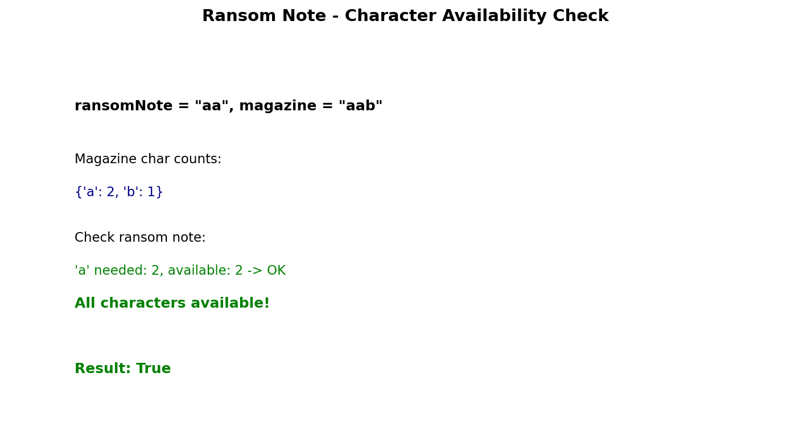

# Ransom Note

## Problem Statement

Given two strings `ransomNote` and `magazine`, return `true` if `ransomNote` can be constructed by using the letters from `magazine` and `false` otherwise.

Each letter in `magazine` can only be used once in `ransomNote`.

**LeetCode:** [383. Ransom Note](https://leetcode.com/problems/ransom-note/)

## Examples

**Example 1:**
```text
Input: ransomNote = "a", magazine = "b"
Output: false
```

**Example 2:**
```text
Input: ransomNote = "aa", magazine = "ab"
Output: false
Explanation: magazine only has one 'a', but ransomNote needs two.
```

**Example 3:**
```text
Input: ransomNote = "aa", magazine = "aab"
Output: true
Explanation: magazine has two 'a's, which is enough.
```

## Constraints

- `1 <= ransomNote.length, magazine.length <= 10^5`
- `ransomNote` and `magazine` consist of lowercase English letters.

## Hash Map Approach



### Key Insight

Count available characters in magazine, then verify ransom note can be formed with those characters.

### Algorithm

1. Count character frequencies in magazine
2. For each character in ransom note:
   - Check if it exists in magazine with sufficient count
   - Decrement the count
3. If all characters can be satisfied, return `True`

## Solution

```python
from collections import Counter

def canConstruct(ransomNote: str, magazine: str) -> bool:
    """
    Check if ransomNote can be constructed from magazine.

    Time: O(m + n) where m = len(ransomNote), n = len(magazine)
    Space: O(1) - at most 26 characters
    """
    magazine_count = Counter(magazine)

    for char in ransomNote:
        if magazine_count[char] <= 0:
            return False
        magazine_count[char] -= 1

    return True
```

::: info Complexity: Time O(m + n) · Space O(1)
- **Time:** O(n) to build magazine counter, O(m) to check ransom note characters
- **Space:** Counter stores at most 26 lowercase letters (constant for fixed alphabet)
:::

```python
# Alternative: Compare Counters
def canConstructCounter(ransomNote: str, magazine: str) -> bool:
    """
    Use Counter subtraction.

    Time: O(m + n)
    Space: O(1)
    """
    ransom_count = Counter(ransomNote)
    magazine_count = Counter(magazine)

    # Check if magazine has enough of each character
    return all(magazine_count[char] >= count
               for char, count in ransom_count.items())
```

::: info Complexity: Time O(m + n) · Space O(1)
- **Time:** Building both counters is O(m + n); comparison iterates through unique chars in ransom note
- **Space:** Both counters store at most 26 entries for lowercase letters
:::

```python
# One-liner using Counter subtraction
def canConstructOneLiner(ransomNote: str, magazine: str) -> bool:
    """Counter subtraction returns empty if magazine covers ransomNote."""
    return not (Counter(ransomNote) - Counter(magazine))
```

::: info Complexity: Time O(m + n) · Space O(1)
- **Time:** Counter subtraction is O(unique chars); overall dominated by counting
- **Space:** Creates counters with at most 26 entries each
:::

```python
# Array-based approach (faster for lowercase letters)
def canConstructArray(ransomNote: str, magazine: str) -> bool:
    """
    Use fixed array for lowercase letters.

    Time: O(m + n)
    Space: O(1) - always 26 elements
    """
    count = [0] * 26

    # Count magazine characters
    for char in magazine:
        count[ord(char) - ord('a')] += 1

    # Check ransom note
    for char in ransomNote:
        idx = ord(char) - ord('a')
        if count[idx] <= 0:
            return False
        count[idx] -= 1

    return True
```

::: info Complexity: Time O(m + n) · Space O(1)
- **Time:** O(n) to count magazine, O(m) to verify ransom note with O(1) array access
- **Space:** Fixed 26-element array regardless of input lengths
:::

## Complexity Analysis

| Approach | Time | Space |
|----------|------|-------|
| Hash Map | O(m + n) | O(1)* |
| Counter Comparison | O(m + n) | O(1)* |
| Array (26 chars) | O(m + n) | O(1) |

*Space is O(1) for fixed character set (26 lowercase letters)

## Edge Cases

1. **Empty ransom note:** `"", "abc"` - Always `True`
2. **Empty magazine:** `"a", ""` - Always `False` (if ransom note is non-empty)
3. **Same strings:** `"abc", "abc"` - `True`
4. **Ransom note longer:** `"aaa", "aa"` - `False`
5. **Extra magazine chars:** `"a", "abc"` - `True`

## Variations

### Count How Many Ransom Notes

```python
def countPossibleNotes(ransomNote: str, magazine: str) -> int:
    """
    How many complete ransom notes can be made from magazine?

    Time: O(m + n)
    Space: O(1)
    """
    if not ransomNote:
        return float('inf')

    ransom_count = Counter(ransomNote)
    magazine_count = Counter(magazine)

    # Find minimum ratio for any character
    min_notes = float('inf')
    for char, needed in ransom_count.items():
        available = magazine_count.get(char, 0)
        min_notes = min(min_notes, available // needed)

    return min_notes if min_notes != float('inf') else 0
```

::: info Complexity: Time O(m + n) · Space O(1)
- **Time:** Building counters O(m + n), finding minimum ratio O(26) = O(1)
- **Space:** Counters store at most 26 entries for lowercase letters
:::

### Find Missing Characters

```python
from typing import Dict

def findMissingChars(ransomNote: str, magazine: str) -> Dict[str, int]:
    """
    Return characters and counts missing to form ransom note.

    Time: O(m + n)
    Space: O(1)
    """
    ransom_count = Counter(ransomNote)
    magazine_count = Counter(magazine)

    missing = {}
    for char, needed in ransom_count.items():
        available = magazine_count.get(char, 0)
        if needed > available:
            missing[char] = needed - available

    return missing
```

::: info Complexity: Time O(m + n) · Space O(1)
- **Time:** Counter creation O(m + n), comparison loop O(unique chars in ransom note)
- **Space:** At most 26 unique characters in missing dictionary
:::

### With Word-Level Construction

```python
from typing import List

def canConstructFromWords(note_words: List[str], magazine_words: List[str]) -> bool:
    """
    Check if note can be constructed using complete words from magazine.

    Time: O(m + n)
    Space: O(n)
    """
    available = Counter(magazine_words)

    for word in note_words:
        if available[word] <= 0:
            return False
        available[word] -= 1

    return True
```

::: info Complexity: Time O(m + n) · Space O(n)
- **Time:** O(n) to build counter of magazine words, O(m) to check note words
- **Space:** Counter stores up to n unique words from magazine
:::

## Common Interview Follow-ups

1. **Case insensitive?** Convert both to lowercase first
2. **What about spaces?** Filter them out or count separately
3. **Unicode support?** Hash map works, array doesn't
4. **Performance optimization?** Early termination if ransom note is longer

## Early Termination Optimization

```python
def canConstructOptimized(ransomNote: str, magazine: str) -> bool:
    """
    Early termination if ransomNote is longer.

    Time: O(m + n)
    Space: O(1)
    """
    # Quick check: can't construct if note is longer
    if len(ransomNote) > len(magazine):
        return False

    magazine_count = Counter(magazine)

    for char in ransomNote:
        if magazine_count[char] <= 0:
            return False
        magazine_count[char] -= 1

    return True
```

::: info Complexity: Time O(m + n) · Space O(1)
- **Time:** O(1) length check may short-circuit; otherwise O(n) count + O(m) verify
- **Space:** Counter stores at most 26 entries for lowercase alphabet
:::

## Related Problems

::: details Valid Anagram (LeetCode 242)
**Problem:** Check if two strings are anagrams.

**Key Insight:** Anagrams have identical character frequencies.

**Approach:** Count chars in both strings, compare counts.

**Complexity:** Time O(n), Space O(1)
:::

::: details First Unique Character in a String (LeetCode 387)
**Problem:** Find first character that doesn't repeat.

**Key Insight:** Count frequencies, then scan for first with count 1.

**Approach:** Two-pass: build frequency map, then find first unique.

**Complexity:** Time O(n), Space O(1)
:::

::: details Group Anagrams (LeetCode 49)
**Problem:** Group strings that are anagrams of each other.

**Key Insight:** Use sorted string or char count tuple as hash key.

**Approach:** Hash map where key is canonical form, value is list of anagrams.

**Complexity:** Time O(n * k log k), Space O(n * k)
:::

::: details Sort Characters By Frequency (LeetCode 451)
**Problem:** Sort string by character frequency, most frequent first.

**Key Insight:** Count frequencies, then sort by count.

**Approach:** Build frequency map, sort entries by count, reconstruct string.

**Complexity:** Time O(n log n), Space O(n)
:::
