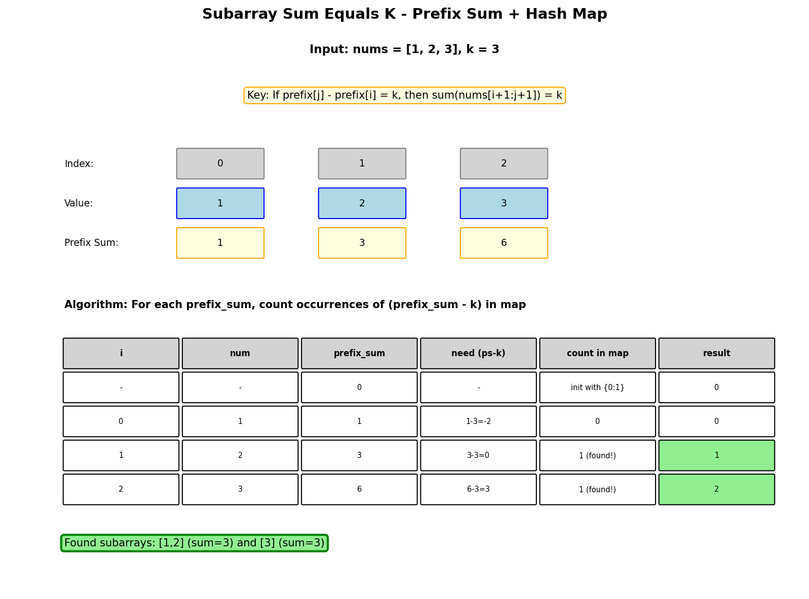

# Subarray Sum Equals K

## Problem Statement

Given an array of integers `nums` and an integer `k`, return the total number of subarrays whose sum equals to `k`.

A subarray is a contiguous non-empty sequence of elements within an array.

**LeetCode:** [560. Subarray Sum Equals K](https://leetcode.com/problems/subarray-sum-equals-k/)

## Examples

**Example 1:**
```text
Input: nums = [1, 1, 1], k = 2
Output: 2
Explanation: Subarrays [1,1] (indices 0-1) and [1,1] (indices 1-2) sum to 2.
```

**Example 2:**
```text
Input: nums = [1, 2, 3], k = 3
Output: 2
Explanation: Subarrays [1,2] and [3] sum to 3.
```

## Constraints

- `1 <= nums.length <= 2 * 10^4`
- `-1000 <= nums[i] <= 1000`
- `-10^7 <= k <= 10^7`

## Prefix Sum + Hash Map Approach



### Key Insight

If `prefix_sum[j] - prefix_sum[i] = k`, then the subarray `nums[i+1:j+1]` sums to `k`.

We need to count how many previous prefix sums equal `current_prefix_sum - k`.

### Algorithm

1. Use a hash map to count prefix sum frequencies
2. Initialize with `{0: 1}` (empty prefix has sum 0)
3. For each element:
   - Update running prefix sum
   - Add count of `(prefix_sum - k)` to result
   - Increment count of current prefix sum in map

## Solution

::: code-group

```python [Python]
from typing import List
from collections import defaultdict

def subarraySum(nums: List[int], k: int) -> int:
    """
    Count subarrays with sum equal to k.

    Time: O(n) - single pass
    Space: O(n) - hash map for prefix sums
    """
    count = 0
    prefix_sum = 0
    prefix_counts = defaultdict(int)
    prefix_counts[0] = 1  # Empty prefix

    for num in nums:
        prefix_sum += num

        # Check if (prefix_sum - k) exists
        # This means there's a subarray ending here with sum k
        count += prefix_counts[prefix_sum - k]

        # Update prefix sum count
        prefix_counts[prefix_sum] += 1

    return count
```

```java [Java]
import java.util.*;

class Solution {
    public int subarraySum(int[] nums, int k) {
        int count = 0;
        int prefixSum = 0;
        Map<Integer, Integer> prefixCounts = new HashMap<>();
        prefixCounts.put(0, 1);  // Empty prefix

        for (int num : nums) {
            prefixSum += num;

            // Check if (prefixSum - k) exists
            count += prefixCounts.getOrDefault(prefixSum - k, 0);

            // Update prefix sum count
            prefixCounts.merge(prefixSum, 1, Integer::sum);
        }

        return count;
    }
}
```

:::

::: info Complexity: Time O(n) · Space O(n)
- **Time:** O(n) for single pass through the array, with O(1) hash map operations at each step
- **Space:** O(n) for the hash map storing prefix sum counts - in worst case, all prefix sums are unique
:::

## Why This Works

Consider array `[1, 2, 3]` and `k = 3`:

| Index | Num | Prefix Sum | Need (prefix - k) | Found? | Count |
|-------|-----|------------|-------------------|--------|-------|
| -     | -   | 0          | -                 | Init   | 0     |
| 0     | 1   | 1          | 1 - 3 = -2        | No     | 0     |
| 1     | 2   | 3          | 3 - 3 = 0         | Yes(1) | 1     |
| 2     | 3   | 6          | 6 - 3 = 3         | Yes(1) | 2     |

Subarrays found: `[1,2]` (sum=3) and `[3]` (sum=3).

## Complexity Analysis

| Approach | Time | Space |
|----------|------|-------|
| Prefix Sum + Hash Map | O(n) | O(n) |
| Brute Force | O(n^2) | O(1) |
| Prefix Sum Array | O(n^2) | O(n) |

## Brute Force (For Comparison)

```python
def subarraySumBruteForce(nums: List[int], k: int) -> int:
    """
    Check all subarrays.

    Time: O(n^2)
    Space: O(1)
    """
    count = 0
    n = len(nums)

    for i in range(n):
        current_sum = 0
        for j in range(i, n):
            current_sum += nums[j]
            if current_sum == k:
                count += 1

    return count
```

::: info Complexity: Time O(n^2) · Space O(1)
- **Time:** O(n^2) for checking all possible subarrays with nested loops
- **Space:** O(1) using only a running sum variable, no additional data structures
:::

## Edge Cases

1. **Single element equals k:** `[5], k=5` - Return 1
2. **Negative numbers:** `[-1, -1, 1], k=-1` - Handle negatives
3. **Zero sum:** `[1, -1, 1, -1], k=0` - Multiple valid subarrays
4. **Entire array:** `[1, 2, 3], k=6` - Include full array
5. **No valid subarray:** `[1, 2, 3], k=10` - Return 0

## Variations

### Return All Subarrays

```python
def subarraySumIndices(nums: List[int], k: int) -> List[tuple]:
    """
    Return all (start, end) indices of subarrays summing to k.

    Time: O(n^2) worst case
    Space: O(n)
    """
    result = []
    prefix_sum = 0
    # Map: prefix_sum -> list of indices where this sum occurred
    prefix_indices = defaultdict(list)
    prefix_indices[0].append(-1)

    for j, num in enumerate(nums):
        prefix_sum += num
        target = prefix_sum - k

        # All previous indices where prefix_sum was (current - k)
        for i in prefix_indices[target]:
            result.append((i + 1, j))

        prefix_indices[prefix_sum].append(j)

    return result
```

### Subarray Sum Divisible by K

```python
def subarraysDivByK(nums: List[int], k: int) -> int:
    """
    Count subarrays with sum divisible by k.

    Time: O(n)
    Space: O(k)
    """
    count = 0
    prefix_sum = 0
    remainder_counts = defaultdict(int)
    remainder_counts[0] = 1

    for num in nums:
        prefix_sum += num
        # Handle negative remainders
        remainder = prefix_sum % k
        count += remainder_counts[remainder]
        remainder_counts[remainder] += 1

    return count
```

### Count Subarrays with Sum in Range

```python
def countSubarraysInRange(nums: List[int], lower: int, upper: int) -> int:
    """
    Count subarrays with sum in [lower, upper].

    Time: O(n^2)
    Space: O(n)
    """
    def countAtMost(target):
        """Count subarrays with sum <= target."""
        count = 0
        # This needs a different approach - sorted data structure
        # For simplicity, using brute force here
        n = len(nums)
        for i in range(n):
            current_sum = 0
            for j in range(i, n):
                current_sum += nums[j]
                if current_sum <= target:
                    count += 1
                # Can't break early due to negative numbers

        return count

    # For positive numbers only, we can use sliding window
    # For general case, need merge sort or segment tree
    return countAtMost(upper) - countAtMost(lower - 1)
```

### Shortest Subarray with Sum at Least K

```python
from collections import deque

def shortestSubarray(nums: List[int], k: int) -> int:
    """
    Find shortest subarray with sum >= k.
    Uses monotonic deque.

    Time: O(n)
    Space: O(n)
    """
    n = len(nums)
    # Compute prefix sums
    prefix = [0] * (n + 1)
    for i in range(n):
        prefix[i + 1] = prefix[i] + nums[i]

    result = float('inf')
    # Monotonic increasing deque of indices
    dq = deque()

    for i in range(n + 1):
        # Check if we found a valid subarray
        while dq and prefix[i] - prefix[dq[0]] >= k:
            result = min(result, i - dq.popleft())

        # Maintain monotonic property
        while dq and prefix[i] <= prefix[dq[-1]]:
            dq.pop()

        dq.append(i)

    return result if result != float('inf') else -1
```

### Maximum Size Subarray Sum Equals k

```python
def maxSubArrayLen(nums: List[int], k: int) -> int:
    """
    Find length of longest subarray with sum k.

    Time: O(n)
    Space: O(n)
    """
    max_len = 0
    prefix_sum = 0
    # Store first occurrence of each prefix sum
    first_occurrence = {0: -1}

    for i, num in enumerate(nums):
        prefix_sum += num

        if prefix_sum - k in first_occurrence:
            max_len = max(max_len, i - first_occurrence[prefix_sum - k])

        # Only store first occurrence for maximum length
        if prefix_sum not in first_occurrence:
            first_occurrence[prefix_sum] = i

    return max_len
```

## Common Mistakes

1. Forgetting to initialize `{0: 1}` for empty prefix
2. Updating hash map before checking (order matters!)
3. Not handling negative numbers (can't use sliding window)

## Related Problems

::: details Continuous Subarray Sum (LeetCode 523)
**Problem:** Check if subarray of length >= 2 has sum that's multiple of k.

**Key Insight:** If prefix[i] % k == prefix[j] % k, subarray between is divisible by k.

**Approach:** Store first index of each remainder. Check if same remainder seen 2+ indices earlier.

**Complexity:** Time O(n), Space O(min(n, k))
:::

::: details Subarray Sums Divisible by K (LeetCode 974)
**Problem:** Count subarrays whose sum is divisible by k.

**Key Insight:** Same remainder at two positions means subarray sum divisible by k.

**Approach:** Count remainders. For each remainder with count c, add c*(c-1)/2 pairs.

**Complexity:** Time O(n), Space O(k)
:::

::: details Shortest Subarray with Sum at Least K (LeetCode 862)
**Problem:** Find shortest subarray with sum >= k (can have negative numbers).

**Key Insight:** Monotonic deque to track prefix sums. Can't use sliding window with negatives.

**Approach:** Use deque maintaining increasing prefix sums. For each position, find valid shorter subarrays.

**Complexity:** Time O(n), Space O(n)
:::

::: details Maximum Size Subarray Sum Equals k (LeetCode 325)
**Problem:** Find longest subarray with sum exactly k.

**Key Insight:** Store first occurrence of each prefix sum. Current_sum - k gives required earlier sum.

**Approach:** Hash map with first index of each prefix sum. Check if current_sum - k exists.

**Complexity:** Time O(n), Space O(n)
:::

::: details Binary Subarrays With Sum (LeetCode 930)
**Problem:** Count subarrays of binary array with sum equal to goal.

**Key Insight:** Prefix sum with counting. Can also use atMost(goal) - atMost(goal-1).

**Approach:** Track prefix sum frequencies. For each position, count how many earlier have sum = current - goal.

**Complexity:** Time O(n), Space O(n)
:::
