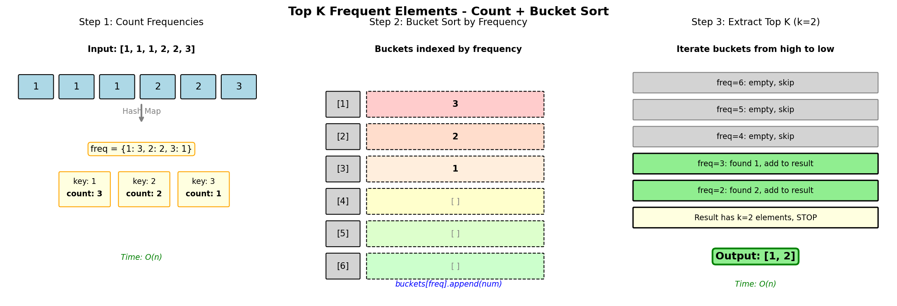

# Top K Frequent Elements

## Problem Statement

Given an integer array `nums` and an integer `k`, return the `k` most frequent elements. You may return the answer in any order.

**LeetCode:** [347. Top K Frequent Elements](https://leetcode.com/problems/top-k-frequent-elements/)

## Examples

**Example 1:**
```text
Input: nums = [1,1,1,2,2,3], k = 2
Output: [1,2]
```

**Example 2:**
```text
Input: nums = [1], k = 1
Output: [1]
```

## Constraints

- `1 <= nums.length <= 10^5`
- `-10^4 <= nums[i] <= 10^4`
- `k` is in the range `[1, the number of unique elements in the array]`
- It is guaranteed that the answer is unique.

**Follow up:** Your algorithm's time complexity must be better than O(n log n), where n is the array's size.

## Visual Explanation



## Key Insight

The problem can be solved optimally using **bucket sort** after counting frequencies:
1. Count the frequency of each element using a hash map
2. Use bucket sort where the index is the frequency
3. Iterate from highest frequency bucket to collect k elements

This achieves O(n) time complexity, which is better than heap-based O(n log k) for large k.

## Solution

```python
from typing import List
from collections import Counter

def topKFrequent(nums: List[int], k: int) -> List[int]:
    """
    Find k most frequent elements using bucket sort.

    Algorithm:
    1. Count frequency of each number
    2. Create buckets where index = frequency
    3. Iterate from highest frequency, collect k elements

    Time: O(n) - counting and bucket operations
    Space: O(n) - hash map and buckets
    """
    # Step 1: Count frequencies
    count = Counter(nums)

    # Step 2: Create buckets - index represents frequency
    # Maximum possible frequency is len(nums)
    n = len(nums)
    buckets = [[] for _ in range(n + 1)]

    for num, freq in count.items():
        buckets[freq].append(num)

    # Step 3: Collect top k from highest frequency buckets
    result = []
    for freq in range(n, 0, -1):  # Start from highest frequency
        for num in buckets[freq]:
            result.append(num)
            if len(result) == k:
                return result

    return result


# Alternative: Using Min-Heap (for comparison)
import heapq

def topKFrequentHeap(nums: List[int], k: int) -> List[int]:
    """
    Find k most frequent using min-heap of size k.

    Time: O(n log k) - n elements, heap operations O(log k)
    Space: O(n + k) - counter + heap
    """
    count = Counter(nums)

    # Use min-heap of size k
    # heapq.nlargest handles this efficiently
    return heapq.nlargest(k, count.keys(), key=count.get)


# Alternative: Using QuickSelect (average O(n))
def topKFrequentQuickSelect(nums: List[int], k: int) -> List[int]:
    """
    Find k most frequent using QuickSelect algorithm.

    Time: O(n) average, O(n^2) worst case
    Space: O(n)
    """
    count = Counter(nums)
    unique = list(count.keys())

    def partition(left, right, pivot_idx):
        pivot_freq = count[unique[pivot_idx]]
        # Move pivot to end
        unique[pivot_idx], unique[right] = unique[right], unique[pivot_idx]

        store_idx = left
        for i in range(left, right):
            if count[unique[i]] > pivot_freq:
                unique[store_idx], unique[i] = unique[i], unique[store_idx]
                store_idx += 1

        # Move pivot to final position
        unique[right], unique[store_idx] = unique[store_idx], unique[right]
        return store_idx

    def quickselect(left, right, k_smallest):
        if left == right:
            return

        import random
        pivot_idx = random.randint(left, right)
        pivot_idx = partition(left, right, pivot_idx)

        if k_smallest == pivot_idx:
            return
        elif k_smallest < pivot_idx:
            quickselect(left, pivot_idx - 1, k_smallest)
        else:
            quickselect(pivot_idx + 1, right, k_smallest)

    n = len(unique)
    quickselect(0, n - 1, k)
    return unique[:k]
```

::: info Complexity: Time O(n) · Space O(n)
- **Time:** O(n) for bucket sort approach - counting frequencies and iterating through buckets; O(n log k) for heap approach; O(n) average for quickselect
- **Space:** O(n) for the frequency counter and bucket array (or heap of size k)
:::

## Step-by-Step Walkthrough

Let's trace through `nums = [1,1,1,2,2,3], k = 2`:

**Step 1: Count Frequencies**
```text
count = {1: 3, 2: 2, 3: 1}
```

**Step 2: Build Frequency Buckets**
```text
buckets[0] = []
buckets[1] = [3]    # 3 appears 1 time
buckets[2] = [2]    # 2 appears 2 times
buckets[3] = [1]    # 1 appears 3 times
buckets[4] = []
buckets[5] = []
buckets[6] = []
```

**Step 3: Collect Top K**
```text
Start from freq=6, going down:
- freq=6: empty, skip
- freq=5: empty, skip
- freq=4: empty, skip
- freq=3: add 1 to result -> [1]
- freq=2: add 2 to result -> [1, 2]
- len(result) == k, return [1, 2]
```

## Complexity Analysis

| Approach | Time | Space | Notes |
|----------|------|-------|-------|
| Bucket Sort | O(n) | O(n) | Best for large k |
| Min-Heap | O(n log k) | O(n + k) | Good for small k |
| Max-Heap | O(n + k log n) | O(n) | Build O(n), extract O(k log n) |
| QuickSelect | O(n) avg | O(n) | Worst case O(n^2) |
| Sorting | O(n log n) | O(n) | Simple but slower |

### When to Use Each Approach

- **Bucket Sort:** When k is close to n (many unique elements needed)
- **Min-Heap:** When k is small relative to n
- **QuickSelect:** When average case O(n) is acceptable

## Edge Cases

1. **Single element:** `[1], k=1` - Return `[1]`
2. **All same:** `[1,1,1], k=1` - Return `[1]`
3. **k equals unique count:** Return all unique elements
4. **Negative numbers:** Hash map handles negatives correctly
5. **Ties in frequency:** Any element with same frequency is valid

## Variations

### Top K Frequent Words

```python
def topKFrequentWords(words: List[str], k: int) -> List[str]:
    """
    Return k most frequent words, sorted by frequency (desc)
    then alphabetically (asc) for ties.

    Time: O(n log k)
    Space: O(n)
    """
    count = Counter(words)

    # Use heap with custom comparator
    # Python heapq is min-heap, so negate frequency
    # For alphabetical, use word directly (smaller = higher priority in min-heap)
    heap = []
    for word, freq in count.items():
        heapq.heappush(heap, (-freq, word))

    return [heapq.heappop(heap)[1] for _ in range(k)]
```

### K Most Frequent in Stream

```python
class FrequentStream:
    """Maintain top k frequent elements in a data stream."""

    def __init__(self, k: int):
        self.k = k
        self.count = Counter()
        self.min_heap = []  # (freq, num)
        self.in_heap = set()

    def add(self, num: int) -> List[int]:
        self.count[num] += 1
        freq = self.count[num]

        if num in self.in_heap:
            # Rebalance needed - simplified approach: rebuild
            self._rebuild_heap()
        elif len(self.min_heap) < self.k:
            heapq.heappush(self.min_heap, (freq, num))
            self.in_heap.add(num)
        elif freq > self.min_heap[0][0]:
            # Replace minimum
            _, removed = heapq.heapreplace(self.min_heap, (freq, num))
            self.in_heap.remove(removed)
            self.in_heap.add(num)

        return [num for _, num in sorted(self.min_heap, reverse=True)]

    def _rebuild_heap(self):
        top_k = heapq.nlargest(self.k, self.count.keys(), key=self.count.get)
        self.min_heap = [(self.count[num], num) for num in top_k]
        heapq.heapify(self.min_heap)
        self.in_heap = set(top_k)
```

### Find K-th Most Frequent

```python
def findKthMostFrequent(nums: List[int], k: int) -> int:
    """
    Return the k-th most frequent element (not top k).

    Time: O(n)
    Space: O(n)
    """
    count = Counter(nums)
    n = len(nums)
    buckets = [[] for _ in range(n + 1)]

    for num, freq in count.items():
        buckets[freq].append(num)

    rank = 0
    for freq in range(n, 0, -1):
        for num in buckets[freq]:
            rank += 1
            if rank == k:
                return num

    return -1  # k exceeds unique count
```

## Common Mistakes

1. **Off-by-one in bucket size:** Bucket array needs size `n + 1` (frequencies 0 to n)
2. **Not handling ties:** Problem states answer is unique, but handle ties if not guaranteed
3. **Using max-heap incorrectly:** Python heapq is min-heap; negate values for max behavior
4. **Forgetting Counter:** Manually counting is error-prone; use `collections.Counter`

## Interview Tips

1. **Start with clarifying questions:**
   - Can k be larger than unique elements? (No, per constraints)
   - What about ties in frequency? (Answer is unique)
   - Time complexity requirement? (Better than O(n log n))

2. **Discuss trade-offs:**
   - Bucket sort: O(n) but O(n) space for buckets
   - Heap: O(n log k) time, better when k << n
   - QuickSelect: O(n) average but O(n^2) worst case

3. **Mention follow-ups proactively:**
   - How to handle streaming data?
   - What if we need top k updated frequently?
   - Memory-constrained environment?

4. **Code organization:**
   - Separate counting from result extraction
   - Use descriptive variable names
   - Handle edge cases explicitly

## Related Problems

::: details Top K Frequent Words (LeetCode 692)
**Problem:** Return k most frequent words, sorted by frequency then alphabetically.

**Key Insight:** Similar to top k elements but with custom comparator for ties.

**Approach:** Count frequencies, use heap with custom comparison. Handle alphabetical ordering.

**Complexity:** Time O(n log k), Space O(n)
:::

::: details Sort Characters By Frequency (LeetCode 451)
**Problem:** Sort string by character frequency, most frequent first.

**Key Insight:** Count then sort by frequency. Bucket sort can achieve O(n).

**Approach:** Count frequencies, bucket sort or priority queue, reconstruct string.

**Complexity:** Time O(n log n) or O(n) with bucket sort, Space O(n)
:::

::: details Kth Largest Element in a Stream (LeetCode 703)
**Problem:** Design class to track kth largest element with streaming adds.

**Key Insight:** Maintain min-heap of size k. Top of heap is kth largest.

**Approach:** Keep exactly k elements in min-heap. New element replaces min if larger.

**Complexity:** Add O(log k), Space O(k)
:::

::: details Kth Largest Element in an Array (LeetCode 215)
**Problem:** Find kth largest element in unsorted array.

**Key Insight:** Quickselect for O(n) average, or min-heap of size k for O(n log k).

**Approach:** Quickselect partitions array around pivot. Recurse on side containing kth position.

**Complexity:** Time O(n) average, O(n^2) worst, Space O(1)
:::

::: details K Closest Points to Origin (LeetCode 973)
**Problem:** Find k points closest to origin.

**Key Insight:** Max-heap of size k, or quickselect on distances.

**Approach:** Max-heap keeps k smallest distances. Or use quickselect to partition.

**Complexity:** Time O(n log k) for heap, O(n) average for quickselect
:::
