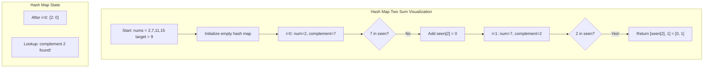
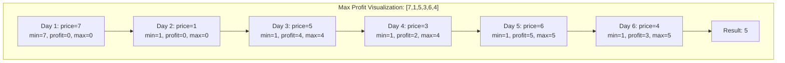

# Two Sum & Maximum Profit

> **Classic hash map problems for $O(1)$ lookups**

These two problems are foundational for understanding hash map usage and single-pass algorithms. Two Sum is often the first problem encountered on LeetCode (Problem #1), while Best Time to Buy and Sell Stock demonstrates elegant tracking of minimum/maximum values.

---

## Two Sum

### Problem Statement

Given an array of integers `nums` and an integer `target`, return **indices of the two numbers** such that they add up to `target`.

**Constraints:**
- Each input has exactly one solution
- You may not use the same element twice
- You can return the answer in any order

### Example

```text
Input: nums = [2,7,11,15], target = 9
Output: [0,1]
Explanation: nums[0] + nums[1] = 2 + 7 = 9, so we return [0, 1]
```

```text
Input: nums = [3,2,4], target = 6
Output: [1,2]
Explanation: nums[1] + nums[2] = 2 + 4 = 6
```

```text
Input: nums = [3,3], target = 6
Output: [0,1]
Explanation: nums[0] + nums[1] = 3 + 3 = 6
```

### Approaches

#### Brute Force $O(n^2)$

The most straightforward approach checks every pair of numbers using nested loops.

```python
def twoSum_brute(nums: list[int], target: int) -> list[int]:
    """
    Check every pair of numbers.
    Time: O(n^2), Space: O(1)
    """
    for i in range(len(nums)):
        for j in range(i + 1, len(nums)):
            if nums[i] + nums[j] == target:
                return [i, j]
    return []
```

::: info Complexity: Time O(n^2) · Space O(1)
- **Time:** Nested loops iterate through all pairs - outer loop runs n times, inner loop runs n-i times, giving n*(n-1)/2 comparisons
- **Space:** Only uses a constant number of variables (i, j) regardless of input size
:::

**Analysis:**
- Time Complexity: $O(n^2)$ due to nested loops
- Space Complexity: $O(1)$ - only uses constant extra space
- Pros: Simple to implement, always finds solution if exists
- Cons: Computationally expensive for large inputs

#### Hash Map $O(n)$ - Optimal Solution

Use a hash map to store previously seen numbers and their indices. For each number, calculate its complement (`target - num`) and check if it exists in the map.

```python
def twoSum(nums: list[int], target: int) -> list[int]:
    """
    Single-pass hash map solution.
    Time: O(n), Space: O(n)
    """
    seen = {}  # value -> index

    for i, num in enumerate(nums):
        complement = target - num
        if complement in seen:
            return [seen[complement], i]
        seen[num] = i

    return []
```

::: info Complexity: Time O(n) · Space O(n)
- **Time:** Single pass through array with O(1) hash map lookups and insertions per element
- **Space:** Hash map stores up to n elements in worst case when no pair is found early
:::

**Why This Works:**
- Instead of looking for two numbers that sum to target, we look for each number's complement
- Hash map provides $O(1)$ lookup time
- Single pass through the array is sufficient

#### Two-Pointer Approach (For Sorted Arrays)

If the array is sorted, use two pointers to find the pair in $O(n)$ time with $O(1)$ space.

```python
def twoSum_sorted(nums: list[int], target: int) -> list[int]:
    """
    Two-pointer approach for sorted arrays.
    Time: O(n), Space: O(1)
    Note: Returns indices in sorted array, not original
    """
    left, right = 0, len(nums) - 1

    while left < right:
        current_sum = nums[left] + nums[right]
        if current_sum == target:
            return [left, right]
        elif current_sum < target:
            left += 1
        else:
            right -= 1

    return []
```

::: info Complexity: Time O(n) · Space O(1)
- **Time:** Two pointers traverse array at most once - each iteration moves one pointer closer, so at most n iterations
- **Space:** Only uses two pointer variables regardless of input size
:::

### Mermaid Diagram



### Complexity Analysis

| Approach | Time | Space | Notes |
|----------|------|-------|-------|
| Brute Force | $O(n^2)$ | $O(1)$ | Check all pairs |
| Hash Map | $O(n)$ | $O(n)$ | Single pass, optimal time |
| Two Pointers | $O(n)$ | $O(1)$ | Requires sorted array |

### Variations

#### Two Sum II - Input Array Is Sorted (LeetCode 167)
- Array is already sorted in ascending order
- Use two-pointer technique for $O(1)$ space
- Return 1-indexed positions

```python
def twoSum_ii(numbers: list[int], target: int) -> list[int]:
    left, right = 0, len(numbers) - 1
    while left < right:
        total = numbers[left] + numbers[right]
        if total == target:
            return [left + 1, right + 1]  # 1-indexed
        elif total < target:
            left += 1
        else:
            right -= 1
    return []
```

::: info Complexity: Time O(n) · Space O(1)
- **Time:** Two pointers converge in at most n steps since array is already sorted
- **Space:** Constant space for two pointer variables only
:::

#### Two Sum III - Data Structure Design (LeetCode 170)
- Design a data structure that supports `add` and `find` operations
- Trade-off between add-heavy vs find-heavy usage

```python
class TwoSum:
    def __init__(self):
        self.nums = {}  # number -> count

    def add(self, number: int) -> None:
        self.nums[number] = self.nums.get(number, 0) + 1

    def find(self, value: int) -> bool:
        for num in self.nums:
            complement = value - num
            if complement in self.nums:
                if complement != num or self.nums[num] > 1:
                    return True
        return False
```

::: info Complexity: Time O(1) add / O(n) find · Space O(n)
- **Time:** add is O(1) hash map insertion; find iterates through all unique numbers with O(1) lookups
- **Space:** Hash map stores counts for each unique number added
:::

#### 3Sum (LeetCode 15)
- Find all unique triplets that sum to zero
- Sort + two pointers for each element

```python
def threeSum(nums: list[int]) -> list[list[int]]:
    nums.sort()
    result = []

    for i in range(len(nums) - 2):
        if i > 0 and nums[i] == nums[i-1]:
            continue  # Skip duplicates

        left, right = i + 1, len(nums) - 1
        while left < right:
            total = nums[i] + nums[left] + nums[right]
            if total == 0:
                result.append([nums[i], nums[left], nums[right]])
                while left < right and nums[left] == nums[left + 1]:
                    left += 1
                while left < right and nums[right] == nums[right - 1]:
                    right -= 1
                left += 1
                right -= 1
            elif total < 0:
                left += 1
            else:
                right -= 1

    return result
```

::: info Complexity: Time O(n^2) · Space O(log n) to O(n)
- **Time:** Sorting takes O(n log n), then outer loop O(n) with inner two-pointer O(n) each = O(n^2) dominates
- **Space:** Sorting requires O(log n) to O(n) depending on implementation; output space excluded
:::

#### 4Sum (LeetCode 18)
- Extend 3Sum with an additional loop
- Time: O(n^3)

---

## Maximum Profit (Best Time to Buy and Sell Stock)

### Problem Statement

You are given an array `prices` where `prices[i]` is the price of a given stock on the `i`th day.

You want to maximize your profit by choosing a **single day** to buy one stock and choosing a **different day in the future** to sell that stock.

Return the **maximum profit** you can achieve from this transaction. If you cannot achieve any profit, return `0`.

### Example

```text
Input: prices = [7,1,5,3,6,4]
Output: 5
Explanation: Buy on day 2 (price = 1) and sell on day 5 (price = 6), profit = 6-1 = 5.
Note that buying on day 2 and selling on day 1 is not allowed because you must buy before you sell.
```

```text
Input: prices = [7,6,4,3,1]
Output: 0
Explanation: No profitable transaction is possible (prices only decrease).
```

### Approach

**Key Insight:** Track the minimum price seen so far, and at each day calculate the potential profit if we sold on that day.

**Algorithm:**
1. Initialize `min_price` to infinity and `max_profit` to 0
2. For each price in the array:
   - Update `min_price` if current price is lower
   - Calculate profit if we sold today: `price - min_price`
   - Update `max_profit` if this profit is higher
3. Return `max_profit`

### Solution (Python)

```python
def maxProfit(prices: list[int]) -> int:
    """
    Track minimum price and maximum profit in single pass.
    Time: O(n), Space: O(1)
    """
    min_price = float('inf')
    max_profit = 0

    for price in prices:
        # Update minimum price seen so far
        min_price = min(min_price, price)
        # Calculate profit if we sold today
        profit = price - min_price
        # Update maximum profit
        max_profit = max(max_profit, profit)

    return max_profit
```

::: info Complexity: Time O(n) · Space O(1)
- **Time:** Single pass through prices array with constant-time operations per element
- **Space:** Only two variables (min_price, max_profit) regardless of input size
:::

### Alternative: Kadane's Algorithm Perspective

This problem can also be viewed through the lens of Kadane's algorithm for maximum subarray:

```python
def maxProfit_kadane(prices: list[int]) -> int:
    """
    Transform to maximum subarray problem.
    Calculate daily gains/losses and find max contiguous sum.
    """
    if len(prices) < 2:
        return 0

    max_profit = 0
    current_profit = 0

    for i in range(1, len(prices)):
        daily_change = prices[i] - prices[i-1]
        current_profit = max(0, current_profit + daily_change)
        max_profit = max(max_profit, current_profit)

    return max_profit
```

::: info Complexity: Time O(n) · Space O(1)
- **Time:** Single pass computing daily differences and running maximum subarray sum
- **Space:** Constant space for tracking current and maximum profit
:::

### Mermaid Diagram



### Complexity Analysis

| Metric | Value |
|--------|-------|
| Time Complexity | O(n) - single pass through array |
| Space Complexity | O(1) - only two variables |

### Variations (Stock Series)

#### Stock II - Multiple Transactions (LeetCode 122)

You can complete as many transactions as you like (buy one, sell one, buy one, sell one).

```python
def maxProfit_ii(prices: list[int]) -> int:
    """
    Collect all positive differences (upward movements).
    Time: O(n), Space: O(1)
    """
    profit = 0
    for i in range(1, len(prices)):
        if prices[i] > prices[i-1]:
            profit += prices[i] - prices[i-1]
    return profit
```

::: info Complexity: Time O(n) · Space O(1)
- **Time:** Single pass adding all positive day-over-day price increases
- **Space:** Only one accumulator variable for total profit
:::

#### Stock III - At Most Two Transactions (LeetCode 123)

```python
def maxProfit_iii(prices: list[int]) -> int:
    """
    Track two transactions using state variables.
    Time: O(n), Space: O(1)
    """
    buy1, sell1 = float('-inf'), 0
    buy2, sell2 = float('-inf'), 0

    for price in prices:
        buy1 = max(buy1, -price)           # Max profit after 1st buy
        sell1 = max(sell1, buy1 + price)   # Max profit after 1st sell
        buy2 = max(buy2, sell1 - price)    # Max profit after 2nd buy
        sell2 = max(sell2, buy2 + price)   # Max profit after 2nd sell

    return sell2
```

::: info Complexity: Time O(n) · Space O(1)
- **Time:** Single pass updating four state variables with constant operations per price
- **Space:** Fixed four variables tracking buy/sell states for two transactions
:::

#### Stock IV - At Most K Transactions (LeetCode 188)

```python
def maxProfit_iv(k: int, prices: list[int]) -> int:
    """
    DP solution for k transactions.
    Time: O(n*k), Space: O(k)
    """
    if not prices or k == 0:
        return 0

    n = len(prices)
    if k >= n // 2:  # Can make unlimited transactions
        return sum(max(0, prices[i] - prices[i-1]) for i in range(1, n))

    # buy[i] = max profit after i-th buy
    # sell[i] = max profit after i-th sell
    buy = [float('-inf')] * (k + 1)
    sell = [0] * (k + 1)

    for price in prices:
        for i in range(1, k + 1):
            buy[i] = max(buy[i], sell[i-1] - price)
            sell[i] = max(sell[i], buy[i] + price)

    return sell[k]
```

::: info Complexity: Time O(n*k) · Space O(k)
- **Time:** For each of n prices, update 2k state variables (k buys + k sells)
- **Space:** Two arrays of size k+1 for buy and sell states
:::

#### Stock with Cooldown (LeetCode 309)

After selling, you must wait one day before buying again.

```python
def maxProfit_cooldown(prices: list[int]) -> int:
    """
    State machine: hold, sold, rest
    Time: O(n), Space: O(1)
    """
    if not prices:
        return 0

    hold = float('-inf')  # Holding stock
    sold = 0              # Just sold
    rest = 0              # Cooldown/ready to buy

    for price in prices:
        prev_hold = hold
        hold = max(hold, rest - price)    # Keep holding or buy
        rest = max(rest, sold)            # Keep resting or finish cooldown
        sold = prev_hold + price          # Sell today

    return max(sold, rest)
```

::: info Complexity: Time O(n) · Space O(1)
- **Time:** Single pass with state machine transitions - constant operations per price
- **Space:** Three state variables (hold, sold, rest) regardless of input size
:::

#### Stock with Transaction Fee (LeetCode 714)

Each transaction incurs a fee.

```python
def maxProfit_fee(prices: list[int], fee: int) -> int:
    """
    Subtract fee when selling.
    Time: O(n), Space: O(1)
    """
    cash = 0              # Not holding stock
    hold = float('-inf')  # Holding stock

    for price in prices:
        cash = max(cash, hold + price - fee)  # Sell (pay fee)
        hold = max(hold, cash - price)        # Buy

    return cash
```

::: info Complexity: Time O(n) · Space O(1)
- **Time:** Single pass updating two states with constant-time operations per price
- **Space:** Two variables (cash, hold) tracking profit in each state
:::

---

## Interview Follow-ups

### Two Sum Follow-ups

1. **What if the array is sorted?**
   - Use two-pointer technique for O(1) space

2. **What if there are multiple valid pairs?**
   - Return all pairs or the first pair found

3. **What if elements can be used multiple times?**
   - Modify the hash map logic

4. **Design a Two Sum data structure with streaming data**
   - Use Two Sum III approach

5. **Extend to 3Sum or 4Sum**
   - Reduce to Two Sum with additional loops

### Maximum Profit Follow-ups

1. **What if you can do unlimited transactions?**
   - Sum all positive daily differences (Stock II)

2. **What if there's a cooldown period?**
   - Use state machine DP (Stock with Cooldown)

3. **What if there's a transaction fee?**
   - Subtract fee when calculating profit (Stock with Fee)

4. **What if you can short sell?**
   - Track both long and short positions

5. **What if you can only make k transactions?**
   - Use Stock IV DP approach

6. **What if you want to find the buy and sell days?**
   - Track indices alongside min_price

```python
def maxProfit_with_days(prices: list[int]) -> tuple[int, int, int]:
    """Return (profit, buy_day, sell_day)"""
    min_price = float('inf')
    max_profit = 0
    buy_day = sell_day = 0
    min_day = 0

    for i, price in enumerate(prices):
        if price < min_price:
            min_price = price
            min_day = i
        profit = price - min_price
        if profit > max_profit:
            max_profit = profit
            buy_day = min_day
            sell_day = i

    return max_profit, buy_day, sell_day
```

::: info Complexity: Time O(n) · Space O(1)
- **Time:** Single pass tracking minimum price and optimal buy/sell days
- **Space:** Fixed number of variables to track prices and day indices
:::

---

## Common Mistakes to Avoid

### Two Sum
- Forgetting that the same element cannot be used twice
- Not handling the case where complement equals the current number
- Returning values instead of indices

### Maximum Profit
- Selling before buying (must buy first, then sell in the future)
- Not returning 0 when no profit is possible
- Off-by-one errors with day indices

---

## Key Takeaways

| Concept | Two Sum | Max Profit |
|---------|---------|------------|
| Core Technique | Hash map for O(1) lookup | Track min/max in single pass |
| Time Complexity | O(n) | O(n) |
| Space Complexity | O(n) | O(1) |
| Pattern | Complement search | Sliding window / Kadane's |
| Interview Frequency | Very High | Very High |

---

## References

- [Two Sum - LeetCode](https://leetcode.com/problems/two-sum/)
- [Two Sum - Algo.Monster In-Depth Explanation](https://algo.monster/liteproblems/1)
- [Two Sum - Algomap Solution](https://algomap.io/problems/two-sum)
- [Two Sum II - Input Array Is Sorted - LeetCode](https://leetcode.com/problems/two-sum-ii-input-array-is-sorted/)
- [Best Time to Buy and Sell Stock - LeetCode](https://leetcode.com/problems/best-time-to-buy-and-sell-stock/)
- [Best Time to Buy and Sell Stock - Algo.Monster](https://algo.monster/liteproblems/121)
- [Best Time to Buy and Sell Stock II - LeetCode](https://leetcode.com/problems/best-time-to-buy-and-sell-stock-ii/description/)
- [Best Time to Buy and Sell Stock III - LeetCode](https://leetcode.com/problems/best-time-to-buy-and-sell-stock-iii/)
- [Best Time to Buy and Sell Stock IV - LeetCode](https://leetcode.com/problems/best-time-to-buy-and-sell-stock-iv/)
- [Best Time to Buy and Sell Stock with Cooldown - LeetCode](https://leetcode.com/problems/best-time-to-buy-and-sell-stock-with-cooldown/)
- [Best Time to Buy and Sell Stock with Transaction Fee - LeetCode](https://leetcode.com/problems/best-time-to-buy-and-sell-stock-with-transaction-fee/)
- [GeeksforGeeks - Two Sum](https://www.geeksforgeeks.org/dsa/check-if-pair-with-given-sum-exists-in-array/)
