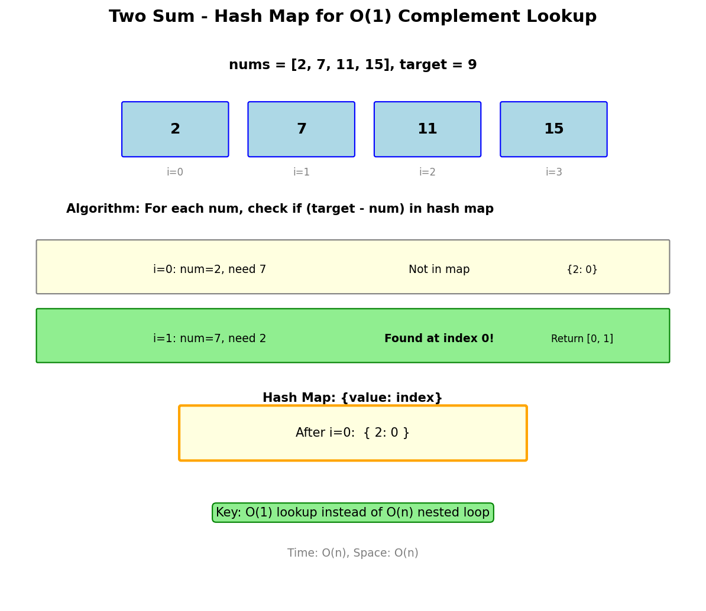

# Two Sum

## Problem Statement

Given an array of integers `nums` and an integer `target`, return indices of the two numbers such that they add up to `target`.

You may assume that each input would have exactly one solution, and you may not use the same element twice.

You can return the answer in any order.

**LeetCode:** [1. Two Sum](https://leetcode.com/problems/two-sum/)

## Examples

**Example 1:**
```
Input: nums = [2,7,11,15], target = 9
Output: [0,1]
Explanation: Because nums[0] + nums[1] == 9, we return [0, 1].
```

**Example 2:**
```
Input: nums = [3,2,4], target = 6
Output: [1,2]
```

**Example 3:**
```
Input: nums = [3,3], target = 6
Output: [0,1]
```

## Constraints

- `2 <= nums.length <= 10^4`
- `-10^9 <= nums[i] <= 10^9`
- `-10^9 <= target <= 10^9`
- Only one valid answer exists.

## Hash Map Approach



### Key Insight

For each number `num`, we need to find if `target - num` exists in the array. Using a hash map allows O(1) lookup.

### Algorithm

1. Create an empty hash map to store `{value: index}`
2. Iterate through the array
3. For each element, calculate `complement = target - nums[i]`
4. Check if complement exists in hash map
5. If found, return `[hash_map[complement], i]`
6. Otherwise, add current element to hash map

## Solution

```python
from typing import List

def twoSum(nums: List[int], target: int) -> List[int]:
    """
    Find two indices whose values sum to target.

    Time: O(n) - single pass through array
    Space: O(n) - hash map storage
    """
    num_to_index = {}

    for i, num in enumerate(nums):
        complement = target - num

        if complement in num_to_index:
            return [num_to_index[complement], i]

        num_to_index[num] = i

    return []  # No solution found
```

::: info Complexity: Time O(n) · Space O(n)
- **Time:** Single pass through array; each lookup and insertion in hash map is O(1) average
- **Space:** Hash map stores at most n key-value pairs (one per array element)
:::

```python
# Alternative: Return all pairs (if multiple solutions exist)
def twoSumAllPairs(nums: List[int], target: int) -> List[List[int]]:
    """Find all pairs that sum to target."""
    result = []
    num_to_indices = {}

    for i, num in enumerate(nums):
        if num not in num_to_indices:
            num_to_indices[num] = []
        num_to_indices[num].append(i)

    seen = set()
    for i, num in enumerate(nums):
        complement = target - num
        if complement in num_to_indices:
            for j in num_to_indices[complement]:
                if i < j:
                    pair = (i, j)
                    if pair not in seen:
                        seen.add(pair)
                        result.append([i, j])

    return result
```

::: info Complexity: Time O(n^2) · Space O(n)
- **Time:** Building index map is O(n), but checking all pairs can be O(n^2) in worst case with many duplicate complements
- **Space:** Hash map stores indices for each unique number, plus seen set and result list
:::

## Complexity Analysis

| Approach | Time | Space |
|----------|------|-------|
| Brute Force | O(n^2) | O(1) |
| Hash Map | O(n) | O(n) |
| Two Pointers (sorted) | O(n log n) | O(1) |

### Why Hash Map is Optimal

- **Brute Force:** Check every pair - O(n^2) time
- **Hash Map:** Single pass with O(1) lookups - O(n) time
- **Two Pointers:** Requires sorting, loses original indices

## Edge Cases

1. **Two same numbers:** `[3,3], target=6` - Works because we check before adding
2. **Negative numbers:** `[-1,2], target=1` - Hash map handles negatives
3. **Single valid pair:** Guaranteed by problem constraints
4. **Large numbers:** Use appropriate data types

## Common Mistakes

1. Using the same element twice
2. Not handling duplicate values correctly
3. Returning values instead of indices

## Variations

### Two Sum II - Sorted Array
If the input is sorted, use two pointers:
```python
def twoSumSorted(numbers: List[int], target: int) -> List[int]:
    left, right = 0, len(numbers) - 1
    while left < right:
        current_sum = numbers[left] + numbers[right]
        if current_sum == target:
            return [left + 1, right + 1]  # 1-indexed
        elif current_sum < target:
            left += 1
        else:
            right -= 1
    return []
```

::: info Complexity: Time O(n) · Space O(1)
- **Time:** Two pointers traverse array once - each step moves one pointer, at most n steps total
- **Space:** Only uses two pointer variables, no additional data structures
:::

### Two Sum - Data Structure Design
```python
class TwoSum:
    def __init__(self):
        self.nums = {}

    def add(self, number: int) -> None:
        self.nums[number] = self.nums.get(number, 0) + 1

    def find(self, value: int) -> bool:
        for num in self.nums:
            complement = value - num
            if complement in self.nums:
                if complement != num or self.nums[num] > 1:
                    return True
        return False
```

::: info Complexity: Time O(1) add / O(n) find · Space O(n)
- **Time:** add is O(1) hash map update; find iterates all unique numbers with O(1) complement lookup
- **Space:** Hash map grows with number of unique elements added
:::

## Related Problems

::: details 3Sum (LeetCode 15)
**Problem:** Find all unique triplets that sum to zero.

**Key Insight:** Sort array, fix first element, use two-pointer on remaining. Skip duplicates.

**Approach:** For each i, use left/right pointers from i+1 and end. Move pointers based on sum comparison.

**Complexity:** Time O(n^2), Space O(1) extra
:::

::: details 4Sum (LeetCode 18)
**Problem:** Find all unique quadruplets that sum to target.

**Key Insight:** Extend 3Sum by adding another outer loop. Two nested loops + two-pointer.

**Approach:** Fix first two elements, use two-pointer for remaining two. Handle duplicates at each level.

**Complexity:** Time O(n^3), Space O(1) extra
:::

::: details Two Sum II - Input Array Is Sorted (LeetCode 167)
**Problem:** Find two numbers in sorted array that sum to target. Return 1-indexed positions.

**Key Insight:** Sorted array allows two-pointer approach without hash map.

**Approach:** Left pointer at start, right at end. If sum < target, move left. If sum > target, move right.

**Complexity:** Time O(n), Space O(1)
:::

::: details Two Sum III - Data Structure Design (LeetCode 170)
**Problem:** Design a data structure supporting add and find operations for two-sum.

**Key Insight:** Trade-off between add and find complexity. Hash map tracks counts.

**Approach:** Store number counts in map. For find, iterate checking if complement exists (handle same number case).

**Complexity:** Add O(1), Find O(n)
:::
