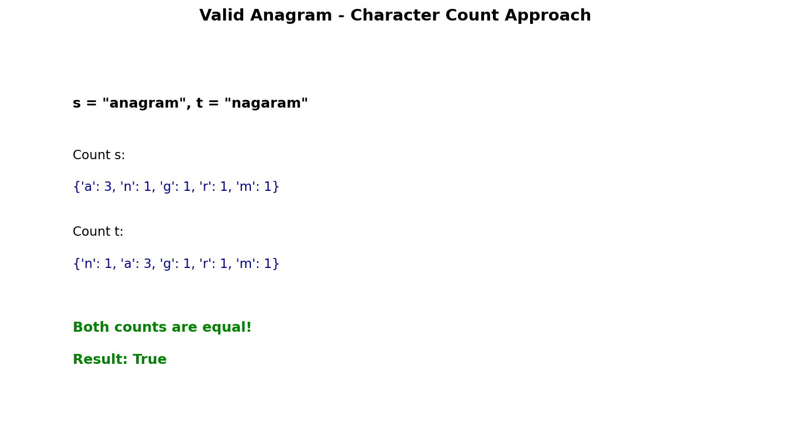

# Valid Anagram

## Problem Statement

Given two strings `s` and `t`, return `true` if `t` is an anagram of `s`, and `false` otherwise.

An **Anagram** is a word or phrase formed by rearranging the letters of a different word or phrase, typically using all the original letters exactly once.

**LeetCode:** [242. Valid Anagram](https://leetcode.com/problems/valid-anagram/)

## Examples

**Example 1:**
```
Input: s = "anagram", t = "nagaram"
Output: true
```

**Example 2:**
```
Input: s = "rat", t = "car"
Output: false
```

## Constraints

- `1 <= s.length, t.length <= 5 * 10^4`
- `s` and `t` consist of lowercase English letters.

## Hash Map Approach



### Key Insight

Two strings are anagrams if they have the same character frequencies. Use a hash map to count characters.

### Algorithm

1. If lengths differ, return `False`
2. Count character frequencies in both strings
3. Compare the two frequency maps

## Solution

```python
from collections import Counter

def isAnagram(s: str, t: str) -> bool:
    """
    Check if t is an anagram of s.

    Time: O(n) - count characters
    Space: O(1) - at most 26 characters
    """
    if len(s) != len(t):
        return False

    return Counter(s) == Counter(t)
```

::: info Complexity: Time O(n) · Space O(1)
- **Time:** Counting characters in both strings is O(n); comparing counters is O(26) = O(1) for fixed alphabet
- **Space:** Counters store at most 26 lowercase letter counts (constant for fixed character set)
:::

```python
# Manual counting approach
def isAnagramManual(s: str, t: str) -> bool:
    """Without using Counter."""
    if len(s) != len(t):
        return False

    count = {}

    # Count characters in s
    for char in s:
        count[char] = count.get(char, 0) + 1

    # Decrement for characters in t
    for char in t:
        if char not in count:
            return False
        count[char] -= 1
        if count[char] < 0:
            return False

    return True
```

::: info Complexity: Time O(n) · Space O(1)
- **Time:** Two passes through strings with O(1) hash map operations
- **Space:** Hash map stores at most 26 entries for lowercase letters
:::

```python
# Array-based counting (faster for lowercase letters only)
def isAnagramArray(s: str, t: str) -> bool:
    """
    Use fixed-size array for lowercase letters.

    Time: O(n)
    Space: O(1) - always 26 elements
    """
    if len(s) != len(t):
        return False

    count = [0] * 26

    for i in range(len(s)):
        count[ord(s[i]) - ord('a')] += 1
        count[ord(t[i]) - ord('a')] -= 1

    return all(c == 0 for c in count)
```

::: info Complexity: Time O(n) · Space O(1)
- **Time:** Single pass incrementing/decrementing counts, then O(26) check for all zeros
- **Space:** Fixed 26-element array regardless of input size
:::

## Alternative: Sorting Approach

```python
def isAnagramSorting(s: str, t: str) -> bool:
    """
    Sort both strings and compare.

    Time: O(n log n)
    Space: O(n) - sorted copies
    """
    return sorted(s) == sorted(t)
```

::: info Complexity: Time O(n log n) · Space O(n)
- **Time:** Sorting each string takes O(n log n); comparison is O(n)
- **Space:** sorted() creates new lists containing all characters
:::

## Complexity Analysis

| Approach | Time | Space |
|----------|------|-------|
| Hash Map | O(n) | O(1)* |
| Array (26 chars) | O(n) | O(1) |
| Sorting | O(n log n) | O(n) |

*Space is O(1) for fixed character set (26 lowercase letters)

## Edge Cases

1. **Empty strings:** `"", ""` - Both empty, return `True`
2. **Different lengths:** `"a", "ab"` - Return `False` immediately
3. **Single character:** `"a", "a"` - Return `True`
4. **Same string:** `"test", "test"` - Return `True`

## Follow-up: Unicode Characters

If the inputs contain Unicode characters:

```python
def isAnagramUnicode(s: str, t: str) -> bool:
    """
    Handle Unicode characters using hash map.

    Time: O(n)
    Space: O(k) where k is unique characters
    """
    if len(s) != len(t):
        return False

    char_count = {}

    for char in s:
        char_count[char] = char_count.get(char, 0) + 1

    for char in t:
        if char not in char_count or char_count[char] == 0:
            return False
        char_count[char] -= 1

    return True
```

::: info Complexity: Time O(n) · Space O(k)
- **Time:** Two linear passes through strings with O(1) hash operations
- **Space:** Hash map stores k unique characters (unbounded for Unicode)
:::

## Variations

### Group Anagrams
Group strings that are anagrams of each other:

```python
from collections import defaultdict
from typing import List

def groupAnagrams(strs: List[str]) -> List[List[str]]:
    """
    Group anagrams using sorted string as key.

    Time: O(n * k log k) where k is max string length
    Space: O(n * k)
    """
    groups = defaultdict(list)

    for s in strs:
        key = tuple(sorted(s))
        groups[key].append(s)

    return list(groups.values())
```

::: info Complexity: Time O(n * k log k) · Space O(n * k)
- **Time:** For each of n strings, sorting k characters takes O(k log k)
- **Space:** Hash map stores all n strings; keys are tuples of length k
:::

```python
# Optimized: Use character count as key
def groupAnagramsOptimized(strs: List[str]) -> List[List[str]]:
    """
    Use character count tuple as key (avoids sorting).

    Time: O(n * k)
    Space: O(n * k)
    """
    groups = defaultdict(list)

    for s in strs:
        count = [0] * 26
        for char in s:
            count[ord(char) - ord('a')] += 1
        groups[tuple(count)].append(s)

    return list(groups.values())
```

::: info Complexity: Time O(n * k) · Space O(n * k)
- **Time:** For each of n strings, counting k characters is O(k) - no sorting needed
- **Space:** Same storage requirements; keys are 26-element tuples (constant per string)
:::

### Find All Anagrams in a String
```python
def findAnagrams(s: str, p: str) -> List[int]:
    """
    Find all start indices of p's anagrams in s.
    Uses sliding window.

    Time: O(n)
    Space: O(1)
    """
    if len(p) > len(s):
        return []

    result = []
    p_count = Counter(p)
    window = Counter(s[:len(p)])

    if window == p_count:
        result.append(0)

    for i in range(len(p), len(s)):
        # Add new character
        window[s[i]] += 1

        # Remove old character
        old_char = s[i - len(p)]
        window[old_char] -= 1
        if window[old_char] == 0:
            del window[old_char]

        if window == p_count:
            result.append(i - len(p) + 1)

    return result
```

::: info Complexity: Time O(n) · Space O(1)
- **Time:** Single pass with O(1) window updates and O(26) counter comparisons
- **Space:** Window and pattern counters store at most 26 characters each
:::

## Related Problems

::: details Group Anagrams (LeetCode 49)
**Problem:** Group strings that are anagrams of each other.

**Key Insight:** Anagrams have same sorted characters or same character counts. Use as hash key.

**Approach:** Create hash key from sorted string or character count tuple. Group strings by key.

**Complexity:** Time O(n * k log k) for sorting approach, Space O(n * k)
:::

::: details Find All Anagrams in a String (LeetCode 438)
**Problem:** Find all start indices of p's anagrams in s.

**Key Insight:** Use sliding window of size p.length. Compare character counts.

**Approach:** Fixed-size sliding window with frequency comparison. Slide and check at each position.

**Complexity:** Time O(n), Space O(1)
:::

::: details Permutation in String (LeetCode 567)
**Problem:** Check if s2 contains any permutation of s1.

**Key Insight:** Same as finding one anagram. Use fixed-size sliding window.

**Approach:** Maintain frequency map for s1. Slide window over s2, return true if frequencies match.

**Complexity:** Time O(n), Space O(1)
:::

::: details Ransom Note (LeetCode 383)
**Problem:** Return true if ransomNote can be constructed from magazine letters.

**Key Insight:** Count characters in magazine, check if enough for ransomNote.

**Approach:** Build frequency map from magazine. Decrement for each ransomNote char, fail if negative.

**Complexity:** Time O(n + m), Space O(1)
:::
