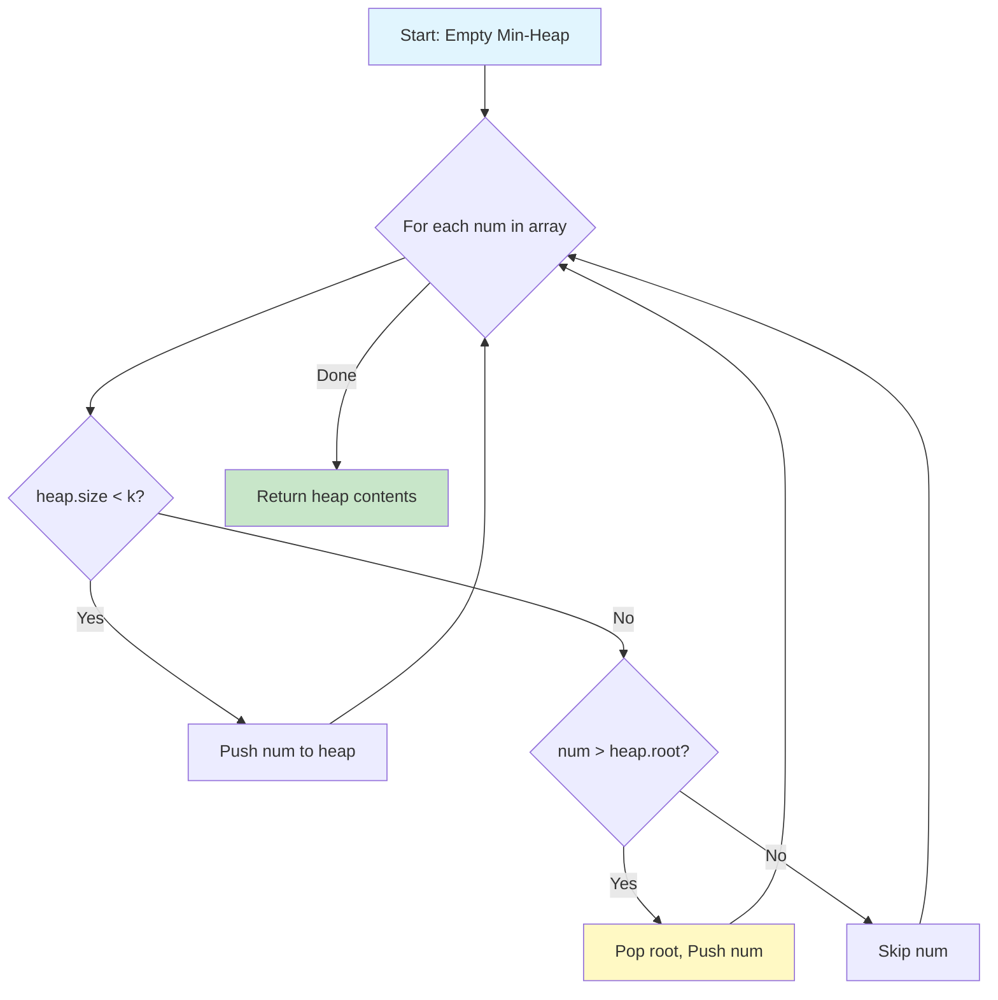
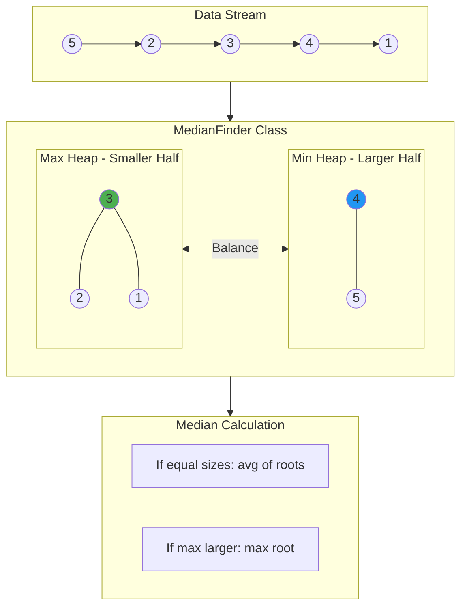
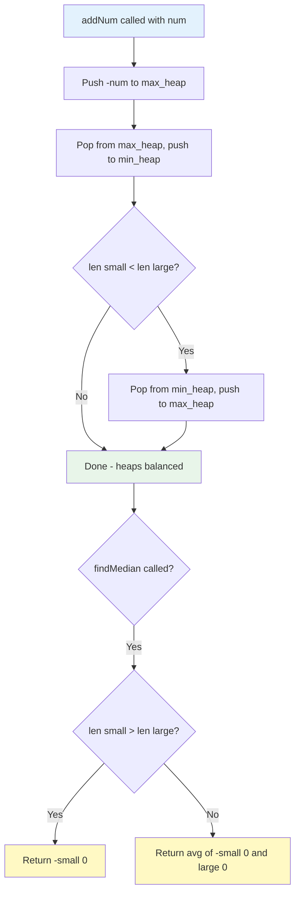

# Heap Problems: Top K, Stock, Median

> **Classic heap applications with visualizations**

---

## Find K Largest Numbers

### Problem Statement
Find the k largest elements in an unsorted array.

**LeetCode Reference:** [Kth Largest Element in an Array (#215)](https://leetcode.com/problems/top-k-frequent-elements/)

### Why Min-Heap for Top K Largest?

The key insight is counterintuitive: to find the K **largest** elements, we use a **Min-Heap**. Here's why:

- We maintain a heap of exactly size K
- The smallest element in our "top K candidates" sits at the root
- When a new element comes in, we only need to compare with this minimum
- If the new element is larger, it deserves a spot in our top K (replacing the current minimum)

### Visualization: Min Heap of Size K

```
Array: [3, 1, 5, 12, 2, 11]  k=3

Initial State: heap = []

Step 1: Process 3
        heap size < k, so push 3
        Heap: [3]
                 (3)

Step 2: Process 1
        heap size < k, so push 1
        Heap: [1, 3]      <- Min-heap property: root is smallest
                 (1)
                 /
               (3)

Step 3: Process 5
        heap size < k, so push 5
        Heap: [1, 3, 5]   <- Heap is now FULL at size k
                 (1)
                / \
              (3) (5)

Step 4: Process 12
        12 > heap[0] (which is 1)? YES!
        Pop 1, push 12
        Heap: [3, 12, 5]
                 (3)      <- 3 is now the minimum of top-3
                / \
             (12) (5)

Step 5: Process 2
        2 > heap[0] (which is 3)? NO
        Skip (2 is not in top-3)
        Heap: [3, 12, 5]  <- unchanged

Step 6: Process 11
        11 > heap[0] (which is 3)? YES!
        Pop 3, push 11
        Heap: [5, 12, 11]
                 (5)      <- New minimum of top-3
                / \
             (12) (11)

Result: [5, 11, 12] (the 3 largest elements)
```

### ASCII Art: Heap Operations Flow

```
+--------------------------------------------------+
|           Finding Top K Elements Process          |
+--------------------------------------------------+

Input Array: [3, 1, 5, 12, 2, 11]    k = 3

    +---+---+---+---+---+---+
    | 3 | 1 | 5 | 12| 2 | 11|    <-- Process left to right
    +---+---+---+---+---+---+
      |   |   |   |   |   |
      v   v   v   v   v   v

    HEAP STATE EVOLUTION:

    [3]         Size: 1  (building)
     |
     v
    [1,3]       Size: 2  (building)
     |
     v
    [1,3,5]     Size: 3  (FULL - now filtering)
     |
     | 12 > 1? YES - replace!
     v
    [3,12,5]    Removed: 1, Added: 12
     |
     | 2 > 3? NO - skip
     v
    [3,12,5]    Unchanged
     |
     | 11 > 3? YES - replace!
     v
    [5,12,11]   Removed: 3, Added: 11

    Final Answer: [5, 11, 12]
```

### Mermaid Diagram: Top K Algorithm Flow



### Solution (Python)

```python
import heapq

def findKLargest(nums: list[int], k: int) -> list[int]:
    """
    Find the k largest elements using a min-heap.

    Time: O(n log k) - each of n elements may trigger heap operation
    Space: O(k) - heap stores exactly k elements
    """
    # Min heap of size k
    heap = []

    for num in nums:
        if len(heap) < k:
            heapq.heappush(heap, num)
        elif num > heap[0]:
            # heapreplace is more efficient than pop + push
            heapq.heapreplace(heap, num)

    return heap
```

::: info Complexity: Time O(n log k) · Space O(k)
- **Time:** Each of the n elements may trigger a heap operation (push or replace), each costing O(log k) since the heap size is bounded at k
- **Space:** The heap stores exactly k elements at any time
:::

```python
# One-liner using built-in
def findKLargest_v2(nums: list[int], k: int) -> list[int]:
    """Uses Python's optimized nlargest implementation."""
    return heapq.nlargest(k, nums)
```

::: info Complexity: Time O(n log k) · Space O(k)
- **Time:** Python's nlargest uses a min-heap of size k internally, processing n elements with O(log k) heap operations
- **Space:** Internally maintains a heap of size k
:::

```python
# Alternative: Max heap approach (less efficient for this problem)
def findKLargest_v3(nums: list[int], k: int) -> list[int]:
    """
    Build max-heap and extract k times.
    Time: O(n + k log n)
    """
    # Negate for max-heap behavior
    max_heap = [-num for num in nums]
    heapq.heapify(max_heap)  # O(n)

    result = []
    for _ in range(k):
        result.append(-heapq.heappop(max_heap))  # O(log n) each

    return result
```

::: info Complexity: Time O(n + k log n) · Space O(n)
- **Time:** Heapify takes O(n). Then we extract k elements, each extraction costing O(log n), giving O(k log n)
- **Space:** The heap stores all n elements
:::

### Visual Guide


### Complexity Analysis

| Approach | Time | Space | Best When |
|----------|------|-------|-----------|
| Min-Heap (size k) | O(n log k) | O(k) | k << n |
| Max-Heap (heapify) | O(n + k log n) | O(n) | k is small |
| Sort + Slice | O(n log n) | O(n) | k close to n |
| QuickSelect | O(n) avg | O(1) | Need only kth element |

---

## Buy and Sell Stock (Multiple Transactions)

### Problem Statement
Given stock prices over days and a limit of k transactions, find the maximum profit.

**LeetCode Reference:** [Best Time to Buy and Sell Stock IV (#188)](https://leetcode.com/problems/best-time-to-buy-and-sell-stock-iv/)

### Visualization: Transaction Decisions

```
Prices: [3, 2, 6, 5, 0, 3]  k=2 transactions

Day:     0   1   2   3   4   5
Price:   3   2   6   5   0   3
         |   |   |   |   |   |
         v   v   v   v   v   v

         3---2   6---5   0---3
             |   ^       |   ^
             |___|       |___|
            BUY  SELL   BUY  SELL

Transaction 1: Buy at 2, Sell at 6  -> Profit: 4
Transaction 2: Buy at 0, Sell at 3  -> Profit: 3
                                       Total:  7
```

### ASCII Art: DP State Transitions

```
+----------------------------------------------------------+
|         Stock Trading DP State Machine                    |
+----------------------------------------------------------+

States: dp[t][d] = max profit using at most t transactions by day d

                    Day 0    Day 1    Day 2    Day 3    Day 4    Day 5
                    (3)      (2)      (6)      (5)      (0)      (3)

    t=0 (no txn)    0        0        0        0        0        0

    t=1 (1 txn)     0        0        4        4        4        4
                             |        ^
                             +--------+
                             buy@2, sell@6

    t=2 (2 txns)    0        0        4        4        6        7
                                                        |        ^
                                                        +--------+
                                                        buy@0, sell@3

State Transition:
+------------------+     +------------------+
|   Not Holding    | --> |    Holding       |
|   (can buy)      |     |   (can sell)     |
+------------------+     +------------------+
        ^                        |
        |                        |
        +------------------------+
             After Sell (profit realized)
```

### Mermaid Diagram: Stock Transaction Flow

```mermaid
flowchart LR
    subgraph Day0[Day 0: $3]
        S0[State: No Position]
    end
    subgraph Day1[Day 1: $2]
        S1A[No Position]
        S1B[Holding - bought@2]
    end
    subgraph Day2[Day 2: $6]
        S2A[No Position - sold@6]
        S2B[Still Holding]
    end
    subgraph Day4[Day 4: $0]
        S4A[No Position]
        S4B[Holding - bought@0]
    end
    subgraph Day5[Day 5: $3]
        S5[Sold@3 - Total: $7]
    end

    S0 --> S1A
    S0 --> S1B
    S1B --> S2A
    S2A --> S4A
    S4A --> S4B
    S4B --> S5

    style S5 fill:#c8e6c9
```

### Solution (Python)

```python
def maxProfit_k_transactions(k: int, prices: list[int]) -> int:
    """
    Find maximum profit with at most k transactions.

    A transaction consists of buying and then selling one share.
    You cannot hold multiple shares at once.

    Time: O(n*k) where n is number of days
    Space: O(n*k) for DP table, can be optimized to O(k)
    """
    if not prices or k == 0:
        return 0

    n = len(prices)

    # Optimization: if k >= n//2, we can do unlimited transactions
    if k >= n // 2:
        return sum(max(0, prices[i] - prices[i-1]) for i in range(1, n))

    # DP approach for limited k
    # dp[t][d] = max profit using at most t transactions by day d
    dp = [[0] * n for _ in range(k + 1)]

    for t in range(1, k + 1):
        # max_diff tracks: max(dp[t-1][j] - prices[j]) for all j < d
        # This represents the best "buy" position for transaction t
        max_diff = -prices[0]

        for d in range(1, n):
            # Either don't transact on day d, or sell on day d
            dp[t][d] = max(
                dp[t][d-1],           # Don't sell on day d
                prices[d] + max_diff   # Sell on day d
            )
            # Update max_diff for future days
            max_diff = max(max_diff, dp[t-1][d] - prices[d])

    return dp[k][n-1]
```

::: info Complexity: Time O(n*k) · Space O(n*k)
- **Time:** We fill a DP table with (k+1) rows and n columns, and each cell computation is O(1) due to the max_diff optimization
- **Space:** The 2D DP table stores (k+1) * n values. Can be optimized to O(k) using rolling arrays
:::

```python
def maxProfit_unlimited(prices: list[int]) -> int:
    """
    Special case: unlimited transactions allowed.
    Simply sum all positive price differences.

    Time: O(n), Space: O(1)
    """
    return sum(max(0, prices[i] - prices[i-1]) for i in range(1, len(prices)))
```

::: info Complexity: Time O(n) · Space O(1)
- **Time:** Single pass through n-1 price differences
- **Space:** Only stores the running sum, no additional data structures
:::

```python
def maxProfit_with_heap(prices: list[int], k: int) -> int:
    """
    Alternative approach using heap to track best profit opportunities.

    Find all potential profits and use heap to get top k.
    Note: This is a simplified version that doesn't handle overlapping intervals.
    """
    import heapq

    if not prices or k == 0:
        return 0

    # Find all increasing sequences (potential profits)
    profits = []
    i = 0
    n = len(prices)

    while i < n - 1:
        # Find local minimum
        while i < n - 1 and prices[i] >= prices[i + 1]:
            i += 1
        buy = prices[i] if i < n else 0

        # Find local maximum
        while i < n - 1 and prices[i] <= prices[i + 1]:
            i += 1
        sell = prices[i] if i < n else 0

        if sell > buy:
            profits.append(sell - buy)

    # Get top k profits
    return sum(heapq.nlargest(k, profits))
```

::: info Complexity: Time O(n + p log k) · Space O(p)
- **Time:** Finding increasing sequences takes O(n). Getting top k from p profit segments uses nlargest which is O(p log k)
- **Space:** O(p) for storing profit segments, where p is the number of increasing price runs
:::

### Visual Guide


---

## Find Median from Data Stream

### Problem Statement
Design a data structure that supports:
- `addNum(int num)` - Add an integer from the data stream
- `findMedian()` - Return the median of all elements so far

**LeetCode Reference:** [Find Median from Data Stream (#295)](https://leetcode.com/problems/find-median-from-data-stream/)

### The Two Heaps Insight

The key insight is to maintain two heaps:
1. **Max-Heap (small)**: Stores the smaller half of numbers
2. **Min-Heap (large)**: Stores the larger half of numbers

The median is always at or between the roots of these heaps!

### Visualization: Two Heaps Step by Step

```
Stream: 5, 2, 3, 4, 1

+========================================================+
|                    STEP-BY-STEP PROCESS                 |
+========================================================+

STEP 1: addNum(5)
+-------------------+     +-------------------+
|    MAX HEAP       |     |    MIN HEAP       |
|   (smaller half)  |     |   (larger half)   |
+-------------------+     +-------------------+
|       [5]         |     |       []          |
|        ^          |     |                   |
|      root         |     |                   |
+-------------------+     +-------------------+

Median = 5 (odd count, take max-heap root)

---------------------------------------------------------

STEP 2: addNum(2)
+-------------------+     +-------------------+
|    MAX HEAP       |     |    MIN HEAP       |
+-------------------+     +-------------------+
|       [2]         |     |       [5]         |
|        ^          |     |        ^          |
+-------------------+     +-------------------+
      smaller              larger

Median = (2 + 5) / 2 = 3.5 (even count, average of roots)

---------------------------------------------------------

STEP 3: addNum(3)
+-------------------+     +-------------------+
|    MAX HEAP       |     |    MIN HEAP       |
+-------------------+     +-------------------+
|     [3, 2]        |     |       [5]         |
|       (3)         |     |       (5)         |
|      /            |     |                   |
|    (2)            |     |                   |
+-------------------+     +-------------------+

Median = 3 (odd count, take max-heap root)

---------------------------------------------------------

STEP 4: addNum(4)
+-------------------+     +-------------------+
|    MAX HEAP       |     |    MIN HEAP       |
+-------------------+     +-------------------+
|     [3, 2]        |     |     [4, 5]        |
|       (3)         |     |       (4)         |
|      /            |     |      /            |
|    (2)            |     |    (5)            |
+-------------------+     +-------------------+

Median = (3 + 4) / 2 = 3.5 (even count)

---------------------------------------------------------

STEP 5: addNum(1)
+-------------------+     +-------------------+
|    MAX HEAP       |     |    MIN HEAP       |
+-------------------+     +-------------------+
|   [3, 2, 1]       |     |     [4, 5]        |
|       (3)         |     |       (4)         |
|      / \          |     |      /            |
|    (2) (1)        |     |    (5)            |
+-------------------+     +-------------------+

Median = 3 (odd count, take max-heap root)

==========================================================
INVARIANTS:
1. All elements in max_heap <= All elements in min_heap
2. |max_heap| == |min_heap| OR |max_heap| == |min_heap| + 1
3. If sizes equal: median = average of two roots
4. If max_heap larger: median = max_heap root
==========================================================
```

### ASCII Art: Balancing Operation

```
Adding number 2.5 to heaps (current state after step 5):

    MAX HEAP (small)          MIN HEAP (large)
         [3]                      [4]
        /   \                     /
      [2]   [1]                 [5]

1. Add 2.5 to max-heap (since 2.5 < 4, the min of large half)

    MAX HEAP                  MIN HEAP
         [3]                      [4]
        / \  \                    /
      [2] [1][2.5]              [5]

   After heapify:
         [3]                      [4]
        / \                       /
     [2.5][1]                   [5]
       /
     [2]

2. Check balance: max_heap has 4, min_heap has 2
   Difference > 1, need to rebalance!

3. Move root of max_heap to min_heap:

    MAX HEAP                  MIN HEAP
        [2.5]                    [3]
        /  \                     / \
      [2]  [1]                 [4] [5]

   Now balanced: sizes are 3 and 3

4. Median = (2.5 + 3) / 2 = 2.75
```

### Mermaid Diagram: Two Heaps Architecture



### Mermaid Diagram: addNum Algorithm Flow



### Solution (Python)

```python
import heapq

class MedianFinder:
    """
    Maintains running median using two heaps.

    - small (max-heap): stores the smaller half of numbers
    - large (min-heap): stores the larger half of numbers

    Time Complexity:
        - addNum: O(log n) for heap operations
        - findMedian: O(1) to access heap roots

    Space Complexity: O(n) to store all numbers
    """

    def __init__(self):
        # Python only has min-heap, so we negate values for max-heap
        self.small = []  # Max heap (stores negated values)
        self.large = []  # Min heap

    def addNum(self, num: int) -> None:
        """Add a number to the data structure."""
        # Step 1: Add to max heap (smaller half)
        heapq.heappush(self.small, -num)

        # Step 2: Balance - move largest from small to large
        # This ensures all elements in small <= all elements in large
        heapq.heappush(self.large, -heapq.heappop(self.small))

        # Step 3: Ensure small has >= elements than large
        # This keeps the median accessible from small's root
        if len(self.small) < len(self.large):
            heapq.heappush(self.small, -heapq.heappop(self.large))

    def findMedian(self) -> float:
        """Return the median of all elements."""
        if len(self.small) > len(self.large):
            # Odd number of elements - median is root of max-heap
            return -self.small[0]
        # Even number of elements - median is average of two roots
        return (-self.small[0] + self.large[0]) / 2
```

::: info Complexity: Time O(log n) for addNum, O(1) for findMedian · Space O(n)
- **Time:** addNum performs a constant number of heap push/pop operations, each O(log n). findMedian only accesses heap roots
- **Space:** Both heaps together store all n numbers from the stream
:::

```python
class MedianFinderOptimized:
    """
    Alternative implementation with lazy deletion support.
    Useful when elements can be removed from the stream.
    """

    def __init__(self):
        self.small = []  # Max heap (negated)
        self.large = []  # Min heap
        self.small_size = 0
        self.large_size = 0
        self.deleted = {}  # Track deleted elements

    def addNum(self, num: int) -> None:
        if not self.small or num <= -self.small[0]:
            heapq.heappush(self.small, -num)
            self.small_size += 1
        else:
            heapq.heappush(self.large, num)
            self.large_size += 1
        self._balance()

    def removeNum(self, num: int) -> None:
        """Mark a number for lazy deletion."""
        self.deleted[num] = self.deleted.get(num, 0) + 1

        if num <= -self.small[0]:
            self.small_size -= 1
        else:
            self.large_size -= 1
        self._balance()

    def _balance(self) -> None:
        """Ensure size invariant and clean deleted elements."""
        # Balance sizes
        while self.small_size > self.large_size + 1:
            heapq.heappush(self.large, -heapq.heappop(self.small))
            self.small_size -= 1
            self.large_size += 1
            self._clean(self.small, True)

        while self.large_size > self.small_size:
            heapq.heappush(self.small, -heapq.heappop(self.large))
            self.large_size -= 1
            self.small_size += 1
            self._clean(self.large, False)

    def _clean(self, heap: list, is_max: bool) -> None:
        """Remove lazily deleted elements from heap top."""
        while heap:
            top = -heap[0] if is_max else heap[0]
            if self.deleted.get(top, 0) > 0:
                self.deleted[top] -= 1
                heapq.heappop(heap)
            else:
                break

    def findMedian(self) -> float:
        return -self.small[0] if self.small_size > self.large_size else \
               (-self.small[0] + self.large[0]) / 2
```

::: info Complexity: Time O(log n) for addNum/removeNum, O(1) for findMedian · Space O(n)
- **Time:** addNum/removeNum perform heap operations O(log n). The lazy deletion amortizes removal cost across operations
- **Space:** O(n) for heaps plus O(n) worst case for the deleted elements tracking map
:::

### Visual Guide


### Complexity Analysis

| Operation | Time | Space |
|-----------|------|-------|
| addNum | O(log n) | O(n) total |
| findMedian | O(1) | - |
| Total for n operations | O(n log n) | O(n) |

---

## Visual Learning Resources

- [VisuAlgo Heap Visualization](https://visualgo.net/en/heap)
- [Two Heap Pattern Visualization](https://algorithm-visualizer.org/)
- [LeetCode Top K Patterns Discussion](https://leetcode.com/discuss/general-discussion/1088565/top-k-problems-sort-heap-and-quickselect/)

---

## Google Interview Applications

### Common Interview Patterns

1. **Top K Pattern**: Used in recommendation systems, trending topics, and analytics
   - [Top K Frequent Elements (LeetCode #347)](https://leetcode.com/problems/top-k-frequent-elements/)
   - [Kth Largest Element (LeetCode #215)](https://leetcode.com/problems/kth-largest-element-in-an-array/)

2. **Two Heaps Pattern**: Real-time statistics and streaming data
   - [Find Median from Data Stream (LeetCode #295)](https://leetcode.com/problems/find-median-from-data-stream/)
   - [Sliding Window Median (LeetCode #480)](https://leetcode.com/problems/sliding-window-median/)

3. **Stock Trading Variants**: Financial modeling and optimization
   - [Best Time to Buy and Sell Stock IV (LeetCode #188)](https://leetcode.com/problems/best-time-to-buy-and-sell-stock-iv/)

### Interview Tips

1. **Always clarify constraints**: k value, array size, memory limits
2. **Discuss tradeoffs**: Min-heap vs sorting vs quickselect
3. **Consider edge cases**: Empty array, k=0, k>n, duplicate values
4. **Mention optimizations**: heapreplace vs separate pop+push

---

## Summary Comparison

| Problem | Data Structure | Key Insight | Time Complexity |
|---------|---------------|-------------|-----------------|
| Top K Elements | Min-Heap (size k) | Keep k largest, evict smallest | O(n log k) |
| Stock Trading | DP + Heap (optional) | Track best buy positions | O(nk) |
| Running Median | Two Heaps | Split data into halves | O(n log n) |

---

## Sources

- [Top K Frequent Elements - LeetCode](https://leetcode.com/problems/top-k-frequent-elements/)
- [Find Median from Data Stream - LeetCode](https://leetcode.com/problems/find-median-from-data-stream/)
- [Top K Problems Discussion - LeetCode](https://leetcode.com/discuss/general-discussion/1088565/top-k-problems-sort-heap-and-quickselect/)
- [Find Median Explanation - Algo.Monster](https://algo.monster/liteproblems/295)
- [Find K Largest Elements - GeeksforGeeks](https://www.geeksforgeeks.org/dsa/k-largestor-smallest-elements-in-an-array/)
- [Median from Running Data Stream - GeeksforGeeks](https://www.geeksforgeeks.org/dsa/median-of-stream-of-integers-running-integers/)
