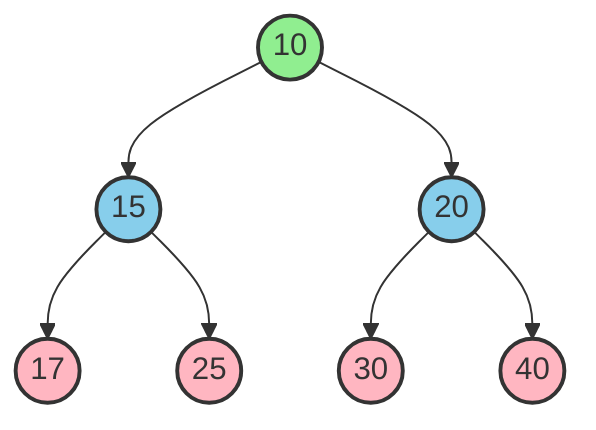
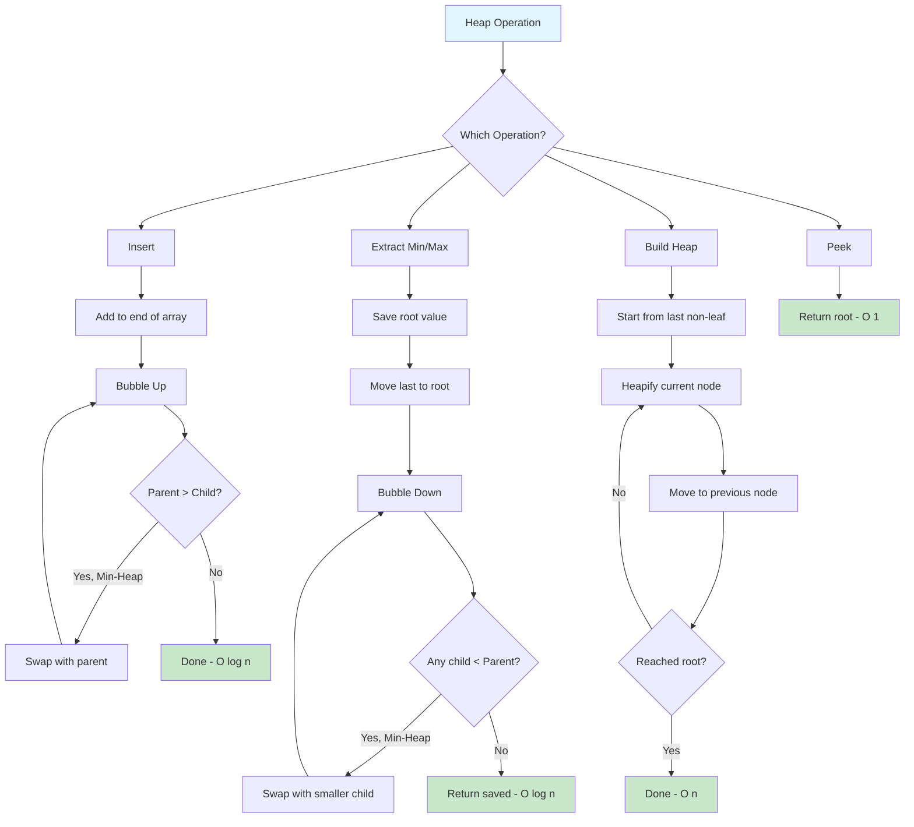

# Heaps

> **Priority queues for efficient min/max operations**

---

## Overview

A **heap** is a specialized tree-based data structure that satisfies the **heap property**: in a max-heap, every parent node is greater than or equal to its children; in a min-heap, every parent is less than or equal to its children. Heaps are commonly implemented as **complete binary trees** stored in arrays, making them memory-efficient and cache-friendly.

### What is a Heap?

A heap is a complete binary tree where:
- **Min-Heap**: The root contains the minimum element; every parent is smaller than its children
- **Max-Heap**: The root contains the maximum element; every parent is larger than its children
- **Complete Tree Property**: All levels are filled except possibly the last, which is filled left-to-right

Heaps are the standard implementation for **priority queues**, enabling efficient extraction of minimum/maximum elements.

### Heap Property Visualization

```
Min-Heap:                    Max-Heap:
       1                          9
      / \                        / \
     3   2                      7   8
    / \ / \                    / \ / \
   7  6 4  5                  3  5 2  4

Parent <= Children           Parent >= Children
```

### When to Use Heaps

| Use Case | Why Heaps Work Well |
|----------|---------------------|
| **Priority Queue** | O(log n) insert and extract-min/max |
| **Top K Elements** | Maintain k elements efficiently |
| **Median Finding** | Two heaps (min + max) approach |
| **Scheduling** | Process tasks by priority |
| **Graph Algorithms** | Dijkstra's, Prim's use min-heaps |
| **Merge K Sorted Lists** | K-way merge with min-heap |

### When to Consider Alternatives

| Scenario | Better Alternative |
|----------|-------------------|
| Need to search for arbitrary element | Hash Table or BST |
| Frequent lookups by value | Hash Table O(1) |
| Need sorted traversal | Balanced BST |
| Simple FIFO/LIFO operations | Queue/Stack |

---

## Document Structure

| Problem | Difficulty | Pattern | Link |
|---------|------------|---------|------|
| Kth Largest Element in Array | Medium | Top-K Min-Heap | [Link](./kth-largest) |
| Top K Frequent Elements | Medium | Heap + Hash Map | [Link](./top-k-frequent) |
| K Closest Points to Origin | Medium | Top-K Max-Heap | [Link](./k-closest-points) |
| Find Median from Data Stream | Hard | Two Heaps | [Link](./find-median-stream) |
| Merge K Sorted Lists | Hard | K-Way Merge | [Link](./merge-k-sorted) |
| Task Scheduler | Medium | Max-Heap + Greedy | [Link](./task-scheduler) |
| Reorganize String | Medium | Max-Heap + Greedy | [Link](./reorganize-string) |
| Meeting Rooms II | Medium | Min-Heap | [Link](./meeting-rooms-ii) |
| Smallest Range Covering Elements | Hard | K-Way Merge | [Link](./smallest-range) |
| Sliding Window Median | Hard | Two Heaps + Lazy Delete | [Link](./sliding-window-median) |

---

## Heap Visualization

### Heap Structure (Mermaid)



### Heap as Array Representation

A heap is typically stored as an array, where the tree structure is implicit:

```
Tree View:              Array View:
       10               [10, 15, 20, 17, 25, 30, 40]
      /  \               0   1   2   3   4   5   6
    15    20
   /  \  /  \
  17  25 30  40

Index Relationships:
- Parent of node i:     (i - 1) // 2
- Left child of i:      2*i + 1
- Right child of i:     2*i + 2
```

### Index Formula Visualization

```
                    Index 0
                      10
                    /    \
          Index 1         Index 2
            15              20
           /  \            /  \
     Index 3  Index 4  Index 5  Index 6
       17       25       30       40

For node at index i:
+------------------+-------------------+-------------------+
|   Parent Index   |  Left Child Index | Right Child Index |
+------------------+-------------------+-------------------+
|   (i - 1) // 2   |     2 * i + 1     |     2 * i + 2     |
+------------------+-------------------+-------------------+

Example: Node at index 1 (value 15)
  - Parent: (1-1)//2 = 0 (value 10)
  - Left child: 2*1+1 = 3 (value 17)
  - Right child: 2*1+2 = 4 (value 25)
```

---

## Visual Guides


---

## Heapify Animation (ASCII)

### Building a Min-Heap from Array

```
Initial Array: [4, 10, 3, 5, 1]

Step 0: Represent as complete binary tree
           4          Index: 0
          / \
        10   3        Index: 1, 2
       /  \
      5    1          Index: 3, 4

Step 1: Start heapifying from last non-leaf node
        Last non-leaf index = (n/2) - 1 = (5/2) - 1 = 1

           4
          / \
       [10]  3     <-- Heapify index 1: Compare 10 with children (5, 1)
       /  \            Min child is 1 at index 4
      5    1           Swap 10 and 1

           4
          / \
         1   3      <-- After swap
       /  \
      5   10

Step 2: Move to index 0 (root)
       [4]          <-- Heapify index 0: Compare 4 with children (1, 3)
       / \             Min child is 1 at index 1
      1   3            Swap 4 and 1
     / \
    5  10

         1          <-- After swap
        / \
       4   3        <-- Continue: Heapify 4 with its children (5, 10)
      / \              4 < 5 and 4 < 10, no swap needed
     5  10

Final Min-Heap:
         1
        / \
       4   3
      / \
     5  10

Array: [1, 4, 3, 5, 10]
```

### Insert Operation (Bubble Up)

```
Insert 2 into heap [1, 4, 3, 5, 10]:

Step 1: Add to end
         1
        / \
       4   3
      / \   \
     5  10  [2]  <-- New element at index 5

Step 2: Bubble up - Compare with parent
        Parent of index 5 = (5-1)/2 = 2 (value 3)
        2 < 3, swap!

         1
        / \
       4  [2]    <-- 2 moved up
      / \   \
     5  10   3

Step 3: Compare with new parent
        Parent of index 2 = (2-1)/2 = 0 (value 1)
        2 > 1, stop!

Final Heap: [1, 4, 2, 5, 10, 3]

         1
        / \
       4   2
      / \   \
     5  10   3
```

### Extract Min Operation (Bubble Down)

```
Extract min from heap [1, 4, 2, 5, 10, 3]:

Step 1: Remove root, move last element to root

       [3]       <-- Last element (3) becomes root
       / \
      4   2
     / \
    5  10

Step 2: Bubble down - Compare with children
        Children of index 0: index 1 (4), index 2 (2)
        Min child is 2 at index 2
        3 > 2, swap!

         2       <-- After swap
        / \
       4  [3]
      / \
     5  10

Step 3: Continue bubble down for index 2
        No children (indices 5, 6 out of bounds)
        Stop!

Extracted: 1
Final Heap: [2, 4, 3, 5, 10]

         2
        / \
       4   3
      / \
     5  10
```

---

## Python heapq Module

### Basic Operations

```python
import heapq

# Creating a heap
heap = []
heapq.heappush(heap, 5)
heapq.heappush(heap, 3)
heapq.heappush(heap, 7)
heapq.heappush(heap, 1)
print(heap)  # [1, 3, 7, 5] - min at index 0

# Extract minimum
min_val = heapq.heappop(heap)  # Returns 1
print(heap)  # [3, 5, 7]

# Peek at minimum without removing
min_val = heap[0]  # O(1), just access index 0

# Heapify existing list - O(n)
arr = [5, 3, 7, 1, 9, 2]
heapq.heapify(arr)
print(arr)  # [1, 3, 2, 5, 9, 7]

# Push and pop in one operation - O(log n)
result = heapq.heappushpop(heap, 4)  # Push 4, then pop min
result = heapq.heapreplace(heap, 4)  # Pop min, then push 4
```

### Top K Elements

```python
import heapq

arr = [3, 1, 4, 1, 5, 9, 2, 6, 5, 3, 5]

# K largest elements - O(n log k)
largest_3 = heapq.nlargest(3, arr)  # [9, 6, 5]

# K smallest elements - O(n log k)
smallest_3 = heapq.nsmallest(3, arr)  # [1, 1, 2]

# With key function
people = [('Alice', 25), ('Bob', 30), ('Charlie', 20)]
oldest = heapq.nlargest(2, people, key=lambda x: x[1])
# [('Bob', 30), ('Alice', 25)]
```

### Max Heap Trick (Negate Values)

```python
import heapq

# Python's heapq is min-heap only
# For max-heap, negate values

max_heap = []
heapq.heappush(max_heap, -5)
heapq.heappush(max_heap, -3)
heapq.heappush(max_heap, -7)

# Get maximum (negate again)
max_val = -heapq.heappop(max_heap)  # Returns 7
print(max_val)

# For complex objects, use tuple (priority, data)
tasks = []
heapq.heappush(tasks, (-10, 'high priority'))
heapq.heappush(tasks, (-1, 'low priority'))
heapq.heappush(tasks, (-5, 'medium priority'))

priority, task = heapq.heappop(tasks)
print(f"Processing: {task} (priority: {-priority})")
# Processing: high priority (priority: 10)
```

### Heap with Custom Objects

```python
import heapq
from dataclasses import dataclass, field
from typing import Any

@dataclass(order=True)
class Task:
    priority: int
    name: str = field(compare=False)

tasks = []
heapq.heappush(tasks, Task(2, "Low priority task"))
heapq.heappush(tasks, Task(1, "High priority task"))
heapq.heappush(tasks, Task(3, "Very low priority"))

while tasks:
    task = heapq.heappop(tasks)
    print(f"{task.name} (priority {task.priority})")

# Alternative: Use tuples (priority, counter, data)
# Counter breaks ties and avoids comparing non-comparable objects
import itertools
counter = itertools.count()
heap = []
heapq.heappush(heap, (5, next(counter), {'name': 'task1'}))
heapq.heappush(heap, (1, next(counter), {'name': 'task2'}))
```

---

## Common Heap Patterns

### Pattern 1: Top K Elements

```python
import heapq

def find_kth_largest(nums: list[int], k: int) -> int:
    """
    Find kth largest element using min-heap of size k
    Time: O(n log k), Space: O(k)
    """
    min_heap = []

    for num in nums:
        heapq.heappush(min_heap, num)
        if len(min_heap) > k:
            heapq.heappop(min_heap)  # Remove smallest

    return min_heap[0]  # Kth largest is min of heap

# Example
nums = [3, 2, 1, 5, 6, 4]
k = 2
print(find_kth_largest(nums, k))  # Output: 5
```

### Pattern 2: Two Heaps (Find Median)

```python
import heapq

class MedianFinder:
    """
    Find median in a stream using two heaps:
    - max_heap: stores smaller half (negate for max behavior)
    - min_heap: stores larger half

    Invariant: len(max_heap) == len(min_heap) or len(max_heap) == len(min_heap) + 1
    """
    def __init__(self):
        self.max_heap = []  # smaller half (negated)
        self.min_heap = []  # larger half

    def addNum(self, num: int) -> None:
        # Always add to max_heap first
        heapq.heappush(self.max_heap, -num)

        # Balance: move largest from max_heap to min_heap
        heapq.heappush(self.min_heap, -heapq.heappop(self.max_heap))

        # Ensure max_heap has >= elements
        if len(min_heap) > len(self.max_heap):
            heapq.heappush(self.max_heap, -heapq.heappop(self.min_heap))

    def findMedian(self) -> float:
        if len(self.max_heap) > len(self.min_heap):
            return -self.max_heap[0]
        return (-self.max_heap[0] + self.min_heap[0]) / 2
```

### Pattern 3: K-Way Merge

```python
import heapq

def merge_k_sorted_lists(lists: list[list[int]]) -> list[int]:
    """
    Merge k sorted lists using min-heap
    Time: O(n log k) where n = total elements
    Space: O(k) for heap
    """
    min_heap = []

    # Initialize: add first element from each list
    for i, lst in enumerate(lists):
        if lst:
            heapq.heappush(min_heap, (lst[0], i, 0))
            # (value, list_index, element_index)

    result = []
    while min_heap:
        val, list_idx, elem_idx = heapq.heappop(min_heap)
        result.append(val)

        # Add next element from same list
        if elem_idx + 1 < len(lists[list_idx]):
            next_val = lists[list_idx][elem_idx + 1]
            heapq.heappush(min_heap, (next_val, list_idx, elem_idx + 1))

    return result

# Example
lists = [[1, 4, 5], [1, 3, 4], [2, 6]]
print(merge_k_sorted_lists(lists))  # [1, 1, 2, 3, 4, 4, 5, 6]
```

### Pattern 4: Schedule Tasks / Greedy Selection

```python
import heapq
from collections import Counter

def reorganize_string(s: str) -> str:
    """
    Reorganize string so no adjacent characters are the same
    Use max-heap to always pick most frequent available char
    """
    counts = Counter(s)
    max_heap = [(-count, char) for char, count in counts.items()]
    heapq.heapify(max_heap)

    result = []
    prev_count, prev_char = 0, ''

    while max_heap:
        count, char = heapq.heappop(max_heap)
        result.append(char)

        # Put previous char back (if count remaining)
        if prev_count < 0:
            heapq.heappush(max_heap, (prev_count, prev_char))

        # Update previous (count is negative, so add 1)
        prev_count, prev_char = count + 1, char

    result_str = ''.join(result)
    return result_str if len(result_str) == len(s) else ""
```

---

## Complexity Analysis

### Time Complexity

| Operation | Time Complexity | Notes |
|-----------|-----------------|-------|
| Insert (push) | O(log n) | Bubble up through height |
| Extract min/max (pop) | O(log n) | Bubble down through height |
| Peek min/max | O(1) | Root is always min/max |
| Build heap (heapify) | O(n) | Not O(n log n)! |
| Search | O(n) | No ordering guarantee for search |
| Delete arbitrary | O(n) | Find O(n) + remove O(log n) |

### Why Heapify is O(n), not O(n log n)

```
For a heap with n nodes:
- Nodes at bottom level: ~n/2 (do 0 swaps)
- Nodes at level 1:      ~n/4 (do at most 1 swap)
- Nodes at level 2:      ~n/8 (do at most 2 swaps)
- ...
- Root:                    1  (do at most log n swaps)

Total work = sum of (nodes at level h) * (max swaps at level h)
           = n/2*0 + n/4*1 + n/8*2 + ... + 1*log(n)
           = O(n)  [by mathematical analysis]
```

### Space Complexity

| Implementation | Space |
|---------------|-------|
| Array-based heap | O(n) |
| Heapify in-place | O(1) additional |
| K-way merge | O(k) for heap |

---

## Heap Operations Flowchart



---

## Visual Learning Resources

### Interactive Visualizations

- [VisuAlgo - Binary Heap](https://visualgo.net/en/heap) - Interactive heap visualization with step-by-step animations for insert, extract, and heapify operations
- [USFCA Heap Visualization](https://www.cs.usfca.edu/~galles/visualization/Heap.html) - Simple, clean visualization for min-heap operations
- [Algorithm Visualizer](https://algorithm-visualizer.org/) - General algorithm animations including heap operations
- [See Algorithms - Binary Heap](https://see-algorithms.com/data-structures/BinaryHeap) - Interactive min-heap and max-heap visualization
- [HeapSort Visualizer](https://heapsortvisualizer.web.app/) - Interactive HeapSort visualization tool
- [Heap Visualization Gallery](https://gallery.selfboot.cn/en/algorithms/heap) - Switch between max/min heap with heapify-up animations

### Video Resources

- [MIT OpenCourseWare - Heaps and Heap Sort](https://ocw.mit.edu/courses/6-006-introduction-to-algorithms-fall-2011/) - Lecture 4 covers heaps
- [Abdul Bari - Heap Data Structure](https://www.youtube.com/watch?v=HqPJF2L5h9U) - Clear visual explanations
- [NeetCode - Heap/Priority Queue Playlist](https://neetcode.io/roadmap) - Interview-focused problems

---

## Interview Focus

Based on recent SDE interview patterns, heaps are frequently tested for problems involving:

### High Priority Topics

1. **Top-K Problems** - Finding k largest/smallest elements is a Google staple
2. **Two Heaps Pattern** - Median finding from data streams
3. **K-Way Merge** - Merging multiple sorted sequences
4. **Task Scheduling** - Greedy selection with priority queues
5. **Graph Algorithms** - Dijkstra's shortest path uses min-heap

### Common Google Heap Questions

| Question Type | Example Problem | Key Insight |
|--------------|-----------------|-------------|
| Top-K | Kth Largest Element | Min-heap of size k |
| Two Heaps | Find Median | Balance max-heap and min-heap |
| K-Way Merge | Merge K Sorted Lists | Heap tracks k pointers |
| Scheduling | Task Scheduler | Max-heap for greedy selection |
| Graph | Network Delay Time | Dijkstra with min-heap |

### Pattern Recognition Triggers

| If you see... | Think about... |
|--------------|----------------|
| "Kth largest/smallest" | Min-heap of size k / Max-heap of size k |
| "Top K" or "K most frequent" | Heap + Hash Map |
| "Median" or "middle element" | Two heaps pattern |
| "Merge K sorted" | K-way merge with min-heap |
| "Schedule" or "order tasks" | Max-heap for greedy |
| "Shortest path" weighted graph | Dijkstra with min-heap |
| "Continuous stream" | Heap for dynamic data |

### What Interviewers Look For

1. **Clarifying Questions**
   - Do we need min or max heap?
   - What's the value of K?
   - Is it a stream (continuous additions)?
   - How to handle duplicates?

2. **Problem-Solving Approach**
   - Identify if heap gives optimal complexity
   - Consider space vs time tradeoffs
   - Explain why heap is better than sorting

3. **Implementation Details**
   - Understand Python heapq is min-heap only
   - Know the negation trick for max-heap
   - Handle edge cases (empty heap, k > n)

4. **Complexity Analysis**
   - Insert/Extract: O(log n)
   - Build heap: O(n), not O(n log n)
   - Top-K: O(n log k) with heap vs O(n log n) with sort

---

## Practice Progression

### Week 1: Foundations

| Day | Focus | Problems |
|-----|-------|----------|
| 1 | Heap Basics | Kth Largest Element, Last Stone Weight |
| 2 | Top-K Pattern | Top K Frequent Elements, K Closest Points |
| 3 | Priority Queue | Meeting Rooms II, Reorganize String |

### Week 2: Advanced Patterns

| Day | Focus | Problems |
|-----|-------|----------|
| 4 | Two Heaps | Find Median from Data Stream |
| 5 | K-Way Merge | Merge K Sorted Lists, Smallest Range |
| 6 | Mixed Practice | Task Scheduler, IPO |

### Week 3: Hard Problems

| Day | Focus | Problems |
|-----|-------|----------|
| 7 | Complex Applications | Sliding Window Median, Trapping Rain Water II |
| 8 | Graph + Heap | Network Delay Time, Swim in Rising Water |
| 9 | Competition Problems | Random hard problems |

---

## Quick Reference Card

### Time Complexity Cheat Sheet

```
Push:       O(log n)  - Bubble up
Pop:        O(log n)  - Bubble down
Peek:       O(1)      - Access root
Heapify:    O(n)      - Build heap from array
Search:     O(n)      - No ordering for search
Top K:      O(n log k)- Using heap of size k
```

### Python heapq Quick Reference

```python
import heapq

# Basic operations
heapq.heappush(heap, item)     # Add item
heapq.heappop(heap)            # Remove and return smallest
heap[0]                        # Peek smallest (don't remove)
heapq.heapify(list)            # Convert list to heap in-place

# Combined operations
heapq.heappushpop(heap, item)  # Push then pop (more efficient)
heapq.heapreplace(heap, item)  # Pop then push (more efficient)

# K elements
heapq.nlargest(k, iterable)    # K largest elements
heapq.nsmallest(k, iterable)   # K smallest elements

# Max-heap trick
heapq.heappush(heap, -value)   # Negate on push
max_val = -heapq.heappop(heap) # Negate on pop
```

---

## Resources

### Recommended Practice

- [LeetCode Heap Problems](https://leetcode.com/tag/heap-priority-queue/)
- [NeetCode Heap Playlist](https://neetcode.io/roadmap)
- [Grind 75 - Heap Section](https://www.techinterviewhandbook.org/grind75)

### Further Reading

- [Tech Interview Handbook - Heap Cheatsheet](https://www.techinterviewhandbook.org/algorithms/heap/)
- [GeeksforGeeks - Top 50 Heap Problems](https://www.geeksforgeeks.org/dsa/top-50-problems-on-heap-data-structure-asked-in-interviews/)
- [Interviewing.io - Heaps Interview Questions](https://interviewing.io/heaps-interview-questions)
- [DevInterview - Heap Interview Questions](https://devinterview.io/questions/data-structures-and-algorithms/heap-and-map-data-structures-interview-questions/)
- [Interview Cake - Heap Concept](https://www.interviewcake.com/concept/java/heap)

---

*Last updated: January 2026*

*Heaps are one of the most underrated data structures in coding interviews. While candidates often remember that heaps help find min/max values efficiently, mastering heap patterns like Top-K, Two Heaps, and K-Way Merge will help you solve approximately 70% of priority-based interview problems with optimal time complexity.*
