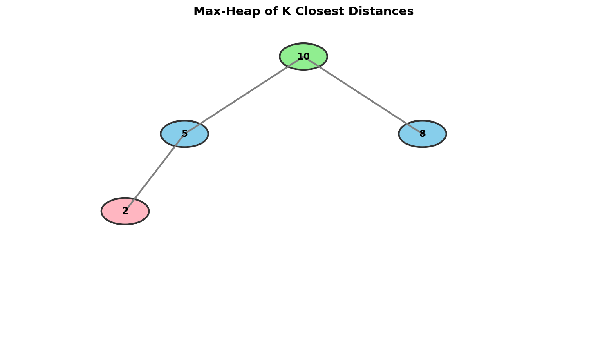
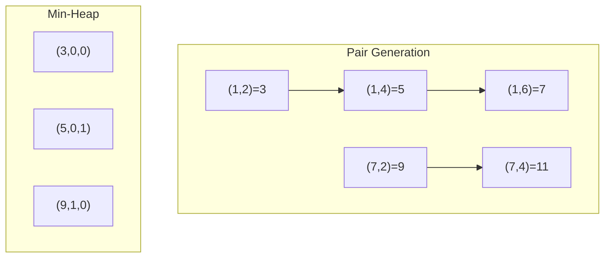

# K Closest Points to Origin

> **Find the k closest points using a max-heap of size k**

---

## Problem Statement

Given an array of `points` where `points[i] = [xi, yi]` represents a point on the X-Y plane and an integer `k`, return the **k closest points to the origin** `(0, 0)`.

The distance between two points on the X-Y plane is the Euclidean distance: `sqrt((x1 - x2)^2 + (y1 - y2)^2)`.

You may return the answer in **any order**. The answer is guaranteed to be unique (except for the order).

**LeetCode:** [Problem 973 - K Closest Points to Origin](https://leetcode.com/problems/k-closest-points-to-origin/)

---

## Examples

### Example 1
```
Input: points = [[1,3],[-2,2]], k = 1
Output: [[-2,2]]
```
**Explanation:**
- Distance of (1, 3) from origin = sqrt(1 + 9) = sqrt(10)
- Distance of (-2, 2) from origin = sqrt(4 + 4) = sqrt(8)
- Since sqrt(8) < sqrt(10), (-2, 2) is closer.

### Example 2
```
Input: points = [[3,3],[5,-1],[-2,4]], k = 2
Output: [[3,3],[-2,4]]
```
**Explanation:** The distances are sqrt(18), sqrt(26), and sqrt(20). The two closest are (3,3) and (-2,4).

---

## Constraints

- `1 <= k <= points.length <= 10^4`
- `-10^4 <= xi, yi <= 10^4`

---

## Visualization



---

## Key Insight

**For the K smallest (closest), use a Max-Heap of size K.**

This is the inverse of Kth Largest:
- We want the **k smallest** distances
- We maintain a **max-heap** of size k
- The root is the **largest** distance in our "top k closest"
- New points only need to beat the current worst (root) to get in

### Why Max-Heap for K Smallest?

```
Think of it as a "K Closest Club":
- Only k members allowed
- The bouncer is the member with the LARGEST distance (worst in the club)
- New point enters only if closer than the bouncer
- The bouncer (max distance in top-k) gets kicked out
```

---

## Solution

### Approach 1: Max-Heap of Size K

::: code-group

```python [Python]
import heapq

def kClosest(points: list[list[int]], k: int) -> list[list[int]]:
    """
    Find k closest points using max-heap of size k.

    Key Insight: Use negative distances for max-heap behavior.
    The largest distance in our "k closest" is at the root.

    Time: O(n log k) - process n points, heap operations O(log k)
    Space: O(k) - heap stores k points
    """
    # Max-heap using negative distances
    # Store (-distance_squared, x, y)
    max_heap = []

    for x, y in points:
        dist_sq = x * x + y * y  # No need for sqrt (monotonic)

        if len(max_heap) < k:
            heapq.heappush(max_heap, (-dist_sq, x, y))
        elif dist_sq < -max_heap[0][0]:
            heapq.heapreplace(max_heap, (-dist_sq, x, y))

    return [[x, y] for _, x, y in max_heap]
```

```java [Java]
import java.util.PriorityQueue;
import java.util.ArrayList;
import java.util.List;

class Solution {
    public int[][] kClosest(int[][] points, int k) {
        // Max-heap by distance squared; root = farthest of the k closest
        PriorityQueue<int[]> maxHeap = new PriorityQueue<>(
            (a, b) -> Integer.compare(b[0] * b[0] + b[1] * b[1], a[0] * a[0] + a[1] * a[1])
        );

        for (int[] point : points) {
            int distSq = point[0] * point[0] + point[1] * point[1];

            if (maxHeap.size() < k) {
                maxHeap.offer(point);
            } else {
                int[] top = maxHeap.peek();
                int topDistSq = top[0] * top[0] + top[1] * top[1];
                if (distSq < topDistSq) {
                    maxHeap.poll();
                    maxHeap.offer(point);
                }
            }
        }

        return maxHeap.toArray(new int[k][]);
    }
}
```

:::

::: info Complexity: Time O(n log k) · Space O(k)
- **Time:** We process n points, each requiring a heap operation (push or heapreplace) costing O(log k) since the heap is bounded at size k
- **Space:** The max-heap stores exactly k points with their distances
:::

### Why Distance Squared?

We don't need the actual Euclidean distance because:
- sqrt is monotonic (if a < b, then sqrt(a) < sqrt(b))
- Comparing squared distances gives the same ordering
- Avoids floating point operations

### Step-by-Step Walkthrough

```
points = [[3,3],[5,-1],[-2,4]], k = 2

Distances squared:
  (3,3):   9 + 9 = 18
  (5,-1):  25 + 1 = 26
  (-2,4):  4 + 16 = 20

Step 1: Process (3,3), dist_sq = 18
        heap size < k, push (-18, 3, 3)
        Heap: [(-18, 3, 3)]

Step 2: Process (5,-1), dist_sq = 26
        heap size < k, push (-26, 5, -1)
        Heap: [(-18, 3, 3), (-26, 5, -1)]
        Note: -18 > -26, so -18 is at root (max-heap by negative = min by positive)

Step 3: Process (-2,4), dist_sq = 20
        20 < -heap[0][0] (which is 18)? NO (20 > 18)
        Skip!
        Heap: [(-18, 3, 3), (-26, 5, -1)]

Wait, this seems wrong! Let's reconsider...

Actually:
        20 < 26 (the max distance in heap)? We need to compare with the FURTHEST
        The furthest in our heap is 26 (at -26)
        But -18 > -26, so -18 is at root!

        heap[0] = (-18, 3, 3), -heap[0][0] = 18
        20 < 18? NO

This means (-2,4) is further than (3,3), so it doesn't replace.

Hmm, but (-2,4) has distance 20, and (5,-1) has distance 26.
So (-2,4) should replace (5,-1)!

The issue: we need the MAXIMUM distance at the root.
With negation: most negative value at root = largest distance.

Let me fix the comparison:
        We want: if new distance < MAX distance in heap
        MAX distance = -heap[0][0] when using negation

        For (5,-1): dist_sq=26, -heap[0][0] = 18
        26 < 18? NO, push anyway since heap not full

        For (-2,4): dist_sq=20
        -heap[0][0] = 26 (since -26 < -18, -26 is at root)
        20 < 26? YES! Replace!

Actually I need to reconsider the heap structure:
  heapq is a min-heap, so smallest value at root.
  With negative values: -26 < -18, so (-26, 5, -1) would be at root.
  -heap[0][0] = 26, which is the MAX distance. Correct!

Corrected walkthrough:

Step 1: Push (-18, 3, 3)
        Heap: [(-18, 3, 3)]

Step 2: Push (-26, 5, -1)
        Min-heap on negatives: -26 < -18
        Heap: [(-26, 5, -1), (-18, 3, 3)]
        Root has the LARGEST distance (26)

Step 3: dist_sq = 20, -heap[0][0] = 26
        20 < 26? YES!
        Replace root with (-20, -2, 4)
        Heap: [(-20, -2, 4), (-18, 3, 3)]

Result: [[3,3], [-2,4]] - the 2 closest points!
```

---

### Approach 2: Using nsmallest

```python
import heapq

def kClosest_nsmallest(points: list[list[int]], k: int) -> list[list[int]]:
    """
    Use Python's nsmallest for cleaner code.

    Time: O(n log k)
    Space: O(k)
    """
    return heapq.nsmallest(k, points, key=lambda p: p[0]**2 + p[1]**2)
```

::: info Complexity: Time O(n log k) · Space O(k)
- **Time:** nsmallest uses a heap internally, processing n elements with O(log k) operations each
- **Space:** Maintains an internal heap of size k
:::

---

### Approach 3: QuickSelect (Average O(n))

```python
import random

def kClosest_quickselect(points: list[list[int]], k: int) -> list[list[int]]:
    """
    QuickSelect partitions around kth smallest distance.

    Time: O(n) average, O(n^2) worst case
    Space: O(1) extra (modifies input)
    """
    def distance(point):
        return point[0]**2 + point[1]**2

    def partition(left: int, right: int) -> int:
        pivot_idx = random.randint(left, right)
        pivot_dist = distance(points[pivot_idx])

        # Move pivot to end
        points[pivot_idx], points[right] = points[right], points[pivot_idx]

        store_idx = left
        for i in range(left, right):
            if distance(points[i]) < pivot_dist:
                points[store_idx], points[i] = points[i], points[store_idx]
                store_idx += 1

        # Move pivot to final position
        points[store_idx], points[right] = points[right], points[store_idx]
        return store_idx

    left, right = 0, len(points) - 1
    while left < right:
        pivot_idx = partition(left, right)
        if pivot_idx == k:
            break
        elif pivot_idx < k:
            left = pivot_idx + 1
        else:
            right = pivot_idx - 1

    return points[:k]
```

::: info Complexity: Time O(n) average, O(n^2) worst · Space O(1)
- **Time:** Average case reduces problem size by half each partition. Worst case occurs with unbalanced partitions
- **Space:** In-place partitioning uses O(1) extra space (ignoring recursion stack)
:::

---

## Complexity Comparison

| Approach | Time | Space | Notes |
|----------|------|-------|-------|
| Max-Heap (size k) | O(n log k) | O(k) | Best for streaming |
| nsmallest | O(n log k) | O(k) | Cleanest code |
| Sort all | O(n log n) | O(n) | Simple but slower |
| QuickSelect | O(n) avg | O(1) | Best average time |

---

## Common Mistakes

1. **Using min-heap instead of max-heap**
   ```python
   # Wrong: min-heap keeps smallest at root
   heapq.heappush(heap, (dist, x, y))

   # Correct: negate for max-heap behavior
   heapq.heappush(heap, (-dist, x, y))
   ```

2. **Forgetting to negate when extracting**
   ```python
   # Remember: stored as negative
   result = [[x, y] for neg_dist, x, y in heap]
   ```

3. **Using sqrt unnecessarily**
   - Comparing squared distances is equivalent and faster

---

## Visual ASCII Diagram

```
Points on coordinate plane:

         y
         ^
    4    |        * (-2, 4)
    3    |    * (3, 3)
    2    |
    1    |
    0    +-------------------> x
   -1    |                  * (5, -1)
         |

Distances from origin (0,0):
  (-2, 4): sqrt(4 + 16) = sqrt(20) ~ 4.47
  (3, 3):  sqrt(9 + 9)  = sqrt(18) ~ 4.24  <- CLOSEST
  (5, -1): sqrt(25 + 1) = sqrt(26) ~ 5.10  <- FURTHEST

k = 2: Return (3,3) and (-2,4)
```

---

## Follow-up Questions

### Q1: What if we need k furthest points?

Use a **min-heap** of size k:

```python
def kFurthest(points: list[list[int]], k: int) -> list[list[int]]:
    min_heap = []
    for x, y in points:
        dist_sq = x * x + y * y
        if len(min_heap) < k:
            heapq.heappush(min_heap, (dist_sq, x, y))
        elif dist_sq > min_heap[0][0]:
            heapq.heapreplace(min_heap, (dist_sq, x, y))
    return [[x, y] for _, x, y in min_heap]
```

### Q2: What if the origin is a different point?

Modify the distance calculation:

```python
def kClosestToPoint(points, k, origin):
    ox, oy = origin
    def dist_sq(p):
        return (p[0] - ox)**2 + (p[1] - oy)**2
    return heapq.nsmallest(k, points, key=dist_sq)
```

---

## Related Problems

::: details Kth Largest Element in an Array (LeetCode 215)
**Problem:** Find the kth largest element in an unsorted array.

**Key Insight:** Uses min-heap of size k for top-k **largest**. No distance calculation - just compare raw values.

**Approach:** Maintain min-heap with k largest elements. For K Closest Points, we use the inverse (max-heap for k smallest distances).

**Complexity:** O(n log k) time, O(k) space
:::

::: details Top K Frequent Elements (LeetCode 347)
**Problem:** Return the k most frequent elements from an array.

**Key Insight:** Uses **frequency** as the priority metric instead of distance.

**Approach:** Count frequencies first with hash map, then use min-heap of size k to track elements with highest frequencies.

**Complexity:** O(n log k) time, O(n) space
:::

::: details Find K Pairs with Smallest Sums (LeetCode 373)
**Problem:** Given two sorted arrays, find k pairs (one element from each) with smallest sums.

**Key Insight:** K-way merge pattern - treat each starting position in first array as a sorted "list" of pairs.

**Approach:** Initialize heap with (nums1[0] + nums2[j], 0, j) for first k elements of nums2. Pop smallest, push next pair from same "row" (i+1, j).



**Complexity:** O(k log k) time, O(k) space
:::

---

## Interview Tips

1. **Clarify the distance metric**
   - Usually Euclidean, but could be Manhattan

2. **Mention the sqrt optimization**
   - Shows mathematical insight

3. **Discuss the heap choice**
   - Max-heap for k smallest (counterintuitive)
   - Explain the "bouncer" analogy

4. **Know alternatives**
   - QuickSelect for O(n) average
   - Simple sort for simplicity

---

## Sources

- [K Closest Points to Origin - LeetCode](https://leetcode.com/problems/k-closest-points-to-origin/)
- [QuickSelect Approach Discussion](https://leetcode.com/problems/k-closest-points-to-origin/solutions/220235/java-three-solutions-to-this-classical-k-th-problem/)
- [NeetCode Solution](https://neetcode.io/solutions/k-closest-points-to-origin)
