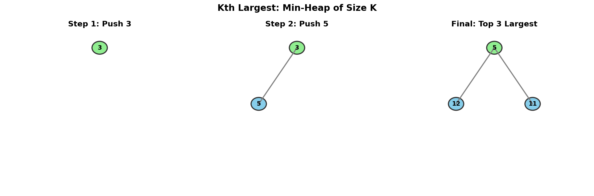
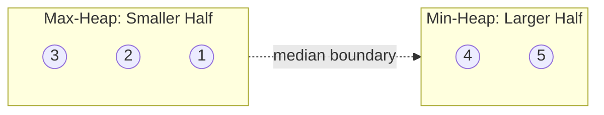

# Kth Largest Element in an Array

> **Find the kth largest element using a min-heap of size k**

---

## Problem Statement

Given an integer array `nums` and an integer `k`, return the **kth largest** element in the array.

Note that it is the kth largest element in the sorted order, not the kth distinct element.

**LeetCode:** [Problem 215 - Kth Largest Element in an Array](https://leetcode.com/problems/kth-largest-element-in-an-array/)

---

## Examples

### Example 1
```
Input: nums = [3, 2, 1, 5, 6, 4], k = 2
Output: 5
```
**Explanation:** The sorted array is [1, 2, 3, 4, 5, 6]. The 2nd largest element is 5.

### Example 2
```
Input: nums = [3, 2, 3, 1, 2, 4, 5, 5, 6], k = 4
Output: 4
```
**Explanation:** The sorted array is [1, 2, 2, 3, 3, 4, 5, 5, 6]. The 4th largest element is 4.

---

## Constraints

- `1 <= k <= nums.length <= 10^5`
- `-10^4 <= nums[i] <= 10^4`

---

## Visualization



---

## Why Min-Heap for Top K Largest?

The key insight is **counterintuitive**: to find the K **largest** elements, we use a **Min-Heap**. Here's why:

1. We maintain a heap of exactly size K
2. The **smallest** element in our "top K candidates" sits at the root
3. When a new element comes in, we only compare with this minimum
4. If the new element is larger, it deserves a spot in our top K (replacing the current minimum)

### The Gatekeeper Analogy

Think of the min-heap as a VIP section with exactly K spots:
- The bouncer (heap root) is the **smallest** person in the VIP section
- New arrivals only need to beat the bouncer to get in
- If someone gets in, the current bouncer leaves
- The kth largest is always the bouncer (smallest in top K)

---

## Approach

### Algorithm Steps

1. **Initialize** an empty min-heap
2. **Iterate** through each number in the array:
   - If heap size < k: push the number
   - Else if number > heap root: replace root with number (heapreplace)
3. **Return** the heap root (kth largest element)

### Step-by-Step Walkthrough

```
Array: [3, 1, 5, 12, 2, 11]  k = 3

Step 1: Process 3
        heap size < k, push 3
        Heap: [3]

Step 2: Process 1
        heap size < k, push 1
        Heap: [1, 3]    <- Min-heap: root is smallest

Step 3: Process 5
        heap size < k, push 5
        Heap: [1, 3, 5] <- Heap is now FULL at size k

Step 4: Process 12
        12 > heap[0] (1)? YES!
        Replace 1 with 12
        Heap: [3, 12, 5]

Step 5: Process 2
        2 > heap[0] (3)? NO
        Skip (2 is not in top-3)
        Heap: [3, 12, 5] <- unchanged

Step 6: Process 11
        11 > heap[0] (3)? YES!
        Replace 3 with 11
        Heap: [5, 12, 11]

Result: heap[0] = 5 (the 3rd largest element)
```

---

## Solution

### Optimal: Min-Heap of Size K

```python
import heapq

def findKthLargest(nums: list[int], k: int) -> int:
    """
    Find the kth largest element using a min-heap of size k.

    Key Insight: Maintain k largest elements in a min-heap.
    The root (minimum of these k) is the kth largest overall.

    Time: O(n log k) - each of n elements may trigger heap operation
    Space: O(k) - heap stores exactly k elements
    """
    min_heap = []

    for num in nums:
        if len(min_heap) < k:
            heapq.heappush(min_heap, num)
        elif num > min_heap[0]:
            # heapreplace is more efficient than pop + push
            heapq.heapreplace(min_heap, num)

    return min_heap[0]
```

::: info Complexity: Time O(n log k) · Space O(k)
- **Time:** We iterate through n elements, and each heap operation (push or heapreplace) costs O(log k) since the heap is bounded at size k
- **Space:** The min-heap stores exactly k elements
:::

### Using Built-in nlargest

```python
import heapq

def findKthLargest_builtin(nums: list[int], k: int) -> int:
    """
    Uses Python's optimized nlargest implementation.

    Time: O(n log k)
    Space: O(k)
    """
    return heapq.nlargest(k, nums)[-1]
```

::: info Complexity: Time O(n log k) · Space O(k)
- **Time:** Python's nlargest internally uses a heap-based algorithm, processing n elements with O(log k) operations
- **Space:** Maintains an internal heap of size k
:::

### Alternative: QuickSelect (Average O(n))

```python
import random

def findKthLargest_quickselect(nums: list[int], k: int) -> int:
    """
    QuickSelect algorithm for average O(n) time.

    Time: O(n) average, O(n^2) worst case
    Space: O(1) if done in-place
    """
    def partition(left: int, right: int, pivot_idx: int) -> int:
        pivot = nums[pivot_idx]
        # Move pivot to end
        nums[pivot_idx], nums[right] = nums[right], nums[pivot_idx]
        store_idx = left

        for i in range(left, right):
            if nums[i] < pivot:
                nums[store_idx], nums[i] = nums[i], nums[store_idx]
                store_idx += 1

        # Move pivot to final position
        nums[right], nums[store_idx] = nums[store_idx], nums[right]
        return store_idx

    def quickselect(left: int, right: int, k_smallest: int) -> int:
        if left == right:
            return nums[left]

        pivot_idx = random.randint(left, right)
        pivot_idx = partition(left, right, pivot_idx)

        if k_smallest == pivot_idx:
            return nums[k_smallest]
        elif k_smallest < pivot_idx:
            return quickselect(left, pivot_idx - 1, k_smallest)
        else:
            return quickselect(pivot_idx + 1, right, k_smallest)

    # kth largest = (n-k)th smallest (0-indexed)
    return quickselect(0, len(nums) - 1, len(nums) - k)
```

::: info Complexity: Time O(n) average, O(n^2) worst · Space O(1)
- **Time:** Average case partitions reduce problem size by half each time, giving O(n + n/2 + n/4 + ...) = O(n). Worst case is when partitions are unbalanced
- **Space:** Done in-place with recursion depth O(log n) average, but iterative version achieves O(1)
:::

---

## Complexity Analysis

| Approach | Time Complexity | Space Complexity | Best When |
|----------|-----------------|------------------|-----------|
| Min-Heap (size k) | O(n log k) | O(k) | k << n |
| Max-Heap (heapify all) | O(n + k log n) | O(n) | k is small |
| Sort + Index | O(n log n) | O(n) | k close to n |
| QuickSelect | O(n) average | O(1) | Need only kth, not top k |

### Why Min-Heap is Preferred

For most interview scenarios:
- **O(n log k)** is better than **O(n log n)** when k << n
- **O(k)** space is better than **O(n)**
- Simple to implement and explain
- Works for streaming data (elements arriving one at a time)

---

## Common Mistakes

1. **Using max-heap instead of min-heap**
   - Max-heap would give 1st largest at root, not kth largest

2. **Forgetting to check heap size before comparing**
   ```python
   # Wrong: might compare with empty heap
   if num > heap[0]:  # IndexError if heap is empty

   # Correct: check size first
   if len(heap) < k:
       heapq.heappush(heap, num)
   elif num > heap[0]:
       heapq.heapreplace(heap, num)
   ```

3. **Using heappop + heappush instead of heapreplace**
   - `heapreplace` is more efficient (single sift operation)

---

## Follow-up Questions

### Q1: What if the array is streaming (elements arrive one at a time)?

The min-heap solution naturally handles streaming data:

```python
class KthLargestStream:
    def __init__(self, k: int, nums: list[int]):
        self.k = k
        self.heap = []
        for num in nums:
            self.add(num)

    def add(self, val: int) -> int:
        if len(self.heap) < self.k:
            heapq.heappush(self.heap, val)
        elif val > self.heap[0]:
            heapq.heapreplace(self.heap, val)
        return self.heap[0]
```

### Q2: What if we need the kth smallest instead?

Use a **max-heap** of size k (negate values in Python):

```python
def findKthSmallest(nums: list[int], k: int) -> int:
    max_heap = []  # Store negated values

    for num in nums:
        if len(max_heap) < k:
            heapq.heappush(max_heap, -num)
        elif num < -max_heap[0]:
            heapq.heapreplace(max_heap, -num)

    return -max_heap[0]
```

### Q3: Can we do better than O(n log k)?

Yes, **QuickSelect** achieves O(n) average time, but:
- Worst case is O(n^2)
- Modifies the original array
- Harder to implement correctly

For interviews, min-heap is usually preferred unless specifically asked about QuickSelect.

---

## Related Problems

::: details Top K Frequent Elements (LeetCode 347)
**Problem:** Given an array of integers and an integer k, return the k most frequent elements.

**Key Insight:** Combine hash map for frequency counting with min-heap for top-k selection.

**Approach:** Count frequencies with Counter, then maintain min-heap of size k with (frequency, element) pairs. Elements with higher frequency replace those with lower frequency.

**Complexity:** O(n log k) time, O(n) space for counter
:::

::: details K Closest Points to Origin (LeetCode 973)
**Problem:** Given an array of points on the X-Y plane and an integer k, return the k closest points to the origin (0, 0).

**Key Insight:** For k **smallest** (closest), use a **max-heap** of size k - the inverse of this problem.

**Approach:** Use max-heap (negate distances) to track k closest points. New points only enter if closer than the current farthest point in the heap.

**Complexity:** O(n log k) time, O(k) space
:::

::: details Find Median from Data Stream (LeetCode 295)
**Problem:** Design a data structure that supports adding integers from a stream and finding the median of all elements.

**Key Insight:** Use two heaps - max-heap for smaller half, min-heap for larger half. The median is always accessible from the heap roots.

**Approach:** Balance the heaps so max-heap has equal or one more element than min-heap. Median is either the max-heap root (odd count) or average of both roots (even count).



**Complexity:** O(log n) addNum, O(1) findMedian
:::

---

## Interview Tips

1. **Clarify the problem**:
   - Is k 0-indexed or 1-indexed?
   - Are there duplicates?
   - Is the array in memory or streaming?

2. **Start with the right approach**:
   - Mention sorting O(n log n) as baseline
   - Explain why min-heap O(n log k) is better

3. **Explain the counterintuitive insight**:
   - "Min-heap for max" is a key interview talking point
   - The bouncer analogy works well

4. **Handle edge cases**:
   - k = 1 (just find maximum)
   - k = n (just find minimum)
   - All elements are the same

---

## Sources

- [Kth Largest Element - LeetCode](https://leetcode.com/problems/kth-largest-element-in-an-array/)
- [Top K Problems Discussion](https://leetcode.com/discuss/general-discussion/1088565/top-k-problems-sort-heap-and-quickselect/)
- [NeetCode - Kth Largest](https://neetcode.io/solutions/kth-largest-element-in-an-array)
