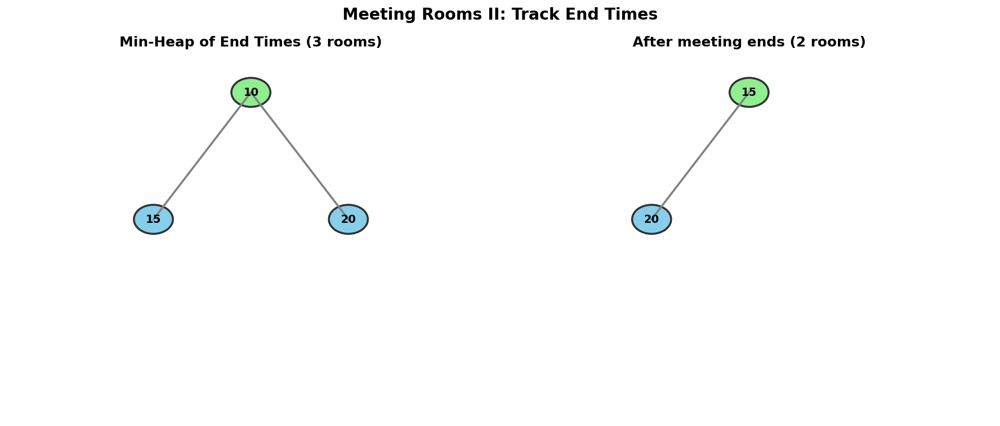
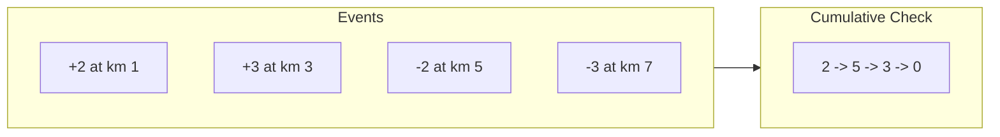

# Meeting Rooms II

> **Find minimum number of conference rooms using a min-heap**

---

## Problem Statement

Given an array of meeting time intervals `intervals` where `intervals[i] = [starti, endi]`, return the **minimum number of conference rooms required**.

**LeetCode:** [Problem 253 - Meeting Rooms II](https://leetcode.com/problems/meeting-rooms-ii/)

---

## Examples

### Example 1
```
Input: intervals = [[0,30],[5,10],[15,20]]
Output: 2
```
**Explanation:**
- Meeting 1: 0-30
- Meeting 2: 5-10 (overlaps with Meeting 1)
- Meeting 3: 15-20 (overlaps with Meeting 1, but Meeting 2 is done)

We need 2 rooms at time 5-10.

### Example 2
```
Input: intervals = [[7,10],[2,4]]
Output: 1
```
**Explanation:** The meetings don't overlap, so 1 room is enough.

---

## Constraints

- `1 <= intervals.length <= 10^4`
- `0 <= starti < endi <= 10^6`

---

## Visualization



---

## Key Insight

At any moment, the number of rooms needed equals the number of **ongoing meetings**.

We can use a **min-heap** to track the end times of ongoing meetings:
- When a new meeting starts, check if any room is free (earliest ending meeting)
- If the room is free (end time <= start time), reuse it
- Otherwise, add a new room

The heap size at any point = number of rooms in use.

---

## Solution

### Approach 1: Min-Heap (Track End Times)

::: code-group

```python [Python]
import heapq

def minMeetingRooms(intervals: list[list[int]]) -> int:
    """
    Find minimum meeting rooms using min-heap of end times.

    Algorithm:
    1. Sort meetings by start time
    2. Use min-heap to track end times of ongoing meetings
    3. For each meeting:
       - If earliest ending meeting is done, reuse that room
       - Otherwise, allocate new room
    4. Return max heap size (max concurrent meetings)

    Time: O(n log n) for sorting and heap operations
    Space: O(n) for the heap
    """
    if not intervals:
        return 0

    # Sort by start time
    intervals.sort(key=lambda x: x[0])

    # Min-heap of end times (ongoing meetings)
    end_times = []

    for start, end in intervals:
        # Check if earliest ending meeting is done
        if end_times and end_times[0] <= start:
            # Reuse that room: pop old end time, push new end time
            heapq.heapreplace(end_times, end)
        else:
            # Need a new room
            heapq.heappush(end_times, end)

    return len(end_times)
```

```java [Java]
import java.util.Arrays;
import java.util.PriorityQueue;

class Solution {
    public int minMeetingRooms(int[][] intervals) {
        if (intervals == null || intervals.length == 0) return 0;

        // Sort by start time
        Arrays.sort(intervals, (a, b) -> Integer.compare(a[0], b[0]));

        // Min-heap of end times (ongoing meetings)
        PriorityQueue<Integer> endTimes = new PriorityQueue<>();

        for (int[] interval : intervals) {
            int start = interval[0];
            int end = interval[1];

            // If earliest ending meeting is done, reuse that room
            if (!endTimes.isEmpty() && endTimes.peek() <= start) {
                endTimes.poll(); // reuse room
            }
            endTimes.offer(end); // allocate or reuse room
        }

        return endTimes.size();
    }
}
```

:::

::: info Complexity: Time O(n log n) · Space O(n)
- **Time:** Sorting takes O(n log n). Each of n meetings requires a heap operation (push or heapreplace) costing O(log n), giving O(n log n) total
- **Space:** The heap can contain up to n end times if all meetings overlap
:::

---

### Step-by-Step Walkthrough

```
intervals = [[0,30], [5,10], [15,20]]

After sorting by start: [[0,30], [5,10], [15,20]]

=== Process [0, 30] ===
  Heap empty, push end time 30
  Heap: [30]
  Rooms needed: 1

=== Process [5, 10] ===
  Check: earliest end = 30, start = 5
  30 > 5, so the room is still occupied
  Push new end time 10
  Heap: [10, 30]
  Rooms needed: 2

=== Process [15, 20] ===
  Check: earliest end = 10, start = 15
  10 <= 15, so that meeting is done! Room is free.
  Reuse: replace 10 with 20
  Heap: [20, 30]
  Rooms needed: 2 (unchanged)

Final answer: len(heap) = 2 (heap size only grows, so the final size equals the max concurrent meetings)
```

---

### Approach 2: Two Pointers (Event-Based)

```python
def minMeetingRooms_twoPointers(intervals: list[list[int]]) -> int:
    """
    Count concurrent meetings using sorted start/end times.

    Algorithm:
    1. Separate and sort start times and end times
    2. Use two pointers to simulate events
    3. When start < end: meeting begins, need room
    4. When start >= end: meeting ends, free room

    Time: O(n log n) for sorting
    Space: O(n) for separated arrays
    """
    if not intervals:
        return 0

    starts = sorted([i[0] for i in intervals])
    ends = sorted([i[1] for i in intervals])

    rooms = 0
    max_rooms = 0
    s_ptr = 0
    e_ptr = 0

    while s_ptr < len(starts):
        if starts[s_ptr] < ends[e_ptr]:
            # Meeting starts before one ends
            rooms += 1
            max_rooms = max(max_rooms, rooms)
            s_ptr += 1
        else:
            # Meeting ends, free a room
            rooms -= 1
            e_ptr += 1

    return max_rooms
```

::: info Complexity: Time O(n log n) · Space O(n)
- **Time:** Sorting both start and end arrays takes O(n log n). The two-pointer traversal is O(n)
- **Space:** O(n) for storing separate start and end time arrays
:::

---

### Approach 3: Chronological Ordering (Sweep Line)

```python
def minMeetingRooms_sweep(intervals: list[list[int]]) -> int:
    """
    Sweep line algorithm: process events in time order.

    Time: O(n log n)
    Space: O(n)
    """
    events = []

    for start, end in intervals:
        events.append((start, 1))   # Meeting starts
        events.append((end, -1))    # Meeting ends

    # Sort by time; if tie, end (-1) comes before start (1)
    events.sort()

    rooms = 0
    max_rooms = 0

    for time, delta in events:
        rooms += delta
        max_rooms = max(max_rooms, rooms)

    return max_rooms
```

::: info Complexity: Time O(n log n) · Space O(n)
- **Time:** Creating 2n events is O(n). Sorting events takes O(n log n). Processing events is O(n)
- **Space:** O(n) for storing 2n event tuples
:::

---

## Visual ASCII Diagram

```
Timeline:
0----5----10----15----20----25----30
|=========================Room 1===|  [0, 30]
     |====|                           [5, 10]
               |=====|                [15, 20]

At time 5-10: 2 meetings concurrent -> 2 rooms
At time 15-20: 2 meetings concurrent -> 2 rooms
Maximum: 2 rooms

Heap evolution:
Time 0:  Push 30      Heap: [30]
Time 5:  Push 10      Heap: [10, 30]
Time 15: Replace 10   Heap: [20, 30]
         with 20
```

---

## Complexity Comparison

| Approach | Time | Space |
|----------|------|-------|
| Min-Heap | O(n log n) | O(n) |
| Two Pointers | O(n log n) | O(n) |
| Sweep Line | O(n log n) | O(n) |

All approaches have the same complexity; choose based on preference.

---

## Common Mistakes

1. **Using <= vs < for room reuse**
   ```python
   # If meeting ends at time 10, room is free AT time 10
   # A meeting starting at 10 CAN use that room

   # Correct: use <=
   if end_times[0] <= start:
       heapq.heapreplace(end_times, end)
   ```

2. **Forgetting to sort by start time**
   ```python
   # Wrong: process in original order
   for start, end in intervals:

   # Correct: sort first
   intervals.sort(key=lambda x: x[0])
   ```

3. **Not handling empty input**
   ```python
   if not intervals:
       return 0
   ```

---

## Edge Cases

```python
# No meetings
[] -> 0

# Single meeting
[[0, 1]] -> 1

# Non-overlapping meetings
[[0, 5], [5, 10]] -> 1  (room reused at boundary)

# All meetings at same time
[[0, 1], [0, 1], [0, 1]] -> 3

# One long meeting with many short ones
[[0, 100], [1, 2], [3, 4], [5, 6]] -> 2
```

---

## Follow-up Questions

### Q1: What if we need to return the room assignments?

```python
def assignRooms(intervals: list[list[int]]) -> list[int]:
    """Return which room each meeting is assigned to."""
    if not intervals:
        return []

    # Keep track of original indices
    indexed = [(s, e, i) for i, (s, e) in enumerate(intervals)]
    indexed.sort(key=lambda x: x[0])

    # Heap: (end_time, room_id)
    rooms = []
    assignment = [0] * len(intervals)
    next_room = 0

    for start, end, idx in indexed:
        if rooms and rooms[0][0] <= start:
            # Reuse room
            _, room_id = heapq.heappop(rooms)
            heapq.heappush(rooms, (end, room_id))
            assignment[idx] = room_id
        else:
            # New room
            heapq.heappush(rooms, (end, next_room))
            assignment[idx] = next_room
            next_room += 1

    return assignment
```

### Q2: What is the maximum number of meetings that can be scheduled with k rooms?

This becomes a variant of the interval scheduling problem. Use greedy selection with k parallel tracks.

---

## Related Problems

::: details Meeting Rooms (LeetCode 252)
**Problem:** Given meeting time intervals, determine if a person could attend all meetings (no overlaps).

**Key Insight:** Simpler version - just check for **any** overlap, not count rooms.

**Approach:** Sort by start time. Check if any meeting starts before the previous one ends: `intervals[i].start < intervals[i-1].end`.

**Complexity:** O(n log n) for sorting, O(1) space
:::

::: details Merge Intervals (LeetCode 56)
**Problem:** Given an array of intervals, merge all overlapping intervals.

**Key Insight:** **Combine** overlapping intervals rather than counting concurrent ones.

**Approach:** Sort by start time. Iterate through intervals, extending the current interval if overlap detected, otherwise start a new interval.

```python
result = [intervals[0]]
for start, end in intervals[1:]:
    if start <= result[-1][1]:  # Overlap
        result[-1][1] = max(result[-1][1], end)
    else:
        result.append([start, end])
```

**Complexity:** O(n log n) time, O(n) space for result
:::

::: details Car Pooling (LeetCode 1094)
**Problem:** Given trips with passenger counts and pickup/dropoff locations, determine if all trips are possible with vehicle capacity.

**Key Insight:** Similar sweep line approach, but track **passenger count** instead of room count. Must stay within capacity.

**Approach:** Create events (location, +passengers for pickup, -passengers for dropoff). Sort by location. Sweep through, checking if cumulative passengers ever exceeds capacity.



**Complexity:** O(n log n) time, O(n) space
:::

::: details My Calendar III (LeetCode 732)
**Problem:** Implement a calendar that returns the maximum k-booking (maximum overlap) after each new event.

**Key Insight:** **Dynamic** version of Meeting Rooms II - events added one by one, need max overlap after each addition.

**Approach:** Use TreeMap/SortedDict to store event boundaries (+1 at start, -1 at end). After each booking, sweep through to find maximum prefix sum.

**Alternative:** Segment tree with lazy propagation for O(log n) per query.

**Complexity:** O(n^2) with sweep per query, O(n log n) with segment tree
:::

---

## Interview Tips

1. **Start with the intuition**
   - "We need to count maximum concurrent meetings"
   - "Each concurrent meeting needs its own room"

2. **Explain why heap works**
   - "We only care about the earliest ending meeting"
   - "If that one is done, we can reuse its room"

3. **Know multiple approaches**
   - Heap: most intuitive for "room allocation"
   - Two pointers: elegant and efficient
   - Sweep line: generalizes to many interval problems

4. **Edge case: boundary times**
   - Clarify: can a meeting starting at time T use a room freed at time T?
   - Usually yes (end time is exclusive)

---

## Sources

- [Meeting Rooms II - LeetCode](https://leetcode.com/problems/meeting-rooms-ii/)
- [Interval Problems Discussion](https://leetcode.com/discuss/general-discussion/794725/general-pattern-for-greedy-approach-for-interval-based-problems)
- [NeetCode Solution](https://neetcode.io/solutions/meeting-rooms-ii)
