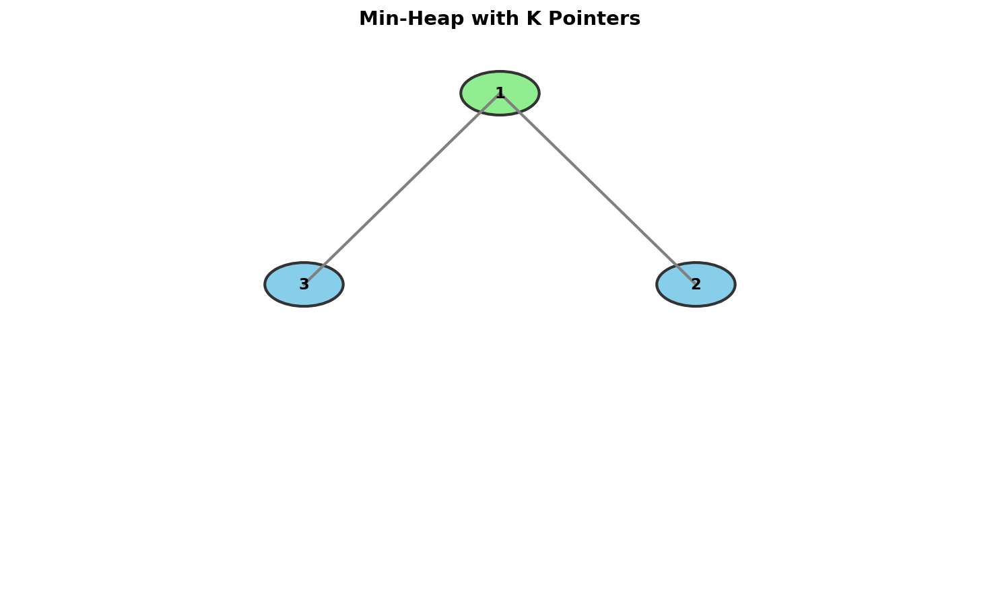
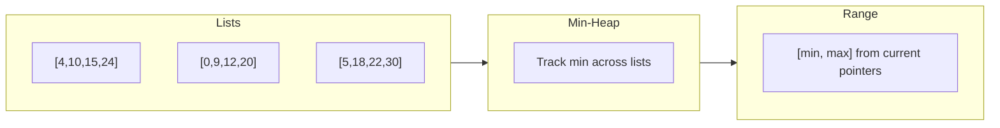

# Merge K Sorted Lists

> **Efficiently merge k sorted lists using a min-heap**

---

## Problem Statement

You are given an array of `k` linked-lists `lists`, each linked-list is sorted in ascending order.

Merge all the linked-lists into one sorted linked-list and return it.

**LeetCode:** [Problem 23 - Merge K Sorted Lists](https://leetcode.com/problems/merge-k-sorted-lists/)

---

## Examples

### Example 1
```
Input: lists = [[1,4,5],[1,3,4],[2,6]]
Output: [1,1,2,3,4,4,5,6]
```
**Explanation:**
```
The linked-lists are:
  1 -> 4 -> 5
  1 -> 3 -> 4
  2 -> 6

Merging them into one sorted list:
  1 -> 1 -> 2 -> 3 -> 4 -> 4 -> 5 -> 6
```

### Example 2
```
Input: lists = []
Output: []
```

### Example 3
```
Input: lists = [[]]
Output: []
```

---

## Constraints

- `k == lists.length`
- `0 <= k <= 10^4`
- `0 <= lists[i].length <= 500`
- `-10^4 <= lists[i][j] <= 10^4`
- `lists[i]` is sorted in ascending order
- The sum of `lists[i].length` will not exceed `10^4`

---

## Visualization



---

## The K-Way Merge Pattern

This problem demonstrates the **K-Way Merge** pattern using a min-heap.

### Key Insight

Instead of comparing all k list heads at each step (O(k) per element), use a **min-heap** to efficiently find the smallest element among k candidates in O(log k) time.

```
Lists:           Min-Heap (tracks current heads):
  1 -> 4 -> 5         [1, 1, 2]
  1 -> 3 -> 4          ^
  2 -> 6              smallest

Pop 1, advance that list's pointer, push next element (4):
                      [1, 2, 4]
                       ^
                      smallest
```

---

## Solution

### Approach: Min-Heap with K Pointers

```python
import heapq
from typing import Optional

class ListNode:
    def __init__(self, val=0, next=None):
        self.val = val
        self.next = next

def mergeKLists(lists: list[Optional[ListNode]]) -> Optional[ListNode]:
    """
    Merge k sorted linked lists using min-heap.

    Algorithm:
    1. Initialize heap with the head of each non-empty list
    2. Pop smallest, add to result, push next node from that list
    3. Repeat until heap is empty

    Time: O(n log k) where n = total nodes, k = number of lists
    Space: O(k) for the heap
    """
    # Min-heap stores (value, list_index, node)
    # list_index is needed to break ties (nodes can't be compared)
    min_heap = []

    # Initialize: add first node from each list
    for i, lst in enumerate(lists):
        if lst:
            heapq.heappush(min_heap, (lst.val, i, lst))

    # Dummy head for result
    dummy = ListNode(0)
    current = dummy

    while min_heap:
        val, list_idx, node = heapq.heappop(min_heap)

        # Add to result
        current.next = node
        current = current.next

        # Push next node from the same list
        if node.next:
            heapq.heappush(min_heap, (node.next.val, list_idx, node.next))

    return dummy.next
```

::: info Complexity: Time O(n log k) · Space O(k)
- **Time:** Each of n total nodes is pushed and popped from the heap exactly once. Each heap operation costs O(log k) where k is the number of lists
- **Space:** The heap stores at most k nodes (one from each list) at any time
:::

### For Arrays Instead of Linked Lists

```python
import heapq

def mergeKSortedArrays(arrays: list[list[int]]) -> list[int]:
    """
    Merge k sorted arrays using min-heap.

    Time: O(n log k) where n = total elements
    Space: O(k) for heap + O(n) for result
    """
    min_heap = []
    result = []

    # Initialize: add first element from each array
    # (value, array_index, element_index)
    for i, arr in enumerate(arrays):
        if arr:
            heapq.heappush(min_heap, (arr[0], i, 0))

    while min_heap:
        val, arr_idx, elem_idx = heapq.heappop(min_heap)
        result.append(val)

        # Push next element from the same array
        if elem_idx + 1 < len(arrays[arr_idx]):
            next_val = arrays[arr_idx][elem_idx + 1]
            heapq.heappush(min_heap, (next_val, arr_idx, elem_idx + 1))

    return result
```

::: info Complexity: Time O(n log k) · Space O(k + n)
- **Time:** Each of n total elements is pushed and popped once. Each heap operation costs O(log k) where k is the number of arrays
- **Space:** O(k) for the heap plus O(n) for the result array
:::

---

## Step-by-Step Walkthrough

```
Input: [[1,4,5], [1,3,4], [2,6]]

=== Initialization ===
Push first elements with (value, list_index, element_index):
  (1, 0, 0) from list 0: [1, 4, 5]
  (1, 1, 0) from list 1: [1, 3, 4]
  (2, 2, 0) from list 2: [2, 6]

Heap: [(1, 0, 0), (1, 1, 0), (2, 2, 0)]
Result: []

=== Step 1 ===
Pop (1, 0, 0): value=1 from list 0
Result: [1]
Push next from list 0: (4, 0, 1)
Heap: [(1, 1, 0), (2, 2, 0), (4, 0, 1)]

=== Step 2 ===
Pop (1, 1, 0): value=1 from list 1
Result: [1, 1]
Push next from list 1: (3, 1, 1)
Heap: [(2, 2, 0), (3, 1, 1), (4, 0, 1)]

=== Step 3 ===
Pop (2, 2, 0): value=2 from list 2
Result: [1, 1, 2]
Push next from list 2: (6, 2, 1)
Heap: [(3, 1, 1), (6, 2, 1), (4, 0, 1)]

=== Step 4 ===
Pop (3, 1, 1): value=3 from list 1
Result: [1, 1, 2, 3]
Push next from list 1: (4, 1, 2)
Heap: [(4, 0, 1), (6, 2, 1), (4, 1, 2)]

=== Step 5 ===
Pop (4, 0, 1): value=4 from list 0
Result: [1, 1, 2, 3, 4]
Push next from list 0: (5, 0, 2)
Heap: [(4, 1, 2), (6, 2, 1), (5, 0, 2)]

=== Step 6 ===
Pop (4, 1, 2): value=4 from list 1
Result: [1, 1, 2, 3, 4, 4]
List 1 exhausted, no push
Heap: [(5, 0, 2), (6, 2, 1)]

=== Step 7 ===
Pop (5, 0, 2): value=5 from list 0
Result: [1, 1, 2, 3, 4, 4, 5]
List 0 exhausted, no push
Heap: [(6, 2, 1)]

=== Step 8 ===
Pop (6, 2, 1): value=6 from list 2
Result: [1, 1, 2, 3, 4, 4, 5, 6]
List 2 exhausted, no push
Heap: []

Final Result: [1, 1, 2, 3, 4, 4, 5, 6]
```

---

## Alternative Approaches

### Divide and Conquer

```python
def mergeKLists_divideConquer(lists: list[Optional[ListNode]]) -> Optional[ListNode]:
    """
    Merge lists using divide and conquer.

    Time: O(n log k) - log k levels, n work per level
    Space: O(log k) - recursion stack
    """
    def mergeTwoLists(l1, l2):
        dummy = ListNode(0)
        current = dummy
        while l1 and l2:
            if l1.val <= l2.val:
                current.next = l1
                l1 = l1.next
            else:
                current.next = l2
                l2 = l2.next
            current = current.next
        current.next = l1 or l2
        return dummy.next

    if not lists:
        return None
    if len(lists) == 1:
        return lists[0]

    mid = len(lists) // 2
    left = mergeKLists_divideConquer(lists[:mid])
    right = mergeKLists_divideConquer(lists[mid:])
    return mergeTwoLists(left, right)
```

::: info Complexity: Time O(n log k) · Space O(log k)
- **Time:** There are log k levels of recursion. At each level, all n nodes are processed once during merging
- **Space:** O(log k) for the recursion stack depth
:::

### Iterative Pairwise Merging

```python
def mergeKLists_iterative(lists: list[Optional[ListNode]]) -> Optional[ListNode]:
    """
    Merge lists iteratively in pairs.

    Time: O(n log k)
    Space: O(1) extra
    """
    if not lists:
        return None

    def mergeTwoLists(l1, l2):
        dummy = ListNode(0)
        current = dummy
        while l1 and l2:
            if l1.val <= l2.val:
                current.next = l1
                l1 = l1.next
            else:
                current.next = l2
                l2 = l2.next
            current = current.next
        current.next = l1 or l2
        return dummy.next

    while len(lists) > 1:
        merged = []
        for i in range(0, len(lists), 2):
            l1 = lists[i]
            l2 = lists[i + 1] if i + 1 < len(lists) else None
            merged.append(mergeTwoLists(l1, l2))
        lists = merged

    return lists[0]
```

::: info Complexity: Time O(n log k) · Space O(1)
- **Time:** There are log k rounds of merging. In each round, all n nodes are visited once. Total: O(n log k)
- **Space:** O(1) extra space since we only store intermediate list references
:::

---

## Complexity Comparison

| Approach | Time | Space | Notes |
|----------|------|-------|-------|
| Min-Heap | O(n log k) | O(k) | Best for memory |
| Divide & Conquer | O(n log k) | O(log k) | Recursion stack |
| Iterative Pairwise | O(n log k) | O(1) | No extra space |
| Naive (compare all) | O(n * k) | O(1) | Too slow |

Where n = total number of nodes, k = number of lists.

---

## Common Mistakes

1. **Not handling empty lists**
   ```python
   # Wrong: will crash on empty list
   for lst in lists:
       heapq.heappush(heap, (lst.val, i, lst))

   # Correct: check for None
   for i, lst in enumerate(lists):
       if lst:
           heapq.heappush(heap, (lst.val, i, lst))
   ```

2. **Missing tie-breaker in heap**
   ```python
   # Wrong: can't compare ListNode objects
   heapq.heappush(heap, (node.val, node))

   # Correct: use index as tie-breaker
   heapq.heappush(heap, (node.val, i, node))
   ```

3. **Not advancing the pointer**
   ```python
   # Wrong: infinite loop
   current.next = node

   # Correct: advance current
   current.next = node
   current = current.next
   ```

---

## Visual ASCII Diagram

```
Lists:
  List 0: 1 -> 4 -> 5 -> None
          ^
  List 1: 1 -> 3 -> 4 -> None
          ^
  List 2: 2 -> 6 -> None
          ^

Min-Heap (by value):
        (1, 0)
       /      \
    (1, 1)   (2, 2)

Pop (1, 0), advance List 0:
  List 0: 1 -> 4 -> 5 -> None
               ^
  Result: 1 ->

Updated Heap:
        (1, 1)
       /      \
    (4, 0)   (2, 2)
```

---

## Follow-up Questions

### Q1: What if lists are extremely large and don't fit in memory?

Use **external merge sort**:
- Read chunks that fit in memory
- Merge chunks using the same k-way merge algorithm
- Write merged results to disk
- Repeat until fully merged

### Q2: What if we need to merge k sorted iterators (streaming)?

The heap approach works perfectly:

```python
def mergeKIterators(iterators):
    heap = []
    for i, it in enumerate(iterators):
        try:
            val = next(it)
            heapq.heappush(heap, (val, i, it))
        except StopIteration:
            pass

    while heap:
        val, i, it = heapq.heappop(heap)
        yield val
        try:
            next_val = next(it)
            heapq.heappush(heap, (next_val, i, it))
        except StopIteration:
            pass
```

---

## Related Problems

::: details Merge Two Sorted Lists (LeetCode 21)
**Problem:** Merge two sorted linked lists into one sorted list.

**Key Insight:** Simpler version with just two lists - no heap needed. Use two-pointer technique.

**Approach:** Compare heads of both lists, append smaller to result, advance that pointer. Continue until one list exhausted, then append remaining.

**Complexity:** O(n + m) time, O(1) space
:::

::: details Smallest Range Covering Elements from K Lists (LeetCode 632)
**Problem:** Find the smallest range that includes at least one number from each of k sorted lists.

**Key Insight:** K-way merge with range tracking. Maintain min-heap with one element from each list, track current max.

**Approach:** Range is [heap_min, current_max]. To shrink range, advance the pointer of the list that contributed the minimum. Stop when any list exhausted.



**Complexity:** O(n log k) time, O(k) space
:::

::: details Kth Smallest Element in a Sorted Matrix (LeetCode 378)
**Problem:** Given an n x n matrix where rows and columns are sorted, find the kth smallest element.

**Key Insight:** Treat matrix as k sorted lists (rows). Use min-heap for k-way merge, or binary search on value range.

**Approach (Heap):** Push first element of each row. Pop k times, pushing next element from same row after each pop. The kth pop is the answer.

**Approach (Binary Search):** Binary search on value range [matrix[0][0], matrix[n-1][n-1]]. Count elements <= mid in O(n) using staircase traversal.

**Complexity:** O(k log n) heap, O(n log(max-min)) binary search
:::

::: details Ugly Number II (LeetCode 264)
**Problem:** Find the nth ugly number. Ugly numbers have only 2, 3, or 5 as prime factors.

**Key Insight:** Generate ugly numbers in sorted order. Each ugly number produces three new candidates by multiplying with 2, 3, and 5.

**Approach:** Use three pointers (for 2, 3, 5 multipliers) or min-heap. Track which ugly numbers have been used as base for each multiplier.

```python
# Three-pointer approach
ugly = [1] * n
p2 = p3 = p5 = 0
for i in range(1, n):
    next_ugly = min(ugly[p2]*2, ugly[p3]*3, ugly[p5]*5)
    ugly[i] = next_ugly
    if next_ugly == ugly[p2]*2: p2 += 1
    if next_ugly == ugly[p3]*3: p3 += 1
    if next_ugly == ugly[p5]*5: p5 += 1
```

**Complexity:** O(n) time, O(n) space
:::

---

## Interview Tips

1. **Start with the brute force**
   - Compare all k heads each time: O(nk)
   - Explain why it's inefficient

2. **Introduce the heap optimization**
   - "Use a min-heap to efficiently find the minimum among k elements"
   - O(log k) per element instead of O(k)

3. **Handle edge cases explicitly**
   - Empty input list
   - Lists containing empty lists
   - Single list

4. **Discuss the tie-breaker**
   - Python heaps can't compare ListNode objects
   - Use index as secondary sort key

---

## Sources

- [Merge K Sorted Lists - LeetCode](https://leetcode.com/problems/merge-k-sorted-lists/)
- [K-Way Merge Pattern](https://www.designgurus.io/course-play/grokking-the-coding-interview/doc/63a16f10d6c63e2fe3c65ff2)
- [NeetCode Solution](https://neetcode.io/solutions/merge-k-sorted-lists)
