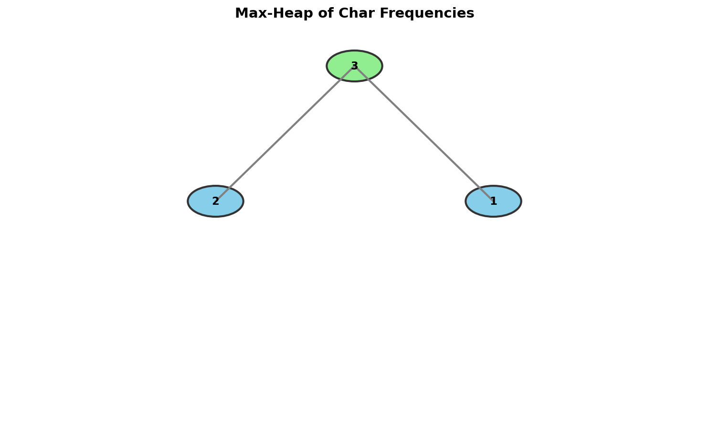
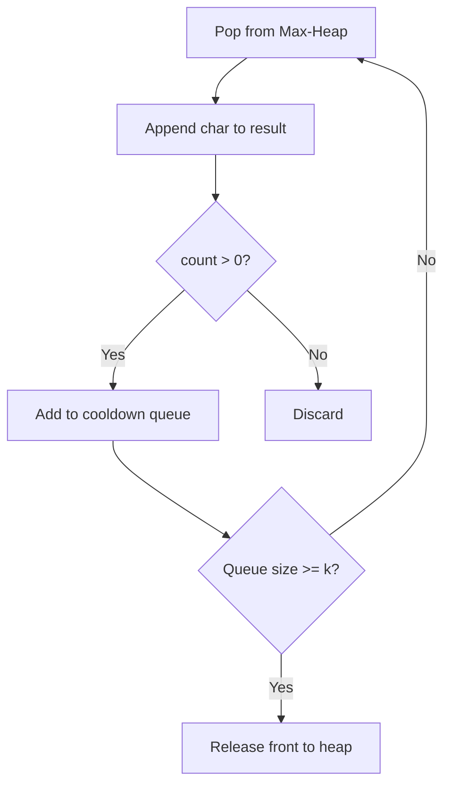

# Reorganize String

> **Rearrange characters so no two adjacent are the same using max-heap**

---

## Problem Statement

Given a string `s`, rearrange the characters of `s` so that any two adjacent characters are not the same.

Return any possible rearrangement of `s` or return `""` if not possible.

**LeetCode:** [Problem 767 - Reorganize String](https://leetcode.com/problems/reorganize-string/)

---

## Examples

### Example 1
```
Input: s = "aab"
Output: "aba"
```

### Example 2
```
Input: s = "aaab"
Output: ""
```
**Explanation:** No valid arrangement exists. With 3 'a's and only 1 'b', we can't prevent adjacent 'a's.

---

## Constraints

- `1 <= s.length <= 500`
- `s` consists of lowercase English letters

---

## Visualization



---

## Key Insight

This problem is similar to **Task Scheduler** but with cooldown n = 1 (no adjacent same characters).

**Greedy approach**: Always pick the character with the highest remaining count that is different from the previous character.

### When Is It Impossible?

If any character appears more than `(len(s) + 1) // 2` times, it's impossible.

```
For string of length 5: at most 3 of any character
  Valid:   a _ a _ a   (3 a's can be placed with gaps)
  Invalid: a a _ _ _   (4 a's can't avoid adjacency)

Formula: max_count <= (n + 1) // 2
```

---

## Solution

### Approach 1: Max-Heap

::: code-group

```python [Python]
import heapq
from collections import Counter

def reorganizeString(s: str) -> str:
    """
    Reorganize string using max-heap.

    Algorithm:
    1. Count character frequencies
    2. Check if valid (max_count <= (n+1)//2)
    3. Use max-heap to always pick most frequent different char
    4. Hold previous char until next is placed

    Time: O(n log 26) = O(n)
    Space: O(26) = O(1)
    """
    count = Counter(s)

    # Check if valid
    max_count = max(count.values())
    if max_count > (len(s) + 1) // 2:
        return ""

    # Max-heap: (-count, char)
    max_heap = [(-cnt, char) for char, cnt in count.items()]
    heapq.heapify(max_heap)

    result = []
    prev_count, prev_char = 0, ''

    while max_heap:
        # Get the most frequent character
        cnt, char = heapq.heappop(max_heap)
        result.append(char)

        # Put the previous character back (if it still has count)
        if prev_count < 0:
            heapq.heappush(max_heap, (prev_count, prev_char))

        # Update previous for next iteration
        prev_count = cnt + 1  # +1 because cnt is negative
        prev_char = char

    result_str = ''.join(result)
    return result_str if len(result_str) == len(s) else ""
```

```java [Java]
import java.util.PriorityQueue;
import java.util.Collections;

class Solution {
    public String reorganizeString(String s) {
        int[] count = new int[26];
        for (char c : s.toCharArray()) {
            count[c - 'a']++;
        }

        // Check if valid: no character appears more than (n+1)/2 times
        int maxCount = 0;
        for (int cnt : count) maxCount = Math.max(maxCount, cnt);
        if (maxCount > (s.length() + 1) / 2) return "";

        // Max-heap: [count, char_index]
        PriorityQueue<int[]> maxHeap = new PriorityQueue<>(
            (a, b) -> Integer.compare(b[0], a[0])
        );
        for (int i = 0; i < 26; i++) {
            if (count[i] > 0) {
                maxHeap.offer(new int[]{count[i], i});
            }
        }

        StringBuilder result = new StringBuilder();
        int prevCount = 0;
        int prevChar = -1;

        while (!maxHeap.isEmpty()) {
            int[] top = maxHeap.poll();
            int cnt = top[0];
            int ch = top[1];

            result.append((char) ('a' + ch));

            // Put previous character back if it still has remaining count
            if (prevCount > 0) {
                maxHeap.offer(new int[]{prevCount, prevChar});
            }

            // Hold current as previous for next iteration
            prevCount = cnt - 1;
            prevChar = ch;
        }

        String res = result.toString();
        return res.length() == s.length() ? res : "";
    }
}
```

:::

::: info Complexity: Time O(n log 26) = O(n) · Space O(26) = O(1)
- **Time:** We process n characters, each with heap operations. Since there are at most 26 unique characters, each heap operation is O(log 26) = O(1)
- **Space:** The heap stores at most 26 character-count pairs, plus O(1) for the previous character tracking
:::

### Step-by-Step Walkthrough

```
s = "aab"

Count: {a: 2, b: 1}
Max count = 2 <= (3+1)//2 = 2. Valid!

Initial heap: [(-2, 'a'), (-1, 'b')]

Step 1:
  Pop (-2, 'a'), append 'a'
  prev_count = 0, prev_char = '' (nothing to push back)
  Update: prev_count = -2 + 1 = -1, prev_char = 'a'
  Result: ['a']
  Heap: [(-1, 'b')]

Step 2:
  Pop (-1, 'b'), append 'b'
  prev_count = -1 < 0, push (-1, 'a') back
  Update: prev_count = -1 + 1 = 0, prev_char = 'b'
  Result: ['a', 'b']
  Heap: [(-1, 'a')]

Step 3:
  Pop (-1, 'a'), append 'a'
  prev_count = 0, nothing to push back
  Update: prev_count = 0, prev_char = 'a'
  Result: ['a', 'b', 'a']
  Heap: []

Final: "aba"
```

---

### Approach 2: Greedy with Sorting

```python
from collections import Counter

def reorganizeString_sort(s: str) -> str:
    """
    Place characters at even indices first, then odd.

    The most frequent character should go at even indices.
    This ensures no adjacent duplicates.

    Time: O(n)
    Space: O(n)
    """
    count = Counter(s)
    max_count = max(count.values())

    if max_count > (len(s) + 1) // 2:
        return ""

    # Sort characters by frequency (descending)
    sorted_chars = sorted(count.keys(), key=lambda x: -count[x])

    result = [''] * len(s)
    idx = 0

    for char in sorted_chars:
        for _ in range(count[char]):
            result[idx] = char
            idx += 2  # Skip to next even/odd position
            if idx >= len(s):
                idx = 1  # Switch to odd indices

    return ''.join(result)
```

::: info Complexity: Time O(n) · Space O(n)
- **Time:** Counting takes O(n). Sorting 26 characters is O(26 log 26) = O(1). Placing n characters is O(n)
- **Space:** O(n) for the result array
:::

### Approach 2 Visualization

```
s = "aab"

Sorted by frequency: [a, b] (a=2, b=1)

Fill even indices first:
  Index: 0  1  2
  Fill:  a  _  a   (both 'a's at even indices 0, 2)

Then odd indices:
  Index: 0  1  2
  Fill:  a  b  a

Result: "aba"
```

---

## Complexity Analysis

| Approach | Time | Space |
|----------|------|-------|
| Max-Heap | O(n log 26) = O(n) | O(26) = O(1) |
| Sorting + Fill | O(n) | O(n) for result |

---

## Common Mistakes

1. **Forgetting to check impossibility**
   ```python
   # Always check first!
   if max_count > (len(s) + 1) // 2:
       return ""
   ```

2. **Not holding the previous character**
   ```python
   # Wrong: picking same char twice in a row
   char = heappop(heap)
   result.append(char)
   heappush(heap, ...)  # Might pop same char next!

   # Correct: hold previous until next is placed
   if prev_count < 0:
       heappush(heap, (prev_count, prev_char))
   ```

3. **Off-by-one in validity check**
   ```python
   # For string of length n:
   # Max occurrences allowed = ceil(n/2) = (n + 1) // 2

   # Examples:
   # n=5: (5+1)//2 = 3 (a_a_a)
   # n=4: (4+1)//2 = 2 (a_a_)
   ```

---

## Visual ASCII Diagram

```
s = "aaabbc"

Count: {a: 3, b: 2, c: 1}
Max = 3, (6+1)//2 = 3. Valid!

Max-Heap evolution:

Initial:    After 'a':    After 'b':    After 'a':
   a(3)        b(2)          a(2)         b(1)
  /   \        /             /            /
b(2)  c(1)   a(2) c(1)     c(1) b(1)    a(1) c(1)

Result progression:
a -> ab -> aba -> abab -> ababc -> ababca

Final: "ababca" (or other valid arrangements)
```

---

## Edge Cases

```python
# Single character
"a" -> "a"

# Two same characters
"aa" -> "" (impossible)

# Two different characters
"ab" -> "ab" or "ba"

# All same except one
"aaab" -> "" (4 > (4+1)//2 = 2)

# Exactly at limit
"aab" -> "aba" (2 <= (3+1)//2 = 2)
```

---

## Follow-up Questions

### Q1: What if we need k distance apart instead of just no adjacent?

Use a queue to enforce k cooldown (similar to Task Scheduler):

```python
def rearrangeKApart(s: str, k: int) -> str:
    if k <= 1:
        return s

    count = Counter(s)
    max_heap = [(-cnt, char) for char, cnt in count.items()]
    heapq.heapify(max_heap)

    result = []
    cooldown = deque()

    while max_heap:
        cnt, char = heapq.heappop(max_heap)
        result.append(char)

        # Add to cooldown with remaining count
        cooldown.append((cnt + 1, char))

        # Release from cooldown after k steps
        if len(cooldown) >= k:
            released_cnt, released_char = cooldown.popleft()
            if released_cnt < 0:
                heapq.heappush(max_heap, (released_cnt, released_char))

    return ''.join(result) if len(result) == len(s) else ""
```

### Q2: What if we need to count the number of valid arrangements?

This becomes a combinatorics problem, harder to solve efficiently.

---

## Related Problems

::: details Task Scheduler (LeetCode 621)
**Problem:** Given tasks with cooldown n between same tasks, find minimum time units to complete all tasks. Idle time is allowed.

**Key Insight:** Similar greedy heap approach, but **idle is allowed** and we count total time, not return a string.

**Approach:** Max-heap + cooldown queue. At each time step, pick most frequent available task. If none available but tasks remain, idle.

**Mathematical Solution:** `result = max(len(tasks), (max_freq - 1) * (n + 1) + count_of_max_freq)`

**Complexity:** O(n) time, O(1) space (at most 26 task types)
:::

::: details Rearrange String k Distance Apart (LeetCode 358)
**Problem:** Rearrange string so same characters are at least k positions apart. Return "" if impossible.

**Key Insight:** Generalization where k can be any value, not just 2 (adjacent). Uses cooldown queue of size k-1.

**Approach:** Max-heap tracks (count, char). Pop most frequent, append to result. Add to cooldown queue with remaining count. After k characters placed, release from queue back to heap.



**Complexity:** O(n log 26) time, O(26 + k) space
:::

::: details Distant Barcodes (LeetCode 1054)
**Problem:** Rearrange barcodes so no two adjacent barcodes are equal. Answer is guaranteed to exist.

**Key Insight:** **Identical problem** to Reorganize String, just with integers instead of characters.

**Approach:** Same max-heap solution. Count frequencies, use max-heap to always place most frequent available barcode.

**Alternative:** Bucket sort by frequency, then fill even indices first (0, 2, 4...), then odd indices (1, 3, 5...).

**Complexity:** O(n log n) or O(n) with bucket sort
:::

---

## Interview Tips

1. **Start with the validity check**
   - "First, let's check if a solution is possible"
   - "If max frequency > (n+1)/2, impossible"

2. **Explain the greedy intuition**
   - "Always use the most frequent remaining character that's different from previous"
   - "This maximizes flexibility for future placements"

3. **Handle the previous character carefully**
   - "We need to 'hold' the previous character to avoid picking it again"
   - Draw the heap state with prev_char held aside

4. **Know both approaches**
   - Heap: more intuitive, generalizes to k-distance
   - Even-odd filling: simpler for this specific problem

---

## Sources

- [Reorganize String - LeetCode](https://leetcode.com/problems/reorganize-string/)
- [Greedy Approach Discussion](https://leetcode.com/problems/reorganize-string/solutions/113440/java-solution-priority-queue/)
- [NeetCode Solution](https://neetcode.io/solutions/reorganize-string)
