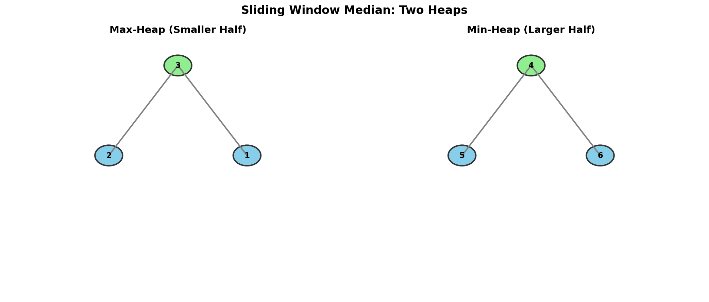

# Sliding Window Median

> **Find median in a sliding window using two heaps with lazy deletion**

---

## Problem Statement

The **median** is the middle value in an ordered integer list. If the size of the list is even, the median is the mean of the two middle values.

Given an array of integers `nums` and an integer `k`, find the median of each window of size `k` as it slides from left to right through the array.

Return an array of the medians for each window position.

**LeetCode:** [Problem 480 - Sliding Window Median](https://leetcode.com/problems/sliding-window-median/)

---

## Examples

### Example 1
```
Input: nums = [1,3,-1,-3,5,3,6,7], k = 3
Output: [1.0,-1.0,-1.0,3.0,5.0,6.0]
```
**Explanation:**
```
Window position                Median
---------------                -----
[1  3  -1] -3  5  3  6  7        1
 1 [3  -1  -3] 5  3  6  7       -1
 1  3 [-1  -3  5] 3  6  7       -1
 1  3  -1 [-3  5  3] 6  7        3
 1  3  -1  -3 [5  3  6] 7        5
 1  3  -1  -3  5 [3  6  7]       6
```

### Example 2
```
Input: nums = [1,2,3,4,2,3,1,4,2], k = 3
Output: [2.0,3.0,3.0,3.0,2.0,3.0,2.0]
```

---

## Constraints

- `1 <= k <= nums.length <= 10^5`
- `-2^31 <= nums[i] <= 2^31 - 1`

---

## Visualization



---

## Key Insight

This problem combines:
1. **Two Heaps Pattern** (like Find Median from Data Stream)
2. **Lazy Deletion** (to handle element removal efficiently)

The challenge is handling **removal** of elements as the window slides. Direct heap deletion is O(n), so we use **lazy deletion**:
- Mark elements as deleted in a hash map
- Remove them from heap only when they appear at the top

---

## Solution

::: code-group

```python [Python]
import heapq
from collections import defaultdict

def medianSlidingWindow(nums: list[int], k: int) -> list[float]:
    """
    Find median in sliding window using two heaps with lazy deletion.

    Two heaps:
    - small (max-heap): smaller half of window
    - large (min-heap): larger half of window

    Lazy deletion:
    - Track elements to delete in a hash map
    - Only remove from heap when element is at the top

    Time: O(n log k) - each element added/removed once
    Space: O(k) for heaps + O(n) for deletion tracking
    """
    # Max-heap for smaller half (negated for Python)
    small = []
    # Min-heap for larger half
    large = []
    # Track elements to be lazily deleted
    to_delete = defaultdict(int)

    def add_num(num: int) -> None:
        """Add a number to the appropriate heap."""
        if not small or num <= -small[0]:
            heapq.heappush(small, -num)
        else:
            heapq.heappush(large, num)

    def remove_num(num: int) -> None:
        """Mark a number for lazy deletion."""
        to_delete[num] += 1

    def balance() -> None:
        """Balance the heaps so |small| == |large| or |small| == |large| + 1."""
        # Move from small to large
        while len(small) > len(large) + 1:
            heapq.heappush(large, -heapq.heappop(small))
            prune(small, is_max=True)

        # Move from large to small
        while len(large) > len(small):
            heapq.heappush(small, -heapq.heappop(large))
            prune(large, is_max=False)

    def prune(heap: list, is_max: bool) -> None:
        """Remove lazily deleted elements from heap top."""
        while heap:
            top = -heap[0] if is_max else heap[0]
            if to_delete[top] > 0:
                to_delete[top] -= 1
                heapq.heappop(heap)
            else:
                break

    def get_median() -> float:
        """Get the current median."""
        prune(small, is_max=True)
        prune(large, is_max=False)

        if k % 2 == 1:
            return float(-small[0])
        return (-small[0] + large[0]) / 2.0

    result = []

    # Initialize first window
    for i in range(k):
        add_num(nums[i])
        balance()
        prune(small, is_max=True)
        prune(large, is_max=False)

    result.append(get_median())

    # Slide the window
    for i in range(k, len(nums)):
        # Add new element (entering window)
        add_num(nums[i])

        # Remove old element (leaving window)
        remove_num(nums[i - k])

        # Rebalance and prune
        balance()
        prune(small, is_max=True)
        prune(large, is_max=False)

        result.append(get_median())

    return result
```

```java [Java]
import java.util.PriorityQueue;
import java.util.Collections;
import java.util.HashMap;
import java.util.Map;

class Solution {
    // small: max-heap for smaller half
    private PriorityQueue<Integer> small = new PriorityQueue<>(Collections.reverseOrder());
    // large: min-heap for larger half
    private PriorityQueue<Integer> large = new PriorityQueue<>();
    // lazy deletion counts
    private Map<Integer, Integer> toDelete = new HashMap<>();
    private int smallSize = 0; // effective size (excluding lazily deleted)
    private int largeSize = 0;

    public double[] medianSlidingWindow(int[] nums, int k) {
        double[] result = new double[nums.length - k + 1];

        // Initialize first window
        for (int i = 0; i < k; i++) {
            addNum(nums[i]);
        }
        result[0] = getMedian(k);

        // Slide the window
        for (int i = k; i < nums.length; i++) {
            addNum(nums[i]);
            removeNum(nums[i - k]);
            result[i - k + 1] = getMedian(k);
        }

        return result;
    }

    private void addNum(int num) {
        if (small.isEmpty() || num <= small.peek()) {
            small.offer(num);
            smallSize++;
        } else {
            large.offer(num);
            largeSize++;
        }
        balance();
    }

    private void removeNum(int num) {
        toDelete.merge(num, 1, Integer::sum);
        if (!small.isEmpty() && num <= small.peek()) {
            smallSize--;
        } else {
            largeSize--;
        }
        balance();
    }

    private void balance() {
        // Ensure smallSize == largeSize or smallSize == largeSize + 1
        while (smallSize > largeSize + 1) {
            large.offer(small.poll());
            largeSize++;
            smallSize--;
            pruneSmall();
        }
        while (largeSize > smallSize) {
            small.offer(large.poll());
            smallSize++;
            largeSize--;
            pruneLarge();
        }
        pruneSmall();
        pruneLarge();
    }

    private void pruneSmall() {
        while (!small.isEmpty() && toDelete.getOrDefault(small.peek(), 0) > 0) {
            toDelete.merge(small.peek(), -1, Integer::sum);
            if (toDelete.get(small.peek()) == 0) toDelete.remove(small.peek());
            small.poll();
        }
    }

    private void pruneLarge() {
        while (!large.isEmpty() && toDelete.getOrDefault(large.peek(), 0) > 0) {
            toDelete.merge(large.peek(), -1, Integer::sum);
            if (toDelete.get(large.peek()) == 0) toDelete.remove(large.peek());
            large.poll();
        }
    }

    private double getMedian(int k) {
        pruneSmall();
        pruneLarge();
        if (k % 2 == 1) return small.peek();
        return ((double) small.peek() + large.peek()) / 2.0;
    }
}
```

:::

::: info Complexity: Time O(n log k) · Space O(n)
- **Time:** Each element is added and removed once. Each heap operation costs O(log k). Lazy deletion amortizes to O(log k) per element
- **Space:** O(k) for the two heaps, plus O(n) worst case for the deletion tracking map if many elements are marked for deletion
:::

---

## Detailed Explanation: Lazy Deletion

### Why Lazy Deletion?

Heaps don't support efficient arbitrary deletion:
- Finding an element: O(n)
- Deleting and reheapifying: O(n)

With lazy deletion:
- Mark for deletion: O(1)
- Actual removal: O(log k) when element reaches top

### How It Works

```
Heap: [5, 7, 8, 10]  (min-heap)
Delete 7 lazily: to_delete[7] = 1

Heap structure unchanged!

Later, when 5 is popped and 7 becomes top:
  - Check to_delete[7] > 0
  - Pop 7 without using it
  - Decrement to_delete[7]

Result: 7 is removed exactly when it would be needed
```

### Balance Tracking

We need to track "effective" sizes (excluding deleted elements):
- An element in the heap but marked deleted doesn't count
- But heap operations don't know about deletions
- Solution: prune after each balance operation

---

## Step-by-Step Walkthrough

```
nums = [1, 3, -1], k = 3

=== Initialize window [1, 3, -1] ===

Add 1:
  small empty, push -1 to small
  small: [-1], large: []

Add 3:
  3 > -small[0] = 1, push to large
  small: [-1], large: [3]

Add -1:
  -1 <= 1, push -(-1) = 1 to small
  small: [-1, 1], large: [3]

  Wait, that's wrong. Let me reconsider.
  small stores NEGATED values.
  small = [-1] means the value 1 is stored.
  -small[0] = -(-1) = 1, which is the max of small half.

  -1 <= 1? YES. Push -(-1) = 1 to small.
  small: [-1, 1]? No, heapify: [1, -1]? No...

  Let me be more careful:
  small stores negated values for max-heap behavior.
  small = [-1] means heap contains -1, representing value 1.
  small[0] = -1, so -small[0] = 1 (the max value in small half).

  Add -1 (the actual value):
  Is -1 <= -small[0]? Is -1 <= 1? YES.
  Push -(-1) = 1 to small.
  small = [-1, 1] after heappush.
  Min of [-1, 1] is -1, so small[0] = -1.
  This represents max = 1 in the smaller half.

  Hmm, this is confusing. Let me use concrete values.

  small (max-heap, stores negated):
    After add 1: small = [-1] (value 1)
    After add -1: small = [-1, 1] or [1, -1]?
      heappush([-1], 1) -> [-1, 1] (min-heap keeps -1 at root)

  So small = [-1, 1], meaning values {1, -1} in max-heap.
  small[0] = -1, so max = -(-1) = 1.

  large (min-heap):
    After add 3: large = [3]

Balance:
  len(small) = 2, len(large) = 1
  2 > 1 + 1? No. Balanced.

Median (k=3, odd):
  -small[0] = 1.0

=== Slide window: remove 1, add next... ===

But wait, the example only has 3 elements and k=3.
Let me use the full example from the problem.

nums = [1,3,-1,-3,5,3,6,7], k = 3

Window [1, 3, -1]:
  Sorted: [-1, 1, 3], median = 1

Window [3, -1, -3]:
  Sorted: [-3, -1, 3], median = -1

...and so on.
```

---

## Alternative: SortedList (Python)

For simpler implementation, use `sortedcontainers.SortedList`:

```python
from sortedcontainers import SortedList

def medianSlidingWindow_sorted(nums: list[int], k: int) -> list[float]:
    """
    Use SortedList for O(log k) insertion and deletion.

    Time: O(n log k)
    Space: O(k)
    """
    window = SortedList()
    result = []

    for i, num in enumerate(nums):
        window.add(num)

        if len(window) > k:
            window.remove(nums[i - k])

        if len(window) == k:
            if k % 2 == 1:
                result.append(float(window[k // 2]))
            else:
                result.append((window[k // 2 - 1] + window[k // 2]) / 2.0)

    return result
```

::: info Complexity: Time O(n log k) · Space O(k)
- **Time:** Each element is added and removed once using O(log k) SortedList operations
- **Space:** The SortedList maintains exactly k elements
:::

---

## Complexity Analysis

| Approach | Time | Space |
|----------|------|-------|
| Two Heaps + Lazy Delete | O(n log k) | O(n) for deletion map |
| SortedList | O(n log k) | O(k) |

---

## Common Mistakes

1. **Not pruning after balance**
   ```python
   # After moving elements between heaps, the tops might be deleted
   balance()
   prune(small, True)   # Don't forget!
   prune(large, False)  # Don't forget!
   ```

2. **Wrong heap comparison for add**
   ```python
   # Wrong: comparing with wrong sign
   if num <= small[0]:  # small[0] is negated!

   # Correct:
   if num <= -small[0]:
   ```

3. **Forgetting the lazy deletion is "lazy"**
   ```python
   # Deleted elements still count in len(heap)!
   # Must track effective size separately or prune before size check
   ```

---

## Visual ASCII Diagram

```
Window sliding over [1, 3, -1, -3, 5, 3]:

Position 0-2: [1, 3, -1]
  small (max): [1, -1]    Max = 1
  large (min): [3]        Min = 3
  Median = 1

Position 1-3: [3, -1, -3]
  Remove 1 (lazy), Add -3
  small (max): [-1, -3]   Max = -1
  large (min): [3]        Min = 3
  Median = -1

Position 2-4: [-1, -3, 5]
  Remove 3 (lazy), Add 5
  small (max): [-1, -3]   Max = -1
  large (min): [5]        Min = 5
  Median = -1

Position 3-5: [-3, 5, 3]
  Remove -1 (lazy), Add 3
  small (max): [-3, 3]    Max = 3
  large (min): [5]        Min = 5
  Median = 3
```

---

## Follow-up Questions

### Q1: What if we need the mode instead of median?

Use a hash map with a max-heap of (count, value) pairs:
- Track counts for window elements
- Heap gives most frequent element

### Q2: What if the window size varies?

The same approach works; just track window boundaries carefully.

---

## Related Problems

::: details Find Median from Data Stream (LeetCode 295)
**Problem:** Design a data structure that supports adding numbers from a stream and finding the median of all elements added so far.

**Key Insight:** Use two heaps - max-heap for smaller half, min-heap for larger half. Median is at the boundary.

**Approach:** Balance heaps so sizes differ by at most 1. Median is either root of larger heap or average of both roots.

**Complexity:** Time O(log n) for add, O(1) for findMedian; Space O(n)
:::

::: details Sliding Window Maximum (LeetCode 239)
**Problem:** Find the maximum element in each sliding window of size k as it moves through an array.

**Key Insight:** Use monotonic decreasing deque - front always holds the maximum of current window.

**Approach:** Remove elements outside window from front, remove smaller elements from back before adding new element. Front is the max.

**Complexity:** Time O(n), Space O(k)
:::

::: details Kth Largest Element in a Stream (LeetCode 703)
**Problem:** Design a class that finds the kth largest element in a stream of numbers.

**Key Insight:** Maintain a min-heap of size k. The root is always the kth largest element.

**Approach:** For each new element, if heap size < k or element > heap root, add it. Pop root if size exceeds k.

**Complexity:** Time O(log k) per add; Space O(k)
:::

---

## Interview Tips

1. **Start with Find Median from Data Stream**
   - "I'll use the two heaps approach for median"
   - "The challenge is handling deletion"

2. **Introduce lazy deletion**
   - "Direct heap deletion is O(n)"
   - "We can mark elements for deletion and remove them when they reach the top"

3. **Discuss the balance invariant**
   - "We maintain |small| = |large| or |small| = |large| + 1"
   - "But we need to be careful with deleted elements"

4. **Know the SortedList alternative**
   - Simpler to implement
   - Same time complexity
   - May be asked as follow-up

---

## Sources

- [Sliding Window Median - LeetCode](https://leetcode.com/problems/sliding-window-median/)
- [Lazy Deletion Technique](https://leetcode.com/problems/sliding-window-median/solutions/96346/java-using-two-tree-sets-o-n-lg-k/)
- [Two Heaps Pattern](https://www.designgurus.io/course-play/grokking-the-coding-interview/doc/639db019d7c9c2e74be0b50e)
