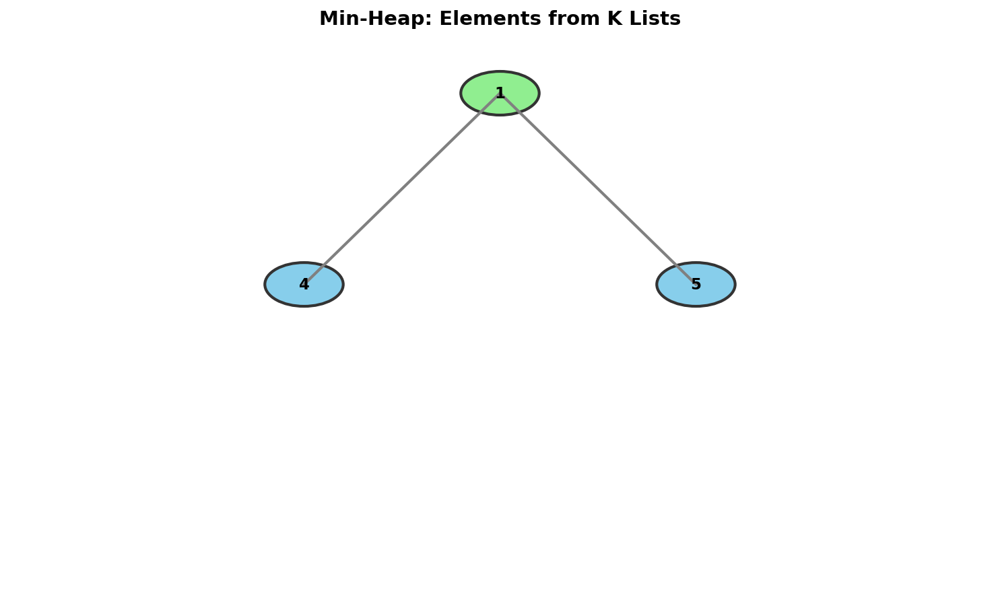

# Smallest Range Covering Elements from K Lists

> **Find the smallest range using k-way merge with min-heap**

---

## Problem Statement

You have `k` lists of sorted integers in non-decreasing order. Find the **smallest range** that includes at least one number from each of the `k` lists.

We define the range `[a, b]` is smaller than range `[c, d]` if:
- `b - a < d - c`, or
- `b - a == d - c` and `a < c`

**LeetCode:** [Problem 632 - Smallest Range Covering Elements from K Lists](https://leetcode.com/problems/smallest-range-covering-elements-from-k-lists/)

---

## Examples

### Example 1
```
Input: nums = [[4,10,15,24,26],[0,9,12,20],[5,18,22,30]]
Output: [20,24]
```
**Explanation:**
- List 1: [4, 10, 15, 24, 26], 24 is in range [20, 24]
- List 2: [0, 9, 12, 20], 20 is in range [20, 24]
- List 3: [5, 18, 22, 30], 22 is in range [20, 24]

### Example 2
```
Input: nums = [[1,2,3],[1,2,3],[1,2,3]]
Output: [1,1]
```

---

## Constraints

- `nums.length == k`
- `1 <= k <= 3500`
- `1 <= nums[i].length <= 50`
- `-10^5 <= nums[i][j] <= 10^5`
- `nums[i]` is sorted in non-decreasing order

---

## Visualization



---

## Key Insight

This problem extends the **K-Way Merge** pattern:

1. Maintain a **min-heap** with one element from each list
2. Track the **current maximum** among elements in the heap
3. The range is `[heap_min, current_max]`
4. To shrink the range, advance the pointer of the list that contributed the minimum

### Why This Works

At any point, the heap contains exactly one element from each list:
- The heap root is the **minimum** across all k lists
- We track the **maximum** separately
- Range = [min, max] covers at least one element from each list

To potentially find a smaller range:
- We can't decrease the max (it's already the max of current pointers)
- We can try to increase the min (by advancing the min-contributing list)

---

## Solution

::: code-group

```python [Python]
import heapq

def smallestRange(nums: list[list[int]]) -> list[int]:
    """
    Find smallest range covering one element from each list.

    Algorithm:
    1. Initialize heap with first element from each list
    2. Track current max
    3. Current range = [heap root, current max]
    4. Pop min, push next from that list, update max
    5. Stop when any list is exhausted

    Time: O(n log k) where n = total elements, k = number of lists
    Space: O(k) for the heap
    """
    # Min-heap: (value, list_index, element_index)
    min_heap = []
    current_max = float('-inf')

    # Initialize with first element from each list
    for i, lst in enumerate(nums):
        heapq.heappush(min_heap, (lst[0], i, 0))
        current_max = max(current_max, lst[0])

    # Track best range
    best_range = [min_heap[0][0], current_max]

    while True:
        # Current range
        min_val, list_idx, elem_idx = heapq.heappop(min_heap)

        # Check if this range is better
        if current_max - min_val < best_range[1] - best_range[0]:
            best_range = [min_val, current_max]

        # Try to advance the list that contributed min
        if elem_idx + 1 == len(nums[list_idx]):
            # This list is exhausted, we must stop
            break

        # Push next element from this list
        next_val = nums[list_idx][elem_idx + 1]
        heapq.heappush(min_heap, (next_val, list_idx, elem_idx + 1))

        # Update max if needed
        current_max = max(current_max, next_val)

    return best_range
```

```java [Java]
import java.util.PriorityQueue;
import java.util.List;

class Solution {
    public int[] smallestRange(List<List<Integer>> nums) {
        // Min-heap: [value, list_index, element_index]
        PriorityQueue<int[]> minHeap = new PriorityQueue<>(
            (a, b) -> Integer.compare(a[0], b[0])
        );
        int currentMax = Integer.MIN_VALUE;

        // Initialize with first element from each list
        for (int i = 0; i < nums.size(); i++) {
            int val = nums.get(i).get(0);
            minHeap.offer(new int[]{val, i, 0});
            currentMax = Math.max(currentMax, val);
        }

        int[] bestRange = {minHeap.peek()[0], currentMax};

        while (true) {
            int[] entry = minHeap.poll();
            int minVal = entry[0];
            int listIdx = entry[1];
            int elemIdx = entry[2];

            // Check if this range is better
            if (currentMax - minVal < bestRange[1] - bestRange[0]) {
                bestRange = new int[]{minVal, currentMax};
            }

            // Stop if this list is exhausted
            if (elemIdx + 1 == nums.get(listIdx).size()) {
                break;
            }

            // Push next element from this list
            int nextVal = nums.get(listIdx).get(elemIdx + 1);
            minHeap.offer(new int[]{nextVal, listIdx, elemIdx + 1});
            currentMax = Math.max(currentMax, nextVal);
        }

        return bestRange;
    }
}
```

:::

::: info Complexity: Time O(n log k) · Space O(k)
- **Time:** Each of n total elements is pushed and popped from the heap exactly once. Each heap operation costs O(log k) where k is the number of lists
- **Space:** The heap always contains exactly k elements (one from each list)
:::

---

## Step-by-Step Walkthrough

```
nums = [[4,10,15,24,26], [0,9,12,20], [5,18,22,30]]

=== Initialization ===
Push first elements:
  (4, 0, 0) from list 0
  (0, 1, 0) from list 1
  (5, 2, 0) from list 2

Heap: [(0, 1, 0), (4, 0, 0), (5, 2, 0)]
current_max = max(4, 0, 5) = 5
best_range = [0, 5] (size 5)

=== Iteration 1 ===
Pop (0, 1, 0): min = 0 from list 1
Range [0, 5] is not better than current best [0, 5]
Advance list 1: push (9, 1, 1)
current_max = max(5, 9) = 9
Heap: [(4, 0, 0), (5, 2, 0), (9, 1, 1)]

=== Iteration 2 ===
Pop (4, 0, 0): min = 4 from list 0
Range [4, 9] size = 5, best is [0, 5] size = 5
4 > 0, so [4, 9] not better
Advance list 0: push (10, 0, 1)
current_max = max(9, 10) = 10
Heap: [(5, 2, 0), (9, 1, 1), (10, 0, 1)]

=== Iteration 3 ===
Pop (5, 2, 0): min = 5 from list 2
Range [5, 10] size = 5, not better
Advance list 2: push (18, 2, 1)
current_max = max(10, 18) = 18
Heap: [(9, 1, 1), (10, 0, 1), (18, 2, 1)]

=== Iteration 4 ===
Pop (9, 1, 1): min = 9 from list 1
Range [9, 18] size = 9, not better
Advance list 1: push (12, 1, 2)
current_max = 18 (unchanged)
Heap: [(10, 0, 1), (12, 1, 2), (18, 2, 1)]

=== Iteration 5 ===
Pop (10, 0, 1): min = 10 from list 0
Range [10, 18] size = 8, not better
Advance list 0: push (15, 0, 2)
current_max = 18 (unchanged)
Heap: [(12, 1, 2), (15, 0, 2), (18, 2, 1)]

=== Iteration 6 ===
Pop (12, 1, 2): min = 12 from list 1
Range [12, 18] size = 6, not better
Advance list 1: push (20, 1, 3)
current_max = max(18, 20) = 20
Heap: [(15, 0, 2), (18, 2, 1), (20, 1, 3)]

=== Iteration 7 ===
Pop (15, 0, 2): min = 15 from list 0
Range [15, 20] size = 5, not better (same size, 15 > 0)
Advance list 0: push (24, 0, 3)
current_max = max(20, 24) = 24
Heap: [(18, 2, 1), (20, 1, 3), (24, 0, 3)]

=== Iteration 8 ===
Pop (18, 2, 1): min = 18 from list 2
Range [18, 24] size = 6, not better
Advance list 2: push (22, 2, 2)
current_max = 24 (unchanged)
Heap: [(20, 1, 3), (22, 2, 2), (24, 0, 3)]

=== Iteration 9 ===
Pop (20, 1, 3): min = 20 from list 1
Range [20, 24] size = 4 < 5, NEW BEST!
best_range = [20, 24]
Advance list 1: list 1 is exhausted!
STOP

Final answer: [20, 24]
```

---

## Complexity Analysis

| Metric | Value |
|--------|-------|
| Time | O(n log k) where n = total elements |
| Space | O(k) for the heap |

The algorithm processes each element at most once, and each heap operation is O(log k).

---

## Common Mistakes

1. **Not tracking maximum separately**
   ```python
   # Wrong: heap only gives minimum efficiently
   current_max = max(val for val, _, _ in heap)  # O(k) each time!

   # Correct: track max incrementally
   current_max = max(current_max, next_val)
   ```

2. **Off-by-one when checking list exhaustion**
   ```python
   # Check BEFORE advancing
   if elem_idx + 1 == len(nums[list_idx]):
       break  # Can't advance further
   ```

3. **Wrong range comparison**
   ```python
   # Range [a, b] vs [c, d]
   # Smaller if b-a < d-c, OR same size and a < c

   if (new_max - new_min < best[1] - best[0] or
       (new_max - new_min == best[1] - best[0] and new_min < best[0])):
       best = [new_min, new_max]
   ```

---

## Visual ASCII Diagram

```
Lists:
  0: [4, 10, 15, 24, 26]
  1: [0,  9, 12, 20]
  2: [5, 18, 22, 30]

Timeline representation:
0    5    10   15   20   25   30
|----|----|----|----|----|----|
List 1: 0    9    12   20
List 0:    4    10   15   24  26
List 2:      5       18   22      30

Finding [20, 24]:
                    |=====|
                   20    24
  List 1 contributes 20   ^
  List 0 contributes 24 --+
  List 2 contributes 22 (inside range)
```

---

## Alternative Approach: Merge + Sliding Window

```python
def smallestRange_merge(nums: list[list[int]]) -> list[int]:
    """
    Merge all lists with source tracking, then use sliding window.

    Time: O(n log n) for sorting
    Space: O(n) for merged list
    """
    # Merge all elements with their list index
    merged = []
    for i, lst in enumerate(nums):
        for val in lst:
            merged.append((val, i))

    merged.sort()

    # Sliding window to find smallest range covering all lists
    k = len(nums)
    count = {}
    covered = 0
    best = [merged[0][0], merged[-1][0]]

    left = 0
    for right, (val, list_idx) in enumerate(merged):
        # Add right element
        if count.get(list_idx, 0) == 0:
            covered += 1
        count[list_idx] = count.get(list_idx, 0) + 1

        # Shrink window while all lists covered
        while covered == k:
            # Update best
            if merged[right][0] - merged[left][0] < best[1] - best[0]:
                best = [merged[left][0], merged[right][0]]

            # Remove left element
            left_list = merged[left][1]
            count[left_list] -= 1
            if count[left_list] == 0:
                covered -= 1
            left += 1

    return best
```

::: info Complexity: Time O(n log n) · Space O(n)
- **Time:** Merging all elements takes O(n). Sorting takes O(n log n). Sliding window traversal is O(n)
- **Space:** O(n) for the merged array plus O(k) for the count dictionary
:::

---

## Follow-up Questions

### Q1: What if we need to find the range containing at least m elements from each list?

Modify the heap approach to track counts:

```python
def smallestRangeM(nums, m):
    # Track how many elements from each list are in current window
    # Use sorted merge + sliding window approach
    pass
```

### Q2: What if lists are given as iterators (streaming)?

The heap approach works directly with iterators - just call `next()` instead of indexing.

---

## Related Problems

::: details Merge K Sorted Lists (LeetCode 23)
**Problem:** Merge k sorted linked lists into one sorted linked list.

**Key Insight:** Use min-heap to always extract the smallest available node across all lists.

**Approach:** Push head of each list to heap. Pop smallest, append to result, push that node's next (if exists) to heap.

**Complexity:** Time O(N log k) where N is total nodes; Space O(k)
:::

::: details Kth Smallest Element in a Sorted Matrix (LeetCode 378)
**Problem:** Given an n x n matrix with sorted rows and columns, find the kth smallest element.

**Key Insight:** Use min-heap for k-way merge of rows, or binary search on value range.

**Approach (Heap):** Push first element of each row to heap. Pop k times, pushing next element from same row after each pop.

**Complexity:** Time O(k log n) for heap, O(n log(max-min)) for binary search; Space O(n)
:::

::: details Find K Pairs with Smallest Sums (LeetCode 373)
**Problem:** Given two sorted arrays, find k pairs (one element from each) with the smallest sums.

**Key Insight:** Use min-heap to explore pairs in order of increasing sum without generating all pairs.

**Approach:** Start with pairs using first element of nums1 with all of nums2. Pop smallest sum pair, push next pair from nums1.

**Complexity:** Time O(k log k); Space O(k)
:::

---

## Interview Tips

1. **Start with the brute force**
   - "We could check all possible ranges, but that's O(n^k)"
   - Show you understand the problem space

2. **Introduce the key insight**
   - "At any time, we need exactly one element from each list"
   - "The range is defined by min and max of these k elements"

3. **Explain why we advance the minimum**
   - "To shrink the range, we must increase the minimum"
   - "Decreasing the maximum would remove the only element from some list"

4. **Handle the stopping condition**
   - "When any list is exhausted, we can't form valid ranges anymore"
   - "Every subsequent range would miss that list"

---

## Sources

- [Smallest Range Covering Elements - LeetCode](https://leetcode.com/problems/smallest-range-covering-elements-from-k-lists/)
- [K-Way Merge Pattern](https://www.designgurus.io/course-play/grokking-the-coding-interview/doc/63a16f10d6c63e2fe3c65ff2)
- [Sliding Window Approach Discussion](https://leetcode.com/problems/smallest-range-covering-elements-from-k-lists/solutions/104904/python-heap-based-solution/)
