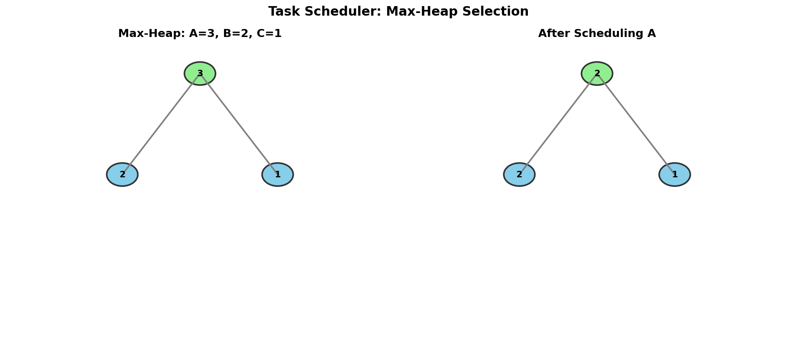

# Task Scheduler

> **Schedule tasks with cooldown using max-heap and greedy selection**

---

## Problem Statement

Given a characters array `tasks`, representing the tasks a CPU needs to do, where each letter represents a different task. Tasks could be done in any order. Each task is done in one unit of time. For each unit of time, the CPU could complete either one task or just be idle.

However, there is a non-negative integer `n` that represents the cooldown period between two **same tasks** (the same letter in the array), that is, there must be at least `n` units of time between any two same tasks.

Return the **least number of units of times** that the CPU will take to finish all the given tasks.

**LeetCode:** [Problem 621 - Task Scheduler](https://leetcode.com/problems/task-scheduler/)

---

## Examples

### Example 1
```
Input: tasks = ["A","A","A","B","B","B"], n = 2
Output: 8
```
**Explanation:**
```
A -> B -> idle -> A -> B -> idle -> A -> B
```
There is at least 2 units of time between any two same tasks.

### Example 2
```
Input: tasks = ["A","A","A","B","B","B"], n = 0
Output: 6
```
**Explanation:** No cooldown needed, just execute all tasks: `A B A B A B`

### Example 3
```
Input: tasks = ["A","A","A","A","A","A","B","C","D","E","F","G"], n = 2
Output: 16
```
**Explanation:**
```
A -> B -> C -> A -> D -> E -> A -> F -> G -> A -> idle -> idle -> A -> idle -> idle -> A
```

---

## Constraints

- `1 <= tasks.length <= 10^4`
- `tasks[i]` is uppercase English letter
- `0 <= n <= 100`

---

## Visualization



---

## Key Insight

The **greedy** approach works: always schedule the task with the **highest remaining count** that is not on cooldown.

Why? Scheduling high-frequency tasks first minimizes idle time by:
1. Using the cooldown period to execute other tasks
2. Avoiding situations where only one task type remains with many instances

---

## Solution 1: Max-Heap + Queue (Simulation)

::: code-group

```python [Python]
import heapq
from collections import Counter, deque

def leastInterval(tasks: list[str], n: int) -> int:
    """
    Schedule tasks using max-heap and cooldown queue.

    Algorithm:
    1. Count task frequencies
    2. Use max-heap to get the most frequent available task
    3. Use queue to track tasks on cooldown
    4. At each time step:
       - Pop from heap (most frequent available)
       - Add to cooldown queue with ready time
       - Check if any task becomes available from queue

    Time: O(t * log(26)) = O(t) where t = total tasks
    Space: O(26) = O(1) for at most 26 task types
    """
    count = Counter(tasks)

    # Max-heap: store negative counts (Python has min-heap)
    max_heap = [-cnt for cnt in count.values()]
    heapq.heapify(max_heap)

    # Queue: (count, ready_time) for tasks on cooldown
    cooldown = deque()

    time = 0

    while max_heap or cooldown:
        time += 1

        # Check if any task becomes available
        if cooldown and cooldown[0][1] == time:
            ready_cnt = cooldown.popleft()[0]
            heapq.heappush(max_heap, ready_cnt)

        if max_heap:
            # Schedule the most frequent available task
            cnt = heapq.heappop(max_heap) + 1  # +1 because stored as negative

            if cnt < 0:  # Still has remaining instances
                # Add to cooldown, ready at time + n + 1
                cooldown.append((cnt, time + n + 1))
        # else: idle (no task available, but some on cooldown)

    return time
```

```java [Java]
import java.util.PriorityQueue;
import java.util.ArrayDeque;
import java.util.Deque;
import java.util.Collections;

class Solution {
    public int leastInterval(char[] tasks, int n) {
        int[] count = new int[26];
        for (char task : tasks) {
            count[task - 'A']++;
        }

        // Max-heap of remaining counts
        PriorityQueue<Integer> maxHeap = new PriorityQueue<>(Collections.reverseOrder());
        for (int cnt : count) {
            if (cnt > 0) maxHeap.offer(cnt);
        }

        // Queue: [remaining_count, ready_time]
        Deque<int[]> cooldown = new ArrayDeque<>();

        int time = 0;

        while (!maxHeap.isEmpty() || !cooldown.isEmpty()) {
            time++;

            // Release tasks whose cooldown has expired
            if (!cooldown.isEmpty() && cooldown.peekFirst()[1] == time) {
                maxHeap.offer(cooldown.pollFirst()[0]);
            }

            if (!maxHeap.isEmpty()) {
                int cnt = maxHeap.poll() - 1; // decrement count
                if (cnt > 0) {
                    // Still has remaining instances; put on cooldown
                    cooldown.addLast(new int[]{cnt, time + n + 1});
                }
            }
            // else: idle cycle
        }

        return time;
    }
}
```

:::

::: info Complexity: Time O(t) · Space O(1)
- **Time:** O(t * log 26) = O(t) where t is total tasks. The heap has at most 26 elements (task types), so each heap operation is O(log 26) = O(1). We process each task once
- **Space:** O(26) = O(1) for the heap and cooldown queue, since there are at most 26 different task types
:::

---

## Solution 2: Mathematical Formula (Optimal)

```python
from collections import Counter

def leastInterval_math(tasks: list[str], n: int) -> int:
    """
    Calculate minimum time using mathematical formula.

    Key Insight:
    The most frequent task(s) determine the minimum frame.

    If max_freq is the highest frequency:
    - We need (max_freq - 1) gaps of size (n + 1)
    - Plus one final round for the last instance of each max-freq task

    Formula:
    result = (max_freq - 1) * (n + 1) + count_of_max_freq_tasks

    But if we have many different tasks, we might fill all gaps.
    So: result = max(len(tasks), formula_result)

    Time: O(t) for counting
    Space: O(26) = O(1)
    """
    count = Counter(tasks)
    max_freq = max(count.values())
    max_freq_count = sum(1 for freq in count.values() if freq == max_freq)

    # Formula: (max_freq - 1) gaps of size (n+1), plus final round
    result = (max_freq - 1) * (n + 1) + max_freq_count

    # Can't be less than total number of tasks
    return max(len(tasks), result)
```

::: info Complexity: Time O(t) · Space O(1)
- **Time:** Counting frequencies takes O(t) where t is total tasks. Finding max frequency and counting max-freq tasks is O(26) = O(1)
- **Space:** O(26) = O(1) for the frequency counter since there are at most 26 task types
:::

### Formula Explanation

```
tasks = ["A","A","A","B","B","B"], n = 2

Task frequencies: A=3, B=3
max_freq = 3
max_freq_count = 2 (both A and B have freq 3)

Visualization:
Frame 1:  A  B  _    (gap of n+1 = 3 slots)
Frame 2:  A  B  _
Frame 3:  A  B       (final round for max-freq tasks)

Total slots: (3-1) * 3 + 2 = 6 + 2 = 8

+---+---+---+
| A | B | _ |   Frame 1 (n+1 = 3 slots)
+---+---+---+
| A | B | _ |   Frame 2
+---+---+---+
| A | B |       Final round
+---+---+

Result = max(6, 8) = 8
```

---

## Step-by-Step Heap Simulation

```
tasks = ["A","A","A","B","B","B"], n = 2

Initial:
  Counts: {A: 3, B: 3}
  Max-Heap: [-3, -3]  (negative for max-heap)
  Cooldown: []

Time 1:
  Pop -3 (A), execute A, remaining = 2
  Add (A, -2) to cooldown, ready at time 4
  Heap: [-3], Cooldown: [(-2, 4)]
  Schedule: [A]

Time 2:
  Pop -3 (B), execute B, remaining = 2
  Add (B, -2) to cooldown, ready at time 5
  Heap: [], Cooldown: [(-2, 4), (-2, 5)]
  Schedule: [A, B]

Time 3:
  Heap empty, no task on cooldown ready
  Idle
  Schedule: [A, B, idle]

Time 4:
  Cooldown[0] ready: (-2, 4), push -2 to heap
  Pop -2 (A), execute A, remaining = 1
  Add to cooldown, ready at time 7
  Heap: [], Cooldown: [(-2, 5), (-1, 7)]
  Schedule: [A, B, idle, A]

Time 5:
  Cooldown[0] ready: (-2, 5), push -2 to heap
  Pop -2 (B), execute B, remaining = 1
  Add to cooldown, ready at time 8
  Heap: [], Cooldown: [(-1, 7), (-1, 8)]
  Schedule: [A, B, idle, A, B]

Time 6:
  No task ready, idle
  Schedule: [A, B, idle, A, B, idle]

Time 7:
  Cooldown[0] ready: (-1, 7), push -1 to heap
  Pop -1 (A), execute A, remaining = 0
  Done with A
  Heap: [], Cooldown: [(-1, 8)]
  Schedule: [A, B, idle, A, B, idle, A]

Time 8:
  Cooldown[0] ready: (-1, 8), push -1 to heap
  Pop -1 (B), execute B, remaining = 0
  Done with B
  Heap: [], Cooldown: []
  Schedule: [A, B, idle, A, B, idle, A, B]

Total time: 8
```

---

## Complexity Comparison

| Approach | Time | Space |
|----------|------|-------|
| Heap Simulation | O(t * log 26) = O(t) | O(26) = O(1) |
| Mathematical | O(t) | O(26) = O(1) |

Both are O(t) because at most 26 task types exist.

---

## Common Mistakes

1. **Forgetting to handle n = 0**
   ```python
   # When n = 0, no cooldown needed
   if n == 0:
       return len(tasks)
   ```

2. **Off-by-one in cooldown calculation**
   ```python
   # Wrong: ready at time + n
   cooldown.append((cnt, time + n))

   # Correct: need n units BETWEEN same tasks
   # If we do task at time t, next can be at time t + n + 1
   cooldown.append((cnt, time + n + 1))
   ```

3. **Forgetting the lower bound**
   ```python
   # Wrong: might be less than total tasks
   return (max_freq - 1) * (n + 1) + max_freq_count

   # Correct: can't be less than total tasks
   return max(len(tasks), ...)
   ```

---

## Visual ASCII Diagram

```
tasks = ["A","A","A","B","B","B","C","C"], n = 2

Frequencies: A=3, B=3, C=2

Max-Heap Evolution:
+-------+         +-------+         +-------+
|   3   |   A->   |   3   |   B->   |   2   |   C->
|  / \  |         |  / \  |         |  /    |
| 3   2 |         | 2   2 |         | 2     |
+-------+         +-------+         +-------+

Schedule:
+---+---+---+---+---+---+---+---+
| A | B | C | A | B | C | A | B |
+---+---+---+---+---+---+---+---+
  1   2   3   4   5   6   7   8

No idle time needed! All gaps filled with other tasks.
Total = 8 = len(tasks)
```

---

## Follow-up Questions

### Q1: What if we want to return the actual schedule, not just the length?

```python
def getSchedule(tasks: list[str], n: int) -> list[str]:
    count = Counter(tasks)
    max_heap = [(-cnt, task) for task, cnt in count.items()]
    heapq.heapify(max_heap)
    cooldown = deque()
    schedule = []

    while max_heap or cooldown:
        if cooldown and cooldown[0][1] == len(schedule):
            cnt, _, task = cooldown.popleft()
            heapq.heappush(max_heap, (cnt, task))

        if max_heap:
            cnt, task = heapq.heappop(max_heap)
            schedule.append(task)
            if cnt + 1 < 0:
                cooldown.append((cnt + 1, len(schedule) + n, task))
        else:
            schedule.append('idle')

    return schedule
```

### Q2: What if tasks have different durations?

Modify the problem to track when each task type will be free, not just after cooldown:

```python
def scheduleWithDurations(tasks, durations, n):
    # tasks[i] takes durations[i] time
    # Need to track both task duration and cooldown
    pass  # More complex scheduling problem
```

---

## Related Problems

::: details Reorganize String (LeetCode 767)
**Problem:** Rearrange characters so no two adjacent characters are the same. Return "" if impossible.

**Key Insight:** Same greedy approach, but cooldown n=1 (no adjacent duplicates). Must return the actual string, not just count.

**Approach:** Use max-heap with (count, char). Pop most frequent, append to result, hold previous char until next iteration to prevent consecutive placement.

**Validity Check:** If max_count > (len(s) + 1) // 2, impossible.

**Complexity:** O(n log 26) = O(n) time, O(26) = O(1) space
:::

::: details Rearrange String k Distance Apart (LeetCode 358)
**Problem:** Rearrange string so same characters are at least k positions apart. Return "" if impossible.

**Key Insight:** Generalization of Reorganize String. Instead of cooldown n=1, use cooldown n=k-1.

**Approach:** Same max-heap + cooldown queue pattern. Pop from heap, add to result, push to cooldown queue with (count, ready_position). Release from queue when position reached.


**Complexity:** O(n log 26) time, O(26) space
:::

::: details Task Scheduler II (LeetCode 2365)
**Problem:** Given tasks that must be done in order with minimum `space` days between same task types, find minimum days to complete all.

**Key Insight:** Tasks must be done **in order** (unlike Task Scheduler I). Track last day each task type was done.

**Approach:** Use hash map to store last completion day for each task type. For each task: if cooldown not met, skip days until it is. Update last completion day and increment day counter.

```python
last_done = {}
day = 0
for task in tasks:
    day = max(day + 1, last_done.get(task, 0) + space + 1)
    last_done[task] = day
return day
```

**Complexity:** O(n) time, O(n) space
:::

---

## Interview Tips

1. **Start with the greedy insight**
   - "Always schedule the most frequent available task"
   - Explain why this minimizes idle time

2. **Present both approaches**
   - Heap simulation: intuitive, good for explaining
   - Mathematical: optimal, shows deeper understanding

3. **Walk through the formula**
   - Draw the frame diagram
   - Explain the (n+1) frame size

4. **Edge cases**
   - n = 0: just return len(tasks)
   - All same task: maximum idle time
   - Many different tasks: possibly no idle time

---

## Sources

- [Task Scheduler - LeetCode](https://leetcode.com/problems/task-scheduler/)
- [Mathematical Solution Discussion](https://leetcode.com/problems/task-scheduler/solutions/104500/java-o-n-time-o-1-space-1-pass-no-sorting-solution-with-detailed-explanation/)
- [NeetCode Solution](https://neetcode.io/solutions/task-scheduler)
