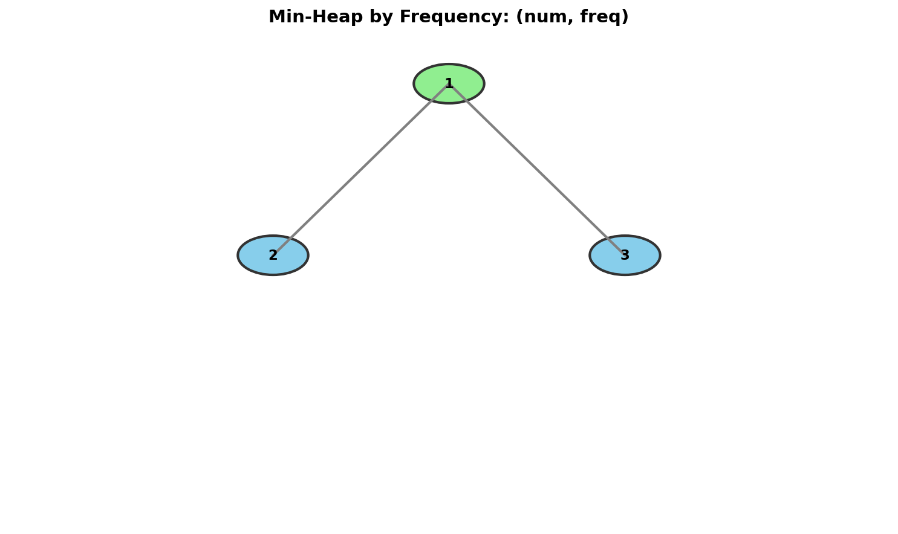

# Top K Frequent Elements

> **Find the k most frequent elements using heap and hash map**

---

## Problem Statement

Given an integer array `nums` and an integer `k`, return the **k most frequent elements**. You may return the answer in **any order**.

**LeetCode:** [Problem 347 - Top K Frequent Elements](https://leetcode.com/problems/top-k-frequent-elements/)

---

## Examples

### Example 1
```
Input: nums = [1, 1, 1, 2, 2, 3], k = 2
Output: [1, 2]
```
**Explanation:**
- Element 1 appears 3 times
- Element 2 appears 2 times
- Element 3 appears 1 time
- The 2 most frequent are [1, 2]

### Example 2
```
Input: nums = [1], k = 1
Output: [1]
```

---

## Constraints

- `1 <= nums.length <= 10^5`
- `-10^4 <= nums[i] <= 10^4`
- `k` is in the range `[1, the number of unique elements in the array]`
- It is guaranteed that the answer is unique

---

## Visualization



---

## Approach

### Key Insight

This problem combines **two techniques**:
1. **Hash Map** to count frequencies
2. **Heap** to find top K by frequency

We can use either:
- **Min-heap of size k**: Keep the k most frequent (similar to Kth Largest)
- **Bucket sort**: O(n) time using frequency as index

---

## Solution 1: Min-Heap of Size K

::: code-group

```python [Python]
import heapq
from collections import Counter

def topKFrequent(nums: list[int], k: int) -> list[int]:
    """
    Find k most frequent elements using min-heap.

    Algorithm:
    1. Count frequencies using Counter
    2. Maintain min-heap of size k with (frequency, element) pairs
    3. The heap root is the kth most frequent

    Time: O(n log k) - n elements, heap operations O(log k)
    Space: O(n) for counter + O(k) for heap
    """
    # Step 1: Count frequencies
    count = Counter(nums)

    # Step 2: Use min-heap of size k
    # Heap stores (frequency, element) - min by frequency
    min_heap = []

    for num, freq in count.items():
        if len(min_heap) < k:
            heapq.heappush(min_heap, (freq, num))
        elif freq > min_heap[0][0]:
            heapq.heapreplace(min_heap, (freq, num))

    # Step 3: Extract elements from heap
    return [num for freq, num in min_heap]
```

```java [Java]
import java.util.HashMap;
import java.util.Map;
import java.util.PriorityQueue;
import java.util.ArrayList;
import java.util.List;

class Solution {
    public int[] topKFrequent(int[] nums, int k) {
        // Step 1: Count frequencies
        Map<Integer, Integer> count = new HashMap<>();
        for (int num : nums) {
            count.merge(num, 1, Integer::sum);
        }

        // Step 2: Min-heap of size k, ordered by frequency
        PriorityQueue<int[]> minHeap = new PriorityQueue<>(
            (a, b) -> Integer.compare(a[1], b[1])  // [element, frequency]
        );

        for (Map.Entry<Integer, Integer> entry : count.entrySet()) {
            int num = entry.getKey();
            int freq = entry.getValue();
            if (minHeap.size() < k) {
                minHeap.offer(new int[]{num, freq});
            } else if (freq > minHeap.peek()[1]) {
                minHeap.poll();
                minHeap.offer(new int[]{num, freq});
            }
        }

        // Step 3: Extract elements
        int[] result = new int[k];
        int i = 0;
        for (int[] entry : minHeap) {
            result[i++] = entry[0];
        }
        return result;
    }
}
```

:::

::: info Complexity: Time O(n log k) · Space O(n)
- **Time:** Counting frequencies takes O(n). Processing m unique elements with heap operations of O(log k) each gives O(m log k). Since m <= n, total is O(n log k)
- **Space:** O(n) for the frequency counter, plus O(k) for the heap
:::

### Step-by-Step Walkthrough

```
nums = [1, 1, 1, 2, 2, 3], k = 2

Step 1: Count frequencies
        {1: 3, 2: 2, 3: 1}

Step 2: Process each (num, freq) pair

Process (1, 3):
    heap size < k, push (3, 1)
    Heap: [(3, 1)]

Process (2, 2):
    heap size < k, push (2, 2)
    Heap: [(2, 2), (3, 1)]  <- min-heap by frequency

Process (3, 1):
    1 > heap[0][0] (which is 2)? NO
    Skip
    Heap: [(2, 2), (3, 1)]

Step 3: Extract elements
        Result: [2, 1]
```

---

## Solution 2: Bucket Sort (Optimal O(n))

```python
from collections import Counter

def topKFrequent_bucket(nums: list[int], k: int) -> list[int]:
    """
    Find k most frequent using bucket sort.

    Key Insight: Frequency ranges from 1 to n, so we can use
    frequency as bucket index.

    Time: O(n) - counting and bucket creation
    Space: O(n) - for buckets
    """
    count = Counter(nums)

    # Create buckets: bucket[i] contains elements with frequency i
    # Frequency can range from 1 to len(nums)
    buckets = [[] for _ in range(len(nums) + 1)]

    for num, freq in count.items():
        buckets[freq].append(num)

    # Collect top k from highest frequency buckets
    result = []
    for freq in range(len(buckets) - 1, 0, -1):
        for num in buckets[freq]:
            result.append(num)
            if len(result) == k:
                return result

    return result
```

::: info Complexity: Time O(n) · Space O(n)
- **Time:** Counting takes O(n). Creating n+1 buckets is O(n). Filling and scanning buckets is O(n) since we process each unique element once
- **Space:** O(n) for the counter and O(n) for the bucket array
:::

### Bucket Sort Visualization

```
nums = [1, 1, 1, 2, 2, 3, 3, 3, 3], k = 2

Frequencies: {1: 3, 2: 2, 3: 4}

Buckets (index = frequency):
+-------+-------+-------+-------+-------+
| idx 0 | idx 1 | idx 2 | idx 3 | idx 4 |
+-------+-------+-------+-------+-------+
|  [ ]  |  [ ]  |  [2]  |  [1]  |  [3]  |
+-------+-------+-------+-------+-------+
            ^       ^       ^
            |       |       |
        freq=2  freq=3  freq=4

Scan from right to left:
- bucket[4] has [3] -> add to result
- bucket[3] has [1] -> add to result
- Result has k=2 elements, done!

Result: [3, 1]
```

---

## Solution 3: Using nlargest

```python
import heapq
from collections import Counter

def topKFrequent_nlargest(nums: list[int], k: int) -> list[int]:
    """
    Use Python's built-in nlargest for cleaner code.

    Time: O(n log k)
    Space: O(n)
    """
    count = Counter(nums)
    # nlargest returns k largest by key function
    return heapq.nlargest(k, count.keys(), key=count.get)
```

::: info Complexity: Time O(n log k) · Space O(n)
- **Time:** Counting takes O(n). nlargest processes m unique elements with heap operations, giving O(m log k) where m <= n
- **Space:** O(n) for the Counter
:::

---

## Complexity Comparison

| Approach | Time | Space | Notes |
|----------|------|-------|-------|
| Min-Heap (size k) | O(n log k) | O(n + k) | Best when k << n |
| Max-Heap (all elements) | O(n + m log m) | O(n + m) | m = unique elements |
| Bucket Sort | O(n) | O(n) | Optimal for dense frequencies |
| Sort by frequency | O(n + m log m) | O(n) | Simple but slower |

---

## Common Mistakes

1. **Heap order confusion**
   ```python
   # Wrong: This is a max-heap by frequency (negate frequency)
   heapq.heappush(heap, (-freq, num))

   # Correct for min-heap of size k:
   heapq.heappush(heap, (freq, num))
   ```

2. **Forgetting to handle ties**
   - The problem guarantees unique answer
   - But in general, handle ties by secondary sorting (e.g., by element value)

3. **Using list as frequency key**
   - Lists are not hashable; use tuple or individual elements

---

## Follow-up Questions

### Q1: What if we need the k least frequent elements?

Use a **max-heap** of size k (negate frequencies):

```python
def bottomKFrequent(nums: list[int], k: int) -> list[int]:
    count = Counter(nums)
    max_heap = []

    for num, freq in count.items():
        if len(max_heap) < k:
            heapq.heappush(max_heap, (-freq, num))
        elif freq < -max_heap[0][0]:
            heapq.heapreplace(max_heap, (-freq, num))

    return [num for _, num in max_heap]
```

### Q2: What if elements are streaming?

Combine with a HashMap that updates frequencies, then periodically query top K:

```python
class TopKStream:
    def __init__(self, k: int):
        self.k = k
        self.count = Counter()

    def add(self, num: int) -> None:
        self.count[num] += 1

    def getTopK(self) -> list[int]:
        return heapq.nlargest(self.k, self.count.keys(), key=self.count.get)
```

### Q3: What if we need top K words by frequency (strings)?

Same approach, but handle tie-breaking by lexicographic order:

```python
def topKFrequentWords(words: list[str], k: int) -> list[str]:
    count = Counter(words)
    # Sort by (-frequency, word) for max-freq, then alphabetical
    return heapq.nsmallest(k, count.keys(),
                           key=lambda w: (-count[w], w))
```

---

## Related Problems

::: details Kth Largest Element in an Array (LeetCode 215)
**Problem:** Find the kth largest element in an unsorted array.

**Key Insight:** Use min-heap of size k - no frequency counting needed, just track the k largest values directly.

**Approach:** Maintain min-heap of size k. For each element, if larger than heap root, replace it. The root is always the kth largest.

**Complexity:** O(n log k) time, O(k) space
:::

::: details Sort Characters By Frequency (LeetCode 451)
**Problem:** Given a string, sort it in decreasing order based on the frequency of characters.

**Key Insight:** Similar frequency counting, but need to **sort all** characters, not just top k.

**Approach:** Count frequencies with hash map, then either sort by frequency or use bucket sort where bucket index = frequency. Bucket sort achieves O(n) time.

**Complexity:** O(n log n) with sorting, O(n) with bucket sort
:::

::: details Top K Frequent Words (LeetCode 692)
**Problem:** Given an array of words and integer k, return the k most frequent words sorted by frequency (and lexicographically for ties).

**Key Insight:** Same as Top K Frequent Elements, but must handle **lexicographic tie-breaking**.

**Approach:** Use min-heap with custom comparator: `(-frequency, word)`. For ties in frequency, sort words in reverse lexicographic order so the "smaller" word stays in heap.

```python
# Tie-breaking: nsmallest with (-freq, word) key
return heapq.nsmallest(k, count.keys(),
                       key=lambda w: (-count[w], w))
```

**Complexity:** O(n log k) time, O(n) space
:::

---

## Interview Tips

1. **Start with frequency counting**
   - Mention `Counter` in Python or `HashMap` in Java/C++
   - This is O(n) and necessary for any approach

2. **Discuss tradeoffs**
   - Heap: O(n log k) time, better when k << n
   - Bucket sort: O(n) time, uses more space

3. **Know when to use each**
   - Heap: When k is small relative to n
   - Bucket sort: When frequency range is bounded
   - Sorting: When you need all elements sorted by frequency

4. **Edge cases**
   - All elements are the same
   - k equals number of unique elements
   - Single element array

---

## Sources

- [Top K Frequent Elements - LeetCode](https://leetcode.com/problems/top-k-frequent-elements/)
- [Bucket Sort Approach Discussion](https://leetcode.com/problems/top-k-frequent-elements/solutions/740374/python-5-lines-o-n-bucket-sort-explained/)
- [NeetCode Solution](https://neetcode.io/solutions/top-k-frequent-elements)
