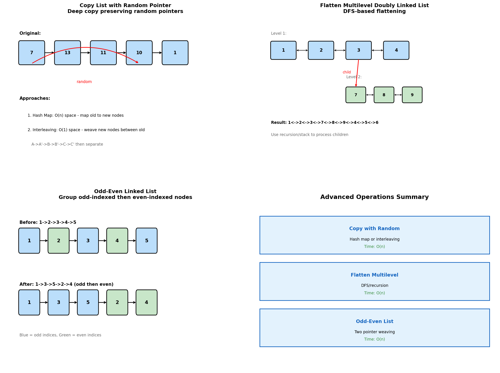
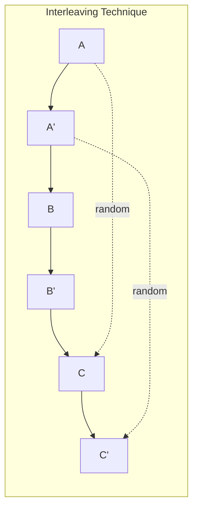
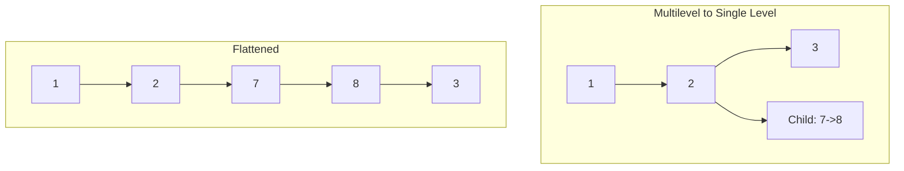
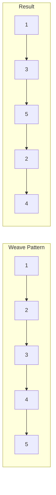
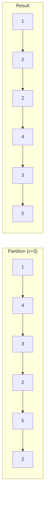
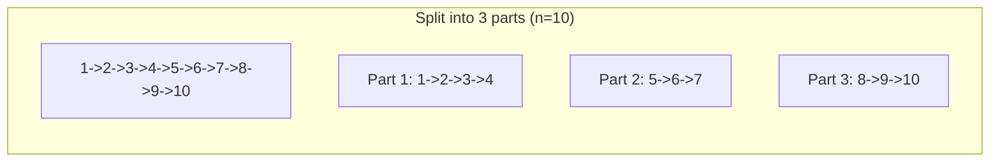

# Advanced Linked List Operations

> **Complex pointer manipulation and special list structures**

---

## Overview

Advanced linked list operations involve complex pointer manipulations, deep copies with special pointers, and flattening hierarchical structures. These problems test your ability to handle multiple pointer types and think through intricate scenarios.



---

## Copy List with Random Pointer (LeetCode #138)

### Problem Statement

A linked list of length n is given such that each node contains an additional random pointer, which could point to any node in the list, or null. Construct a deep copy of the list.

### Approach 1: Hash Map

```python
def copyRandomList_hashmap(head: 'Node') -> 'Node':
    """
    Use hash map to map original nodes to copies.
    Two passes: create nodes, then set pointers.
    Time: O(n), Space: O(n)
    """
    if not head:
        return None

    # Map original -> copy
    old_to_new = {}

    # First pass: create all nodes
    current = head
    while current:
        old_to_new[current] = Node(current.val)
        current = current.next

    # Second pass: set next and random pointers
    current = head
    while current:
        copy = old_to_new[current]
        copy.next = old_to_new.get(current.next)
        copy.random = old_to_new.get(current.random)
        current = current.next

    return old_to_new[head]
```

::: info Complexity: Time O(n) · Space O(n)
- **Time:** O(n) because we traverse the list twice: once to create copies, once to set pointers
- **Space:** O(n) for the hash map storing n original-to-copy node mappings
:::

### Approach 2: Interleaving (O(1) Space)

```python
def copyRandomList_interleave(head: 'Node') -> 'Node':
    """
    Interleave copy nodes with original nodes.
    A -> A' -> B -> B' -> C -> C'
    Time: O(n), Space: O(1) (excluding output)
    """
    if not head:
        return None

    # Step 1: Create copy nodes interleaved with originals
    current = head
    while current:
        copy = Node(current.val)
        copy.next = current.next
        current.next = copy
        current = copy.next

    # Step 2: Set random pointers for copies
    current = head
    while current:
        if current.random:
            current.next.random = current.random.next
        current = current.next.next

    # Step 3: Separate the two lists
    dummy = Node(0)
    copy_current = dummy
    current = head

    while current:
        copy_current.next = current.next
        copy_current = copy_current.next
        current.next = copy_current.next
        current = current.next

    return dummy.next
```

::: info Complexity: Time O(n) · Space O(1)
- **Time:** O(n) because we traverse the list three times: interleave, set random pointers, separate
- **Space:** O(1) because we don't use extra data structures; copies are interleaved with originals
:::

### Visual Example (Interleaving)

```
Original: A -> B -> C
          |    |    |
          v    v    v
Random:   C   None   A

After interleaving:
A -> A' -> B -> B' -> C -> C'
|                      |
+----------------------+  (A.random = C means A'.random = C')

After separation:
Original: A -> B -> C
Copy:     A' -> B' -> C' (with correct random pointers)
```

---

## Flatten a Multilevel Doubly Linked List (LeetCode #430)

### Problem Statement

Given a doubly linked list where some nodes have a child pointer to another doubly linked list, flatten all lists into a single-level doubly linked list.

### Solution

```python
def flatten(head: 'Node') -> 'Node':
    """
    DFS-based flattening.
    When encountering a child, insert the flattened child list.
    """
    if not head:
        return None

    current = head

    while current:
        if current.child:
            # Flatten the child list recursively
            child_head = flatten(current.child)
            child_tail = child_head

            # Find tail of child list
            while child_tail.next:
                child_tail = child_tail.next

            # Save next
            next_node = current.next

            # Insert child list
            current.next = child_head
            child_head.prev = current
            current.child = None

            # Connect tail to next
            child_tail.next = next_node
            if next_node:
                next_node.prev = child_tail

        current = current.next

    return head
```

::: info Complexity: Time O(n) · Space O(d)
- **Time:** O(n) because we visit each node exactly once during the flattening process
- **Space:** O(d) where d is the maximum depth of nesting, for the recursion stack
:::

### Iterative Solution with Stack

```python
def flatten_iterative(head: 'Node') -> 'Node':
    """
    Use stack to process children first (DFS order).
    """
    if not head:
        return None

    dummy = Node(0)
    dummy.next = head
    prev = dummy
    stack = [head]

    while stack:
        current = stack.pop()

        # Connect to previous
        prev.next = current
        current.prev = prev

        # Push next first (processed last)
        if current.next:
            stack.append(current.next)

        # Push child second (processed first, before next)
        if current.child:
            stack.append(current.child)
            current.child = None

        prev = current

    # Disconnect dummy
    head.prev = None
    return head
```

::: info Complexity: Time O(n) · Space O(n)
- **Time:** O(n) because we process each node exactly once by popping from the stack
- **Space:** O(n) in the worst case if all nodes have children creating a deep stack
:::

---

## Odd Even Linked List (LeetCode #328)

### Problem Statement

Group all odd-indexed nodes together followed by even-indexed nodes. The first node is considered odd.

### Solution

```python
def oddEvenList(head: ListNode) -> ListNode:
    """
    Separate into odd and even lists, then connect.
    Time: O(n), Space: O(1)
    """
    if not head or not head.next:
        return head

    odd = head
    even = head.next
    even_head = even

    while even and even.next:
        # Connect odd nodes
        odd.next = even.next
        odd = odd.next

        # Connect even nodes
        even.next = odd.next
        even = even.next

    # Connect odd list to even list
    odd.next = even_head

    return head
```

::: info Complexity: Time O(n) · Space O(1)
- **Time:** O(n) because we traverse the list once, rearranging odd and even nodes
- **Space:** O(1) because we only use pointers (odd, even, even_head) to rearrange in-place
:::

### Visual Example

```
Before: 1 -> 2 -> 3 -> 4 -> 5
        odd  even odd  even odd

After:  1 -> 3 -> 5 -> 2 -> 4
        [odd nodes]   [even nodes]
```

---

## Partition List (LeetCode #86)

### Problem Statement

Given a linked list and a value x, partition it such that all nodes less than x come before nodes greater than or equal to x. Preserve the original relative order.

### Solution

```python
def partition(head: ListNode, x: int) -> ListNode:
    """
    Create two lists: nodes < x and nodes >= x.
    Then connect them.
    """
    less_head = ListNode(0)
    greater_head = ListNode(0)
    less = less_head
    greater = greater_head

    current = head
    while current:
        if current.val < x:
            less.next = current
            less = less.next
        else:
            greater.next = current
            greater = greater.next
        current = current.next

    # Connect lists
    greater.next = None  # Important: avoid cycle
    less.next = greater_head.next

    return less_head.next
```

::: info Complexity: Time O(n) · Space O(1)
- **Time:** O(n) because we traverse the list once, distributing nodes to two partitions
- **Space:** O(1) because we only use dummy nodes and pointers, rearranging existing nodes
:::

---

## Split Linked List in Parts (LeetCode #725)

### Problem Statement

Given a linked list and an integer k, split the linked list into k consecutive parts. Parts should have sizes as equal as possible, with earlier parts being larger.

### Solution

```python
def splitListToParts(head: ListNode, k: int) -> List[ListNode]:
    """
    Calculate part sizes, then split.
    Earlier parts get extra nodes if not evenly divisible.
    """
    # Calculate length
    length = 0
    current = head
    while current:
        length += 1
        current = current.next

    # Calculate part sizes
    base_size = length // k
    extra = length % k  # First 'extra' parts get one more node

    result = []
    current = head

    for i in range(k):
        result.append(current)

        # Size of this part
        size = base_size + (1 if i < extra else 0)

        # Move to end of this part
        for _ in range(size - 1):
            if current:
                current = current.next

        # Cut the list
        if current:
            next_head = current.next
            current.next = None
            current = next_head

    return result
```

::: info Complexity: Time O(n) · Space O(k)
- **Time:** O(n) because we traverse the list twice: once for length, once to split into k parts
- **Space:** O(k) for the result array containing k list heads (the nodes themselves are reused)
:::

---

## Rotate List (LeetCode #61)

### Problem Statement

Rotate the list to the right by k places.

```python
def rotateRight(head: ListNode, k: int) -> ListNode:
    """
    Find the (n-k)th node and make it the new tail.
    Connect old tail to old head.
    """
    if not head or not head.next or k == 0:
        return head

    # Find length and tail
    length = 1
    tail = head
    while tail.next:
        length += 1
        tail = tail.next

    # Normalize k
    k = k % length
    if k == 0:
        return head

    # Find new tail (n-k)th node
    new_tail = head
    for _ in range(length - k - 1):
        new_tail = new_tail.next

    # Rotate
    new_head = new_tail.next
    new_tail.next = None
    tail.next = head

    return new_head
```

::: info Complexity: Time O(n) · Space O(1)
- **Time:** O(n) because we traverse the list twice: once to find length/tail, once to find new tail
- **Space:** O(1) because we only use pointers to rearrange the existing nodes
:::

---

## Common Patterns

### Hash Map for Complex Pointers

```python
# When nodes have multiple pointers (random, child, etc.)
old_to_new = {}
for node in original_list:
    old_to_new[node] = copy(node)

for node in original_list:
    copy_node = old_to_new[node]
    copy_node.next = old_to_new.get(node.next)
    copy_node.special = old_to_new.get(node.special)
```

### Interleaving for O(1) Space Copy

```python
# Step 1: Interleave
# A -> A' -> B -> B' -> C -> C'

# Step 2: Set special pointers using relationship
# copy.special = original.special.next

# Step 3: Separate lists
```

### Split into Multiple Lists

```python
list1_head = ListNode(0)
list2_head = ListNode(0)
tail1, tail2 = list1_head, list2_head

for node in original:
    if condition(node):
        tail1.next = node
        tail1 = tail1.next
    else:
        tail2.next = node
        tail2 = tail2.next

tail1.next = list2_head.next  # or None
tail2.next = None
```

---

## Complexity Summary

| Problem | Time | Space |
|---------|------|-------|
| Copy with Random (Hash) | O(n) | O(n) |
| Copy with Random (Interleave) | O(n) | O(1) |
| Flatten Multilevel | O(n) | O(depth) |
| Odd Even List | O(n) | O(1) |
| Partition List | O(n) | O(1) |
| Split in Parts | O(n) | O(k) for result |

---

## Edge Cases

1. **Empty list**: Return null
2. **Single node**: Handle specially
3. **No special pointers**: Random/child all null
4. **Self-referencing**: Node's random points to itself
5. **Circular references**: Be careful not to loop infinitely

---

## Related Problems

::: details Copy List with Random Pointer (LeetCode 138)
**Problem:** Deep copy a linked list where each node has a random pointer to any node or null.

**Key Insight:** Use hash map to map original nodes to copies, or interleave copies with originals for O(1) space.



**Approach:** Hash map: Two passes - create nodes, then set pointers. Interleave: Insert copies after originals, set random as original.random.next.

**Complexity:** O(n) time, O(n) or O(1) space
:::

::: details Flatten a Multilevel Doubly Linked List (LeetCode 430)
**Problem:** Flatten a doubly linked list where nodes may have child lists into a single-level list.

**Key Insight:** Use DFS - when encountering a child, recursively flatten and insert between current and next.



**Approach:** Traverse list, when child found: flatten child, find child's tail, insert between current and next.

**Complexity:** O(n) time, O(depth) space for recursion
:::

::: details Odd Even Linked List (LeetCode 328)
**Problem:** Group all odd-indexed nodes together followed by even-indexed nodes.

**Key Insight:** Build two separate chains (odd and even positions), then connect odd's tail to even's head.



**Approach:** Maintain odd and even pointers, weave through list connecting odd to odd.next.next and same for even.

**Complexity:** O(n) time, O(1) space
:::

::: details Partition List (LeetCode 86)
**Problem:** Partition list so all nodes less than x come before nodes >= x, preserving order.

**Key Insight:** Build two separate lists (less than x, greater or equal), then concatenate.



**Approach:** Two dummy heads for less and greater lists, iterate and append to appropriate list, connect.

**Complexity:** O(n) time, O(1) space
:::

::: details Split Linked List in Parts (LeetCode 725)
**Problem:** Split linked list into k consecutive parts with sizes as equal as possible.

**Key Insight:** Calculate base size and how many parts get an extra node (length % k).



**Approach:** Calculate n/k as base size, first n%k parts get size+1. Iterate cutting list at each part boundary.

**Complexity:** O(n) time, O(k) space for result
:::

---

## Interview Tips

1. **For copy with random**: Explain both approaches, discuss trade-offs
2. **For flattening**: Draw out the structure before coding
3. **For partitioning**: Remember to null-terminate to avoid cycles
4. **Always clarify**: Whether to modify in-place or create new list
5. **Test edge cases**: Empty, single node, all same partition

---

## Sources

- [Copy List with Random Pointer - LeetCode](https://leetcode.com/problems/copy-list-with-random-pointer/)
- [Flatten Multilevel Doubly Linked List - LeetCode](https://leetcode.com/problems/flatten-a-multilevel-doubly-linked-list/)
- [Odd Even Linked List - LeetCode](https://leetcode.com/problems/odd-even-linked-list/)
- [Partition List - LeetCode](https://leetcode.com/problems/partition-list/)
