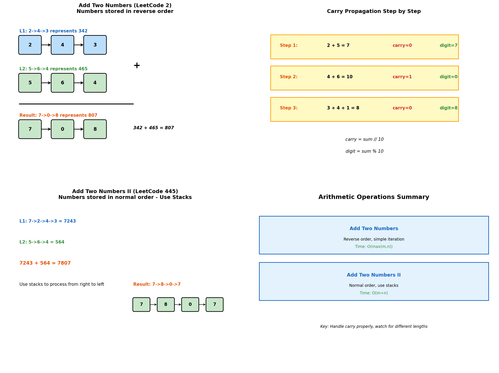
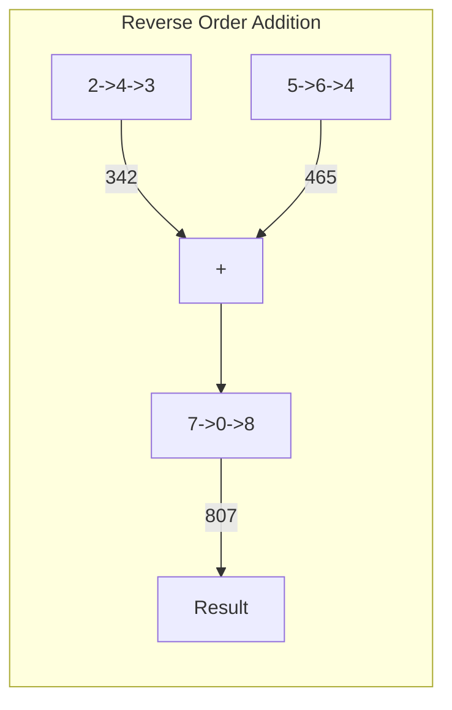
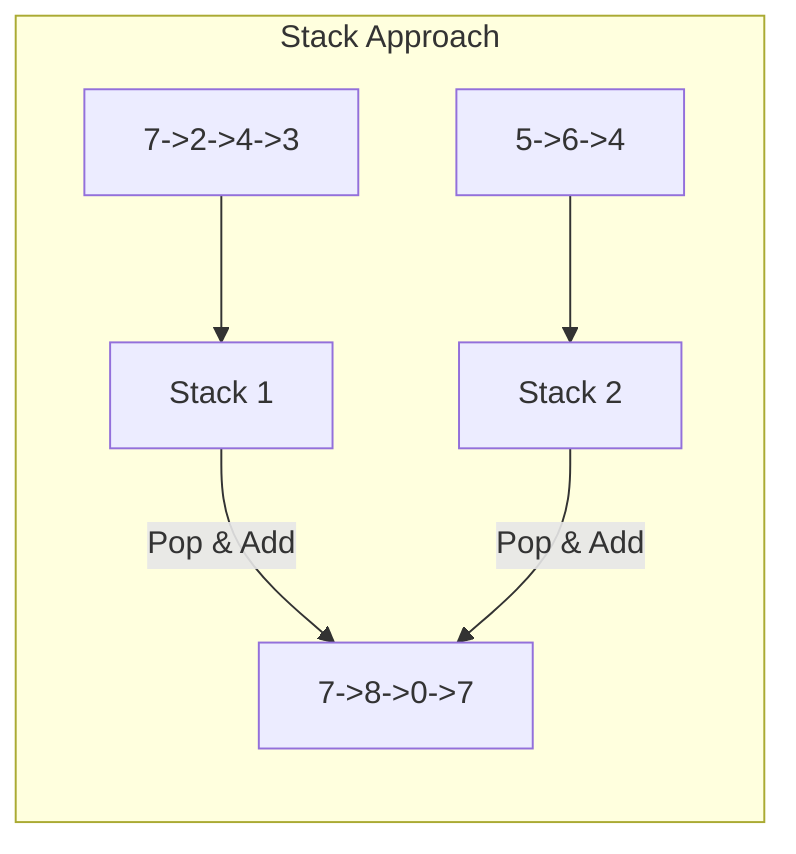
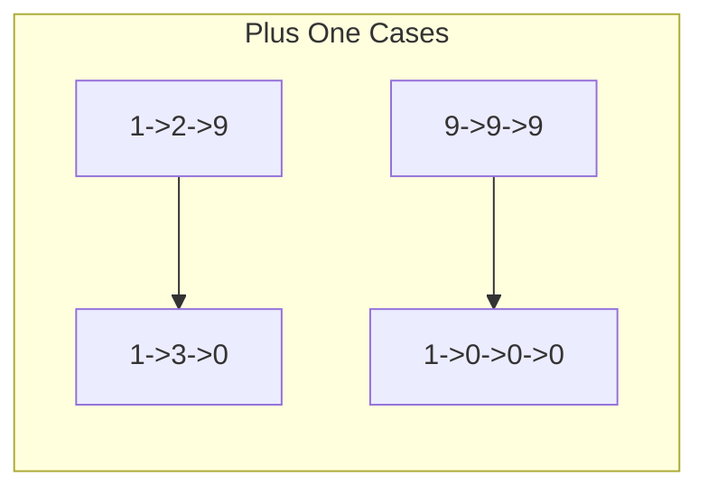
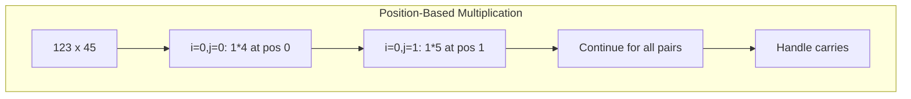

# Arithmetic Operations on Linked Lists

> **Adding, subtracting, and multiplying numbers represented as linked lists**

---

## Overview

Arithmetic operations on linked lists involve performing mathematical operations on numbers where each digit is stored in a separate node. These problems test your ability to handle carries, different number lengths, and various digit orderings.



---

## Add Two Numbers (LeetCode #2)

### Problem Statement

You are given two non-empty linked lists representing two non-negative integers. The digits are stored in reverse order, and each node contains a single digit. Add the two numbers and return the sum as a linked list.

### Solution

::: code-group

```python [Python]
def addTwoNumbers(l1: ListNode, l2: ListNode) -> ListNode:
    """
    Add two numbers stored in reverse order.
    Process digit by digit, handling carry.

    Example: 342 + 465 = 807
    L1: 2 -> 4 -> 3 (342 reversed)
    L2: 5 -> 6 -> 4 (465 reversed)
    Result: 7 -> 0 -> 8 (807 reversed)
    """
    dummy = ListNode(0)
    current = dummy
    carry = 0

    while l1 or l2 or carry:
        # Get values (0 if list exhausted)
        val1 = l1.val if l1 else 0
        val2 = l2.val if l2 else 0

        # Calculate sum and carry
        total = val1 + val2 + carry
        carry = total // 10
        digit = total % 10

        # Create new node
        current.next = ListNode(digit)
        current = current.next

        # Advance pointers
        l1 = l1.next if l1 else None
        l2 = l2.next if l2 else None

    return dummy.next
```

```java [Java]
public ListNode addTwoNumbers(ListNode l1, ListNode l2) {
    ListNode dummy = new ListNode(0);
    ListNode current = dummy;
    int carry = 0;

    while (l1 != null || l2 != null || carry != 0) {
        int val1 = (l1 != null) ? l1.val : 0;
        int val2 = (l2 != null) ? l2.val : 0;

        int total = val1 + val2 + carry;
        carry = total / 10;
        int digit = total % 10;

        current.next = new ListNode(digit);
        current = current.next;

        if (l1 != null) l1 = l1.next;
        if (l2 != null) l2 = l2.next;
    }

    return dummy.next;
}
```

:::

::: info Complexity: Time O(max(m, n)) · Space O(max(m, n))
- **Time:** O(max(m, n)) because we traverse both lists in parallel until both are exhausted and carry is zero
- **Space:** O(max(m, n)) because we create a new node for each digit of the result
:::

### Step-by-Step Example

```
L1: 2 -> 4 -> 3 (represents 342)
L2: 5 -> 6 -> 4 (represents 465)

Step 1: 2 + 5 = 7, carry = 0
Step 2: 4 + 6 + 0 = 10, digit = 0, carry = 1
Step 3: 3 + 4 + 1 = 8, carry = 0

Result: 7 -> 0 -> 8 (represents 807)
```

### Complexity

| Metric | Value |
|--------|-------|
| Time | O(max(m, n)) |
| Space | O(max(m, n)) |

---

## Add Two Numbers II (LeetCode #445)

### Problem Statement

Same as above, but digits are stored in normal order (most significant digit first).

### Approach 1: Using Stacks

::: code-group

```python [Python]
def addTwoNumbers_stacks(l1: ListNode, l2: ListNode) -> ListNode:
    """
    Use stacks to process from right to left.
    Build result from head (insert at front).
    """
    # Push all digits to stacks
    stack1, stack2 = [], []

    while l1:
        stack1.append(l1.val)
        l1 = l1.next
    while l2:
        stack2.append(l2.val)
        l2 = l2.next

    # Add from right to left
    carry = 0
    head = None

    while stack1 or stack2 or carry:
        val1 = stack1.pop() if stack1 else 0
        val2 = stack2.pop() if stack2 else 0

        total = val1 + val2 + carry
        carry = total // 10
        digit = total % 10

        # Insert at front
        new_node = ListNode(digit)
        new_node.next = head
        head = new_node

    return head
```

```java [Java]
public ListNode addTwoNumbers(ListNode l1, ListNode l2) {
    Deque<Integer> stack1 = new ArrayDeque<>();
    Deque<Integer> stack2 = new ArrayDeque<>();

    while (l1 != null) { stack1.push(l1.val); l1 = l1.next; }
    while (l2 != null) { stack2.push(l2.val); l2 = l2.next; }

    int carry = 0;
    ListNode head = null;

    while (!stack1.isEmpty() || !stack2.isEmpty() || carry != 0) {
        int val1 = stack1.isEmpty() ? 0 : stack1.pop();
        int val2 = stack2.isEmpty() ? 0 : stack2.pop();

        int total = val1 + val2 + carry;
        carry = total / 10;
        int digit = total % 10;

        ListNode newNode = new ListNode(digit);
        newNode.next = head;
        head = newNode;
    }

    return head;
}
```

:::

::: info Complexity: Time O(m + n) · Space O(m + n)
- **Time:** O(m + n) because we push all digits to stacks and then process them
- **Space:** O(m + n) for the two stacks storing all digits from both input lists
:::

### Approach 2: Reverse, Add, Reverse

```python
def addTwoNumbers_reverse(l1: ListNode, l2: ListNode) -> ListNode:
    """
    1. Reverse both lists
    2. Add like problem #2
    3. Reverse result
    """
    def reverse(head):
        prev = None
        curr = head
        while curr:
            next_temp = curr.next
            curr.next = prev
            prev = curr
            curr = next_temp
        return prev

    # Reverse inputs
    l1 = reverse(l1)
    l2 = reverse(l2)

    # Add (same as problem #2)
    dummy = ListNode(0)
    current = dummy
    carry = 0

    while l1 or l2 or carry:
        val1 = l1.val if l1 else 0
        val2 = l2.val if l2 else 0

        total = val1 + val2 + carry
        carry = total // 10

        current.next = ListNode(total % 10)
        current = current.next

        l1 = l1.next if l1 else None
        l2 = l2.next if l2 else None

    # Reverse result
    return reverse(dummy.next)
```

::: info Complexity: Time O(m + n) · Space O(max(m, n))
- **Time:** O(m + n) because we reverse both lists (O(m + n)), add them (O(max(m, n))), and reverse result
- **Space:** O(max(m, n)) for the result list; reversals are done in-place
:::

### Approach 3: Recursive with Padding

```python
def addTwoNumbers_recursive(l1: ListNode, l2: ListNode) -> ListNode:
    """
    Pad shorter list, then recurse to add from right.
    """
    def get_length(head):
        length = 0
        while head:
            length += 1
            head = head.next
        return length

    def pad_list(head, padding):
        for _ in range(padding):
            new_node = ListNode(0)
            new_node.next = head
            head = new_node
        return head

    def add_helper(l1, l2):
        """Returns (result_node, carry)"""
        if not l1:
            return None, 0

        # Recurse first
        next_node, carry = add_helper(l1.next, l2.next)

        # Add current digits
        total = l1.val + l2.val + carry
        node = ListNode(total % 10)
        node.next = next_node

        return node, total // 10

    # Get lengths
    len1, len2 = get_length(l1), get_length(l2)

    # Pad shorter list
    if len1 < len2:
        l1 = pad_list(l1, len2 - len1)
    else:
        l2 = pad_list(l2, len1 - len2)

    # Add recursively
    result, carry = add_helper(l1, l2)

    # Handle final carry
    if carry:
        new_head = ListNode(carry)
        new_head.next = result
        result = new_head

    return result
```

::: info Complexity: Time O(m + n) · Space O(max(m, n))
- **Time:** O(m + n) because we calculate lengths, pad the shorter list, and recursively add
- **Space:** O(max(m, n)) for the recursion stack and the result list
:::

### Complexity Comparison

| Approach | Time | Space |
|----------|------|-------|
| Stacks | O(m + n) | O(m + n) |
| Reverse | O(m + n) | O(max(m, n)) for result |
| Recursive | O(m + n) | O(max(m, n)) |

---

## Subtract Two Numbers

### Problem Statement

Subtract smaller number from larger number represented as linked lists.

::: code-group

```python [Python]
def subtractTwoNumbers(l1: ListNode, l2: ListNode) -> ListNode:
    """
    Subtract l2 from l1 (assuming l1 >= l2).
    Handle borrowing instead of carrying.
    """
    # First determine which is larger
    def to_number(head):
        num = 0
        while head:
            num = num * 10 + head.val
            head = head.next
        return num

    num1, num2 = to_number(l1), to_number(l2)

    # Ensure we subtract smaller from larger
    if num1 < num2:
        l1, l2 = l2, l1

    # Reverse lists for easier processing
    def reverse(head):
        prev = None
        while head:
            next_temp = head.next
            head.next = prev
            prev = head
            head = next_temp
        return prev

    l1, l2 = reverse(l1), reverse(l2)

    dummy = ListNode(0)
    current = dummy
    borrow = 0

    while l1:
        val1 = l1.val - borrow
        val2 = l2.val if l2 else 0

        if val1 < val2:
            val1 += 10
            borrow = 1
        else:
            borrow = 0

        current.next = ListNode(val1 - val2)
        current = current.next

        l1 = l1.next
        l2 = l2.next if l2 else None

    # Reverse result and remove leading zeros
    result = reverse(dummy.next)
    while result and result.next and result.val == 0:
        result = result.next

    return result
```

```java [Java]
public ListNode subtractTwoNumbers(ListNode l1, ListNode l2) {
    long num1 = toNumber(l1);
    long num2 = toNumber(l2);

    if (num1 < num2) { ListNode tmp = l1; l1 = l2; l2 = tmp; }

    l1 = reverse(l1);
    l2 = reverse(l2);

    ListNode dummy = new ListNode(0);
    ListNode current = dummy;
    int borrow = 0;

    while (l1 != null) {
        int val1 = l1.val - borrow;
        int val2 = (l2 != null) ? l2.val : 0;

        if (val1 < val2) { val1 += 10; borrow = 1; }
        else { borrow = 0; }

        current.next = new ListNode(val1 - val2);
        current = current.next;

        l1 = l1.next;
        if (l2 != null) l2 = l2.next;
    }

    ListNode result = reverse(dummy.next);
    while (result != null && result.next != null && result.val == 0) {
        result = result.next;
    }
    return result;
}

private long toNumber(ListNode head) {
    long num = 0;
    while (head != null) { num = num * 10 + head.val; head = head.next; }
    return num;
}

private ListNode reverse(ListNode head) {
    ListNode prev = null;
    while (head != null) {
        ListNode next = head.next;
        head.next = prev;
        prev = head;
        head = next;
    }
    return prev;
}
```

:::

::: info Complexity: Time O(m + n) · Space O(max(m, n))
- **Time:** O(m + n) because we traverse both lists to convert to numbers, then reverse and process
- **Space:** O(max(m, n)) for the result list; intermediate operations use constant space
:::

---

## Multiply Two Numbers

### Problem Statement

Multiply two numbers represented as linked lists.

::: code-group

```python [Python]
def multiplyTwoNumbers(l1: ListNode, l2: ListNode) -> ListNode:
    """
    Multiply digit by digit, similar to long multiplication.
    """
    def reverse(head):
        prev = None
        while head:
            next_temp = head.next
            head.next = prev
            prev = head
            head = next_temp
        return prev

    def to_list(num):
        if num == 0:
            return ListNode(0)
        head = None
        while num > 0:
            node = ListNode(num % 10)
            node.next = head
            head = node
            num //= 10
        return head

    # Convert to numbers (for simplicity)
    # For very large numbers, use array-based multiplication
    def to_number(head):
        num = 0
        while head:
            num = num * 10 + head.val
            head = head.next
        return num

    num1, num2 = to_number(l1), to_number(l2)
    return to_list(num1 * num2)
```

```java [Java]
public ListNode multiplyTwoNumbers(ListNode l1, ListNode l2) {
    long num1 = toNumber(l1);
    long num2 = toNumber(l2);
    return toList(num1 * num2);
}

private long toNumber(ListNode head) {
    long num = 0;
    while (head != null) { num = num * 10 + head.val; head = head.next; }
    return num;
}

private ListNode toList(long num) {
    if (num == 0) return new ListNode(0);
    ListNode head = null;
    while (num > 0) {
        ListNode node = new ListNode((int)(num % 10));
        node.next = head;
        head = node;
        num /= 10;
    }
    return head;
}
```

:::

::: info Complexity: Time O(m * n) · Space O(max(m, n))
- **Time:** O(m + n) to convert the lists to numbers, but the multiplication itself dominates: schoolbook multiply of an m-digit and an n-digit number is O(m * n) (Python's big-int multiply uses Karatsuba, roughly O(n^1.585))
- **Space:** O(max(m, n)) for the result list; may overflow for languages without big integer support
:::

### Array-Based Multiplication (For Large Numbers)

```python
def multiplyTwoNumbers_array(l1: ListNode, l2: ListNode) -> ListNode:
    """
    Handle very large numbers using array-based multiplication.
    Similar to multiplying polynomials.
    """
    # Convert lists to arrays
    def to_array(head):
        arr = []
        while head:
            arr.append(head.val)
            head = head.next
        return arr

    arr1, arr2 = to_array(l1), to_array(l2)
    n1, n2 = len(arr1), len(arr2)

    # Result array
    result = [0] * (n1 + n2)

    # Multiply
    for i in range(n1 - 1, -1, -1):
        for j in range(n2 - 1, -1, -1):
            mul = arr1[i] * arr2[j]
            p1, p2 = i + j, i + j + 1
            total = mul + result[p2]

            result[p2] = total % 10
            result[p1] += total // 10

    # Convert to linked list
    dummy = ListNode(0)
    current = dummy
    leading_zero = True

    for digit in result:
        if digit == 0 and leading_zero:
            continue
        leading_zero = False
        current.next = ListNode(digit)
        current = current.next

    return dummy.next if dummy.next else ListNode(0)
```

::: info Complexity: Time O(m * n) · Space O(m + n)
- **Time:** O(m * n) because we multiply each digit pair, similar to grade-school multiplication algorithm
- **Space:** O(m + n) for the result array and linked list; handles arbitrarily large numbers
:::

---

## Common Patterns

### Carry Handling Pattern

```python
carry = 0
while l1 or l2 or carry:
    val1 = l1.val if l1 else 0
    val2 = l2.val if l2 else 0

    total = val1 + val2 + carry
    carry = total // 10
    digit = total % 10

    # Process digit...

    l1 = l1.next if l1 else None
    l2 = l2.next if l2 else None
```

### Build Result from Head (Insert at Front)

```python
head = None
while condition:
    new_node = ListNode(value)
    new_node.next = head
    head = new_node
```

---

## Edge Cases

1. **Different lengths**: Handle shorter list exhausting first
2. **Carry overflow**: Final carry creating new digit
3. **Zero result**: Single node with value 0
4. **Leading zeros**: Remove from result (except single 0)
5. **Large numbers**: May overflow standard integer types

---

## Related Problems

::: details Add Two Numbers (LeetCode 2)
**Problem:** Add two numbers stored in reverse order as linked lists. Return sum as a linked list.

**Key Insight:** Process from head (least significant digit), propagate carry forward.



**Approach:** Iterate both lists, add values with carry, create node for digit, propagate carry.

**Complexity:** O(max(m,n)) time, O(max(m,n)) space
:::

::: details Add Two Numbers II (LeetCode 445)
**Problem:** Add two numbers stored in normal order (most significant first) as linked lists.

**Key Insight:** Use stacks to process from right to left, or reverse both lists first.



**Approach:** Push all digits to stacks, pop and add from right, insert result at head.

**Complexity:** O(m+n) time, O(m+n) space
:::

::: details Plus One Linked List (LeetCode 369)
**Problem:** Represent a number as a linked list (most significant first), add one to it.

**Key Insight:** Find rightmost non-9 digit, increment it, set all following 9s to 0.



**Approach:** Find rightmost non-9 digit, increment it, zero out all digits to its right. Handle all-9s case.

**Complexity:** O(n) time, O(1) space
:::

::: details Multiply Strings (LeetCode 43)
**Problem:** Multiply two non-negative integers represented as strings.

**Key Insight:** Use grade-school multiplication with position-based indexing.



**Approach:** For each pair of digits, multiply and add to result at position i+j and i+j+1.

**Complexity:** O(m*n) time, O(m+n) space
:::

---

## Interview Tips

1. **Clarify digit order**: Reverse vs normal order changes approach
2. **Handle carry**: Always check for final carry
3. **Use dummy node**: Simplifies list construction
4. **Watch for lengths**: Different length handling is crucial
5. **Consider overflow**: For very large numbers, use array-based approach

---

## Sources

- [Add Two Numbers - LeetCode](https://leetcode.com/problems/add-two-numbers/)
- [Add Two Numbers II - LeetCode](https://leetcode.com/problems/add-two-numbers-ii/)
- [Plus One Linked List - LeetCode](https://leetcode.com/problems/plus-one-linked-list/)
