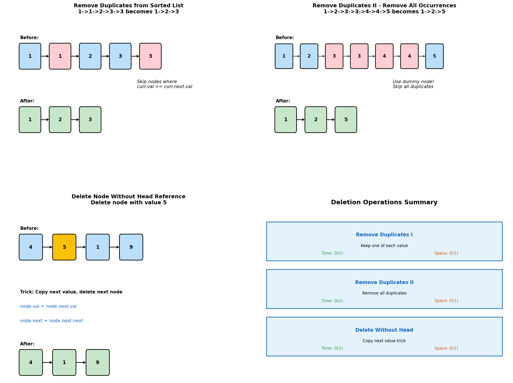
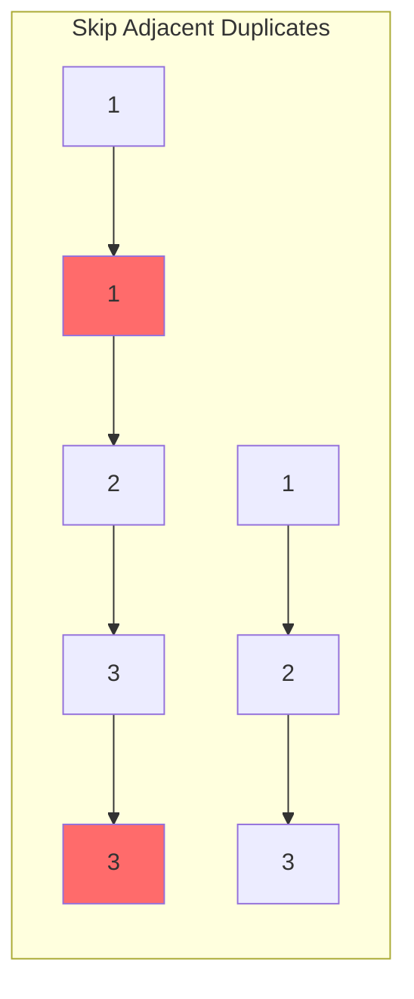
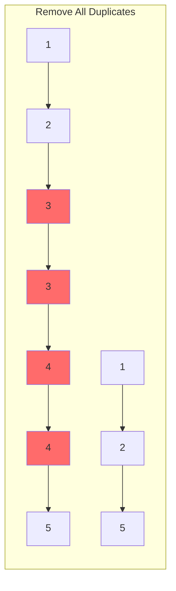
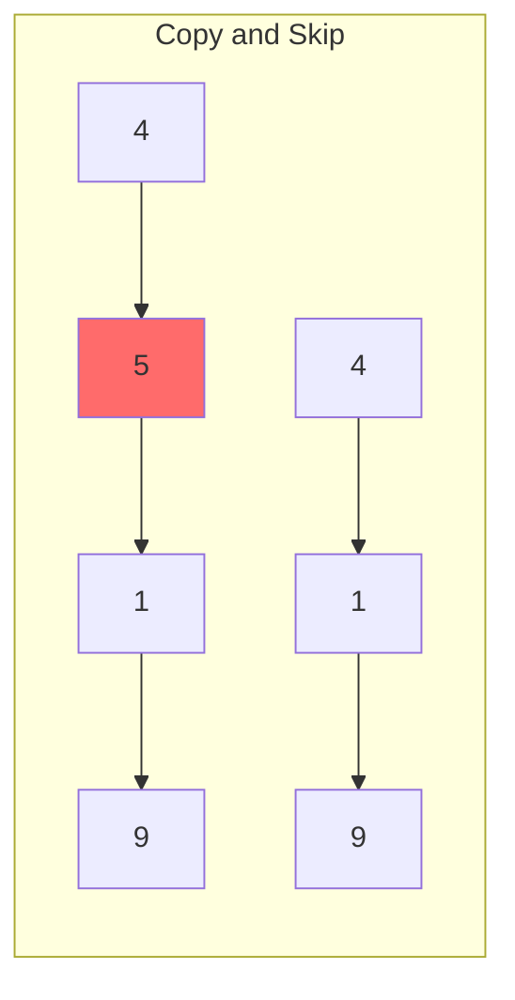
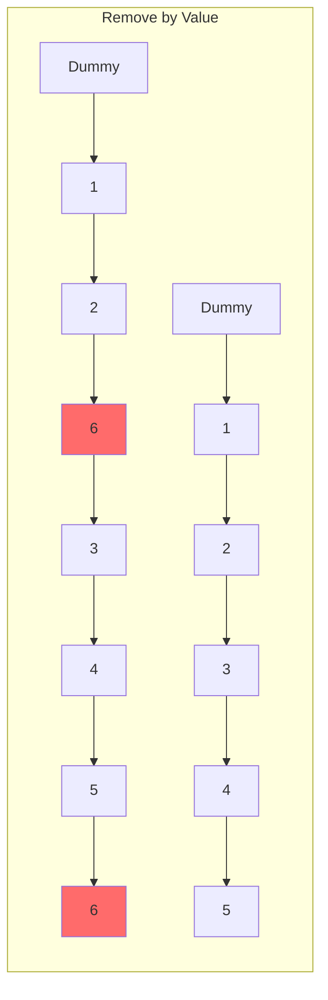
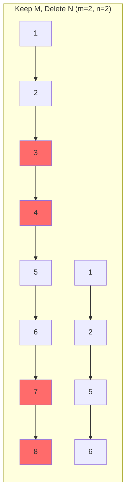

# Deletion Operations

> **Removing nodes and duplicates from linked lists**

---

## Overview

Deletion operations involve removing specific nodes from linked lists based on various criteria. These problems test your understanding of pointer manipulation and edge case handling, especially when the head node might be affected.



---

## Remove Duplicates from Sorted List (LeetCode #83)

### Problem Statement

Given the head of a sorted linked list, delete all duplicates such that each element appears only once. Return the linked list sorted as well.

### Solution

::: code-group

```python [Python]
def deleteDuplicates(head: ListNode) -> ListNode:
    """
    Keep one of each value, skip consecutive duplicates.
    Since list is sorted, duplicates are adjacent.
    """
    if not head:
        return head

    current = head

    while current and current.next:
        if current.val == current.next.val:
            # Skip the duplicate
            current.next = current.next.next
        else:
            # Move to next distinct value
            current = current.next

    return head
```

```java [Java]
public ListNode deleteDuplicates(ListNode head) {
    if (head == null) return head;

    ListNode current = head;
    while (current != null && current.next != null) {
        if (current.val == current.next.val) {
            current.next = current.next.next;
        } else {
            current = current.next;
        }
    }

    return head;
}
```

:::

::: info Complexity: Time O(n) · Space O(1)
- **Time:** O(n) because we traverse the list once, comparing each node with its next
- **Space:** O(1) because we only use a single pointer and modify the list in-place
:::

### Visual Example

```
Before: 1 -> 1 -> 2 -> 3 -> 3
After:  1 -> 2 -> 3

Process:
- At 1: 1 == 1, skip duplicate -> 1 -> 2 -> 3 -> 3
- At 1: 1 != 2, move forward
- At 2: 2 != 3, move forward
- At 3: 3 == 3, skip duplicate -> 1 -> 2 -> 3
- Done
```

### Complexity

| Metric | Value |
|--------|-------|
| Time | O(n) |
| Space | O(1) |

---

## Remove Duplicates from Sorted List II (LeetCode #82)

### Problem Statement

Given the head of a sorted linked list, delete all nodes that have duplicate numbers, leaving only distinct numbers from the original list.

### Solution

::: code-group

```python [Python]
def deleteDuplicates_II(head: ListNode) -> ListNode:
    """
    Remove ALL occurrences of duplicates.
    Use dummy node since head might be removed.
    """
    dummy = ListNode(0)
    dummy.next = head
    prev = dummy

    while head:
        # Check if current node starts a duplicate sequence
        if head.next and head.val == head.next.val:
            # Skip all nodes with this value
            while head.next and head.val == head.next.val:
                head = head.next
            # Skip the last duplicate too
            prev.next = head.next
        else:
            # No duplicate, move prev forward
            prev = prev.next

        head = head.next

    return dummy.next
```

```java [Java]
public ListNode deleteDuplicates(ListNode head) {
    ListNode dummy = new ListNode(0);
    dummy.next = head;
    ListNode prev = dummy;

    while (head != null) {
        if (head.next != null && head.val == head.next.val) {
            while (head.next != null && head.val == head.next.val) {
                head = head.next;
            }
            prev.next = head.next;
        } else {
            prev = prev.next;
        }
        head = head.next;
    }

    return dummy.next;
}
```

:::

::: info Complexity: Time O(n) · Space O(1)
- **Time:** O(n) because we traverse the list once, checking each node for duplicates
- **Space:** O(1) because we only use pointers (dummy, prev, head) regardless of list size
:::

### Visual Example

```
Before: 1 -> 2 -> 3 -> 3 -> 4 -> 4 -> 5
After:  1 -> 2 -> 5

Process:
- 1: unique, keep
- 2: unique, keep
- 3: duplicate (3->3), skip both
- 4: duplicate (4->4), skip both
- 5: unique, keep
```

### Complexity

| Metric | Value |
|--------|-------|
| Time | O(n) |
| Space | O(1) |

---

## Delete Node in a Linked List (LeetCode #237)

### Problem Statement

Given only a reference to a node to be deleted (not the head), delete that node from the linked list.

### Solution

::: code-group

```python [Python]
def deleteNode(node: ListNode) -> None:
    """
    Copy the next node's value to current node,
    then delete the next node.

    Trick: We can't access previous node,
    so we copy value and skip next instead.
    """
    node.val = node.next.val
    node.next = node.next.next
```

```java [Java]
public void deleteNode(ListNode node) {
    node.val = node.next.val;
    node.next = node.next.next;
}
```

:::

::: info Complexity: Time O(1) · Space O(1)
- **Time:** O(1) because we perform exactly two operations: copy value and update pointer
- **Space:** O(1) because we only modify existing nodes without allocating new memory
:::

### Why It Works

Without access to the previous node, we cannot update its `next` pointer. Instead:
1. Copy the next node's value to the current node
2. Skip the next node entirely

This effectively "moves" the next node's identity to the current position.

### Limitations

- Cannot delete the tail node (no next to copy from)
- Changes node values, which may not always be acceptable

### Complexity

| Metric | Value |
|--------|-------|
| Time | O(1) |
| Space | O(1) |

---

## Remove Linked List Elements (LeetCode #203)

### Problem Statement

Remove all nodes with a specific value from the linked list.

### Solution

::: code-group

```python [Python]
def removeElements(head: ListNode, val: int) -> ListNode:
    """
    Remove all nodes with the given value.
    Use dummy node to handle head removal.
    """
    dummy = ListNode(0)
    dummy.next = head
    current = dummy

    while current.next:
        if current.next.val == val:
            # Remove by skipping
            current.next = current.next.next
        else:
            current = current.next

    return dummy.next
```

```java [Java]
public ListNode removeElements(ListNode head, int val) {
    ListNode dummy = new ListNode(0);
    dummy.next = head;
    ListNode current = dummy;

    while (current.next != null) {
        if (current.next.val == val) {
            current.next = current.next.next;
        } else {
            current = current.next;
        }
    }

    return dummy.next;
}
```

:::

::: info Complexity: Time O(n) · Space O(1)
- **Time:** O(n) because we traverse the entire list once, checking each node's value
- **Space:** O(1) because we only use a dummy node and current pointer, modifying in-place
:::

### Recursive Solution

```python
def removeElements_recursive(head: ListNode, val: int) -> ListNode:
    """Recursive approach."""
    if not head:
        return None

    head.next = removeElements_recursive(head.next, val)

    return head.next if head.val == val else head
```

::: info Complexity: Time O(n) · Space O(n)
- **Time:** O(n) because each node is visited exactly once during the recursive traversal
- **Space:** O(n) because the recursion stack grows to the size of the list
:::

### Complexity

| Metric | Value |
|--------|-------|
| Time | O(n) |
| Space | O(1) iterative, O(n) recursive |

---

## Delete N Nodes After M Nodes (LeetCode #1474)

### Problem Statement

Given a linked list and two integers m and n, traverse the linked list and remove some nodes as follows:
- Keep the first m nodes starting with head
- Remove the next n nodes
- Repeat until end of list

### Solution

::: code-group

```python [Python]
def deleteNodes(head: ListNode, m: int, n: int) -> ListNode:
    """
    Alternate between keeping m nodes and deleting n nodes.
    """
    current = head

    while current:
        # Keep m nodes
        for _ in range(m - 1):
            if not current:
                return head
            current = current.next

        if not current:
            return head

        # Delete n nodes
        temp = current
        for _ in range(n):
            if temp.next:
                temp = temp.next
            else:
                break

        # Connect
        current.next = temp.next
        current = current.next

    return head
```

```java [Java]
public ListNode deleteNodes(ListNode head, int m, int n) {
    ListNode current = head;

    while (current != null) {
        for (int i = 0; i < m - 1; i++) {
            if (current == null) return head;
            current = current.next;
        }
        if (current == null) return head;

        ListNode temp = current;
        for (int i = 0; i < n; i++) {
            if (temp.next != null) temp = temp.next;
            else break;
        }

        current.next = temp.next;
        current = current.next;
    }

    return head;
}
```

:::

::: info Complexity: Time O(n) · Space O(1)
- **Time:** O(n) because we traverse the list once, keeping m nodes and skipping n nodes repeatedly
- **Space:** O(1) because we only use pointers and modify the list in-place
:::

---

## Remove Zero Sum Consecutive Nodes (LeetCode #1171)

### Problem Statement

Given the head of a linked list, repeatedly delete consecutive sequences of nodes that sum to 0 until there are no such sequences.

### Solution

::: code-group

```python [Python]
def removeZeroSumSublists(head: ListNode) -> ListNode:
    """
    Use prefix sum to identify zero-sum sequences.
    If same prefix sum appears twice, nodes between sum to 0.
    """
    dummy = ListNode(0)
    dummy.next = head

    # First pass: record last occurrence of each prefix sum
    prefix_sum = 0
    seen = {0: dummy}
    current = head

    while current:
        prefix_sum += current.val
        seen[prefix_sum] = current
        current = current.next

    # Second pass: skip to last occurrence of each prefix sum
    prefix_sum = 0
    current = dummy

    while current:
        prefix_sum += current.val
        current.next = seen[prefix_sum].next
        current = current.next

    return dummy.next
```

```java [Java]
public ListNode removeZeroSumSublists(ListNode head) {
    ListNode dummy = new ListNode(0);
    dummy.next = head;

    // First pass: record last occurrence of each prefix sum
    Map<Integer, ListNode> seen = new HashMap<>();
    int prefixSum = 0;
    seen.put(0, dummy);
    ListNode current = head;
    while (current != null) {
        prefixSum += current.val;
        seen.put(prefixSum, current);
        current = current.next;
    }

    // Second pass: skip to last occurrence of each prefix sum
    prefixSum = 0;
    current = dummy;
    while (current != null) {
        prefixSum += current.val;
        current.next = seen.get(prefixSum).next;
        current = current.next;
    }

    return dummy.next;
}
```

:::

::: info Complexity: Time O(n) · Space O(n)
- **Time:** O(n) because we traverse the list twice: once to build prefix sum map, once to skip nodes
- **Space:** O(n) for the hash map storing prefix sums and their corresponding nodes
:::

### Example

```
Input: 1 -> 2 -> -3 -> 3 -> 1

Prefix sums: 0, 1, 3, 0, 3, 4

Same prefix sum at positions 0 and 3 (value 0)
-> nodes between (1, 2, -3) sum to 0
-> remove them

Result: 3 -> 1
```

---

## Common Patterns

### Dummy Node Pattern

```python
def delete_pattern(head, condition):
    dummy = ListNode(0)
    dummy.next = head
    current = dummy

    while current.next:
        if condition(current.next):
            current.next = current.next.next  # Skip/delete
        else:
            current = current.next  # Move forward

    return dummy.next
```

### Two-Pointer for Duplicate Removal

```python
def remove_duplicates_pattern(head):
    dummy = ListNode(0)
    dummy.next = head
    prev = dummy

    while head:
        if is_duplicate(head):
            # Skip all duplicates
            while is_still_duplicate(head):
                head = head.next
            prev.next = head
        else:
            prev = prev.next
        head = head.next if head else None

    return dummy.next
```

---

## Edge Cases

1. **Empty list**: Return None/head as-is
2. **Single node**: Check if it meets deletion criteria
3. **All nodes deleted**: Return None
4. **Head deleted**: Use dummy node
5. **Tail deleted**: Handle null next pointer
6. **All duplicates**: Entire list removed

---

## Comparison Table

| Problem | Keeps at Least One? | Uses Dummy Node? | Key Insight |
|---------|---------------------|------------------|-------------|
| Remove Duplicates I | Yes (one of each) | No | Skip adjacent same values |
| Remove Duplicates II | No (remove all) | Yes | Skip entire duplicate sequences |
| Delete Node | N/A | No | Copy and skip trick |
| Remove Elements | N/A | Yes | Skip nodes with target value |

---

## Related Problems

::: details Remove Duplicates from Sorted List (LeetCode 83)
**Problem:** Delete all duplicates such that each element appears only once.

**Key Insight:** Since list is sorted, duplicates are adjacent. Skip consecutive same values.



**Approach:** Compare current with next, if equal skip next; otherwise advance current.

**Complexity:** O(n) time, O(1) space
:::

::: details Remove Duplicates from Sorted List II (LeetCode 82)
**Problem:** Delete ALL nodes that have duplicate numbers, leaving only distinct numbers.

**Key Insight:** Use dummy node since head may be deleted. Skip entire duplicate sequences.



**Approach:** When duplicate found, skip all nodes with that value. Use prev pointer to track last unique node.

**Complexity:** O(n) time, O(1) space
:::

::: details Delete Node in a Linked List (LeetCode 237)
**Problem:** Delete a node (not the tail) given only access to that node.

**Key Insight:** Cannot delete the node directly without prev pointer. Copy next node's value and skip next.



**Approach:** Copy value from next node to current, then skip next node.

**Complexity:** O(1) time, O(1) space
:::

::: details Remove Linked List Elements (LeetCode 203)
**Problem:** Remove all nodes with a specific value.

**Key Insight:** Use dummy node to handle head removal case uniformly.



**Approach:** Use dummy node, iterate and skip nodes matching target value.

**Complexity:** O(n) time, O(1) space
:::

::: details Delete N Nodes After M Nodes (LeetCode 1474)
**Problem:** Keep first m nodes, delete next n nodes, repeat until end of list.

**Key Insight:** Alternate between counting m nodes to keep and n nodes to delete.



**Approach:** Count m nodes keeping them, then skip n nodes, repeat until list ends.

**Complexity:** O(n) time, O(1) space
:::

---

## Interview Tips

1. **Always consider dummy node**: When head might be deleted
2. **Handle edge cases first**: Empty list, single node
3. **Don't lose the next pointer**: Save before modifying
4. **For sorted lists**: Duplicates are adjacent
5. **For copy trick**: Know its limitations (can't delete tail)

---

## Sources

- [Remove Duplicates from Sorted List - LeetCode](https://leetcode.com/problems/remove-duplicates-from-sorted-list/)
- [Remove Duplicates from Sorted List II - LeetCode](https://leetcode.com/problems/remove-duplicates-from-sorted-list-ii/)
- [Delete Node in a Linked List - LeetCode](https://leetcode.com/problems/delete-node-in-a-linked-list/)
- [Remove Linked List Elements - LeetCode](https://leetcode.com/problems/remove-linked-list-elements/)
