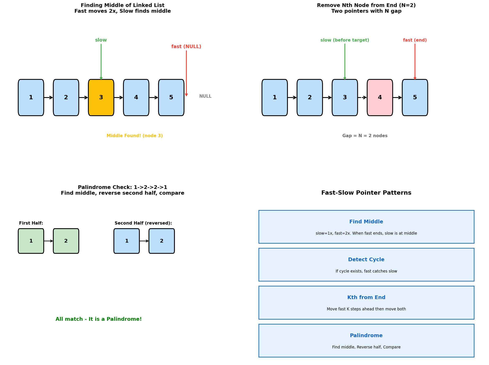
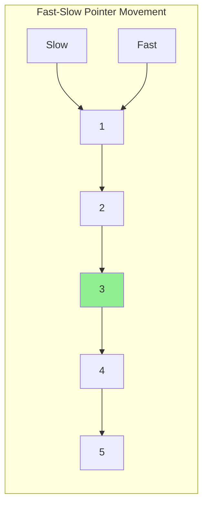
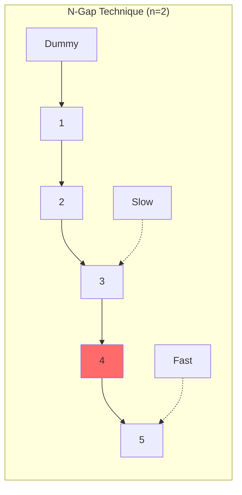
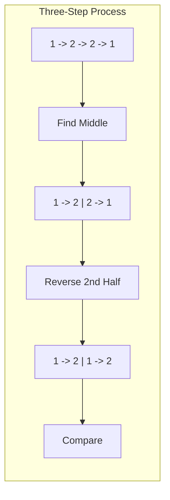
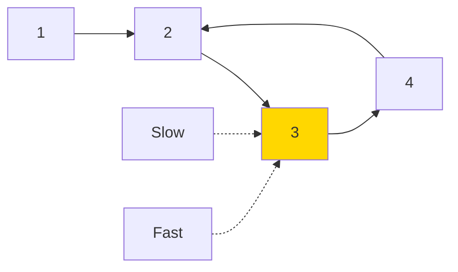
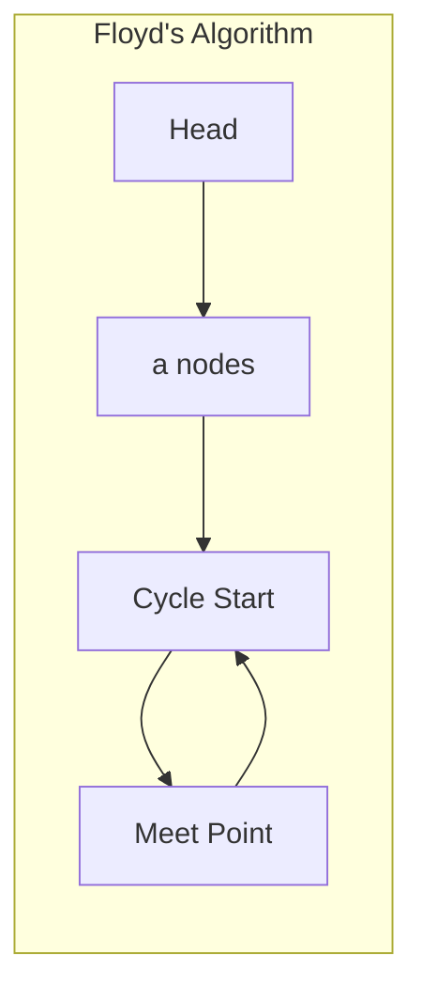
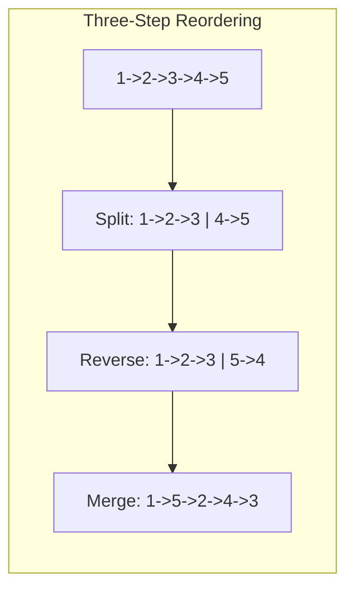

# Fast-Slow Pointers (Two Pointer Technique)

> **Finding middle elements, detecting patterns, and solving kth-from-end problems**

---

## Overview

The fast-slow pointer technique (also called the tortoise and hare algorithm) uses two pointers moving at different speeds to solve linked list problems efficiently. This pattern is fundamental for finding middle elements, detecting cycles, and locating positions relative to the end.



---

## Middle of the Linked List (LeetCode #876)

### Problem Statement

Given the head of a singly linked list, return the middle node of the linked list. If there are two middle nodes, return the second middle node.

### Solution

```python
def middleNode(head: ListNode) -> ListNode:
    """
    Find middle using fast-slow pointers.
    Fast moves 2 steps, slow moves 1 step.
    When fast reaches end, slow is at middle.
    """
    slow = fast = head

    while fast and fast.next:
        slow = slow.next
        fast = fast.next.next

    return slow
```

::: info Complexity: Time O(n) · Space O(1)
- **Time:** O(n) because fast pointer traverses at most n nodes (or n/2 for even-length lists)
- **Space:** O(1) because we only use two pointers regardless of list size
:::

### Why It Works

- Fast pointer moves twice as fast as slow pointer
- When fast reaches the end (or null), slow has traveled half the distance
- For even-length lists, returns the second middle node

### Complexity

| Metric | Value |
|--------|-------|
| Time | O(n) |
| Space | O(1) |

---

## Remove Nth Node From End of List (LeetCode #19)

### Problem Statement

Given the head of a linked list, remove the nth node from the end of the list and return its head.

### Solution

```python
def removeNthFromEnd(head: ListNode, n: int) -> ListNode:
    """
    Use two pointers with n-node gap.
    When fast reaches end, slow is at node before target.
    """
    dummy = ListNode(0)
    dummy.next = head
    slow = fast = dummy

    # Advance fast by n+1 steps (so slow stops one before target)
    for _ in range(n + 1):
        fast = fast.next

    # Move both until fast reaches end
    while fast:
        slow = slow.next
        fast = fast.next

    # Remove the nth node
    slow.next = slow.next.next

    return dummy.next
```

::: info Complexity: Time O(n) · Space O(1)
- **Time:** O(n) because we traverse the list exactly once with the two-pointer technique
- **Space:** O(1) because we only use a dummy node and two pointers, regardless of list size
:::

### Key Insight

By maintaining a gap of n nodes between fast and slow pointers:
- When fast reaches the end (null), slow is exactly n+1 positions from the end
- This positions slow right before the node we want to remove

### Edge Cases

```python
def removeNthFromEnd_robust(head: ListNode, n: int) -> ListNode:
    # Use dummy node to handle removing head
    dummy = ListNode(0)
    dummy.next = head

    # Calculate length
    length = 0
    curr = head
    while curr:
        length += 1
        curr = curr.next

    # Handle edge cases
    if n > length:
        return head  # Invalid n
    if n == length:
        return head.next  # Remove head

    # Find node before target
    curr = dummy
    for _ in range(length - n):
        curr = curr.next

    curr.next = curr.next.next
    return dummy.next
```

::: info Complexity: Time O(n) · Space O(1)
- **Time:** O(n) because we calculate length once and traverse once more to find the target position
- **Space:** O(1) because we only use pointers and counters, no additional data structures
:::

### Complexity

| Metric | Value |
|--------|-------|
| Time | O(n) - single pass |
| Space | O(1) |

---

## Palindrome Linked List (LeetCode #234)

### Problem Statement

Given the head of a singly linked list, return true if it is a palindrome or false otherwise.

### Solution

```python
def isPalindrome(head: ListNode) -> bool:
    """
    Three-step approach:
    1. Find middle using fast-slow pointers
    2. Reverse second half
    3. Compare first and second halves
    """
    if not head or not head.next:
        return True

    # Step 1: Find middle
    slow = fast = head
    while fast and fast.next:
        slow = slow.next
        fast = fast.next.next

    # Step 2: Reverse second half
    prev = None
    curr = slow
    while curr:
        next_temp = curr.next
        curr.next = prev
        prev = curr
        curr = next_temp

    # Step 3: Compare halves
    left, right = head, prev
    while right:  # Right half is shorter or equal
        if left.val != right.val:
            return False
        left = left.next
        right = right.next

    return True
```

::: info Complexity: Time O(n) · Space O(1)
- **Time:** O(n) because we traverse the list ~1.5 times: once to find middle/reverse, once to compare
- **Space:** O(1) because we reverse the second half in-place, using only pointer variables
:::

### Restoring the List (Optional)

```python
def isPalindrome_restore(head: ListNode) -> bool:
    """Version that restores the list to original state."""
    if not head or not head.next:
        return True

    # Find middle
    slow = fast = head
    while fast and fast.next:
        slow = slow.next
        fast = fast.next.next

    # Reverse second half
    second_half_start = reverse(slow)

    # Compare
    result = True
    first = head
    second = second_half_start
    while second:
        if first.val != second.val:
            result = False
            break
        first = first.next
        second = second.next

    # Restore the list
    reverse(second_half_start)

    return result

def reverse(head):
    prev = None
    curr = head
    while curr:
        next_temp = curr.next
        curr.next = prev
        prev = curr
        curr = next_temp
    return prev
```

::: info Complexity: Time O(n) · Space O(1)
- **Time:** O(n) because we traverse the list for comparison and reversal (including optional restoration)
- **Space:** O(1) because all operations are performed in-place with only pointer manipulation
:::

### Complexity

| Metric | Value |
|--------|-------|
| Time | O(n) |
| Space | O(1) |

---

## Linked List Cycle II (LeetCode #142)

### Problem Statement

Given the head of a linked list, return the node where the cycle begins. If there is no cycle, return null.

### Solution

```python
def detectCycle(head: ListNode) -> ListNode:
    """
    Floyd's Cycle Detection Algorithm:
    Phase 1: Detect if cycle exists using fast-slow pointers
    Phase 2: Find cycle start by moving one pointer to head
    """
    if not head or not head.next:
        return None

    slow = fast = head

    # Phase 1: Detect cycle
    while fast and fast.next:
        slow = slow.next
        fast = fast.next.next
        if slow == fast:
            break
    else:
        return None  # No cycle

    # Phase 2: Find cycle start
    slow = head
    while slow != fast:
        slow = slow.next
        fast = fast.next

    return slow  # Cycle start
```

::: info Complexity: Time O(n) · Space O(1)
- **Time:** O(n) because phase 1 (detection) takes O(n) and phase 2 (finding start) takes at most O(n)
- **Space:** O(1) because we only use two pointers throughout the algorithm
:::

### Mathematical Proof

Let:
- F = distance from head to cycle start
- C = cycle length
- a = distance from cycle start to meeting point

When slow and fast meet:
- Slow traveled: F + a
- Fast traveled: F + a + nC (n >= 1 complete cycles)

Since fast moves twice as fast:
```
2(F + a) = F + a + nC
F + a = nC
F = nC - a = (n-1)C + (C - a)
```

The distance from head to cycle start (F) equals the distance from meeting point to cycle start (C - a) plus complete cycles. Therefore, moving one pointer from head and another from meeting point at the same speed, they will meet at cycle start.

### Complexity

| Metric | Value |
|--------|-------|
| Time | O(n) |
| Space | O(1) |

---

## Pattern Summary

### When to Use Fast-Slow Pointers

| Problem Type | Fast Speed | Slow Speed | Result |
|--------------|------------|------------|--------|
| Find middle | 2 | 1 | Slow at middle |
| Detect cycle | 2 | 1 | Meet inside cycle |
| Kth from end | 1 (after k steps) | 1 | Gap determines position |
| Find cycle start | 1 | 1 (after meeting) | Meet at cycle start |

### Common Patterns

```python
# Pattern 1: Find Middle
slow = fast = head
while fast and fast.next:
    slow = slow.next
    fast = fast.next.next
# slow is now at middle

# Pattern 2: Detect Cycle
slow = fast = head
while fast and fast.next:
    slow = slow.next
    fast = fast.next.next
    if slow == fast:
        # Cycle detected
        break

# Pattern 3: Kth from End
slow = fast = head
for _ in range(k):
    fast = fast.next
while fast:
    slow = slow.next
    fast = fast.next
# slow is kth from end
```

---

## Related Problems

::: details Middle of the Linked List (LeetCode 876)
**Problem:** Given the head of a singly linked list, return the middle node. If there are two middle nodes, return the second one.

**Key Insight:** Use fast-slow pointers where fast moves 2x speed. When fast reaches end, slow is at middle.



**Approach:** Initialize both pointers at head. Move slow by 1 and fast by 2 until fast reaches null.

**Complexity:** O(n) time, O(1) space
:::

::: details Remove Nth Node From End (LeetCode 19)
**Problem:** Remove the nth node from the end of a linked list in one pass.

**Key Insight:** Maintain a gap of n nodes between two pointers. When fast reaches end, slow is at the node before the target.



**Approach:** Use dummy node, advance fast by n+1 steps, then move both until fast is null. Skip slow.next.

**Complexity:** O(n) time, O(1) space
:::

::: details Palindrome Linked List (LeetCode 234)
**Problem:** Determine if a singly linked list is a palindrome.

**Key Insight:** Combine three techniques: find middle, reverse second half, compare both halves.



**Approach:** Find middle with fast-slow, reverse second half in-place, compare node by node.

**Complexity:** O(n) time, O(1) space
:::

::: details Linked List Cycle (LeetCode 141)
**Problem:** Determine if a linked list has a cycle.

**Key Insight:** If a cycle exists, fast and slow pointers will eventually meet inside the cycle.



**Approach:** Move slow by 1, fast by 2. If they meet, cycle exists. If fast reaches null, no cycle.

**Complexity:** O(n) time, O(1) space
:::

::: details Linked List Cycle II (LeetCode 142)
**Problem:** Return the node where a cycle begins, or null if no cycle.

**Key Insight:** Floyd's algorithm - after detecting cycle, reset one pointer to head and move both at same speed until they meet at cycle start.



**Approach:** Phase 1: Detect cycle with fast-slow. Phase 2: Reset slow to head, move both by 1 until they meet.

**Complexity:** O(n) time, O(1) space
:::

::: details Reorder List (LeetCode 143)
**Problem:** Reorder list from L0->L1->...->Ln to L0->Ln->L1->Ln-1->L2->Ln-2->...

**Key Insight:** Combine fast-slow middle finding, list reversal, and alternating merge.



**Approach:** Find middle, reverse second half, interleave nodes from both halves.

**Complexity:** O(n) time, O(1) space
:::

---

## Interview Tips

1. **Clarify the middle definition**: For even-length lists, which middle node?
2. **Use dummy node**: When the head might be removed
3. **Check edge cases**: Empty list, single node, two nodes
4. **Draw the pointers**: Visualize the gap between fast and slow
5. **Remember the math**: For cycle detection, understand why phase 2 works

---

## Sources

- [Middle of the Linked List - LeetCode](https://leetcode.com/problems/middle-of-the-linked-list/)
- [Remove Nth Node From End - LeetCode](https://leetcode.com/problems/remove-nth-node-from-end-of-list/)
- [Palindrome Linked List - LeetCode](https://leetcode.com/problems/palindrome-linked-list/)
- [Linked List Cycle II - LeetCode](https://leetcode.com/problems/linked-list-cycle-ii/)
