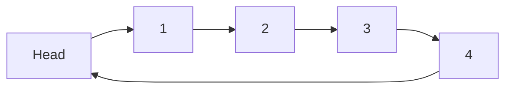
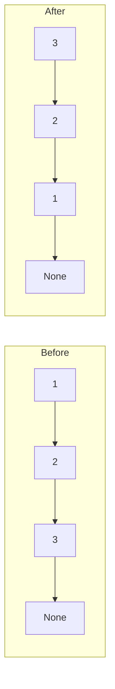
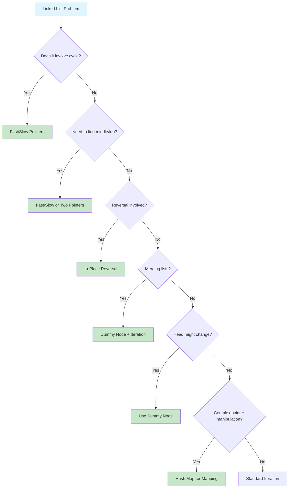
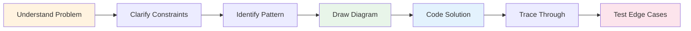

# Linked Lists

> **Sequential data with pointer-based connections**

---

## Overview

A **linked list** is a linear data structure consisting of nodes connected through pointers. Unlike arrays, linked list elements are not stored in contiguous memory locations; each node contains data and a reference (pointer) to the next node in the sequence.

### What is a Linked List?

A linked list is a chain of nodes where each node is a different element. Starting from the head node, you traverse the list by following pointers until reaching the end (null). This structure allows for efficient insertions and deletions at the cost of random access.

```
Head --> [10 | *] --> [20 | *] --> [30 | *] --> [40 | *] --> None
          Node 1       Node 2       Node 3       Node 4
```

**Key Characteristics:**
- **Non-contiguous memory**: Nodes scattered across memory, connected by pointers
- **Dynamic size**: Can grow and shrink at runtime without pre-allocation
- **Sequential access**: Must traverse from head to reach any node
- **Pointer overhead**: Each node requires extra memory for pointer(s)

### When to Use Linked Lists

| Use Case | Why Linked Lists Work Well |
|----------|---------------------------|
| **Frequent insertions/deletions** | O(1) if you have the node reference |
| **Unknown size requirements** | No need to pre-allocate memory |
| **Implementing stacks/queues** | Efficient push/pop from ends |
| **LRU Cache implementation** | Fast removal of arbitrary nodes |
| **Memory-constrained systems** | No wasted space from over-allocation |

### When to Consider Alternatives

| Limitation | Better Alternative |
|------------|-------------------|
| Need random access by index | Array |
| Frequent searches by value | Hash Table |
| Need bidirectional traversal | Doubly Linked List or Array |
| Cache-friendly operations | Array (better spatial locality) |
| Memory efficiency for small elements | Array (no pointer overhead) |

---

## Document Structure

| Problem | Difficulty | Technique | Link |
|---------|------------|-----------|------|
| Reverse Linked List | Easy | Iterative/Recursive | [Link](./reverse-cycle) |
| Linked List Cycle | Easy | Fast/Slow Pointers | [Link](./reverse-cycle) |
| Linked List Cycle II | Medium | Floyd's Algorithm | [Link](./reverse-cycle) |
| Middle of the Linked List | Easy | Fast/Slow Pointers | [Link](./fast-slow-pointers) |
| Remove Nth Node From End | Medium | Two Pointers | [Link](./fast-slow-pointers) |
| Palindrome Linked List | Easy | Fast/Slow + Reversal | [Link](./fast-slow-pointers) |
| Merge Two Sorted Lists | Easy | Dummy Node | [Link](./merge-operations) |
| Merge K Sorted Lists | Hard | Heap/Divide-Conquer | [Link](./merge-operations) |
| Add Two Numbers | Medium | Dummy Node + Carry | [Link](./arithmetic-operations) |
| Remove Duplicates from Sorted List | Easy | Iterative | [Link](./deletion-operations) |
| Remove Duplicates II | Medium | Dummy Node | [Link](./deletion-operations) |
| Intersection of Two Linked Lists | Easy | Two Pointers | [Link](./intersection-operations) |
| Copy List with Random Pointer | Medium | Hash Map/Interleaving | [Link](./advanced-operations) |
| Flatten a Multilevel Doubly Linked List | Medium | DFS/Recursion | [Link](./advanced-operations) |
| LRU Cache | Medium | Hash Map + Doubly Linked List | [Link](./lru-cache) |
| Rotate List | Medium | Two Pointers + Length | [Link](./rotation-operations) |
| Reorder List | Medium | Fast/Slow + Reverse + Merge | [Link](./reorder-operations) |
| Sort List | Medium | Merge Sort | [Link](./sort-operations) |
| Swap Nodes in Pairs | Medium | Recursion/Iteration | [Link](./swap-operations) |
| Reverse Nodes in K-Group | Hard | Iterative Reversal | [Link](./reverse-k-group) |

---

## Linked List Types

### Singly Linked List

Each node contains data and a pointer to the next node. Traversal is unidirectional.

```python
class ListNode:
    def __init__(self, val=0, next=None):
        self.val = val
        self.next = next
```


### Doubly Linked List

Each node contains data and pointers to both the next and previous nodes. Enables bidirectional traversal.

```python
class DLLNode:
    def __init__(self, val=0, prev=None, next=None):
        self.val = val
        self.prev = prev
        self.next = next
```


### Circular Linked List

The tail node points back to the head, forming a loop. Can be singly or doubly linked.

```python
class CircularNode:
    def __init__(self, val=0, next=None):
        self.val = val
        self.next = next  # Points to head for last node
```



### XOR Linked List (Memory Efficient)

An advanced variant that stores XOR of previous and next addresses, reducing pointer overhead by 50%.

```python
# Conceptual - uses bitwise XOR of addresses
# Each node stores: prev_address XOR next_address
# Traversal requires tracking both current and previous node
```

---

## Arrays vs Linked Lists

| Operation | Array | Linked List | Notes |
|-----------|-------|-------------|-------|
| Access by index | O(1) | O(n) | Arrays: direct calculation; Lists: must traverse |
| Search | O(n) / O(log n) sorted | O(n) | Binary search only works on arrays |
| Insert at beginning | O(n) | O(1) | Arrays: shift all elements |
| Insert at end | O(1) amortized | O(n) or O(1) with tail | Lists need tail pointer for O(1) |
| Insert at middle | O(n) | O(1) if node known | Finding the node is O(n) |
| Delete at beginning | O(n) | O(1) | Arrays: shift all elements |
| Delete at end | O(1) | O(n) or O(1) with tail | Singly linked needs prev node |
| Delete at middle | O(n) | O(1) if node known | Finding the node is O(n) |
| Memory layout | Contiguous | Scattered | Arrays: better cache performance |
| Memory overhead | None | Per-node pointer(s) | 4-8 bytes per pointer |
| Size flexibility | Fixed/resize needed | Dynamic | Lists grow naturally |

### When Arrays Beat Linked Lists

```python
# Arrays: O(1) random access
arr = [10, 20, 30, 40, 50]
print(arr[3])  # Instant access to index 3

# Linked Lists: O(n) to reach index
def get_at_index(head, index):
    current = head
    for _ in range(index):
        current = current.next
    return current.val  # Must traverse
```

### When Linked Lists Beat Arrays

```python
# Linked Lists: O(1) insertion if you have the node
def insert_after(node, val):
    new_node = ListNode(val)
    new_node.next = node.next
    node.next = new_node  # Just update pointers

# Arrays: O(n) insertion (shift elements)
arr = [10, 20, 40, 50]
arr.insert(2, 30)  # Must shift 40, 50
```

---

## Essential Techniques

### 1. Dummy Head Node

A sentinel/dummy node simplifies edge cases, especially when the head might change.

```python
def remove_elements(head: ListNode, val: int) -> ListNode:
    """Remove all nodes with given value."""
    dummy = ListNode(0)
    dummy.next = head

    current = dummy
    while current.next:
        if current.next.val == val:
            current.next = current.next.next
        else:
            current = current.next

    return dummy.next  # Original head might have been removed
```

**When to Use:**
- Operations might modify the head
- Merging multiple lists
- Removing nodes (head could be removed)
- Simplifying null checks

### 2. Fast/Slow Pointers (Floyd's Algorithm)

Two pointers moving at different speeds to detect cycles and find middle elements.

```python
def find_middle(head: ListNode) -> ListNode:
    """Find the middle node of linked list."""
    slow = fast = head
    while fast and fast.next:
        slow = slow.next
        fast = fast.next.next
    return slow  # Middle node

def has_cycle(head: ListNode) -> bool:
    """Detect if linked list has a cycle."""
    slow = fast = head
    while fast and fast.next:
        slow = slow.next
        fast = fast.next.next
        if slow == fast:
            return True  # Cycle detected
    return False

def find_cycle_start(head: ListNode) -> ListNode:
    """Find the node where cycle begins."""
    slow = fast = head

    # Find meeting point
    while fast and fast.next:
        slow = slow.next
        fast = fast.next.next
        if slow == fast:
            break
    else:
        return None  # No cycle

    # Find cycle start
    slow = head
    while slow != fast:
        slow = slow.next
        fast = fast.next

    return slow  # Cycle start node
```

**Applications:**
- Detect cycle in linked list
- Find cycle start node
- Find middle element
- Find kth node from end
- Check if palindrome

### 3. In-Place Reversal

Reverse a linked list by changing pointer directions without extra space.

```python
def reverse_list(head: ListNode) -> ListNode:
    """Iterative reversal - O(n) time, O(1) space."""
    prev, curr = None, head
    while curr:
        next_temp = curr.next  # Store next
        curr.next = prev       # Reverse pointer
        prev = curr            # Move prev forward
        curr = next_temp       # Move curr forward
    return prev  # New head

def reverse_recursive(head: ListNode) -> ListNode:
    """Recursive reversal - O(n) time, O(n) space."""
    if not head or not head.next:
        return head

    new_head = reverse_recursive(head.next)
    head.next.next = head
    head.next = None

    return new_head
```



### 4. Two Pointers for Kth from End

Use two pointers with k-node gap to find kth node from end in one pass.

```python
def remove_nth_from_end(head: ListNode, n: int) -> ListNode:
    """Remove nth node from end of list."""
    dummy = ListNode(0)
    dummy.next = head

    fast = slow = dummy

    # Advance fast by n+1 steps
    for _ in range(n + 1):
        fast = fast.next

    # Move both until fast reaches end
    while fast:
        slow = slow.next
        fast = fast.next

    # Remove the nth node
    slow.next = slow.next.next

    return dummy.next
```

### 5. Merge Two Lists

Combine two sorted lists using a dummy node.

```python
def merge_two_lists(l1: ListNode, l2: ListNode) -> ListNode:
    """Merge two sorted linked lists."""
    dummy = ListNode(0)
    current = dummy

    while l1 and l2:
        if l1.val <= l2.val:
            current.next = l1
            l1 = l1.next
        else:
            current.next = l2
            l2 = l2.next
        current = current.next

    # Attach remaining nodes
    current.next = l1 or l2

    return dummy.next
```

### 6. Hash Map for Complex Problems

Use hash map when you need to detect duplicates or access arbitrary nodes.

```python
def copy_random_list(head: 'Node') -> 'Node':
    """Copy list with random pointers using hash map."""
    if not head:
        return None

    old_to_new = {}

    # First pass: create all nodes
    current = head
    while current:
        old_to_new[current] = Node(current.val)
        current = current.next

    # Second pass: set pointers
    current = head
    while current:
        old_to_new[current].next = old_to_new.get(current.next)
        old_to_new[current].random = old_to_new.get(current.random)
        current = current.next

    return old_to_new[head]
```

---

## Common Patterns Flowchart



---

## Linked List Operations Complexity

| Operation | Singly Linked | Doubly Linked | Notes |
|-----------|---------------|---------------|-------|
| Access by index | O(n) | O(n) | Must traverse from head |
| Search | O(n) | O(n) | Linear scan required |
| Insert at head | O(1) | O(1) | Just update head pointer |
| Insert at tail | O(n) or O(1)* | O(1)* | *O(1) with tail pointer |
| Insert after node | O(1) | O(1) | Given node reference |
| Delete head | O(1) | O(1) | Update head pointer |
| Delete tail | O(n) | O(1) | Singly needs to find prev |
| Delete given node | O(1)** | O(1) | **Copy next value trick |
| Find middle | O(n) | O(n) | Fast/slow pointers |
| Reverse | O(n) | O(n) | In-place pointer swap |
| Detect cycle | O(n) | O(n) | Floyd's algorithm |

---

## Python Implementation Tips

### Basic List Operations

```python
# Creating a linked list from array
def create_list(arr):
    if not arr:
        return None
    head = ListNode(arr[0])
    current = head
    for val in arr[1:]:
        current.next = ListNode(val)
        current = current.next
    return head

# Converting linked list to array (for debugging)
def list_to_array(head):
    result = []
    while head:
        result.append(head.val)
        head = head.next
    return result

# Finding list length
def get_length(head):
    length = 0
    while head:
        length += 1
        head = head.next
    return length
```

### Common Interview Idioms

```python
# Dummy Node Pattern
def any_operation(head):
    dummy = ListNode(0)
    dummy.next = head
    # ... operations ...
    return dummy.next

# Two Pointer Template (kth from end)
def kth_from_end(head, k):
    slow = fast = head
    for _ in range(k):
        fast = fast.next
    while fast:
        slow = slow.next
        fast = fast.next
    return slow

# Reverse a Portion of List
def reverse_between(head, left, right):
    dummy = ListNode(0)
    dummy.next = head
    prev = dummy

    # Get to position before left
    for _ in range(left - 1):
        prev = prev.next

    # Reverse from left to right
    current = prev.next
    for _ in range(right - left):
        next_node = current.next
        current.next = next_node.next
        next_node.next = prev.next
        prev.next = next_node

    return dummy.next
```

---

## Google Interview Focus Areas

Based on recent Google SDE interview patterns, these linked list topics are frequently tested:

### High Priority Topics

1. **Cycle Detection** - Floyd's algorithm for detecting and finding cycle start
2. **Reversal Variants** - Reverse entire list, reverse in groups, reverse between positions
3. **Two Pointer Problems** - Find middle, kth from end, intersection point
4. **Merging Operations** - Merge sorted lists, merge K lists with heap
5. **LRU Cache** - Combine hash map with doubly linked list

### Common Google Linked List Questions

| Question Type | Example Problem | Key Insight |
|--------------|-----------------|-------------|
| Cycle Detection | "Detect if list has cycle and find start" | Floyd's tortoise and hare |
| Reversal | "Reverse nodes in k-group" | Iterative with count |
| Two Pointers | "Find intersection of two lists" | Align lengths first |
| Merge | "Merge K sorted lists" | Use min-heap for efficiency |
| Design | "Implement LRU Cache" | Hash map + doubly linked list |
| Palindrome | "Check if list is palindrome" | Find middle, reverse second half |

### What Interviewers Look For

1. **Clarifying Questions**
   - Can the list have cycles?
   - Is the list singly or doubly linked?
   - Do I have access to the tail pointer?
   - Should I modify in-place or create new nodes?

2. **Edge Cases to Consider**
   - Empty list (null head)
   - Single node list
   - Two node list
   - List with all same values
   - List with cycle

3. **Code Quality**
   - Clean pointer manipulation
   - No memory leaks (in languages with manual memory management)
   - Handle null pointers gracefully

4. **Testing**
   - Walk through with simple examples
   - Test edge cases
   - Verify pointer assignments

### Interview Strategy for Linked List Problems



---

## Practice Progression

### Week 1: Fundamentals

| Day | Focus | Problems |
|-----|-------|----------|
| 1 | Basic Operations | Reverse List, Middle of List, Delete Node |
| 2 | Two Pointers | Nth from End, Linked List Cycle, Palindrome |
| 3 | Merge Operations | Merge Two Lists, Merge K Lists |

### Week 2: Intermediate

| Day | Focus | Problems |
|-----|-------|----------|
| 4 | Reversal Variants | Reverse Between, Swap Pairs, Rotate List |
| 5 | Advanced Two Pointers | Intersection, Cycle II, Reorder List |
| 6 | Arithmetic | Add Two Numbers, Add Two Numbers II |

### Week 3: Advanced

| Day | Focus | Problems |
|-----|-------|----------|
| 7 | Complex Operations | Copy Random List, Flatten Multilevel |
| 8 | Design Problems | LRU Cache, Design Linked List |
| 9 | Mixed Practice | Random selection from all patterns |

---

## Quick Reference Card

### Time Complexity Cheat Sheet

```
Access:     O(n)     - Must traverse from head
Search:     O(n)     - Linear scan
Insert:     O(1)     - If you have node reference
Delete:     O(1)     - If you have node reference
Reverse:    O(n)     - Visit each node once
Find cycle: O(n)     - Floyd's algorithm
```

### Pattern Recognition Triggers

| If you see... | Think about... |
|--------------|----------------|
| "Cycle in list" | Fast/Slow Pointers (Floyd's) |
| "Middle element" | Fast/Slow Pointers |
| "Kth from end" | Two Pointers with gap |
| "Reverse" | Three pointer technique |
| "Merge sorted" | Dummy node + comparison |
| "Head might change" | Dummy node |
| "Random pointer" | Hash map for mapping |
| "LRU/LFU Cache" | Hash map + Doubly linked list |
| "Palindrome" | Fast/slow + reverse half |

### Common Mistakes to Avoid

1. **Losing reference to head** - Always save or use dummy node
2. **Not handling null** - Check before dereferencing `.next`
3. **Infinite loops** - Ensure loop termination condition is correct
4. **Memory leaks** - In C/C++, remember to free nodes
5. **Off-by-one errors** - Carefully track positions (0 vs 1-indexed)

---

## Resources

### Recommended Practice

- [LeetCode Linked List Problems](https://leetcode.com/tag/linked-list/)
- [Tech Interview Handbook - Linked List](https://www.techinterviewhandbook.org/algorithms/linked-list/)
- [GeeksforGeeks - Top 50 Linked List Problems](https://www.geeksforgeeks.org/top-50-linked-list-interview-question/)
- [TakeUForward - Linked List Series](https://takeuforward.org/linked-list/top-linkedlist-interview-questions-structured-path-with-video-solutions)

### Further Reading

- [InterviewBit - Linked List Questions](https://www.interviewbit.com/linked-list-interview-questions/)
- [Google Tech Dev Guide - Linked Lists](https://techdevguide.withgoogle.com/resources/topics/linked-lists/)
- [Educative - Linked List Patterns](https://www.educative.io/blog/linked-list-interview-questions)

---

*Last updated: January 2026*

*Linked lists test your ability to manipulate pointers carefully while handling edge cases. Master the core patterns here, and you will find that even complex linked list problems become manageable.*
