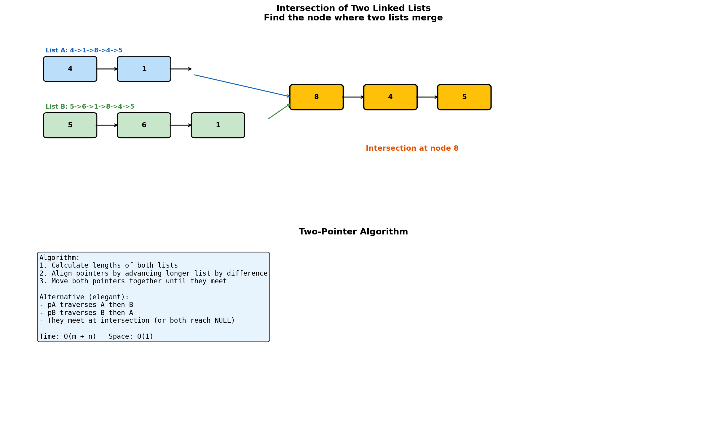
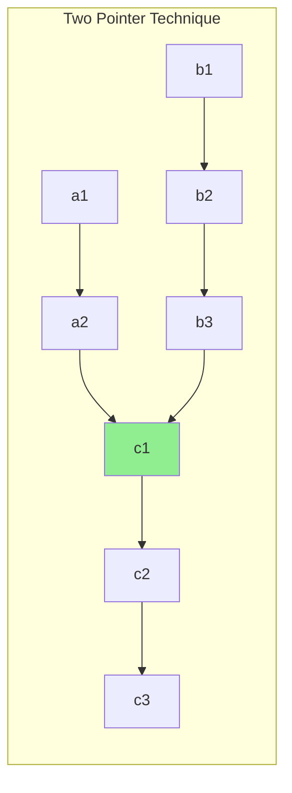
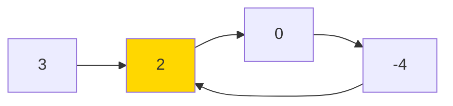
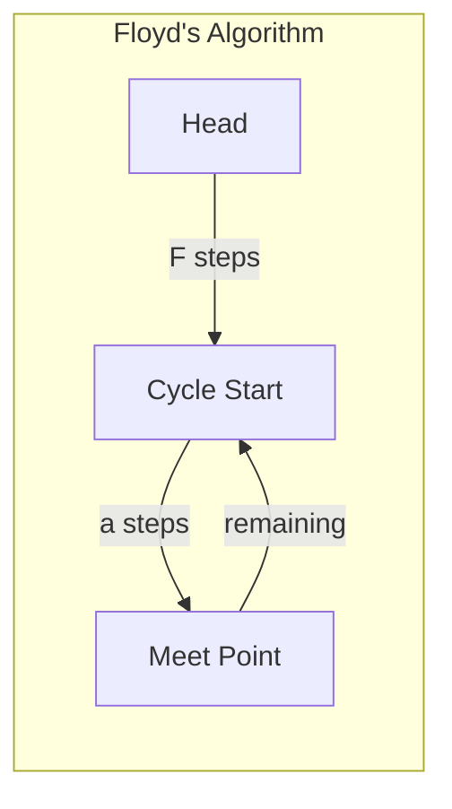
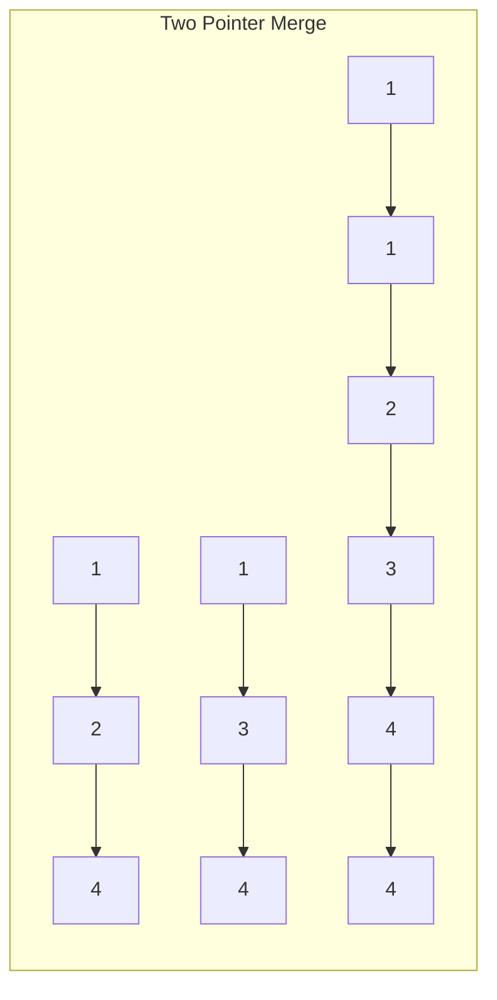

# Intersection Operations

> **Finding common nodes between linked lists**

---

## Overview

Intersection problems involve finding nodes where two or more linked lists converge. The key insight is that once two lists intersect, they share all subsequent nodes (since each node has only one `next` pointer).



---

## Intersection of Two Linked Lists (LeetCode #160)

### Problem Statement

Given the heads of two singly linked lists, return the node at which the two lists intersect. If the two linked lists have no intersection, return null.

### Approach 1: Two Pointers (Elegant)

```python
def getIntersectionNode(headA: ListNode, headB: ListNode) -> ListNode:
    """
    Elegant two-pointer approach.
    pA traverses A then B, pB traverses B then A.
    They meet at intersection or both reach null.

    Why it works:
    - If lists intersect: pA travels (a + c + b), pB travels (b + c + a)
    - If no intersection: both travel (a + b) and meet at null
    """
    if not headA or not headB:
        return None

    pA, pB = headA, headB

    while pA != pB:
        # Move to other list when reaching end
        pA = pA.next if pA else headB
        pB = pB.next if pB else headA

    return pA  # Either intersection node or null
```

::: info Complexity: Time O(m + n) · Space O(1)
- **Time:** O(m + n) because each pointer traverses at most m + n nodes before meeting or both reaching null
- **Space:** O(1) because we only use two pointers regardless of list sizes
:::

### Mathematical Explanation

Let:
- `a` = length of list A before intersection
- `b` = length of list B before intersection
- `c` = length of common part (after intersection)

Pointer A travels: `a + c + b`
Pointer B travels: `b + c + a`

Both travel the same total distance! They will meet at the intersection point (or both at null if no intersection).

### Approach 2: Calculate Lengths

```python
def getIntersectionNode_lengths(headA: ListNode, headB: ListNode) -> ListNode:
    """
    1. Calculate lengths of both lists
    2. Align by advancing longer list
    3. Move together until intersection found
    """
    def get_length(head):
        length = 0
        while head:
            length += 1
            head = head.next
        return length

    lenA = get_length(headA)
    lenB = get_length(headB)

    # Align starting positions
    while lenA > lenB:
        headA = headA.next
        lenA -= 1
    while lenB > lenA:
        headB = headB.next
        lenB -= 1

    # Move together until intersection
    while headA != headB:
        headA = headA.next
        headB = headB.next

    return headA
```

::: info Complexity: Time O(m + n) · Space O(1)
- **Time:** O(m + n) because we calculate both lengths (O(m + n)) then traverse aligned lists
- **Space:** O(1) because we only use pointers and counters, no additional data structures
:::

### Approach 3: Hash Set

```python
def getIntersectionNode_hashset(headA: ListNode, headB: ListNode) -> ListNode:
    """
    Store all nodes from list A in a set.
    Find first node from B that exists in set.
    Time: O(m + n), Space: O(m)
    """
    visited = set()

    # Store all nodes from A
    current = headA
    while current:
        visited.add(current)
        current = current.next

    # Find intersection
    current = headB
    while current:
        if current in visited:
            return current
        current = current.next

    return None
```

::: info Complexity: Time O(m + n) · Space O(m)
- **Time:** O(m + n) because we traverse list A (O(m)) to build the set, then traverse list B (O(n)) to find intersection
- **Space:** O(m) because we store all nodes from list A in the hash set
:::

### Complexity Comparison

| Approach | Time | Space |
|----------|------|-------|
| Two Pointers | O(m + n) | O(1) |
| Calculate Lengths | O(m + n) | O(1) |
| Hash Set | O(m + n) | O(m) or O(n) |

---

## Finding Intersection Point with Different Structures

### Intersection with Cycle

If one or both lists have cycles, the problem becomes more complex.

```python
def getIntersectionNode_with_cycle(headA: ListNode, headB: ListNode) -> ListNode:
    """
    Handle lists that might have cycles.
    """
    def detect_cycle(head):
        """Returns cycle start node or None."""
        if not head:
            return None

        slow = fast = head
        while fast and fast.next:
            slow = slow.next
            fast = fast.next.next
            if slow == fast:
                # Find cycle start
                slow = head
                while slow != fast:
                    slow = slow.next
                    fast = fast.next
                return slow
        return None

    cycleA = detect_cycle(headA)
    cycleB = detect_cycle(headB)

    # Case 1: Neither has cycle
    if not cycleA and not cycleB:
        return getIntersectionNode(headA, headB)

    # Case 2: One has cycle, other doesn't - no intersection
    if (cycleA is None) != (cycleB is None):
        return None

    # Case 3: Both have cycles
    # Check if cycles are the same
    if cycleA == cycleB:
        # Intersection before or at cycle start
        # Temporarily break cycle and find intersection
        temp = cycleA.next
        cycleA.next = None  # Break cycle
        result = getIntersectionNode(headA, headB)
        cycleA.next = temp  # Restore cycle
        return result if result else cycleA
    else:
        # Check if they share the same cycle
        current = cycleA.next
        while current != cycleA:
            if current == cycleB:
                return cycleA  # or cycleB, both valid
            current = current.next
        return None  # Different cycles, no intersection
```

::: info Complexity: Time O(m + n) · Space O(1)
- **Time:** O(m + n) because we detect cycles in both lists and potentially traverse them to find intersection
- **Space:** O(1) because Floyd's algorithm and intersection detection only use constant pointers
:::

---

## Check if Two Lists Intersect (Boolean)

### Problem Variant

Simply determine if two lists intersect (without returning the node).

```python
def doIntersect(headA: ListNode, headB: ListNode) -> bool:
    """
    Check if lists have same tail node.
    If they intersect, they share the same tail.
    """
    if not headA or not headB:
        return False

    # Find tail of A
    tailA = headA
    while tailA.next:
        tailA = tailA.next

    # Find tail of B
    tailB = headB
    while tailB.next:
        tailB = tailB.next

    return tailA == tailB
```

::: info Complexity: Time O(m + n) · Space O(1)
- **Time:** O(m + n) because we traverse both lists once to find their tail nodes
- **Space:** O(1) because we only use two tail pointers regardless of list sizes
:::

---

## Intersection Point of Three Lists

### Problem Statement

Find the common node where three lists meet.

```python
def getIntersectionNode_three(headA: ListNode, headB: ListNode, headC: ListNode) -> ListNode:
    """
    Find intersection of all three lists.
    First find intersection of A and B, then check with C.
    """
    # Get intersection of A and B
    intersect_AB = getIntersectionNode(headA, headB)

    if not intersect_AB:
        return None

    # Check if this point is also on C
    current = headC
    while current:
        if current == intersect_AB:
            return current
        current = current.next

    return None
```

::: info Complexity: Time O(m + n + p) · Space O(1)
- **Time:** O(m + n + p) because we find intersection of A and B (O(m + n)), then traverse C (O(p))
- **Space:** O(1) because we reuse the two-pointer intersection algorithm
:::

---

## Split Linked List at Intersection

### Problem Statement

Given two intersecting lists, split them back into separate lists.

```python
def splitAtIntersection(headA: ListNode, headB: ListNode) -> tuple:
    """
    Find intersection and set shorter list's last node to null.
    Returns modified lists and intersection point.
    """
    def get_length(head):
        length = 0
        last = None
        while head:
            length += 1
            last = head
            head = head.next
        return length, last

    lenA, lastA = get_length(headA)
    lenB, lastB = get_length(headB)

    # Find intersection
    intersection = getIntersectionNode(headA, headB)
    if not intersection:
        return headA, headB, None

    # Find node before intersection in each list
    def find_before_intersection(head, intersection):
        if head == intersection:
            return None  # Intersection is at head
        current = head
        while current and current.next != intersection:
            current = current.next
        return current

    beforeA = find_before_intersection(headA, intersection)
    beforeB = find_before_intersection(headB, intersection)

    # Split (disconnect shorter path)
    if beforeB:
        beforeB.next = None

    return headA, headB, intersection
```

::: info Complexity: Time O(m + n) · Space O(1)
- **Time:** O(m + n) because we find lengths, intersection, and node before intersection in linear time
- **Space:** O(1) because we only use pointers to track positions in the lists
:::

---

## Common Patterns

### Two-Pointer Intersection Pattern

```python
def intersection_pattern(headA, headB):
    pA, pB = headA, headB

    while pA != pB:
        pA = pA.next if pA else headB
        pB = pB.next if pB else headA

    return pA
```

### Length Alignment Pattern

```python
def align_lengths(headA, headB, lenA, lenB):
    while lenA > lenB:
        headA = headA.next
        lenA -= 1
    while lenB > lenA:
        headB = headB.next
        lenB -= 1
    return headA, headB
```

---

## Edge Cases

1. **No intersection**: Both pointers reach null
2. **Intersection at head**: One list is suffix of another
3. **Same list**: Head is the intersection
4. **Empty list**: Return null immediately
5. **Single node intersection**: Only tail is shared

---

## Related Problems

::: details Intersection of Two Linked Lists (LeetCode 160)
**Problem:** Find the node where two singly linked lists intersect. Return null if no intersection.

**Key Insight:** If pointerA traverses A then B, and pointerB traverses B then A, they travel equal distance and meet at intersection.



**Approach:** Two pointers start at heads. When one reaches null, redirect to other list's head. They meet at intersection or both at null.

**Complexity:** O(m+n) time, O(1) space
:::

::: details Linked List Cycle (LeetCode 141)
**Problem:** Determine if a linked list has a cycle.

**Key Insight:** Fast pointer (2 steps) and slow pointer (1 step) will meet if cycle exists.



**Approach:** Move slow by 1, fast by 2. If they meet, cycle exists. If fast reaches null, no cycle.

**Complexity:** O(n) time, O(1) space
:::

::: details Linked List Cycle II (LeetCode 142)
**Problem:** Return the node where the cycle begins, or null if no cycle exists.

**Key Insight:** After fast-slow meet, reset one pointer to head. Moving both by 1 step, they meet at cycle start.



**Approach:** Phase 1: Detect meeting point. Phase 2: One pointer from head, one from meeting point, move by 1 until they meet.

**Complexity:** O(n) time, O(1) space
:::

::: details Merge Two Sorted Lists (LeetCode 21)
**Problem:** Merge two sorted linked lists into one sorted list.

**Key Insight:** Use two pointers to compare heads, always attach smaller node to result.



**Approach:** Dummy node for result, compare heads, attach smaller and advance that pointer.

**Complexity:** O(m+n) time, O(1) space
:::

---

## Interview Tips

1. **Clarify intersection definition**: Same node (by reference), not just same value
2. **Consider the elegant solution**: Two-pointer approach is interview-friendly
3. **Explain the math**: Why switching lists works
4. **Handle edge cases**: Empty lists, no intersection
5. **Know space tradeoffs**: O(1) vs O(n) approaches

---

## Sources

- [Intersection of Two Linked Lists - LeetCode](https://leetcode.com/problems/intersection-of-two-linked-lists/)
- [Tech Interview Handbook - Linked Lists](https://www.techinterviewhandbook.org/algorithms/linked-list/)
