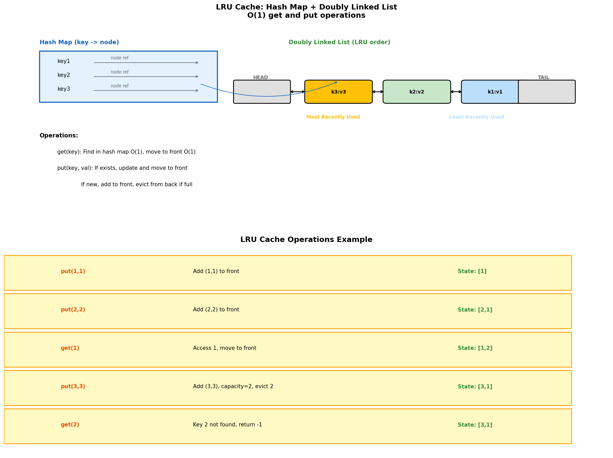
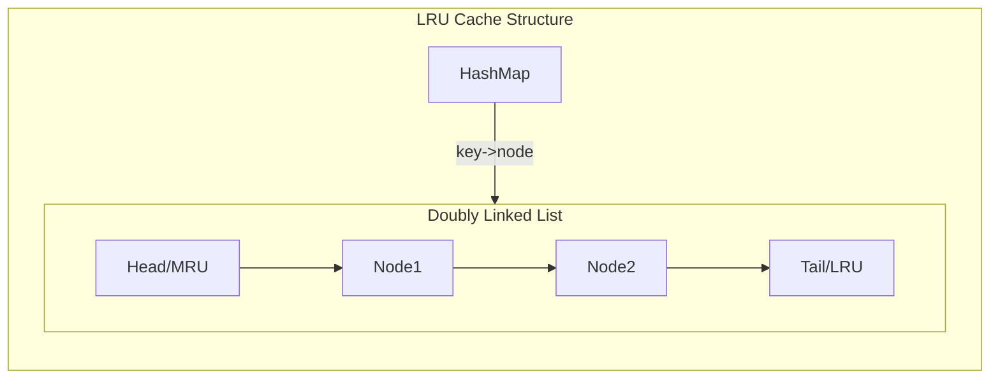
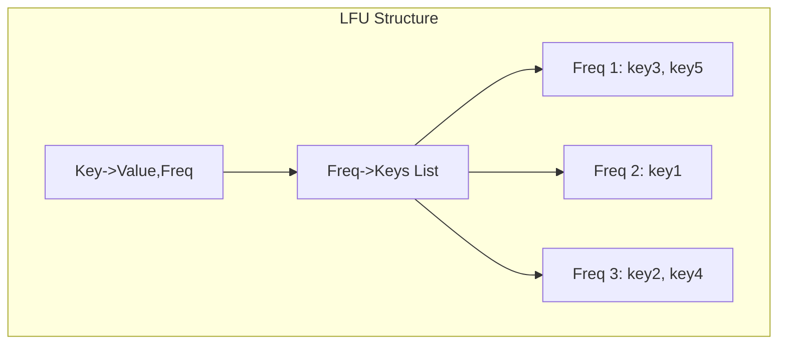
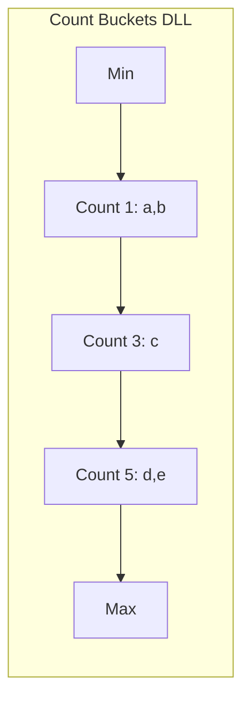
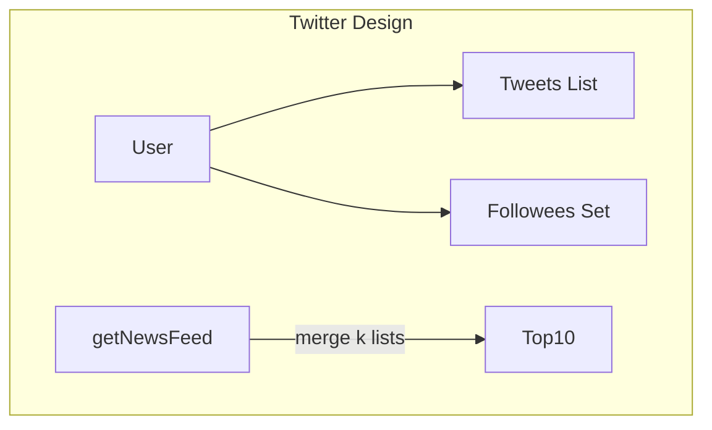

# LRU Cache Implementation

> **Combining hash map with doubly linked list for O(1) operations**

---

## Overview

LRU (Least Recently Used) Cache is a classic data structure design problem that combines a hash map with a doubly linked list to achieve O(1) time complexity for both get and put operations. It's frequently asked in Google interviews and tests your understanding of data structure design.



---

## Problem Statement (LeetCode #146)

Design a data structure that follows the constraints of a Least Recently Used (LRU) cache:

- `LRUCache(int capacity)`: Initialize the cache with positive size capacity
- `int get(int key)`: Return the value if key exists, otherwise return -1
- `void put(int key, int value)`: Update or insert the value. If the number of keys exceeds capacity, evict the least recently used key.

Both operations must run in O(1) average time complexity.

---

## Solution

### Data Structure Design

```python
class DLLNode:
    """Doubly linked list node for LRU Cache."""
    def __init__(self, key=0, value=0):
        self.key = key
        self.value = value
        self.prev = None
        self.next = None


class LRUCache:
    """
    LRU Cache using Hash Map + Doubly Linked List.

    Hash Map: key -> node (O(1) lookup)
    Doubly Linked List: maintains access order (O(1) move/remove)

    Structure:
    HEAD <-> node1 <-> node2 <-> ... <-> nodeN <-> TAIL
    (most recent)                        (least recent)
    """

    def __init__(self, capacity: int):
        self.capacity = capacity
        self.cache = {}  # key -> node

        # Sentinel nodes (avoid null checks)
        self.head = DLLNode()  # Most recently used
        self.tail = DLLNode()  # Least recently used
        self.head.next = self.tail
        self.tail.prev = self.head

    def _remove(self, node: DLLNode) -> None:
        """Remove a node from the doubly linked list."""
        node.prev.next = node.next
        node.next.prev = node.prev

    def _add_to_front(self, node: DLLNode) -> None:
        """Add a node right after head (most recent position)."""
        node.next = self.head.next
        node.prev = self.head
        self.head.next.prev = node
        self.head.next = node

    def _move_to_front(self, node: DLLNode) -> None:
        """Move existing node to front (mark as most recently used)."""
        self._remove(node)
        self._add_to_front(node)

    def get(self, key: int) -> int:
        """
        Get value by key.
        If found, move to front (mark as recently used).
        """
        if key not in self.cache:
            return -1

        node = self.cache[key]
        self._move_to_front(node)
        return node.value

    def put(self, key: int, value: int) -> None:
        """
        Insert or update key-value pair.
        If key exists, update value and move to front.
        If new key, add to front and evict LRU if over capacity.
        """
        if key in self.cache:
            # Update existing
            node = self.cache[key]
            node.value = value
            self._move_to_front(node)
        else:
            # Add new
            node = DLLNode(key, value)
            self.cache[key] = node
            self._add_to_front(node)

            # Evict if over capacity
            if len(self.cache) > self.capacity:
                # Remove LRU (node before tail)
                lru = self.tail.prev
                self._remove(lru)
                del self.cache[lru.key]
```

::: info Complexity: Time O(1) for get/put · Space O(capacity)
- **Time:** O(1) for both operations because hash map provides O(1) lookup, and doubly linked list provides O(1) insertion/deletion/move
- **Space:** O(capacity) because we store at most `capacity` nodes in both the hash map and doubly linked list
:::

---

## How It Works

### Get Operation

```
1. Check if key exists in hash map -> O(1)
2. If not found, return -1
3. If found:
   a. Get node reference from hash map -> O(1)
   b. Remove node from current position -> O(1)
   c. Add node to front (most recent) -> O(1)
   d. Return value
```

### Put Operation

```
1. If key exists:
   a. Update value in existing node -> O(1)
   b. Move node to front -> O(1)

2. If key doesn't exist:
   a. Create new node -> O(1)
   b. Add to hash map -> O(1)
   c. Add node to front -> O(1)
   d. If over capacity:
      - Get LRU node (before tail) -> O(1)
      - Remove from list -> O(1)
      - Remove from hash map -> O(1)
```

---

## Example Walkthrough

```python
# Initialize cache with capacity 2
cache = LRUCache(2)

cache.put(1, 1)    # Cache: {1=1}
                   # List: HEAD <-> [1:1] <-> TAIL

cache.put(2, 2)    # Cache: {1=1, 2=2}
                   # List: HEAD <-> [2:2] <-> [1:1] <-> TAIL

cache.get(1)       # Returns 1, moves key 1 to front
                   # List: HEAD <-> [1:1] <-> [2:2] <-> TAIL

cache.put(3, 3)    # Over capacity! Evict LRU (key 2)
                   # Cache: {1=1, 3=3}
                   # List: HEAD <-> [3:3] <-> [1:1] <-> TAIL

cache.get(2)       # Returns -1 (was evicted)

cache.put(4, 4)    # Evict LRU (key 1)
                   # Cache: {3=3, 4=4}
                   # List: HEAD <-> [4:4] <-> [3:3] <-> TAIL

cache.get(1)       # Returns -1 (was evicted)
cache.get(3)       # Returns 3, moves to front
cache.get(4)       # Returns 4, moves to front
```

---

## Alternative Implementation Using OrderedDict

Python's `OrderedDict` maintains insertion order and supports moving items to end:

```python
from collections import OrderedDict

class LRUCache_OrderedDict:
    """
    Simplified implementation using OrderedDict.
    Note: move_to_end is O(1) in Python 3.7+
    """

    def __init__(self, capacity: int):
        self.capacity = capacity
        self.cache = OrderedDict()

    def get(self, key: int) -> int:
        if key not in self.cache:
            return -1
        # Move to end (most recent)
        self.cache.move_to_end(key)
        return self.cache[key]

    def put(self, key: int, value: int) -> None:
        if key in self.cache:
            # Update and move to end
            self.cache.move_to_end(key)
        self.cache[key] = value

        # Evict oldest if over capacity
        if len(self.cache) > self.capacity:
            self.cache.popitem(last=False)
```

::: info Complexity: Time O(1) for get/put · Space O(capacity)
- **Time:** O(1) because Python's OrderedDict provides O(1) move_to_end() and popitem() operations
- **Space:** O(capacity) because the OrderedDict stores at most `capacity` key-value pairs
:::

**Note**: While `OrderedDict` is simpler, interviewers usually expect the explicit hash map + doubly linked list implementation to verify you understand the underlying mechanics.

---

## Complexity Analysis

| Operation | Time | Space |
|-----------|------|-------|
| get() | O(1) | - |
| put() | O(1) | - |
| Overall | - | O(capacity) |

---

## Common Variations

### LFU Cache (LeetCode #460)

Evict least *frequently* used item (track access count):

```python
class LFUCache:
    """
    Least Frequently Used Cache.
    Uses hash maps for O(1) operations:
    - key -> (value, frequency)
    - frequency -> doubly linked list of keys
    """
    def __init__(self, capacity: int):
        self.capacity = capacity
        self.cache = {}  # key -> [value, freq]
        self.freq_map = defaultdict(OrderedDict)  # freq -> {key: None}
        self.min_freq = 0

    def get(self, key: int) -> int:
        if key not in self.cache:
            return -1

        value, freq = self.cache[key]
        self._update_freq(key, freq)
        return value

    def put(self, key: int, value: int) -> None:
        if self.capacity == 0:
            return

        if key in self.cache:
            _, freq = self.cache[key]
            self.cache[key] = [value, freq]
            self._update_freq(key, freq)
        else:
            if len(self.cache) >= self.capacity:
                # Evict LFU
                evict_key, _ = self.freq_map[self.min_freq].popitem(last=False)
                del self.cache[evict_key]

            self.cache[key] = [value, 1]
            self.freq_map[1][key] = None
            self.min_freq = 1

    def _update_freq(self, key, freq):
        # Remove from current frequency list
        del self.freq_map[freq][key]
        if not self.freq_map[freq] and self.min_freq == freq:
            self.min_freq += 1

        # Add to next frequency list
        self.cache[key][1] = freq + 1
        self.freq_map[freq + 1][key] = None
```

::: info Complexity: Time O(1) for get/put · Space O(capacity)
- **Time:** O(1) because all operations (lookup, update frequency, eviction) use hash maps with O(1) operations
- **Space:** O(capacity) for storing cache entries plus O(capacity) for frequency tracking structures
:::

### TTL Cache

Cache with time-to-live expiration:

```python
import time

class TTLCache:
    """LRU Cache with TTL (time-to-live) expiration."""

    def __init__(self, capacity: int, ttl: int):
        self.capacity = capacity
        self.ttl = ttl  # seconds
        self.cache = OrderedDict()  # key -> (value, timestamp)

    def _is_expired(self, timestamp):
        return time.time() - timestamp > self.ttl

    def get(self, key: int) -> int:
        if key not in self.cache:
            return -1

        value, timestamp = self.cache[key]
        if self._is_expired(timestamp):
            del self.cache[key]
            return -1

        # Refresh timestamp and move to end
        self.cache.move_to_end(key)
        self.cache[key] = (value, time.time())
        return value

    def put(self, key: int, value: int) -> None:
        timestamp = time.time()

        if key in self.cache:
            self.cache.move_to_end(key)
        self.cache[key] = (value, timestamp)

        # Evict expired and over-capacity
        while len(self.cache) > self.capacity:
            self.cache.popitem(last=False)
```

::: info Complexity: Time O(1) amortized for get/put · Space O(capacity)
- **Time:** O(1) amortized; get may do O(1) expiration check, put may evict expired entries but amortizes to O(1)
- **Space:** O(capacity) because we store at most `capacity` entries with their timestamps
:::

---

## Interview Tips

1. **Start with the design**: Explain why hash map + DLL before coding
2. **Draw the structure**: Show sentinel nodes, pointers
3. **Explain trade-offs**: Why DLL over singly linked
4. **Handle edge cases**: Empty cache, capacity 0, repeated keys
5. **Know complexities**: Both operations must be O(1)

### Common Follow-up Questions

- "What if we need thread safety?" (Use locks)
- "What if capacity is very large?" (Consider sharding)
- "Can you implement LFU instead?" (Track frequencies)
- "How would you add TTL?" (Store timestamps)

---

## Why This Design?

| Requirement | Data Structure | Why |
|-------------|----------------|-----|
| O(1) lookup | Hash Map | Direct key access |
| O(1) ordering | Doubly Linked List | Move nodes without traversal |
| Track recency | List order | Head = recent, Tail = LRU |
| O(1) eviction | DLL tail | Immediate access to oldest |

**Why not just a hash map?** Cannot track access order.
**Why not just a list?** O(n) lookup by key.
**Why doubly linked?** Need O(1) removal without knowing previous node.

---

## Related Problems

::: details LRU Cache (LeetCode 146)
**Problem:** Design a data structure for Least Recently Used cache with O(1) get and put operations.

**Key Insight:** Combine hash map (O(1) lookup) with doubly linked list (O(1) insertion/deletion).



**Approach:** Hash map stores key->node. DLL maintains recency order. On access, move node to front. On eviction, remove from tail.

**Complexity:** O(1) time for get/put, O(capacity) space
:::

::: details LFU Cache (LeetCode 460)
**Problem:** Design Least Frequently Used cache. Evict least frequently used item; if tie, evict least recently used.

**Key Insight:** Track frequency counts with hash maps. Each frequency maps to a list of keys in access order.



**Approach:** Maintain key->(value,freq), freq->OrderedDict of keys, and min_freq tracker.

**Complexity:** O(1) time for get/put, O(capacity) space
:::

::: details All O'One Data Structure (LeetCode 432)
**Problem:** Design a data structure to increment/decrement string counts and return max/min key strings in O(1).

**Key Insight:** Use hash map with doubly linked list of count buckets, each bucket contains all keys with that count.



**Approach:** Buckets DLL sorted by count. Keys move between adjacent buckets on inc/dec.

**Complexity:** O(1) time for all operations
:::

::: details Design Twitter (LeetCode 355)
**Problem:** Design simplified Twitter with postTweet, getNewsFeed (10 most recent), follow, and unfollow.

**Key Insight:** Use hash maps for user->tweets and user->followees. Merge k sorted lists for news feed.



**Approach:** Store tweets with timestamps. For feed, collect all followees' tweets and use heap to get top 10.

**Complexity:** O(k log k) for getNewsFeed where k = number of followees
:::

---

## Sources

- [LRU Cache - LeetCode](https://leetcode.com/problems/lru-cache/)
- [LFU Cache - LeetCode](https://leetcode.com/problems/lfu-cache/)
- [Python OrderedDict Documentation](https://docs.python.org/3/library/collections.html#collections.OrderedDict)
