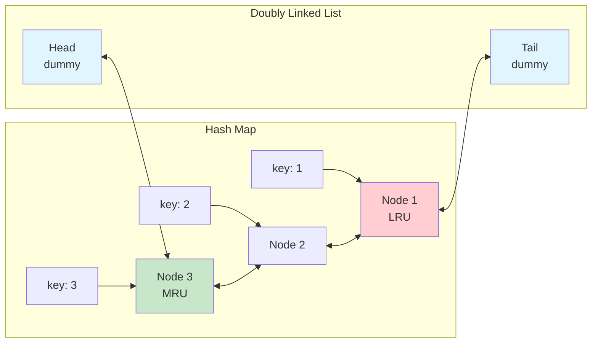

# Merge Linked Lists & LRU Cache

> **Advanced linked list applications**

---

## Visual Guides

### Merge Two Sorted Lists


### LRU Cache Structure


---

## Merge Two Sorted Lists

### Problem Statement
Given the heads of two sorted linked lists, merge them into one sorted list by splicing together the nodes of the first two lists.

### Solution

::: code-group

```python [Python]
def mergeTwoLists(l1, l2):
    dummy = ListNode(0)
    curr = dummy

    while l1 and l2:
        if l1.val <= l2.val:
            curr.next = l1
            l1 = l1.next
        else:
            curr.next = l2
            l2 = l2.next
        curr = curr.next

    curr.next = l1 or l2
    return dummy.next
```

```java [Java]
public ListNode mergeTwoLists(ListNode l1, ListNode l2) {
    ListNode dummy = new ListNode(0);
    ListNode curr = dummy;

    while (l1 != null && l2 != null) {
        if (l1.val <= l2.val) {
            curr.next = l1;
            l1 = l1.next;
        } else {
            curr.next = l2;
            l2 = l2.next;
        }
        curr = curr.next;
    }

    curr.next = (l1 != null) ? l1 : l2;
    return dummy.next;
}
```

:::

::: info Complexity: Time O(n + m) · Space O(1)
- **Time:** O(n + m) because we traverse each node in both lists exactly once, comparing and linking at each step
- **Space:** O(1) because we only use a constant number of pointers (dummy, curr) and rearrange existing nodes in-place
:::

### Complexity
- **Time:** O(n + m) where n and m are the lengths of the two lists
- **Space:** O(1) - only pointer manipulation, no extra space

---

## Merge K Sorted Lists

### Problem Statement
You are given an array of k linked lists, where each linked list is sorted in ascending order. Merge all the linked lists into one sorted linked list and return its head.

**Example:**
- Input: lists = [[1,4,5], [1,3,4], [2,6]]
- Output: [1,1,2,3,4,4,5,6]

### Approach 1: Divide and Conquer

This approach uses the Merge Sort paradigm - divide the problem into smaller units, solve them, then merge the results.

**How it works:**
1. Split k lists into two halves: lists[0...mid] and lists[mid+1...end]
2. Recursively merge the left half to get first sorted list
3. Recursively merge the right half to get second sorted list
4. Merge the two sorted lists using two-pointer approach

::: code-group

```python [Python]
def mergeKLists(lists: list) -> ListNode:
    if not lists:
        return None

    while len(lists) > 1:
        merged = []
        for i in range(0, len(lists), 2):
            l1 = lists[i]
            l2 = lists[i + 1] if i + 1 < len(lists) else None
            merged.append(mergeTwoLists(l1, l2))
        lists = merged

    return lists[0]
```

```java [Java]
public ListNode mergeKLists(ListNode[] lists) {
    if (lists == null || lists.length == 0) return null;

    List<ListNode> listArr = new ArrayList<>(Arrays.asList(lists));

    while (listArr.size() > 1) {
        List<ListNode> merged = new ArrayList<>();
        for (int i = 0; i < listArr.size(); i += 2) {
            ListNode l1 = listArr.get(i);
            ListNode l2 = (i + 1 < listArr.size()) ? listArr.get(i + 1) : null;
            merged.add(mergeTwoLists(l1, l2));
        }
        listArr = merged;
    }

    return listArr.get(0);
}
```

:::

::: info Complexity: Time O(N log k) · Space O(1)
- **Time:** O(N log k) where N is total nodes across all lists; we perform log k merge rounds, each processing all N nodes
- **Space:** O(1) because we only store the merged list array and rearrange pointers in-place (not counting output)
:::

### Approach 2: Min Heap

A min heap (priority queue) keeps the smallest node at the top, allowing efficient extraction of the next smallest element across all lists.

**How it works:**
1. Push the head of each non-null linked list into the heap
2. Pop the smallest node, append to result list
3. If the popped node has a next, push that next node into the heap
4. Repeat until heap is empty

```python
import heapq

def mergeKLists_heap(lists: list) -> ListNode:
    heap = []

    # Add first node from each list
    for i, lst in enumerate(lists):
        if lst:
            heapq.heappush(heap, (lst.val, i, lst))

    dummy = ListNode(0)
    curr = dummy

    while heap:
        val, i, node = heapq.heappop(heap)
        curr.next = node
        curr = curr.next

        if node.next:
            heapq.heappush(heap, (node.next.val, i, node.next))

    return dummy.next
```

::: info Complexity: Time O(N log k) · Space O(k)
- **Time:** O(N log k) because each of the N nodes is pushed and popped from the heap once, and heap operations are O(log k)
- **Space:** O(k) because the heap maintains at most k nodes (one from each list) at any time
:::

### Complexity Comparison

| Approach | Time Complexity | Space Complexity |
|----------|----------------|------------------|
| Divide & Conquer | O(N log k) | O(1) |
| Min Heap | O(N log k) | O(k) |

Where N is the total number of nodes across all lists, and k is the number of lists.

---

## LRU Cache

### Problem Statement
Design a data structure that follows the constraints of a Least Recently Used (LRU) cache with O(1) average time complexity for both `get` and `put` operations.

**Operations:**
- `LRUCache(int capacity)` - Initialize the cache with positive size capacity
- `int get(int key)` - Return the value if key exists, otherwise return -1
- `void put(int key, int value)` - Update value if key exists, otherwise add the key-value pair. If capacity is exceeded, evict the least recently used key.

### Approach
The optimal solution combines a **Hash Map** and a **Doubly Linked List**:
- **Hash Map:** O(1) lookup of key to node location
- **Doubly Linked List:** Maintains access order - most recently used at head, least recently used at tail

**Key Insight:** When accessing a node, remove it from its current position and reinsert at the head. The tail always contains the LRU item for eviction.

### Mermaid Diagram



### Solution

::: code-group

```python [Python]
class DLLNode:
    def __init__(self, key=0, val=0):
        self.key = key
        self.val = val
        self.prev = None
        self.next = None

class LRUCache:
    def __init__(self, capacity: int):
        self.capacity = capacity
        self.cache = {}  # key -> node

        # Dummy head and tail
        self.head = DLLNode()
        self.tail = DLLNode()
        self.head.next = self.tail
        self.tail.prev = self.head

    def _remove(self, node):
        node.prev.next = node.next
        node.next.prev = node.prev

    def _add_to_front(self, node):
        node.next = self.head.next
        node.prev = self.head
        self.head.next.prev = node
        self.head.next = node

    def get(self, key: int) -> int:
        if key not in self.cache:
            return -1

        node = self.cache[key]
        self._remove(node)
        self._add_to_front(node)
        return node.val

    def put(self, key: int, value: int) -> None:
        if key in self.cache:
            self._remove(self.cache[key])

        node = DLLNode(key, value)
        self.cache[key] = node
        self._add_to_front(node)

        if len(self.cache) > self.capacity:
            # Remove LRU (node before tail)
            lru = self.tail.prev
            self._remove(lru)
            del self.cache[lru.key]
```

```java [Java]
class LRUCache {
    private static class DLLNode {
        int key, value;
        DLLNode prev, next;
        DLLNode() {}
        DLLNode(int key, int value) { this.key = key; this.value = value; }
    }

    private final int capacity;
    private final Map<Integer, DLLNode> cache = new HashMap<>();
    private final DLLNode head = new DLLNode(), tail = new DLLNode();

    public LRUCache(int capacity) {
        this.capacity = capacity;
        head.next = tail;
        tail.prev = head;
    }

    private void remove(DLLNode node) {
        node.prev.next = node.next;
        node.next.prev = node.prev;
    }

    private void addToFront(DLLNode node) {
        node.next = head.next;
        node.prev = head;
        head.next.prev = node;
        head.next = node;
    }

    public int get(int key) {
        if (!cache.containsKey(key)) return -1;
        DLLNode node = cache.get(key);
        remove(node);
        addToFront(node);
        return node.value;
    }

    public void put(int key, int value) {
        if (cache.containsKey(key)) {
            DLLNode node = cache.get(key);
            node.value = value;
            remove(node);
            addToFront(node);
        } else {
            DLLNode node = new DLLNode(key, value);
            cache.put(key, node);
            addToFront(node);
            if (cache.size() > capacity) {
                DLLNode lru = tail.prev;
                remove(lru);
                cache.remove(lru.key);
            }
        }
    }
}
```

:::

::: info Complexity: Time O(1) for get/put · Space O(capacity)
- **Time:** O(1) for both operations because hash map provides O(1) lookup, and doubly linked list provides O(1) insertion/deletion
- **Space:** O(capacity) because we store at most `capacity` nodes in the hash map and doubly linked list
:::

### Using OrderedDict (Simpler)

Python's `OrderedDict` maintains insertion order and provides `move_to_end()` for O(1) reordering.

```python
from collections import OrderedDict

class LRUCache:
    def __init__(self, capacity: int):
        self.capacity = capacity
        self.cache = OrderedDict()

    def get(self, key: int) -> int:
        if key not in self.cache:
            return -1
        self.cache.move_to_end(key)
        return self.cache[key]

    def put(self, key: int, value: int) -> None:
        if key in self.cache:
            self.cache.move_to_end(key)
        self.cache[key] = value
        if len(self.cache) > self.capacity:
            self.cache.popitem(last=False)
```

::: info Complexity: Time O(1) for get/put · Space O(capacity)
- **Time:** O(1) because OrderedDict's move_to_end() and popitem() are O(1) operations in Python 3.7+
- **Space:** O(capacity) because the OrderedDict stores at most `capacity` key-value pairs
:::

### Complexity
- **Time:** O(1) for both `get` and `put`
- **Space:** O(capacity)

---

## Interview Applications

These problems are frequently asked in technical interviews because they test:

### Merge K Sorted Lists
- **System Design:** Merging sorted data streams in distributed systems
- **External Sorting:** Merging sorted chunks that don't fit in memory
- **Real-world:** Merging search results from multiple servers
- **Follow-ups:** What if lists are on different machines? Handle duplicates?

### LRU Cache
- **Memory Management:** Page replacement in operating systems
- **Database Systems:** Buffer pool management
- **Web Services:** API response caching, session management
- **CDN Design:** Content caching at edge servers
- **Follow-ups:**
  - How to make it thread-safe?
  - How to handle distributed LRU cache?
  - What about TTL (time-to-live) for entries?

### Common Interview Variations

| Problem | Variation | Key Difference |
|---------|-----------|----------------|
| Merge K Lists | Merge K Sorted Arrays | Use arrays instead of linked lists |
| LRU Cache | LFU Cache | Evict least frequently used |
| LRU Cache | TTL Cache | Entries expire after time limit |
| LRU Cache | Multi-level Cache | L1/L2 cache hierarchy |

---

## Sources

- [Merge k Sorted Lists - LeetCode](https://leetcode.com/problems/merge-k-sorted-lists/)
- [23. Merge k Sorted Lists - In-Depth Explanation](https://algo.monster/liteproblems/23)
- [LRU Cache - LeetCode](https://leetcode.com/problems/lru-cache/)
- [146. LRU Cache - In-Depth Explanation](https://algo.monster/liteproblems/146)
- [146. LRU Cache - Solution & Explanation - NeetCode](https://neetcode.io/solutions/lru-cache)
