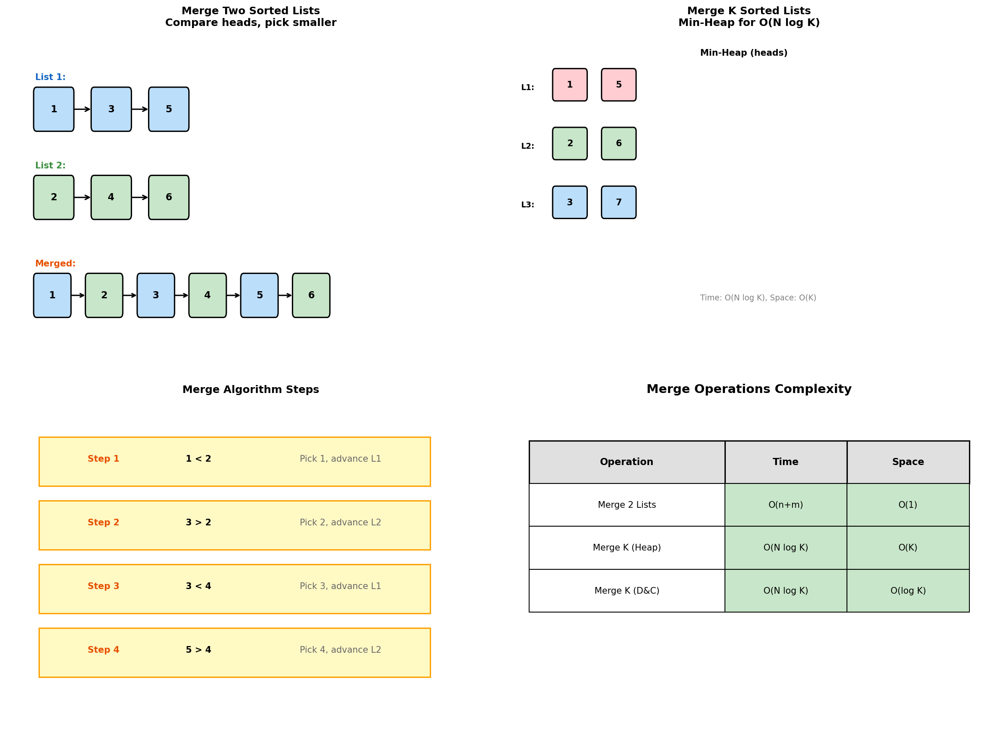
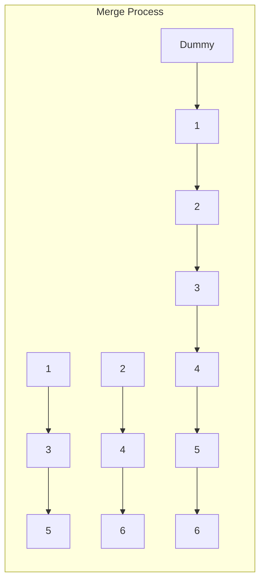
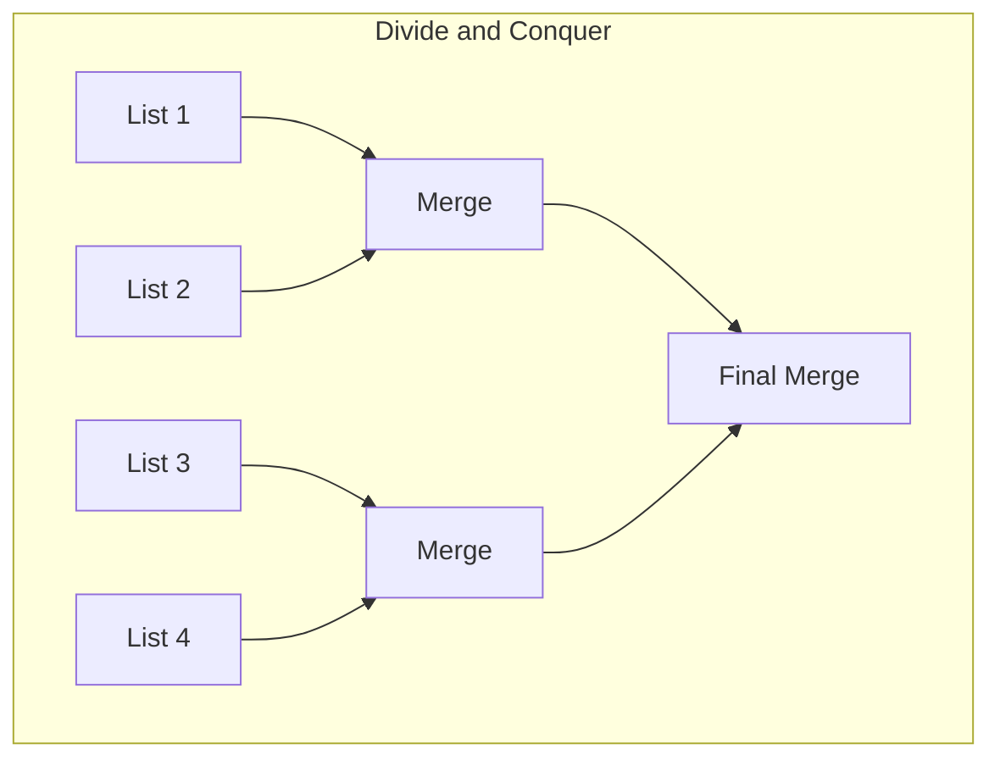
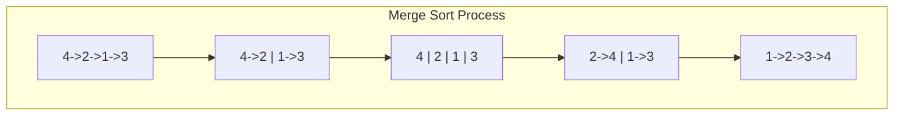
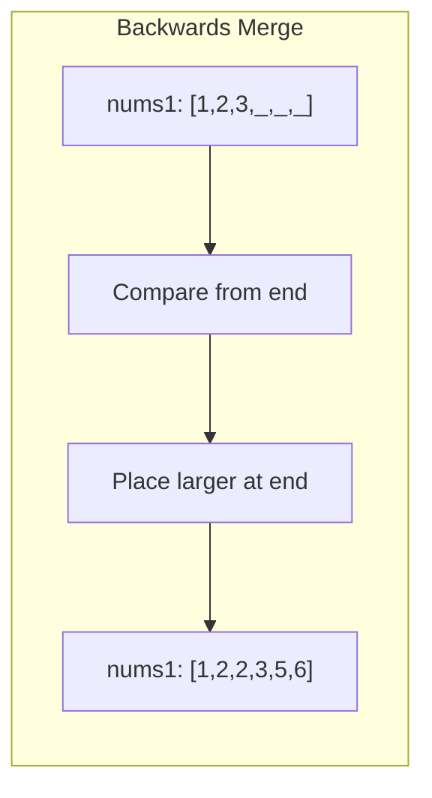
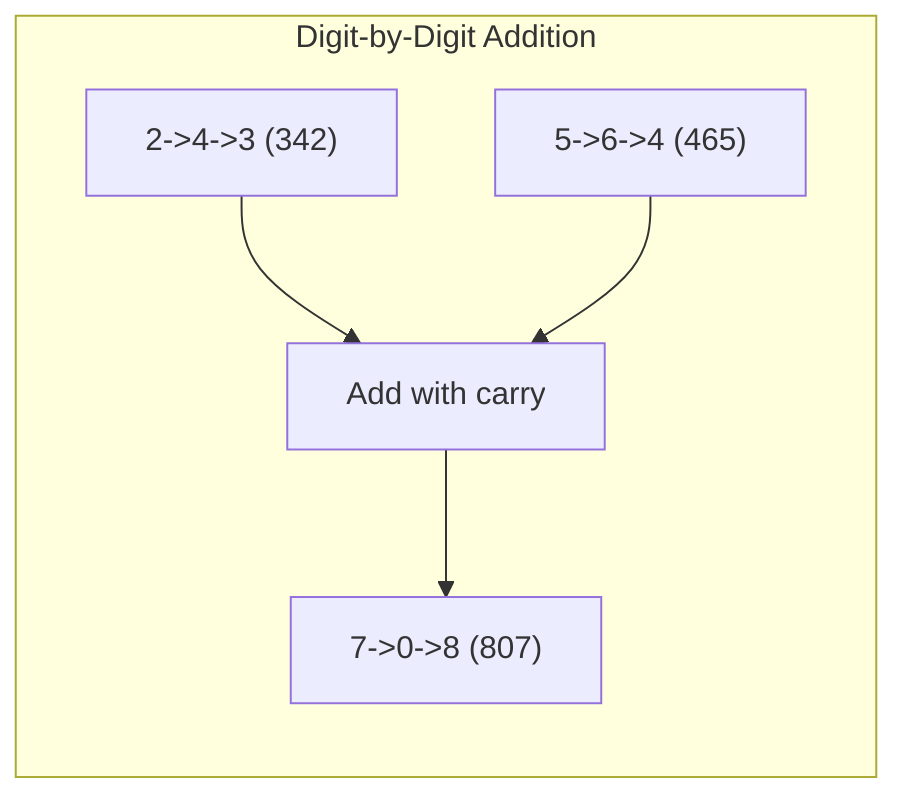

# Merge Operations

> **Combining sorted linked lists efficiently**

---

## Overview

Merge operations are fundamental linked list techniques used to combine multiple sorted lists into a single sorted list. These problems test your ability to handle pointer manipulation while maintaining sorted order.



---

## Merge Two Sorted Lists (LeetCode #21)

### Problem Statement

Merge two sorted linked lists and return it as a sorted list. The list should be made by splicing together the nodes of the first two lists.

### Solution

::: code-group

```python [Python]
def mergeTwoLists(l1: ListNode, l2: ListNode) -> ListNode:
    """
    Merge two sorted lists using dummy node technique.
    Compare heads and attach smaller node to result.
    """
    dummy = ListNode(0)
    current = dummy

    while l1 and l2:
        if l1.val <= l2.val:
            current.next = l1
            l1 = l1.next
        else:
            current.next = l2
            l2 = l2.next
        current = current.next

    # Attach remaining nodes
    current.next = l1 or l2

    return dummy.next
```

```java [Java]
public ListNode mergeTwoLists(ListNode l1, ListNode l2) {
    ListNode dummy = new ListNode(0);
    ListNode current = dummy;

    while (l1 != null && l2 != null) {
        if (l1.val <= l2.val) {
            current.next = l1;
            l1 = l1.next;
        } else {
            current.next = l2;
            l2 = l2.next;
        }
        current = current.next;
    }

    current.next = (l1 != null) ? l1 : l2;
    return dummy.next;
}
```

:::

::: info Complexity: Time O(n + m) · Space O(1)
- **Time:** O(n + m) because we visit each node in both lists exactly once
- **Space:** O(1) because we only use a dummy node and pointers, rearranging existing nodes in-place
:::

### Recursive Solution

```python
def mergeTwoLists_recursive(l1: ListNode, l2: ListNode) -> ListNode:
    """Recursive approach - elegant but uses O(n+m) space."""
    if not l1:
        return l2
    if not l2:
        return l1

    if l1.val <= l2.val:
        l1.next = mergeTwoLists_recursive(l1.next, l2)
        return l1
    else:
        l2.next = mergeTwoLists_recursive(l1, l2.next)
        return l2
```

::: info Complexity: Time O(n + m) · Space O(n + m)
- **Time:** O(n + m) because each recursive call processes one node from either list
- **Space:** O(n + m) because the recursion stack can grow up to the total number of nodes
:::

### Complexity

| Approach | Time | Space |
|----------|------|-------|
| Iterative | O(n + m) | O(1) |
| Recursive | O(n + m) | O(n + m) |

---

## Merge K Sorted Lists (LeetCode #23)

### Problem Statement

You are given an array of k linked lists, each sorted in ascending order. Merge all the linked lists into one sorted list.

### Approach 1: Min-Heap (Priority Queue)

::: code-group

```python [Python]
import heapq

def mergeKLists_heap(lists: List[ListNode]) -> ListNode:
    """
    Use min-heap to always get the smallest element.
    Time: O(N log K), Space: O(K)
    """
    # Handle edge cases
    if not lists:
        return None

    # Create min-heap with (value, index, node)
    # Index is needed to break ties when values are equal
    heap = []
    for i, node in enumerate(lists):
        if node:
            heapq.heappush(heap, (node.val, i, node))

    dummy = ListNode(0)
    current = dummy

    while heap:
        val, idx, node = heapq.heappop(heap)
        current.next = node
        current = current.next

        if node.next:
            heapq.heappush(heap, (node.next.val, idx, node.next))

    return dummy.next
```

```java [Java]
public ListNode mergeKLists(ListNode[] lists) {
    if (lists == null || lists.length == 0) return null;

    PriorityQueue<ListNode> heap =
        new PriorityQueue<>((a, b) -> Integer.compare(a.val, b.val));

    for (ListNode node : lists) {
        if (node != null) heap.offer(node);
    }

    ListNode dummy = new ListNode(0);
    ListNode current = dummy;

    while (!heap.isEmpty()) {
        ListNode node = heap.poll();
        current.next = node;
        current = current.next;
        if (node.next != null) heap.offer(node.next);
    }

    return dummy.next;
}
```

:::

::: info Complexity: Time O(N log K) · Space O(K)
- **Time:** O(N log K) where N is total nodes; each node is pushed/popped once from the heap at O(log K) cost
- **Space:** O(K) because the heap maintains at most K nodes (one head from each list) at any time
:::

### Approach 2: Divide and Conquer

```python
def mergeKLists_divideConquer(lists: List[ListNode]) -> ListNode:
    """
    Merge lists in pairs, reducing problem size by half each iteration.
    Time: O(N log K), Space: O(log K) for recursion
    """
    if not lists:
        return None
    if len(lists) == 1:
        return lists[0]

    mid = len(lists) // 2
    left = mergeKLists_divideConquer(lists[:mid])
    right = mergeKLists_divideConquer(lists[mid:])

    return mergeTwoLists(left, right)

def mergeTwoLists(l1, l2):
    dummy = ListNode(0)
    current = dummy

    while l1 and l2:
        if l1.val <= l2.val:
            current.next = l1
            l1 = l1.next
        else:
            current.next = l2
            l2 = l2.next
        current = current.next

    current.next = l1 or l2
    return dummy.next
```

::: info Complexity: Time O(N log K) · Space O(log K)
- **Time:** O(N log K) because we perform log K levels of merging, each level processing all N nodes
- **Space:** O(log K) for the recursion stack depth in divide-and-conquer approach
:::

### Approach 3: Iterative Pairwise Merge

```python
def mergeKLists_iterative(lists: List[ListNode]) -> ListNode:
    """
    Iteratively merge lists in pairs.
    Time: O(N log K), Space: O(1)
    """
    if not lists:
        return None

    while len(lists) > 1:
        merged = []
        for i in range(0, len(lists), 2):
            l1 = lists[i]
            l2 = lists[i + 1] if i + 1 < len(lists) else None
            merged.append(mergeTwoLists(l1, l2))
        lists = merged

    return lists[0]
```

::: info Complexity: Time O(N log K) · Space O(1)
- **Time:** O(N log K) because we perform log K rounds of pairwise merging, each round processing all N nodes
- **Space:** O(1) because we only maintain the merged list array and rearrange pointers in-place
:::

### Complexity Comparison

| Approach | Time | Space | Notes |
|----------|------|-------|-------|
| Brute Force (merge one by one) | O(NK) | O(1) | Slowest |
| Min-Heap | O(N log K) | O(K) | Good for streaming |
| Divide and Conquer | O(N log K) | O(log K) | Elegant recursion |
| Iterative Pairwise | O(N log K) | O(1) | Best space |

Where N = total number of nodes across all lists, K = number of lists

---

## Merge in Place (No Extra Nodes)

### Problem Variant

Merge two sorted lists without creating new nodes.

```python
def mergeInPlace(l1: ListNode, l2: ListNode) -> ListNode:
    """
    Merge by rearranging existing node pointers only.
    """
    dummy = ListNode(0)
    tail = dummy

    while l1 and l2:
        if l1.val <= l2.val:
            tail.next = l1
            l1 = l1.next
        else:
            tail.next = l2
            l2 = l2.next
        tail = tail.next

    tail.next = l1 if l1 else l2
    return dummy.next
```

::: info Complexity: Time O(n + m) · Space O(1)
- **Time:** O(n + m) because we traverse each node exactly once during the merge
- **Space:** O(1) because we only rearrange existing node pointers without creating new nodes
:::

---

## Merge Sort Linked List (LeetCode #148)

### Problem Statement

Sort a linked list in O(n log n) time; O(1) space as a follow-up.

::: code-group

```python [Python]
def sortList(head: ListNode) -> ListNode:
    """
    Merge sort for linked list.
    1. Find middle using fast-slow pointers
    2. Split list into two halves
    3. Recursively sort each half
    4. Merge sorted halves
    """
    if not head or not head.next:
        return head

    # Find middle
    slow, fast = head, head.next
    while fast and fast.next:
        slow = slow.next
        fast = fast.next.next

    # Split
    mid = slow.next
    slow.next = None

    # Sort recursively
    left = sortList(head)
    right = sortList(mid)

    # Merge
    return mergeTwoLists(left, right)
```

```java [Java]
public ListNode sortList(ListNode head) {
    if (head == null || head.next == null) return head;

    ListNode slow = head, fast = head.next;
    while (fast != null && fast.next != null) {
        slow = slow.next;
        fast = fast.next.next;
    }

    ListNode mid = slow.next;
    slow.next = null;

    ListNode left = sortList(head);
    ListNode right = sortList(mid);

    return mergeTwoSorted(left, right);
}

private ListNode mergeTwoSorted(ListNode l1, ListNode l2) {
    ListNode dummy = new ListNode(0);
    ListNode current = dummy;
    while (l1 != null && l2 != null) {
        if (l1.val <= l2.val) { current.next = l1; l1 = l1.next; }
        else { current.next = l2; l2 = l2.next; }
        current = current.next;
    }
    current.next = (l1 != null) ? l1 : l2;
    return dummy.next;
}
```

:::

::: info Complexity: Time O(n log n) · Space O(log n)
- **Time:** O(n log n) because we divide the list log n times and merge all n elements at each level
- **Space:** O(log n) for the recursion stack depth; the merge itself is O(1) pointer manipulation
:::

### Bottom-Up Merge Sort (True O(1) Space)

```python
def sortList_bottomUp(head: ListNode) -> ListNode:
    """
    Bottom-up merge sort without recursion.
    True O(1) space complexity.
    """
    if not head or not head.next:
        return head

    # Get length
    length = 0
    curr = head
    while curr:
        length += 1
        curr = curr.next

    dummy = ListNode(0)
    dummy.next = head

    # Merge sublists of increasing size
    size = 1
    while size < length:
        prev = dummy
        curr = dummy.next

        while curr:
            # Get first sublist of 'size'
            left = curr
            right = split(left, size)
            curr = split(right, size)

            # Merge and connect
            prev = merge(left, right, prev)

        size *= 2

    return dummy.next

def split(head, size):
    """Split list at position 'size', return second part."""
    for _ in range(size - 1):
        if not head:
            break
        head = head.next

    if not head:
        return None

    second = head.next
    head.next = None
    return second

def merge(l1, l2, prev):
    """Merge two lists and attach to prev, return new tail."""
    while l1 and l2:
        if l1.val <= l2.val:
            prev.next = l1
            l1 = l1.next
        else:
            prev.next = l2
            l2 = l2.next
        prev = prev.next

    prev.next = l1 or l2
    while prev.next:
        prev = prev.next

    return prev
```

::: info Complexity: Time O(n log n) · Space O(1)
- **Time:** O(n log n) because we perform log n passes, each processing all n nodes
- **Space:** O(1) because we eliminate recursion and only use constant extra pointers
:::

---

## Common Patterns

### Dummy Node Pattern

```python
def merge_template(l1, l2):
    dummy = ListNode(0)  # Sentinel node
    current = dummy

    while l1 and l2:
        # Compare and attach
        if condition(l1, l2):
            current.next = l1
            l1 = l1.next
        else:
            current.next = l2
            l2 = l2.next
        current = current.next

    # Attach remaining
    current.next = l1 or l2

    return dummy.next  # Skip dummy
```

### Heap Pattern for K Lists

```python
def merge_k_template(lists):
    heap = []
    for i, node in enumerate(lists):
        if node:
            heapq.heappush(heap, (node.val, i, node))

    dummy = ListNode(0)
    current = dummy

    while heap:
        val, idx, node = heapq.heappop(heap)
        current.next = node
        current = current.next

        if node.next:
            heapq.heappush(heap, (node.next.val, idx, node.next))

    return dummy.next
```

---

## Edge Cases to Handle

1. **Empty lists**: One or both lists are null
2. **Single element**: Lists with only one node
3. **Unequal lengths**: One list is much longer
4. **Duplicate values**: Maintain stability
5. **All same values**: Handle ties correctly

---

## Related Problems

::: details Merge Two Sorted Lists (LeetCode 21)
**Problem:** Merge two sorted linked lists into one sorted list by splicing together their nodes.

**Key Insight:** Use a dummy node to simplify head handling, compare values, and attach smaller node.



**Approach:** Use dummy node, iterate comparing heads of both lists, attach smaller to result, advance that list.

**Complexity:** O(n + m) time, O(1) space
:::

::: details Merge K Sorted Lists (LeetCode 23)
**Problem:** Merge k sorted linked lists into one sorted list.

**Key Insight:** Use min-heap to always get smallest element across all lists, or divide-and-conquer to merge pairs.



**Approach:** Min-heap: push all heads, pop min, push its next. D&C: recursively merge pairs.

**Complexity:** O(N log K) time, O(K) space for heap
:::

::: details Sort List (LeetCode 148)
**Problem:** Sort a linked list in O(n log n) time and constant space.

**Key Insight:** Merge sort is ideal for linked lists - find middle, split, sort recursively, merge.



**Approach:** Find middle with fast-slow pointers, recursively sort each half, merge sorted halves.

**Complexity:** O(n log n) time, O(log n) space for recursion
:::

::: details Merge Sorted Array (LeetCode 88)
**Problem:** Merge nums2 into nums1, both sorted, with nums1 having enough space.

**Key Insight:** Work backwards from end to avoid overwriting elements in nums1.



**Approach:** Three pointers: end of nums1 elements, end of nums2, end of merged array. Fill from back.

**Complexity:** O(n + m) time, O(1) space
:::

::: details Add Two Numbers (LeetCode 2)
**Problem:** Add two numbers represented as reversed linked lists, return sum as linked list.

**Key Insight:** Process digit by digit like merge, handling carry propagation.



**Approach:** Iterate through both lists, add digits plus carry, create new node for result digit.

**Complexity:** O(max(m,n)) time, O(max(m,n)) space
:::

---

## Interview Tips

1. **Start with merge two**: Master this before K-merge
2. **Discuss trade-offs**: Heap vs divide-conquer approaches
3. **Handle edge cases**: Empty lists, single elements
4. **Use dummy node**: Simplifies head handling
5. **Know complexities**: O(N log K) for optimal K-merge

---

## Sources

- [Merge Two Sorted Lists - LeetCode](https://leetcode.com/problems/merge-two-sorted-lists/)
- [Merge K Sorted Lists - LeetCode](https://leetcode.com/problems/merge-k-sorted-lists/)
- [Sort List - LeetCode](https://leetcode.com/problems/sort-list/)
