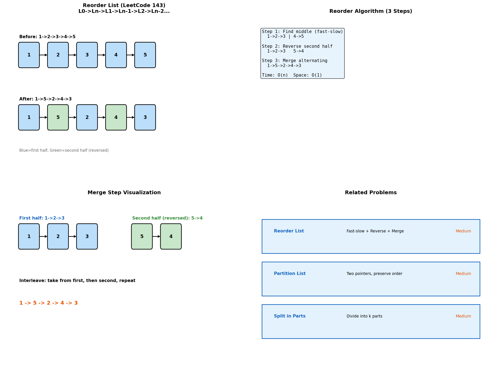
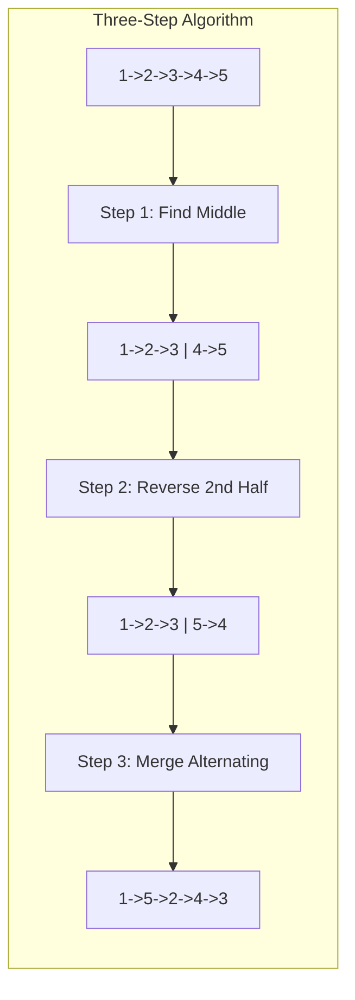
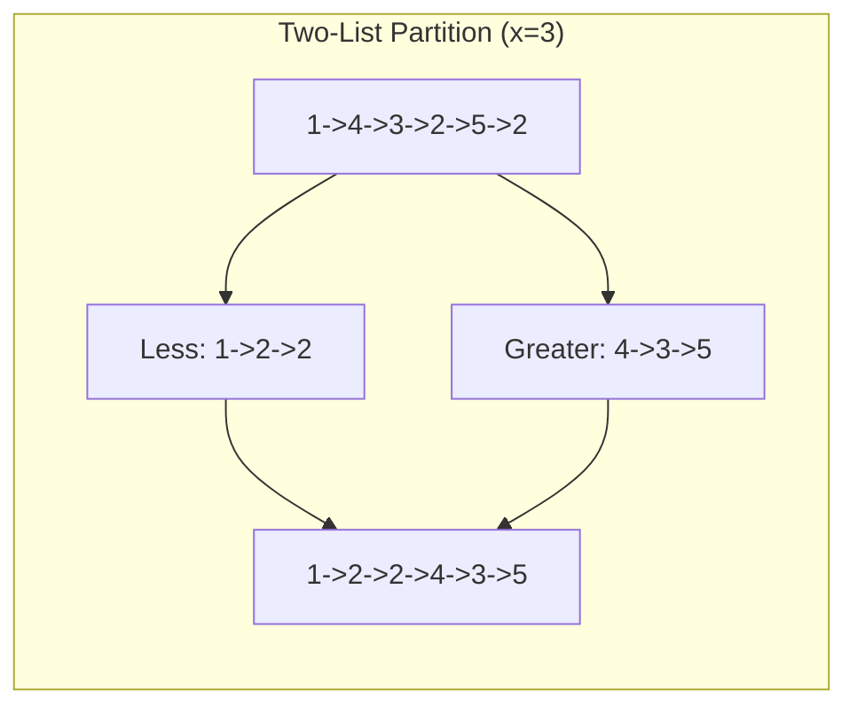
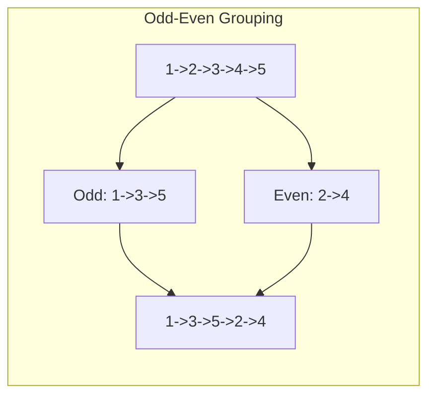
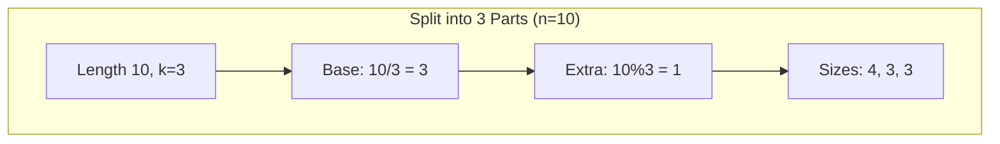
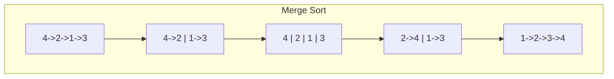

# Reorder Operations

> **Rearranging linked list nodes in specific patterns**

---

## Overview

Reorder operations involve rearranging nodes in a linked list according to specific rules. The classic "reorder list" problem combines multiple techniques: finding the middle, reversing, and merging.



---

## Reorder List (LeetCode #143)

### Problem Statement

Given a singly linked list: L0 -> L1 -> ... -> Ln-1 -> Ln
Reorder it to: L0 -> Ln -> L1 -> Ln-1 -> L2 -> Ln-2 -> ...

### Example

```
Input:  1 -> 2 -> 3 -> 4 -> 5
Output: 1 -> 5 -> 2 -> 4 -> 3

Pattern: first, last, second, second-last, ...
```

### Solution

::: code-group

```python [Python]
def reorderList(head: ListNode) -> None:
    """
    Three-step algorithm:
    1. Find middle using fast-slow pointers
    2. Reverse second half
    3. Merge two halves alternately

    Time: O(n), Space: O(1)
    """
    if not head or not head.next:
        return

    # Step 1: Find middle
    slow, fast = head, head
    while fast.next and fast.next.next:
        slow = slow.next
        fast = fast.next.next

    # Step 2: Reverse second half
    second = slow.next
    slow.next = None  # Split the list
    prev = None
    while second:
        next_temp = second.next
        second.next = prev
        prev = second
        second = next_temp
    second = prev  # New head of reversed second half

    # Step 3: Merge alternately
    first = head
    while second:
        # Save next pointers
        first_next = first.next
        second_next = second.next

        # Interleave
        first.next = second
        second.next = first_next

        # Advance
        first = first_next
        second = second_next
```

```java [Java]
public void reorderList(ListNode head) {
    if (head == null || head.next == null) return;

    // Step 1: Find middle
    ListNode slow = head, fast = head;
    while (fast.next != null && fast.next.next != null) {
        slow = slow.next;
        fast = fast.next.next;
    }

    // Step 2: Reverse second half
    ListNode second = slow.next;
    slow.next = null;
    ListNode prev = null;
    while (second != null) {
        ListNode nextTemp = second.next;
        second.next = prev;
        prev = second;
        second = nextTemp;
    }
    second = prev;

    // Step 3: Merge alternately
    ListNode first = head;
    while (second != null) {
        ListNode firstNext = first.next;
        ListNode secondNext = second.next;

        first.next = second;
        second.next = firstNext;

        first = firstNext;
        second = secondNext;
    }
}
```

:::

::: info Complexity: Time O(n) · Space O(1)
- **Time:** O(n) because we traverse the list three times: find middle, reverse second half, merge alternating
- **Space:** O(1) because all operations are done in-place with only pointer manipulation
:::

### Step-by-Step Visualization

```
Original: 1 -> 2 -> 3 -> 4 -> 5

Step 1: Find middle
slow at 3, fast at 5
Split: [1 -> 2 -> 3] and [4 -> 5]

Step 2: Reverse second half
[4 -> 5] becomes [5 -> 4]

Step 3: Merge
first: 1 -> 2 -> 3
second: 5 -> 4

Merge step by step:
- 1 -> 5 -> (2 -> 3)
- 1 -> 5 -> 2 -> 4 -> (3)
- 1 -> 5 -> 2 -> 4 -> 3

Result: 1 -> 5 -> 2 -> 4 -> 3
```

---

## Partition List (LeetCode #86)

### Problem Statement

Given a linked list and a value x, partition it such that all nodes less than x come before nodes greater than or equal to x. Preserve original relative order.

### Solution

::: code-group

```python [Python]
def partition(head: ListNode, x: int) -> ListNode:
    """
    Create two separate lists and connect them.
    Time: O(n), Space: O(1)
    """
    # Dummy heads for two partitions
    less_head = ListNode(0)
    greater_head = ListNode(0)
    less = less_head
    greater = greater_head

    current = head
    while current:
        if current.val < x:
            less.next = current
            less = less.next
        else:
            greater.next = current
            greater = greater.next
        current = current.next

    # Connect partitions
    greater.next = None  # Terminate greater list
    less.next = greater_head.next

    return less_head.next
```

```java [Java]
public ListNode partition(ListNode head, int x) {
    ListNode lessHead = new ListNode(0);
    ListNode greaterHead = new ListNode(0);
    ListNode less = lessHead, greater = greaterHead;

    ListNode current = head;
    while (current != null) {
        if (current.val < x) {
            less.next = current;
            less = less.next;
        } else {
            greater.next = current;
            greater = greater.next;
        }
        current = current.next;
    }

    greater.next = null;
    less.next = greaterHead.next;
    return lessHead.next;
}
```

:::

::: info Complexity: Time O(n) · Space O(1)
- **Time:** O(n) because we traverse the list once, distributing nodes to two partitions
- **Space:** O(1) because we use dummy nodes and pointers to rearrange existing nodes in-place
:::

### Example

```
Input: 1 -> 4 -> 3 -> 2 -> 5 -> 2, x = 3
Output: 1 -> 2 -> 2 -> 4 -> 3 -> 5

Partition:
- less than 3: 1 -> 2 -> 2
- >= 3: 4 -> 3 -> 5
- Connect: 1 -> 2 -> 2 -> 4 -> 3 -> 5
```

---

## Sort List by Parity

### Problem Statement

Rearrange so all odd values come before even values.

```python
def sortByParity(head: ListNode) -> ListNode:
    """
    Separate odd and even values, then connect.
    """
    odd_head = ListNode(0)
    even_head = ListNode(0)
    odd = odd_head
    even = even_head

    current = head
    while current:
        if current.val % 2 == 1:  # Odd
            odd.next = current
            odd = odd.next
        else:  # Even
            even.next = current
            even = even.next
        current = current.next

    # Connect
    even.next = None
    odd.next = even_head.next

    return odd_head.next
```

::: info Complexity: Time O(n) · Space O(1)
- **Time:** O(n) because we traverse the list once, separating odd and even valued nodes
- **Space:** O(1) because we only use dummy heads and pointers, rearranging nodes in-place
:::

---

## Rearrange by Position (Odd-Even Positions)

### Problem (LeetCode #328)

Group nodes by their position: all odd-positioned nodes before even-positioned.

::: code-group

```python [Python]
def oddEvenList(head: ListNode) -> ListNode:
    """
    Group odd-indexed then even-indexed nodes.
    Index starts from 1.
    """
    if not head or not head.next:
        return head

    odd = head
    even = head.next
    even_head = even

    while even and even.next:
        odd.next = even.next
        odd = odd.next
        even.next = odd.next
        even = even.next

    odd.next = even_head
    return head
```

```java [Java]
public ListNode oddEvenList(ListNode head) {
    if (head == null || head.next == null) return head;

    ListNode odd = head, even = head.next, evenHead = even;

    while (even != null && even.next != null) {
        odd.next = even.next;
        odd = odd.next;
        even.next = odd.next;
        even = even.next;
    }

    odd.next = evenHead;
    return head;
}
```

:::

::: info Complexity: Time O(n) · Space O(1)
- **Time:** O(n) because we traverse the list once, weaving through odd and even positions
- **Space:** O(1) because we only use pointers (odd, even, even_head) to rearrange in-place
:::

---

## Split Linked List in Parts (LeetCode #725)

### Problem Statement

Split a linked list into k parts with sizes as equal as possible.

::: code-group

```python [Python]
def splitListToParts(head: ListNode, k: int) -> List[ListNode]:
    """
    Calculate part sizes, split accordingly.
    Earlier parts get extra nodes if not evenly divisible.
    """
    # Find length
    length = 0
    current = head
    while current:
        length += 1
        current = current.next

    # Calculate sizes
    base_size = length // k
    extra = length % k

    result = []
    current = head

    for i in range(k):
        result.append(current)
        size = base_size + (1 if i < extra else 0)

        # Move to end of this part
        for _ in range(size - 1):
            if current:
                current = current.next

        # Cut the list
        if current:
            next_head = current.next
            current.next = None
            current = next_head

    return result
```

```java [Java]
public ListNode[] splitListToParts(ListNode head, int k) {
    int length = 0;
    ListNode current = head;
    while (current != null) { length++; current = current.next; }

    int baseSize = length / k, extra = length % k;
    ListNode[] result = new ListNode[k];
    current = head;

    for (int i = 0; i < k; i++) {
        result[i] = current;
        int size = baseSize + (i < extra ? 1 : 0);

        for (int j = 0; j < size - 1; j++) {
            if (current != null) current = current.next;
        }

        if (current != null) {
            ListNode nextHead = current.next;
            current.next = null;
            current = nextHead;
        }
    }

    return result;
}
```

:::

::: info Complexity: Time O(n) · Space O(k)
- **Time:** O(n) because we traverse the list twice: once for length, once to split into k parts
- **Space:** O(k) for the result array containing k list heads (nodes themselves are reused)
:::

---

## Interleave Two Lists

### Problem Statement

Interleave nodes from two lists alternately.

```python
def interleave(l1: ListNode, l2: ListNode) -> ListNode:
    """
    Create list: l1[0] -> l2[0] -> l1[1] -> l2[1] -> ...
    """
    dummy = ListNode(0)
    current = dummy
    turn = True  # True = l1's turn

    while l1 or l2:
        if turn and l1:
            current.next = l1
            l1 = l1.next
            current = current.next
        elif not turn and l2:
            current.next = l2
            l2 = l2.next
            current = current.next
        elif l1:
            current.next = l1
            break
        elif l2:
            current.next = l2
            break

        turn = not turn

    return dummy.next
```

::: info Complexity: Time O(m + n) · Space O(1)
- **Time:** O(m + n) because we traverse both lists once, interleaving their nodes
- **Space:** O(1) because we use a dummy node and pointers to create the interleaved result
:::

---

## Common Patterns

### Split Pattern

```python
def split_pattern(head, condition):
    list1_head = ListNode(0)
    list2_head = ListNode(0)
    tail1, tail2 = list1_head, list2_head

    while head:
        if condition(head):
            tail1.next = head
            tail1 = tail1.next
        else:
            tail2.next = head
            tail2 = tail2.next
        head = head.next

    tail1.next = None
    tail2.next = None

    return list1_head.next, list2_head.next
```

### Merge Alternating Pattern

```python
def merge_alternating(l1, l2):
    while l1 and l2:
        l1_next, l2_next = l1.next, l2.next
        l1.next = l2
        l2.next = l1_next
        l1, l2 = l1_next, l2_next
```

---

## Complexity Summary

| Problem | Time | Space |
|---------|------|-------|
| Reorder List | O(n) | O(1) |
| Partition List | O(n) | O(1) |
| Odd-Even List | O(n) | O(1) |
| Split in Parts | O(n) | O(k) for result |

---

## Edge Cases

1. **Empty list**: Return None or empty result
2. **Single node**: Return as-is
3. **Two nodes**: Simple swap (for reorder)
4. **All same partition**: One list empty
5. **k > length**: Some parts will be null

---

## Related Problems

::: details Reorder List (LeetCode 143)
**Problem:** Reorder L0->L1->...->Ln to L0->Ln->L1->Ln-1->L2->Ln-2->...

**Key Insight:** Three classic operations combined: find middle, reverse, merge alternating.



**Approach:** Fast-slow to find middle, in-place reversal of second half, interleave nodes.

**Complexity:** O(n) time, O(1) space
:::

::: details Partition List (LeetCode 86)
**Problem:** Partition list around value x: all nodes < x before nodes >= x, preserving order.

**Key Insight:** Build two separate lists, then concatenate. Simpler than in-place partitioning.



**Approach:** Two dummy heads for less and greater lists. Iterate appending to appropriate list. Connect and null-terminate.

**Complexity:** O(n) time, O(1) space
:::

::: details Odd Even Linked List (LeetCode 328)
**Problem:** Group odd-indexed nodes together followed by even-indexed nodes (1-indexed).

**Key Insight:** Build odd and even chains simultaneously by skipping nodes.



**Approach:** Maintain odd and even pointers. Weave through: odd.next = even.next, advance odd, even.next = odd.next, advance even.

**Complexity:** O(n) time, O(1) space
:::

::: details Split Linked List in Parts (LeetCode 725)
**Problem:** Split list into k parts with sizes as equal as possible (earlier parts larger).

**Key Insight:** Base size is n/k, first n%k parts get one extra node.



**Approach:** Calculate length, determine base size and extras. Iterate cutting at each part boundary.

**Complexity:** O(n) time, O(k) space for result
:::

::: details Sort List (LeetCode 148)
**Problem:** Sort a linked list in O(n log n) time using constant space.

**Key Insight:** Merge sort is ideal for linked lists - natural splitting and merging.



**Approach:** Find middle with fast-slow, recursively sort halves, merge sorted lists.

**Complexity:** O(n log n) time, O(log n) space for recursion
:::

---

## Interview Tips

1. **For reorder**: Draw the transformation step by step
2. **Remember the three steps**: Middle, Reverse, Merge
3. **For partition**: Always null-terminate both lists
4. **Handle edge cases**: Empty, single node, all in one partition
5. **Mention in-place**: Most solutions should use O(1) extra space

---

## Sources

- [Reorder List - LeetCode](https://leetcode.com/problems/reorder-list/)
- [Partition List - LeetCode](https://leetcode.com/problems/partition-list/)
- [Odd Even Linked List - LeetCode](https://leetcode.com/problems/odd-even-linked-list/)
- [Split Linked List in Parts - LeetCode](https://leetcode.com/problems/split-linked-list-in-parts/)
