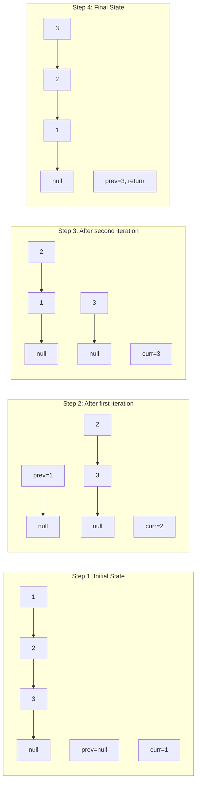
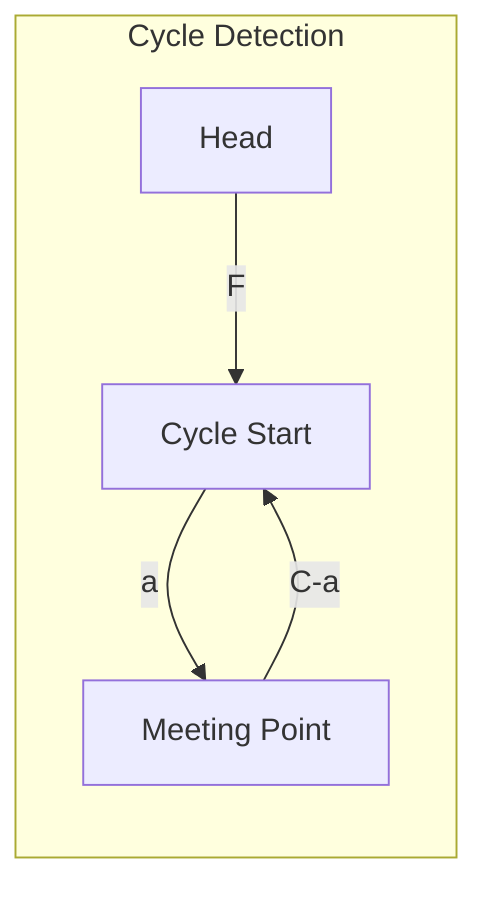
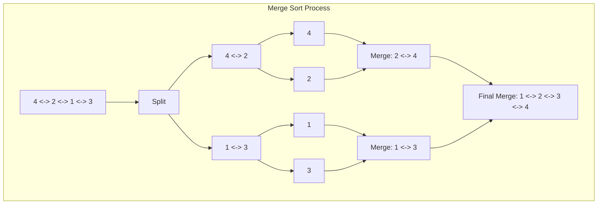

# Reverse, Cycle & Merge Sort Linked List

> **Fundamental linked list manipulations**

---

## Visual Guides

### Linked List Reversal
<!-- TODO: Add visualization  -->

### Floyd's Cycle Detection
<!-- TODO: Add visualization  -->

---

## Reverse Linked List

Reversing a linked list is one of the most fundamental problems in data structures (LeetCode #206). It tests your understanding of pointer manipulation and is a building block for many advanced linked list operations.

### Iterative Solution

The iterative approach uses three pointers to reverse links in place:

::: code-group

```python [Python]
def reverseList(head):
    prev, curr = None, head

    while curr:
        next_temp = curr.next  # Save next node before breaking link
        curr.next = prev       # Reverse the link
        prev = curr            # Move prev forward
        curr = next_temp       # Move curr forward

    return prev
```

```java [Java]
public ListNode reverseList(ListNode head) {
    ListNode prev = null, curr = head;

    while (curr != null) {
        ListNode nextTemp = curr.next;
        curr.next = prev;
        prev = curr;
        curr = nextTemp;
    }

    return prev;
}
```

:::

::: info Complexity: Time O(n) · Space O(1)
- **Time:** O(n) because we traverse each node exactly once, performing constant-time pointer operations at each step
- **Space:** O(1) because we only use three pointers (prev, curr, next_temp) regardless of list size
:::

**Key Insight**: Always save `curr.next` before modifying it, or you'll lose the rest of the list!

### Recursive Solution

The recursive approach reverses the rest of the list first, then fixes the current node's pointer:

```python
def reverseList_recursive(head):
    # Base case: empty list or single node
    if not head or not head.next:
        return head

    # Reverse the rest of the list
    new_head = reverseList_recursive(head.next)

    # Fix pointers for current node
    head.next.next = head  # Make next node point back to current
    head.next = None       # Break original forward link

    return new_head
```

::: info Complexity: Time O(n) · Space O(n)
- **Time:** O(n) because each node is visited exactly once during the recursive calls
- **Space:** O(n) because the recursion creates n stack frames, one for each node in the list
:::

**How it works**: For list `1 -> 2 -> 3`, after recursion returns with `new_head = 3`:
- At node 2: `2.next.next = 2` makes `3 -> 2`, then `2.next = None`
- At node 1: `1.next.next = 1` makes `2 -> 1`, then `1.next = None`

### Mermaid Diagram



**Visual Step-by-Step:**
```
Original: 1 -> 2 -> 3 -> null
          ^
         curr (prev = null)

Step 1:   null <- 1    2 -> 3 -> null
                 ^     ^
               prev   curr

Step 2:   null <- 1 <- 2    3 -> null
                       ^     ^
                     prev   curr

Step 3:   null <- 1 <- 2 <- 3
                            ^
                          prev (curr = null, exit loop)

Return: prev (node 3)
```

### Complexity

| Approach | Time | Space |
|----------|------|-------|
| Iterative | O(n) | O(1) |
| Recursive | O(n) | O(n) - call stack |

---

## Linked List Cycle

Floyd's Cycle Detection Algorithm (also known as the "Tortoise and Hare" algorithm) is an elegant solution for detecting cycles in linked lists.

### Detect Cycle (LeetCode #141)

::: code-group

```python [Python]
def hasCycle(head) -> bool:
    slow = fast = head

    while fast and fast.next:
        slow = slow.next        # Move 1 step
        fast = fast.next.next   # Move 2 steps
        if slow == fast:
            return True

    return False
```

```java [Java]
public boolean hasCycle(ListNode head) {
    ListNode slow = head, fast = head;

    while (fast != null && fast.next != null) {
        slow = slow.next;
        fast = fast.next.next;
        if (slow == fast) return true;
    }

    return false;
}
```

:::

::: info Complexity: Time O(n) · Space O(1)
- **Time:** O(n) because in the worst case (no cycle), fast pointer traverses n/2 nodes; with a cycle, pointers meet within n iterations
- **Space:** O(1) because we only use two pointers (slow, fast) regardless of list size
:::

**Intuition**: If there's a cycle, the fast pointer will eventually "lap" the slow pointer. If no cycle exists, fast will reach the end.

### Find Cycle Start (LeetCode #142)

::: code-group

```python [Python]
def detectCycle(head):
    slow = fast = head

    # Phase 1: Detect cycle
    while fast and fast.next:
        slow = slow.next
        fast = fast.next.next
        if slow == fast:
            break
    else:
        return None  # No cycle found

    # Phase 2: Find entrance
    slow = head
    while slow != fast:
        slow = slow.next
        fast = fast.next

    return slow  # This is the cycle start
```

```java [Java]
public ListNode detectCycle(ListNode head) {
    ListNode slow = head, fast = head;
    boolean hasCycle = false;

    while (fast != null && fast.next != null) {
        slow = slow.next;
        fast = fast.next.next;
        if (slow == fast) { hasCycle = true; break; }
    }

    if (!hasCycle) return null;

    slow = head;
    while (slow != fast) {
        slow = slow.next;
        fast = fast.next;
    }

    return slow;
}
```

:::

::: info Complexity: Time O(n) · Space O(1)
- **Time:** O(n) because phase 1 takes O(n) to detect cycle, and phase 2 takes at most O(n) to find the cycle start
- **Space:** O(1) because we only use two pointers (slow, fast) throughout both phases
:::

### Why This Works (Mathematical Proof)

Let's define:
- **F** = distance from head to cycle start
- **C** = cycle length
- **a** = distance from cycle start to meeting point

```
Head ----F---- Cycle Start ----a---- Meeting Point
                    |                      |
                    +--- (C - a) ----------+
```

**When slow and fast meet:**
- Slow has traveled: `F + a`
- Fast has traveled: `F + a + nC` (where n >= 1 cycles)

Since fast moves twice as fast:
```
2(F + a) = F + a + nC
F + a = nC
F = nC - a
F = (n-1)C + (C - a)
```

**Key insight**: The distance from head to cycle start (F) equals the distance from meeting point to cycle start going forward (C - a) plus some complete cycles.

Therefore, if we move one pointer from head and another from meeting point (both at speed 1), they will meet at the cycle start!



### Edge Cases

```python
def detectCycle_robust(head):
    # Handle empty list or single node
    if not head or not head.next:
        return None

    slow = fast = head
    has_cycle = False

    while fast and fast.next:
        slow = slow.next
        fast = fast.next.next
        if slow == fast:
            has_cycle = True
            break

    if not has_cycle:
        return None

    slow = head
    while slow != fast:
        slow = slow.next
        fast = fast.next

    return slow
```

::: info Complexity: Time O(n) · Space O(1)
- **Time:** O(n) because we traverse the list twice at most (once for detection, once for finding start)
- **Space:** O(1) because we use only a constant number of pointers regardless of list size
:::

---

## Merge Sort Doubly Linked List

Merge sort is ideal for linked lists because it doesn't require random access and achieves O(n log n) time complexity.

### Approach

1. **Split**: Find the middle of the list and split it into two halves
2. **Recursively sort**: Apply merge sort to each half
3. **Merge**: Combine the sorted halves maintaining sorted order

### DLL Node Definition

```python
class DLLNode:
    def __init__(self, val=0, prev=None, next=None):
        self.val = val
        self.prev = prev
        self.next = next
```

### Solution

::: code-group

```python [Python]
def sortDLL(head):
    """Sort a doubly linked list using merge sort."""
    # Base case: empty or single node
    if not head or not head.next:
        return head

    # Split list at middle
    middle = get_middle(head)
    second = middle.next
    middle.next = None
    if second:
        second.prev = None

    # Recursively sort both halves
    left = sortDLL(head)
    right = sortDLL(second)

    # Merge sorted halves
    return merge(left, right)


def get_middle(head):
    """Find the middle node using slow/fast pointers."""
    slow = fast = head
    while fast.next and fast.next.next:
        slow = slow.next
        fast = fast.next.next
    return slow


def merge(left, right):
    """Merge two sorted doubly linked lists."""
    dummy = DLLNode(0)
    curr = dummy

    while left and right:
        if left.val <= right.val:
            curr.next = left
            left.prev = curr
            left = left.next
        else:
            curr.next = right
            right.prev = curr
            right = right.next
        curr = curr.next

    # Attach remaining nodes
    if left:
        curr.next = left
        left.prev = curr
    if right:
        curr.next = right
        right.prev = curr

    # Fix head's prev pointer
    result = dummy.next
    if result:
        result.prev = None
    return result
```

```java [Java]
static class DLLNode {
    int val;
    DLLNode prev, next;
    DLLNode(int val) { this.val = val; }
}

public DLLNode sortDLL(DLLNode head) {
    if (head == null || head.next == null) return head;

    DLLNode slow = head, fast = head;
    while (fast.next != null && fast.next.next != null) {
        slow = slow.next;
        fast = fast.next.next;
    }

    DLLNode second = slow.next;
    slow.next = null;
    if (second != null) second.prev = null;

    DLLNode left = sortDLL(head);
    DLLNode right = sortDLL(second);

    return mergeDLL(left, right);
}

private DLLNode mergeDLL(DLLNode l1, DLLNode l2) {
    DLLNode dummy = new DLLNode(0);
    DLLNode curr = dummy;

    while (l1 != null && l2 != null) {
        if (l1.val <= l2.val) {
            curr.next = l1; l1.prev = curr; l1 = l1.next;
        } else {
            curr.next = l2; l2.prev = curr; l2 = l2.next;
        }
        curr = curr.next;
    }

    if (l1 != null) { curr.next = l1; l1.prev = curr; }
    if (l2 != null) { curr.next = l2; l2.prev = curr; }

    DLLNode result = dummy.next;
    if (result != null) result.prev = null;
    return result;
}
```

:::

::: info Complexity: Time O(n log n) · Space O(log n)
- **Time:** O(n log n) because we perform log n levels of splitting/merging, and each level processes all n nodes
- **Space:** O(log n) for the recursion stack depth; the merge operation itself is O(1) as we only rearrange pointers
:::

### Merge Sort for Singly Linked List (LeetCode #148)

```python
def sortList(head):
    """Sort a singly linked list using merge sort."""
    if not head or not head.next:
        return head

    # Find middle using slow/fast pointers
    slow, fast = head, head.next
    while fast and fast.next:
        slow = slow.next
        fast = fast.next.next

    # Split the list
    mid = slow.next
    slow.next = None

    # Recursively sort and merge
    left = sortList(head)
    right = sortList(mid)
    return mergeLists(left, right)


def mergeLists(l1, l2):
    """Merge two sorted linked lists."""
    dummy = ListNode(0)
    curr = dummy

    while l1 and l2:
        if l1.val <= l2.val:
            curr.next = l1
            l1 = l1.next
        else:
            curr.next = l2
            l2 = l2.next
        curr = curr.next

    curr.next = l1 or l2
    return dummy.next
```

::: info Complexity: Time O(n log n) · Space O(log n)
- **Time:** O(n log n) because merge sort divides the list log n times and merges all n elements at each level
- **Space:** O(log n) for the recursion stack; unlike array merge sort, no O(n) auxiliary array is needed
:::

### Visualization



### Complexity

| Metric | Value | Explanation |
|--------|-------|-------------|
| Time | O(n log n) | log n levels of recursion, O(n) work per level |
| Space | O(log n) | Recursion stack depth |

**Note**: Unlike array-based merge sort, linked list merge sort doesn't need O(n) extra space for merging since we just rearrange pointers.

---

## Interview Applications

### Common Interview Patterns

1. **Reverse in Groups (LeetCode #25)**: Reverse nodes in k-group
   ```python
   def reverseKGroup(head, k):
       # Count nodes
       count = 0
       curr = head
       while curr and count < k:
           curr = curr.next
           count += 1

       if count < k:
           return head

       # Reverse k nodes
       prev, curr = None, head
       for _ in range(k):
           next_temp = curr.next
           curr.next = prev
           prev = curr
           curr = next_temp

       # Recursively process rest
       head.next = reverseKGroup(curr, k)
       return prev
   ```

2. **Palindrome Linked List (LeetCode #234)**: Uses reversal + slow-fast
   ```python
   def isPalindrome(head):
       # Find middle
       slow = fast = head
       while fast and fast.next:
           slow = slow.next
           fast = fast.next.next

       # Reverse second half
       prev = None
       while slow:
           next_temp = slow.next
           slow.next = prev
           prev = slow
           slow = next_temp

       # Compare halves
       left, right = head, prev
       while right:
           if left.val != right.val:
               return False
           left = left.next
           right = right.next
       return True
   ```

   ::: info Complexity: Time O(n) · Space O(1)
   - **Time:** O(n) because we traverse the list 1.5 times: once to find middle/reverse, once to compare halves
   - **Space:** O(1) because we reverse the second half in-place using only pointer variables
   :::

3. **Reorder List (LeetCode #143)**: Combines finding middle, reversal, and merging
   ```python
   def reorderList(head):
       if not head or not head.next:
           return

       # Find middle
       slow, fast = head, head
       while fast.next and fast.next.next:
           slow = slow.next
           fast = fast.next.next

       # Reverse second half
       prev, curr = None, slow.next
       slow.next = None
       while curr:
           next_temp = curr.next
           curr.next = prev
           prev = curr
           curr = next_temp

       # Merge alternating
       first, second = head, prev
       while second:
           tmp1, tmp2 = first.next, second.next
           first.next = second
           second.next = tmp1
           first, second = tmp1, tmp2
   ```

   ::: info Complexity: Time O(n) · Space O(1)
   - **Time:** O(n) because we traverse the list three times: find middle, reverse second half, merge alternating
   - **Space:** O(1) because all operations are done in-place with only pointer manipulation
   :::

### Interview Tips

| Topic | Key Points |
|-------|------------|
| Reversal | Always save next pointer before modifying; handle null cases |
| Cycle Detection | Floyd's algorithm is O(1) space; understand the math for finding start |
| Merge Sort | Preferred for linked lists; no random access needed; stable sort |
| Edge Cases | Empty list, single node, even/odd length |

### Related LeetCode Problems

| Problem | Technique |
|---------|-----------|
| #206 Reverse Linked List | Basic reversal |
| #92 Reverse Linked List II | Partial reversal |
| #25 Reverse Nodes in k-Group | Group reversal |
| #141 Linked List Cycle | Cycle detection |
| #142 Linked List Cycle II | Find cycle start |
| #148 Sort List | Merge sort |
| #21 Merge Two Sorted Lists | Merge operation |
| #23 Merge k Sorted Lists | Advanced merging |
| #234 Palindrome Linked List | Reversal + comparison |
| #143 Reorder List | Multiple techniques |

---

## Summary

| Operation | Time | Space | Key Insight |
|-----------|------|-------|-------------|
| Reverse (Iterative) | O(n) | O(1) | Three pointers, save next before modifying |
| Reverse (Recursive) | O(n) | O(n) | Reverse rest, then fix current node |
| Cycle Detection | O(n) | O(1) | Fast catches slow if cycle exists |
| Find Cycle Start | O(n) | O(1) | Distance math: F = (n-1)C + (C-a) |
| Merge Sort | O(n log n) | O(log n) | Split, recurse, merge |

---

## Sources

- [Reverse Linked List - LeetCode](https://leetcode.com/problems/reverse-linked-list/)
- [Reverse Linked List - NeetCode Solution](https://neetcode.io/solutions/reverse-linked-list)
- [Reverse Linked List - Algo.Monster](https://algo.monster/liteproblems/206)
- [Sort List - LeetCode](https://leetcode.com/problems/sort-list/)
- [Merge Sort for Linked Lists - GeeksforGeeks](https://www.geeksforgeeks.org/dsa/merge-sort-for-linked-list/)
- [Merge Two Sorted Lists - LeetCode](https://leetcode.com/problems/merge-two-sorted-lists/)
- [LeetCode Merge Sort Problem List](https://leetcode.com/problem-list/merge-sort/)
