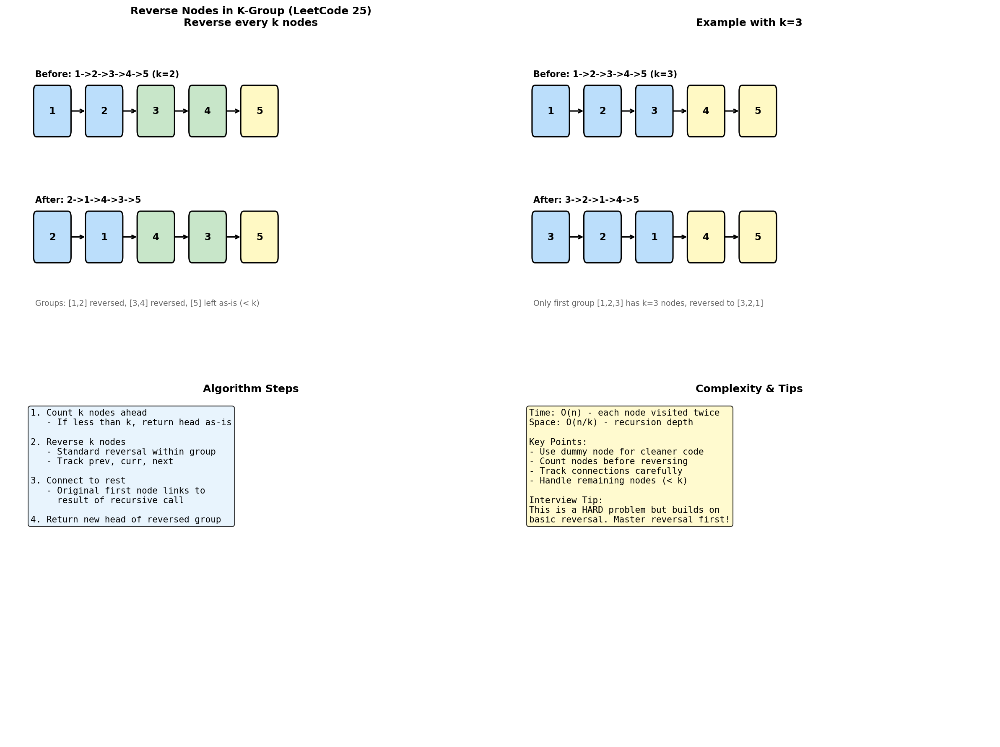

# Reverse Nodes in K-Group

> **Reversing linked list segments of size k**

---

## Overview

Reversing nodes in k-groups is a classic hard problem that builds upon basic linked list reversal. It requires careful tracking of group boundaries and proper connection between reversed segments.



---

## Problem Statement (LeetCode #25)

Given a linked list, reverse the nodes of the list k at a time and return the modified list. k is a positive integer and is less than or equal to the length of the linked list. If the number of nodes is not a multiple of k, leave the remaining nodes as they are.

### Examples

```
Input: 1 -> 2 -> 3 -> 4 -> 5, k = 2
Output: 2 -> 1 -> 4 -> 3 -> 5

Input: 1 -> 2 -> 3 -> 4 -> 5, k = 3
Output: 3 -> 2 -> 1 -> 4 -> 5
```

---

## Recursive Solution

```python
def reverseKGroup(head: ListNode, k: int) -> ListNode:
    """
    Recursive approach to reverse nodes in k-groups.

    Algorithm:
    1. Check if there are k nodes to reverse
    2. Reverse k nodes
    3. Recursively process remaining list
    4. Connect reversed group to result of recursive call

    Time: O(n), Space: O(n/k) for recursion
    """
    # Step 1: Check if we have k nodes
    curr = head
    count = 0
    while curr and count < k:
        curr = curr.next
        count += 1

    # If less than k nodes, return head as-is
    if count < k:
        return head

    # Step 2: Reverse k nodes
    prev = None
    curr = head
    for _ in range(k):
        next_temp = curr.next
        curr.next = prev
        prev = curr
        curr = next_temp

    # Step 3: Recursively process rest and connect
    # head is now the tail of reversed group
    head.next = reverseKGroup(curr, k)

    # prev is the new head of reversed group
    return prev
```

::: info Complexity: Time O(n) · Space O(n/k)
- **Time:** O(n) because each node is visited twice: once for counting, once for reversing
- **Space:** O(n/k) for the recursion stack, with one frame per k-group
:::

---

## Iterative Solution

```python
def reverseKGroup_iterative(head: ListNode, k: int) -> ListNode:
    """
    Iterative approach - more complex but O(1) space.

    Time: O(n), Space: O(1)
    """
    dummy = ListNode(0)
    dummy.next = head
    prev_group_end = dummy

    while True:
        # Check if k nodes exist
        kth = prev_group_end
        for _ in range(k):
            kth = kth.next
            if not kth:
                return dummy.next  # Less than k nodes remaining

        # Mark group boundaries
        group_start = prev_group_end.next
        group_end = kth
        next_group_start = kth.next

        # Reverse the group
        prev = next_group_start
        curr = group_start
        while curr != next_group_start:
            next_temp = curr.next
            curr.next = prev
            prev = curr
            curr = next_temp

        # Connect reversed group
        prev_group_end.next = group_end
        prev_group_end = group_start
```

::: info Complexity: Time O(n) · Space O(1)
- **Time:** O(n) because each node is visited twice: once to count k nodes, once to reverse
- **Space:** O(1) because we only use pointers without any recursion or additional data structures
:::

### Step-by-Step Example (k=3)

```
Initial: dummy -> 1 -> 2 -> 3 -> 4 -> 5
         prev_group_end = dummy

Group 1: [1, 2, 3]
- Count k nodes: OK
- Reverse: 3 -> 2 -> 1
- Connect: dummy -> 3 -> 2 -> 1 -> 4 -> 5
- prev_group_end = node 1

Group 2: [4, 5]
- Count k nodes: Only 2 < 3
- Return (no reversal)

Result: 3 -> 2 -> 1 -> 4 -> 5
```

---

## Helper Function Approach

```python
def reverseKGroup_helper(head: ListNode, k: int) -> ListNode:
    """
    Using helper functions for clarity.
    """
    dummy = ListNode(0)
    dummy.next = head
    prev = dummy

    while True:
        # Find kth node
        kth = getKth(prev, k)
        if not kth:
            break

        # Mark next group start
        next_start = kth.next

        # Reverse group
        new_head, new_tail = reverseGroup(prev.next, kth)

        # Connect
        prev.next = new_head
        new_tail.next = next_start
        prev = new_tail

    return dummy.next


def getKth(start: ListNode, k: int) -> ListNode:
    """Get kth node from start."""
    curr = start
    for _ in range(k):
        if not curr:
            return None
        curr = curr.next
    return curr


def reverseGroup(start: ListNode, end: ListNode) -> tuple:
    """
    Reverse nodes from start to end (inclusive).
    Returns (new_head, new_tail).
    """
    prev = None
    curr = start
    end_next = end.next

    while curr != end_next:
        next_temp = curr.next
        curr.next = prev
        prev = curr
        curr = next_temp

    return (prev, start)  # end becomes head, start becomes tail
```

::: info Complexity: Time O(n) · Space O(1)
- **Time:** O(n) because each node is processed exactly twice (count and reverse)
- **Space:** O(1) because helper functions use only constant pointers
:::

---

## Reverse Alternate K-Groups

### Problem Variant

Reverse every other k-group.

```python
def reverseAlternateKGroup(head: ListNode, k: int) -> ListNode:
    """
    Reverse first k, skip k, reverse k, skip k, ...
    """
    dummy = ListNode(0)
    dummy.next = head
    prev = dummy
    should_reverse = True

    while True:
        # Check if k nodes exist
        kth = prev
        for _ in range(k):
            kth = kth.next
            if not kth:
                return dummy.next

        if should_reverse:
            # Reverse this group
            group_start = prev.next
            next_start = kth.next

            p = next_start
            c = group_start
            while c != next_start:
                n = c.next
                c.next = p
                p = c
                c = n

            prev.next = kth
            prev = group_start
        else:
            # Skip this group
            prev = kth

        should_reverse = not should_reverse

    return dummy.next
```

::: info Complexity: Time O(n) · Space O(1)
- **Time:** O(n) because we traverse the list, alternately reversing and skipping k-groups
- **Space:** O(1) because we use only pointers without recursion
:::

---

## Reverse Last K Nodes Only

```python
def reverseLastK(head: ListNode, k: int) -> ListNode:
    """
    Reverse only the last k nodes.
    """
    if not head:
        return head

    # Find length
    length = 0
    curr = head
    while curr:
        length += 1
        curr = curr.next

    if k >= length:
        return reverseList(head)

    # Find node before last k
    dummy = ListNode(0)
    dummy.next = head
    prev = dummy

    for _ in range(length - k):
        prev = prev.next

    # Reverse last k
    curr = prev.next
    p = None
    while curr:
        n = curr.next
        curr.next = p
        p = curr
        curr = n

    prev.next = p
    return dummy.next


def reverseList(head):
    prev = None
    curr = head
    while curr:
        n = curr.next
        curr.next = prev
        prev = curr
        curr = n
    return prev
```

::: info Complexity: Time O(n) · Space O(1)
- **Time:** O(n) because we traverse once for length, once to find split point, and once to reverse
- **Space:** O(1) because we only use pointers to rearrange the last k nodes
:::

---

## Complexity Analysis

| Approach | Time | Space |
|----------|------|-------|
| Recursive | O(n) | O(n/k) |
| Iterative | O(n) | O(1) |

Both approaches traverse each node at most twice (once to count, once to reverse).

---

## Common Mistakes

1. **Off-by-one in counting**: Make sure to count exactly k nodes
2. **Not handling < k case**: Remaining nodes should stay unchanged
3. **Losing connections**: Always save next pointers before modifying
4. **Wrong head return**: Return dummy.next, not head
5. **Infinite loops**: Ensure proper advancement of pointers

---

## Edge Cases

| Case | Handling |
|------|----------|
| Empty list | Return None |
| k = 1 | Return head unchanged |
| k = length | Reverse entire list |
| k > length | Return head unchanged |
| length % k != 0 | Leave remaining nodes as-is |

---

## Related Problems

::: details Reverse Linked List (LeetCode 206)
**Problem:** Reverse a singly linked list completely and return the new head.

**Key Insight:** Track three pointers: prev (initially null), curr, and next. Iteratively reverse each link.

**Approach:** For each node, save next, point curr to prev, advance prev to curr, advance curr to next. Return prev as new head.

**Complexity:** Time O(n), Space O(1) iterative / O(n) recursive
:::

::: details Reverse Linked List II (LeetCode 92)
**Problem:** Reverse only the nodes from position left to position right in a linked list.

**Key Insight:** Use dummy node for edge case handling, find the node before left position, then reverse the sublist.

**Approach:** Navigate to left-1, reverse nodes from left to right using standard technique, reconnect the three segments.

**Complexity:** Time O(n), Space O(1)
:::

::: details Swap Nodes in Pairs (LeetCode 24)
**Problem:** Swap every two adjacent nodes in a linked list (essentially Reverse K-Group with k=2).

**Key Insight:** Special case of k-group reversal; can use simpler pair-swap logic without counting.

**Approach:** Use dummy node, for each pair redirect: prev -> second -> first -> next. Advance prev to first.

**Complexity:** Time O(n), Space O(1)
:::

::: details Rotate List (LeetCode 61)
**Problem:** Rotate the list to the right by k places, moving last k nodes to the front.

**Key Insight:** Connect tail to head forming a cycle, then break at the appropriate position (length - k % length).

**Approach:** Find length and tail, connect tail to head, walk (length - k % length) steps from head, break the cycle.

**Complexity:** Time O(n), Space O(1)
:::

---

## Interview Strategy

1. **Start simple**: Mention you know basic reversal
2. **Explain approach**: Count k, reverse, connect
3. **Draw it out**: Show before/after for one group
4. **Handle edge cases**: Less than k nodes
5. **Choose complexity**: Recursive (easier) vs Iterative (better space)

### Follow-up Questions to Expect

- "What if we want to reverse every other group?"
- "Can you do it in O(1) space?"
- "What's the time complexity?"
- "How do you handle the last group with < k nodes?"

---

## Template Code

```python
def reverseKGroup_template(head: ListNode, k: int) -> ListNode:
    dummy = ListNode(0)
    dummy.next = head
    prev_group = dummy

    while True:
        # 1. Find kth node
        kth = prev_group
        for _ in range(k):
            kth = kth.next
            if not kth:
                return dummy.next  # Done

        # 2. Save boundaries
        group_start = prev_group.next
        next_group = kth.next

        # 3. Reverse the group
        prev, curr = next_group, group_start
        for _ in range(k):
            temp = curr.next
            curr.next = prev
            prev = curr
            curr = temp

        # 4. Connect
        prev_group.next = prev  # kth node is new head
        prev_group = group_start  # Old head is new tail

    return dummy.next
```

---

## Sources

- [Reverse Nodes in K-Group - LeetCode](https://leetcode.com/problems/reverse-nodes-in-k-group/)
- [Reverse Linked List II - LeetCode](https://leetcode.com/problems/reverse-linked-list-ii/)
- [Swap Nodes in Pairs - LeetCode](https://leetcode.com/problems/swap-nodes-in-pairs/)
