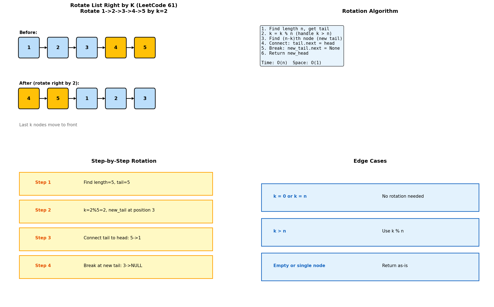
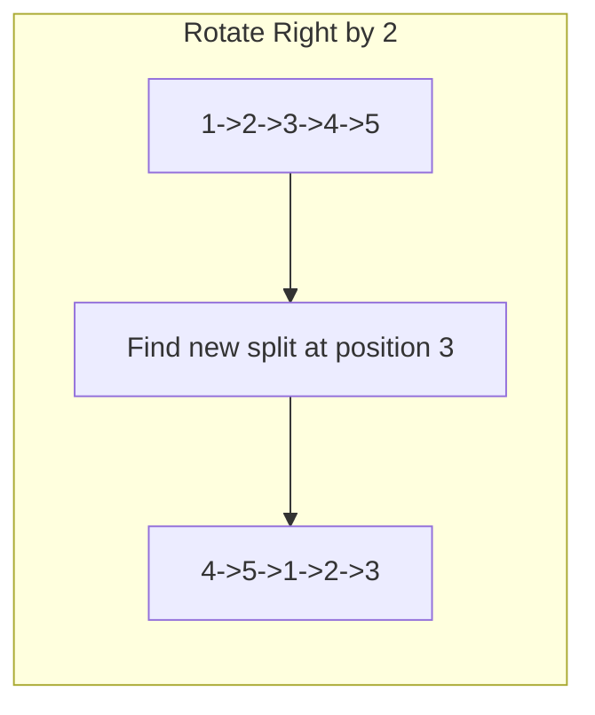
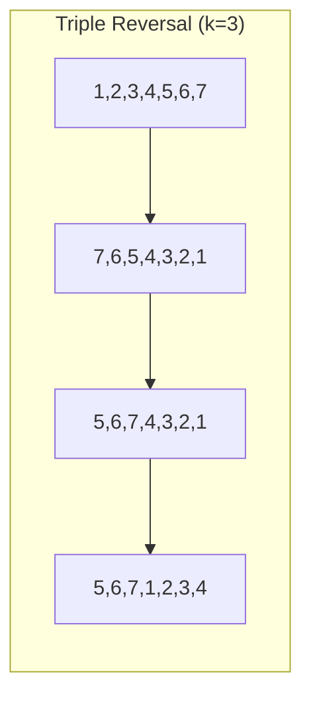
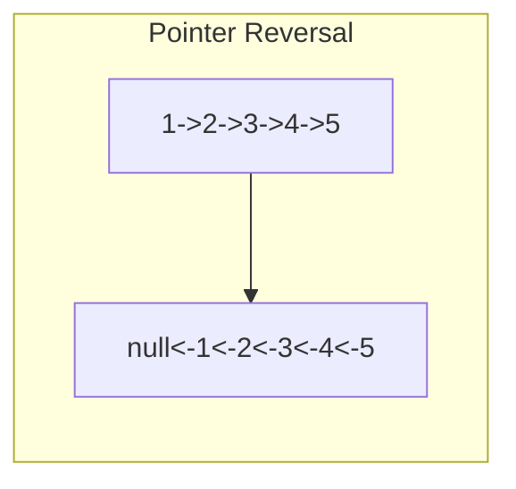
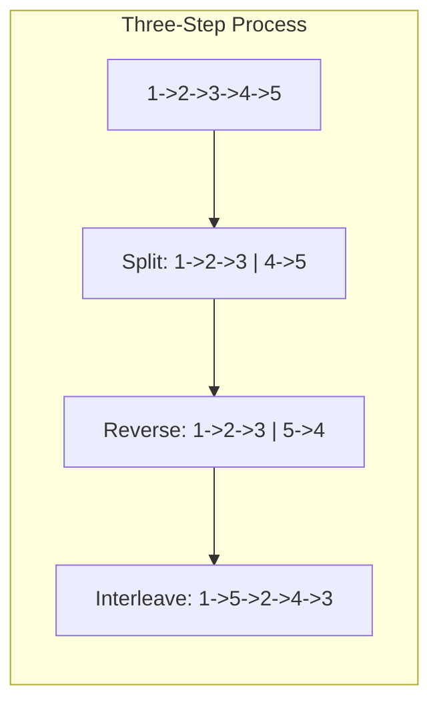

# Rotation Operations

> **Rotating linked lists by k positions**

---

## Overview

Rotation operations involve moving nodes from one end of the list to the other. The key insight is that rotation is equivalent to finding a new split point and reconnecting the list.



---

## Rotate List (LeetCode #61)

### Problem Statement

Given the head of a linked list, rotate the list to the right by k places.

### Example

```
Input: 1 -> 2 -> 3 -> 4 -> 5, k = 2
Output: 4 -> 5 -> 1 -> 2 -> 3

Explanation:
- Last 2 nodes (4, 5) move to front
- Remaining nodes (1, 2, 3) follow
```

### Solution

```python
def rotateRight(head: ListNode, k: int) -> ListNode:
    """
    Rotate list right by k positions.

    Algorithm:
    1. Find length and tail
    2. Normalize k (k = k % length)
    3. Find new tail at position (length - k)
    4. Reconnect: tail.next = head, new_tail.next = None

    Time: O(n), Space: O(1)
    """
    if not head or not head.next or k == 0:
        return head

    # Step 1: Find length and tail
    length = 1
    tail = head
    while tail.next:
        length += 1
        tail = tail.next

    # Step 2: Normalize k
    k = k % length
    if k == 0:
        return head  # No rotation needed

    # Step 3: Find new tail (length - k - 1 steps from head)
    new_tail = head
    for _ in range(length - k - 1):
        new_tail = new_tail.next

    # Step 4: Reconnect
    new_head = new_tail.next
    new_tail.next = None
    tail.next = head

    return new_head
```

::: info Complexity: Time O(n) · Space O(1)
- **Time:** O(n) because we traverse the list twice: once to find length/tail, once to find new tail position
- **Space:** O(1) because we only use pointers (tail, new_tail, new_head) to rearrange the list
:::

### Step-by-Step Example

```
List: 1 -> 2 -> 3 -> 4 -> 5, k = 2
Length = 5, k = 2 % 5 = 2

Step 1: Find tail
tail = node 5

Step 2: k = 2 (already normalized)

Step 3: Find new tail at position (5-2-1) = 2
new_tail = node 3

Step 4: Reconnect
new_head = node 4
3.next = None
5.next = 1

Result: 4 -> 5 -> 1 -> 2 -> 3
```

### Alternative: Make Circular Then Break

```python
def rotateRight_circular(head: ListNode, k: int) -> ListNode:
    """
    Make list circular, then break at the right position.
    """
    if not head or not head.next or k == 0:
        return head

    # Find length and make circular
    length = 1
    current = head
    while current.next:
        length += 1
        current = current.next
    current.next = head  # Make circular

    # Find break point
    k = k % length
    steps_to_new_tail = length - k

    new_tail = current
    for _ in range(steps_to_new_tail):
        new_tail = new_tail.next

    new_head = new_tail.next
    new_tail.next = None

    return new_head
```

::: info Complexity: Time O(n) · Space O(1)
- **Time:** O(n) because we traverse once to find length and make circular, once to find break point
- **Space:** O(1) because we only use pointers to manipulate the circular list
:::

---

## Rotate Left by K

### Problem Variant

Rotate list to the left by k positions.

```python
def rotateLeft(head: ListNode, k: int) -> ListNode:
    """
    Rotate left is equivalent to rotate right by (length - k).
    Or: first k nodes move to end.
    """
    if not head or not head.next or k == 0:
        return head

    # Find length
    length = 0
    current = head
    while current:
        length += 1
        current = current.next

    # Normalize and convert to right rotation
    k = k % length
    if k == 0:
        return head

    # Rotate right by (length - k) is same as rotate left by k
    return rotateRight(head, length - k)
```

::: info Complexity: Time O(n) · Space O(1)
- **Time:** O(n) because we calculate length once and reuse the rotateRight function
- **Space:** O(1) because the conversion to right rotation uses no extra space
:::

### Direct Implementation

```python
def rotateLeft_direct(head: ListNode, k: int) -> ListNode:
    """
    Direct left rotation: move first k nodes to end.
    """
    if not head or not head.next or k == 0:
        return head

    # Find length and tail
    length = 1
    tail = head
    while tail.next:
        length += 1
        tail = tail.next

    k = k % length
    if k == 0:
        return head

    # Find new tail (k-1 steps from head)
    new_tail = head
    for _ in range(k - 1):
        new_tail = new_tail.next

    # Reconnect
    new_head = new_tail.next
    new_tail.next = None
    tail.next = head

    return new_head
```

::: info Complexity: Time O(n) · Space O(1)
- **Time:** O(n) because we traverse to find length/tail, then traverse again to find new tail
- **Space:** O(1) because we only use pointers to rearrange the existing nodes
:::

---

## Rotate by Position (Not Count)

### Problem Variant

Rotate so that the node at position k becomes the new head.

```python
def rotateToPosition(head: ListNode, k: int) -> ListNode:
    """
    Make the k-th node (0-indexed) the new head.
    """
    if not head or not head.next or k == 0:
        return head

    # Find length and tail
    length = 1
    tail = head
    while tail.next:
        length += 1
        tail = tail.next

    k = k % length
    if k == 0:
        return head

    # Find new tail (k-1 steps from head)
    new_tail = head
    for _ in range(k - 1):
        new_tail = new_tail.next

    new_head = new_tail.next
    new_tail.next = None
    tail.next = head

    return new_head
```

::: info Complexity: Time O(n) · Space O(1)
- **Time:** O(n) because we traverse the list twice: once for length/tail, once to find new tail
- **Space:** O(1) because we only manipulate pointers without additional data structures
:::

---

## Rotation with Circular List

### Problem Variant

For a circular list, rotation changes the head position.

```python
def rotateCircular(head: ListNode, k: int) -> ListNode:
    """
    Rotate a circular list - just move head pointer.
    """
    if not head or head.next == head or k == 0:
        return head

    # Find length
    length = 1
    current = head
    while current.next != head:
        length += 1
        current = current.next

    k = k % length
    if k == 0:
        return head

    # Move head forward by (length - k) for right rotation
    new_head = head
    for _ in range(length - k):
        new_head = new_head.next

    return new_head
```

::: info Complexity: Time O(n) · Space O(1)
- **Time:** O(n) because we traverse once to find length, then traverse (length - k) steps to find new head
- **Space:** O(1) because we only update the head pointer without modifying the circular structure
:::

---

## Edge Cases

| Case | Handling |
|------|----------|
| Empty list | Return None |
| Single node | Return head (no change) |
| k = 0 | Return head (no change) |
| k = length | Return head (full rotation = no change) |
| k > length | Use k % length |
| k = length - 1 | Move tail to front |

---

## Complexity Analysis

| Approach | Time | Space |
|----------|------|-------|
| Two-pass (find length, then rotate) | O(n) | O(1) |
| Circular approach | O(n) | O(1) |

Both approaches require traversing the entire list at least once.

---

## Common Mistakes

1. **Not normalizing k**: If k > length, must use k % length
2. **Off-by-one errors**: Careful with (length - k) vs (length - k - 1)
3. **Forgetting to null-terminate**: New tail must point to None
4. **Not handling edge cases**: Single node, k = 0, k = length

---

## Related Problems

::: details Rotate List (LeetCode 61)
**Problem:** Rotate the linked list to the right by k places.

**Key Insight:** Rotation is finding a new split point. Last k nodes move to front.



**Approach:** Find length and tail, normalize k (k%length), find new tail at (length-k-1), reconnect.

**Complexity:** O(n) time, O(1) space
:::

::: details Rotate Array (LeetCode 189)
**Problem:** Rotate array to the right by k steps.

**Key Insight:** Triple reversal: reverse all, reverse first k, reverse rest.



**Approach:** Reverse entire array, reverse first k elements, reverse remaining n-k elements.

**Complexity:** O(n) time, O(1) space
:::

::: details Reverse Linked List (LeetCode 206)
**Problem:** Reverse a singly linked list.

**Key Insight:** Iteratively change next pointers, maintaining prev, curr, and next references.



**Approach:** Three pointers: prev=null, curr=head. For each node: save next, point to prev, advance pointers.

**Complexity:** O(n) time, O(1) space
:::

::: details Reorder List (LeetCode 143)
**Problem:** Reorder L0->L1->...->Ln to L0->Ln->L1->Ln-1->L2->Ln-2->...

**Key Insight:** Combine finding middle, reversing second half, and interleaving both halves.



**Approach:** Find middle with fast-slow, reverse second half, merge alternating from both halves.

**Complexity:** O(n) time, O(1) space
:::

---

## Interview Tips

1. **Clarify direction**: Right rotation vs left rotation
2. **Ask about k**: Can k be larger than length?
3. **Draw the transformation**: Before and after states
4. **Mention edge cases**: What about empty list, single node?
5. **Optimize**: Can skip full rotations with k % length

---

## Rotation vs Reversal

| Operation | Effect | Example |
|-----------|--------|---------|
| Rotate right by k | Last k nodes move to front | 1,2,3,4,5 (k=2) -> 4,5,1,2,3 |
| Rotate left by k | First k nodes move to end | 1,2,3,4,5 (k=2) -> 3,4,5,1,2 |
| Reverse | All nodes in opposite order | 1,2,3,4,5 -> 5,4,3,2,1 |

---

## Sources

- [Rotate List - LeetCode](https://leetcode.com/problems/rotate-list/)
- [Rotate Array - LeetCode](https://leetcode.com/problems/rotate-array/)
