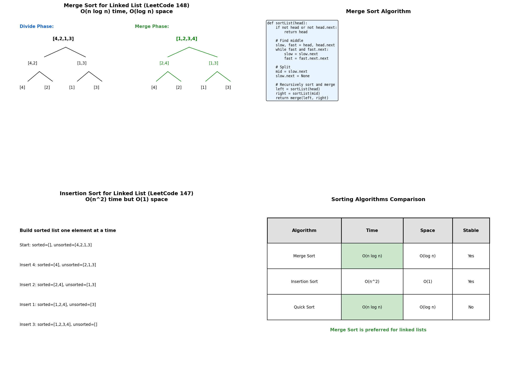
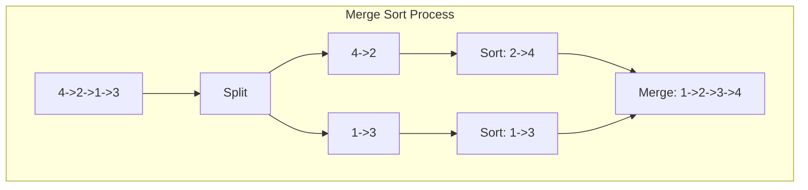
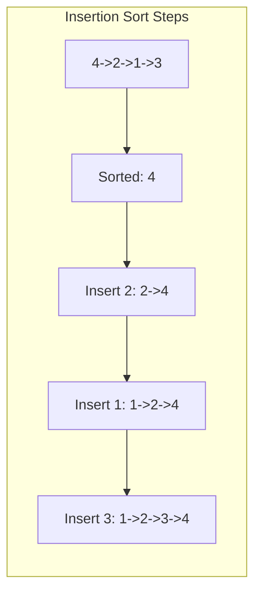
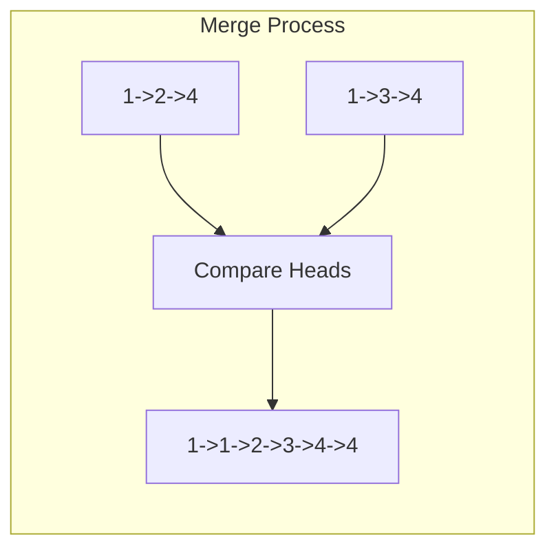
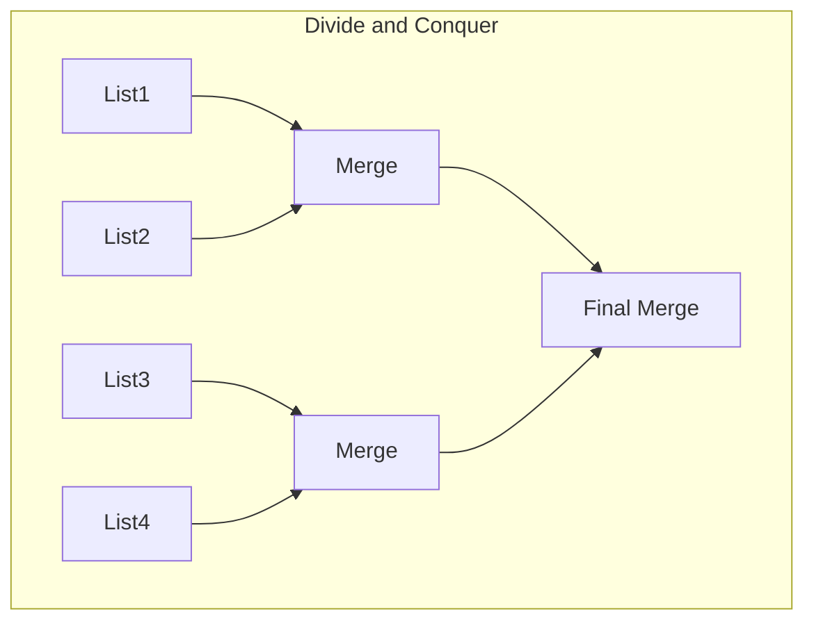

# Sort Operations

> **Sorting linked lists with optimal algorithms**

---

## Overview

Sorting linked lists differs from sorting arrays because random access is not available. Merge sort is typically preferred for linked lists as it naturally fits the sequential access pattern and achieves O(n log n) time with O(log n) space.



---

## Sort List (LeetCode #148)

### Problem Statement

Given the head of a linked list, return the list after sorting it in ascending order.

### Merge Sort Solution

::: code-group

```python [Python]
def sortList(head: ListNode) -> ListNode:
    """
    Merge sort for linked list.
    1. Find middle using fast-slow pointers
    2. Recursively sort each half
    3. Merge sorted halves

    Time: O(n log n), Space: O(log n) for recursion
    """
    # Base case
    if not head or not head.next:
        return head

    # Find middle
    slow, fast = head, head.next
    while fast and fast.next:
        slow = slow.next
        fast = fast.next.next

    # Split
    mid = slow.next
    slow.next = None

    # Recursively sort
    left = sortList(head)
    right = sortList(mid)

    # Merge
    return merge(left, right)


def merge(l1: ListNode, l2: ListNode) -> ListNode:
    """Merge two sorted lists."""
    dummy = ListNode(0)
    current = dummy

    while l1 and l2:
        if l1.val <= l2.val:
            current.next = l1
            l1 = l1.next
        else:
            current.next = l2
            l2 = l2.next
        current = current.next

    current.next = l1 or l2
    return dummy.next
```

```java [Java]
public ListNode sortList(ListNode head) {
    if (head == null || head.next == null) return head;

    ListNode slow = head, fast = head.next;
    while (fast != null && fast.next != null) {
        slow = slow.next;
        fast = fast.next.next;
    }

    ListNode mid = slow.next;
    slow.next = null;

    ListNode left = sortList(head);
    ListNode right = sortList(mid);

    return merge(left, right);
}

private ListNode merge(ListNode l1, ListNode l2) {
    ListNode dummy = new ListNode(0);
    ListNode current = dummy;

    while (l1 != null && l2 != null) {
        if (l1.val <= l2.val) { current.next = l1; l1 = l1.next; }
        else { current.next = l2; l2 = l2.next; }
        current = current.next;
    }

    current.next = (l1 != null) ? l1 : l2;
    return dummy.next;
}
```

:::

::: info Complexity: Time O(n log n) · Space O(log n)
- **Time:** O(n log n) because we divide the list log n times and merge all n elements at each level
- **Space:** O(log n) for the recursion stack depth; the merge operation itself is O(1)
:::

### Bottom-Up Merge Sort (True O(1) Space)

```python
def sortList_bottomUp(head: ListNode) -> ListNode:
    """
    Bottom-up merge sort without recursion.
    True O(1) space complexity.
    """
    if not head or not head.next:
        return head

    # Get length
    length = 0
    current = head
    while current:
        length += 1
        current = current.next

    dummy = ListNode(0)
    dummy.next = head

    # Merge sublists of increasing size: 1, 2, 4, 8, ...
    size = 1
    while size < length:
        prev = dummy
        current = dummy.next

        while current:
            # Get left sublist
            left = current
            right = split(left, size)
            current = split(right, size)

            # Merge and connect
            prev = mergeAndConnect(left, right, prev)

        size *= 2

    return dummy.next


def split(head: ListNode, size: int) -> ListNode:
    """Split list after 'size' nodes, return second part."""
    for _ in range(size - 1):
        if not head:
            break
        head = head.next

    if not head:
        return None

    second = head.next
    head.next = None
    return second


def mergeAndConnect(l1: ListNode, l2: ListNode, prev: ListNode) -> ListNode:
    """Merge two lists and connect to prev, return new tail."""
    current = prev

    while l1 and l2:
        if l1.val <= l2.val:
            current.next = l1
            l1 = l1.next
        else:
            current.next = l2
            l2 = l2.next
        current = current.next

    current.next = l1 or l2

    while current.next:
        current = current.next

    return current
```

::: info Complexity: Time O(n log n) · Space O(1)
- **Time:** O(n log n) because we perform log n passes over the list, each processing all n nodes
- **Space:** O(1) because we eliminate recursion and only use constant extra pointers
:::

---

## Insertion Sort List (LeetCode #147)

### Problem Statement

Sort a linked list using insertion sort.

### Solution

::: code-group

```python [Python]
def insertionSortList(head: ListNode) -> ListNode:
    """
    Insertion sort: build sorted list one node at a time.
    Time: O(n^2), Space: O(1)
    """
    dummy = ListNode(0)  # Sorted list starts empty

    current = head
    while current:
        # Find insertion position in sorted list
        prev = dummy
        while prev.next and prev.next.val < current.val:
            prev = prev.next

        # Save next unsorted node
        next_unsorted = current.next

        # Insert current node
        current.next = prev.next
        prev.next = current

        # Move to next unsorted node
        current = next_unsorted

    return dummy.next
```

```java [Java]
public ListNode insertionSortList(ListNode head) {
    ListNode dummy = new ListNode(0);
    ListNode current = head;

    while (current != null) {
        ListNode prev = dummy;
        while (prev.next != null && prev.next.val < current.val) {
            prev = prev.next;
        }

        ListNode nextUnsorted = current.next;

        current.next = prev.next;
        prev.next = current;

        current = nextUnsorted;
    }

    return dummy.next;
}
```

:::

::: info Complexity: Time O(n^2) · Space O(1)
- **Time:** O(n^2) because for each of n nodes, we may traverse up to n positions to find the insertion point
- **Space:** O(1) because we only use a dummy node and pointers to rearrange existing nodes
:::

### Visual Example

```
Unsorted: 4 -> 2 -> 1 -> 3
Sorted: (empty)

Step 1: Insert 4
Sorted: 4

Step 2: Insert 2 (before 4)
Sorted: 2 -> 4

Step 3: Insert 1 (before 2)
Sorted: 1 -> 2 -> 4

Step 4: Insert 3 (between 2 and 4)
Sorted: 1 -> 2 -> 3 -> 4
```

---

## Quick Sort for Linked List

### Solution

```python
def quickSort(head: ListNode) -> ListNode:
    """
    Quick sort for linked list.
    Note: Not as efficient as merge sort due to pivot selection.
    Time: O(n log n) average, O(n^2) worst
    """
    if not head or not head.next:
        return head

    # Use first node as pivot
    pivot = head
    head = head.next
    pivot.next = None

    # Partition into less, equal, greater
    less_head = ListNode(0)
    equal_head = ListNode(0)
    greater_head = ListNode(0)
    less, equal, greater = less_head, equal_head, greater_head

    equal.next = pivot
    equal = equal.next

    while head:
        next_node = head.next
        head.next = None

        if head.val < pivot.val:
            less.next = head
            less = less.next
        elif head.val > pivot.val:
            greater.next = head
            greater = greater.next
        else:
            equal.next = head
            equal = equal.next

        head = next_node

    # Recursively sort
    sorted_less = quickSort(less_head.next)
    sorted_greater = quickSort(greater_head.next)

    # Connect: less -> equal -> greater
    dummy = ListNode(0)
    current = dummy

    # Attach less
    if sorted_less:
        current.next = sorted_less
        while current.next:
            current = current.next

    # Attach equal
    current.next = equal_head.next
    while current.next:
        current = current.next

    # Attach greater
    current.next = sorted_greater

    return dummy.next
```

::: info Complexity: Time O(n log n) average, O(n^2) worst · Space O(log n)
- **Time:** O(n log n) average because partition typically divides evenly; O(n^2) worst case with poor pivots
- **Space:** O(log n) for recursion stack in average case, O(n) in worst case with unbalanced partitions
:::

---

## Sort List with Comparator

### Custom Sorting

```python
def sortListCustom(head: ListNode, compare) -> ListNode:
    """
    Sort with custom comparison function.
    compare(a, b) returns True if a should come before b.
    """
    if not head or not head.next:
        return head

    # Find middle
    slow, fast = head, head.next
    while fast and fast.next:
        slow = slow.next
        fast = fast.next.next

    mid = slow.next
    slow.next = None

    left = sortListCustom(head, compare)
    right = sortListCustom(mid, compare)

    # Merge with custom compare
    dummy = ListNode(0)
    current = dummy

    while left and right:
        if compare(left.val, right.val):
            current.next = left
            left = left.next
        else:
            current.next = right
            right = right.next
        current = current.next

    current.next = left or right
    return dummy.next


# Usage examples:
# Ascending: sortListCustom(head, lambda a, b: a <= b)
# Descending: sortListCustom(head, lambda a, b: a >= b)
# By absolute value: sortListCustom(head, lambda a, b: abs(a) <= abs(b))
```

::: info Complexity: Time O(n log n) · Space O(log n)
- **Time:** O(n log n) because merge sort divides the list log n times and merges at each level
- **Space:** O(log n) for the recursion stack; custom comparator doesn't affect space complexity
:::

---

## Sort Linked List with Values 0, 1, 2 (Dutch National Flag)

### Problem Variant

Sort a linked list containing only 0s, 1s, and 2s.

::: code-group

```python [Python]
def sortColors(head: ListNode) -> ListNode:
    """
    Three-way partition for 0, 1, 2.
    Similar to Dutch National Flag problem.
    Time: O(n), Space: O(1)
    """
    # Three dummy heads
    zeros = ListNode(0)
    ones = ListNode(0)
    twos = ListNode(0)
    z, o, t = zeros, ones, twos

    current = head
    while current:
        if current.val == 0:
            z.next = current
            z = z.next
        elif current.val == 1:
            o.next = current
            o = o.next
        else:
            t.next = current
            t = t.next
        current = current.next

    # Connect: 0s -> 1s -> 2s
    t.next = None
    o.next = twos.next
    z.next = ones.next

    return zeros.next
```

```java [Java]
public ListNode sortColors(ListNode head) {
    ListNode zeros = new ListNode(0), ones = new ListNode(0), twos = new ListNode(0);
    ListNode z = zeros, o = ones, t = twos;

    ListNode current = head;
    while (current != null) {
        if (current.val == 0) { z.next = current; z = z.next; }
        else if (current.val == 1) { o.next = current; o = o.next; }
        else { t.next = current; t = t.next; }
        current = current.next;
    }

    t.next = null;
    o.next = twos.next;
    z.next = ones.next;

    return zeros.next;
}
```

:::

::: info Complexity: Time O(n) · Space O(1)
- **Time:** O(n) because we traverse the list once, distributing nodes into three buckets
- **Space:** O(1) because we only use dummy heads and pointers to partition existing nodes
:::

---

## Complexity Comparison

| Algorithm | Time (Avg) | Time (Worst) | Space | Stable |
|-----------|------------|--------------|-------|--------|
| Merge Sort | O(n log n) | O(n log n) | O(log n) | Yes |
| Merge Sort (bottom-up) | O(n log n) | O(n log n) | O(1) | Yes |
| Insertion Sort | O(n^2) | O(n^2) | O(1) | Yes |
| Quick Sort | O(n log n) | O(n^2) | O(log n) | No |
| Three-way (0,1,2) | O(n) | O(n) | O(1) | Yes |

---

## Why Merge Sort for Linked Lists?

1. **No random access needed**: Merge sort only requires sequential access
2. **Natural splitting**: Finding middle with fast-slow pointers
3. **In-place merging**: Just rearrange pointers, no extra array
4. **Guaranteed O(n log n)**: Unlike quick sort
5. **Stable sort**: Maintains relative order of equal elements

---

## Common Patterns

### Find Middle Pattern

```python
slow, fast = head, head.next  # Note: head.next for even split
while fast and fast.next:
    slow = slow.next
    fast = fast.next.next
# slow is at middle (or left-middle for even length)
```

### Merge Pattern

```python
dummy = ListNode(0)
current = dummy

while l1 and l2:
    if l1.val <= l2.val:
        current.next = l1
        l1 = l1.next
    else:
        current.next = l2
        l2 = l2.next
    current = current.next

current.next = l1 or l2
return dummy.next
```

---

## Edge Cases

1. **Empty list**: Return None
2. **Single node**: Already sorted
3. **Two nodes**: Simple comparison and swap if needed
4. **All same values**: Should maintain original order (stable)
5. **Already sorted**: Should still work efficiently

---

## Related Problems

::: details Sort List (LeetCode 148)
**Problem:** Sort a linked list in O(n log n) time and constant space.

**Key Insight:** Merge sort is optimal for linked lists - no random access needed, natural splitting.



**Approach:** Find middle with fast-slow pointers, recursively sort both halves, merge sorted lists.

**Complexity:** O(n log n) time, O(log n) space for recursion
:::

::: details Insertion Sort List (LeetCode 147)
**Problem:** Sort a linked list using insertion sort algorithm.

**Key Insight:** Build sorted list one node at a time, finding correct position for each.



**Approach:** Maintain sorted list with dummy head. For each node, find insertion point and insert.

**Complexity:** O(n^2) time, O(1) space
:::

::: details Merge Two Sorted Lists (LeetCode 21)
**Problem:** Merge two sorted linked lists into one sorted list.

**Key Insight:** This is the core merge step used in merge sort for linked lists.



**Approach:** Dummy node for result, compare heads, attach smaller and advance that pointer.

**Complexity:** O(n+m) time, O(1) space
:::

::: details Merge K Sorted Lists (LeetCode 23)
**Problem:** Merge k sorted linked lists into one sorted list.

**Key Insight:** Use min-heap for O(N log K) or divide-and-conquer by merging pairs.



**Approach:** Min-heap: maintain k heads, always pop smallest. D&C: recursively merge pairs of lists.

**Complexity:** O(N log K) time, O(K) space
:::

---

## Interview Tips

1. **Default to merge sort**: It's optimal for linked lists
2. **Know both implementations**: Recursive (easier) and iterative (O(1) space)
3. **Understand why not quick sort**: Poor pivot selection in linked lists
4. **Handle edge cases**: Empty, single node
5. **Mention stability**: Merge sort is stable

---

## Sources

- [Sort List - LeetCode](https://leetcode.com/problems/sort-list/)
- [Insertion Sort List - LeetCode](https://leetcode.com/problems/insertion-sort-list/)
- [Merge Sort for Linked Lists - GeeksforGeeks](https://www.geeksforgeeks.org/merge-sort-for-linked-list/)
