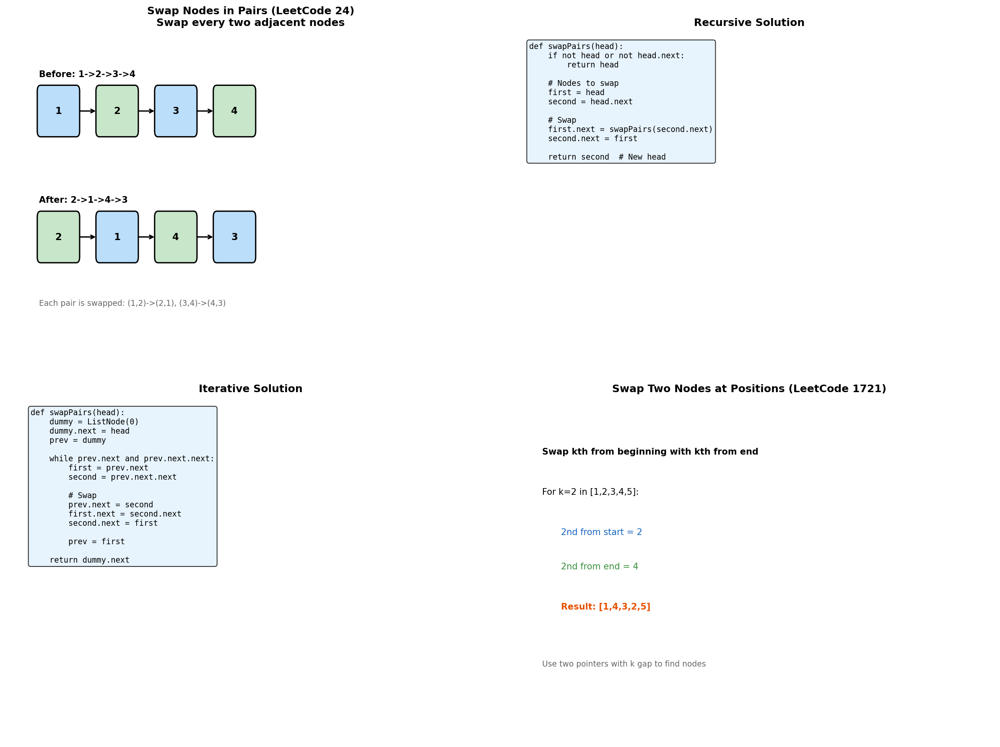

# Swap Operations

> **Swapping nodes and pairs in linked lists**

---

## Overview

Swap operations involve exchanging positions of nodes in a linked list. These problems test your ability to carefully manipulate multiple pointers while maintaining list integrity.



---

## Swap Nodes in Pairs (LeetCode #24)

### Problem Statement

Given a linked list, swap every two adjacent nodes and return its head. You must solve the problem without modifying the values in the list's nodes.

### Iterative Solution

```python
def swapPairs(head: ListNode) -> ListNode:
    """
    Swap every two adjacent nodes.
    Time: O(n), Space: O(1)
    """
    dummy = ListNode(0)
    dummy.next = head
    prev = dummy

    while prev.next and prev.next.next:
        # Nodes to swap
        first = prev.next
        second = prev.next.next

        # Perform swap
        prev.next = second
        first.next = second.next
        second.next = first

        # Move prev forward
        prev = first

    return dummy.next
```

::: info Complexity: Time O(n) · Space O(1)
- **Time:** O(n) because we traverse the list once, processing each pair of nodes
- **Space:** O(1) because we only use pointers (dummy, prev, first, second) regardless of list size
:::

### Recursive Solution

```python
def swapPairs_recursive(head: ListNode) -> ListNode:
    """
    Recursive approach - swap first pair, recurse on rest.
    Time: O(n), Space: O(n) for recursion stack
    """
    # Base case: 0 or 1 nodes
    if not head or not head.next:
        return head

    # Nodes to swap
    first = head
    second = head.next

    # Swap and recurse
    first.next = swapPairs_recursive(second.next)
    second.next = first

    return second  # Second is new head of this pair
```

::: info Complexity: Time O(n) · Space O(n)
- **Time:** O(n) because each node is visited exactly once during recursive calls
- **Space:** O(n) because the recursion stack grows to n/2 frames (one per pair)
:::

### Visual Example

```
Before: 1 -> 2 -> 3 -> 4

Step 1: Swap (1,2)
- prev = dummy, first = 1, second = 2
- dummy -> 2 -> 1 -> 3 -> 4
- prev = 1

Step 2: Swap (3,4)
- prev = 1, first = 3, second = 4
- 1 -> 4 -> 3
- prev = 3

After: 2 -> 1 -> 4 -> 3
```

---

## Swap Kth Node from Beginning and End (LeetCode #1721)

### Problem Statement

Given a linked list, swap the kth node from the beginning with the kth node from the end. Return the head of the linked list after swapping.

### Solution

```python
def swapNodes(head: ListNode, k: int) -> ListNode:
    """
    Swap kth from start with kth from end.
    Time: O(n), Space: O(1)
    """
    # Find kth from beginning
    first = head
    for _ in range(k - 1):
        first = first.next

    # Find kth from end using two pointers
    second = head
    temp = first
    while temp.next:
        second = second.next
        temp = temp.next

    # Swap values (simple approach)
    first.val, second.val = second.val, first.val

    return head
```

::: info Complexity: Time O(n) · Space O(1)
- **Time:** O(n) because we traverse to find kth from start, then use two pointers to find kth from end
- **Space:** O(1) because we only swap values, using a constant number of pointers
:::

### Swap by Rearranging Pointers (More Complex)

```python
def swapNodes_pointers(head: ListNode, k: int) -> ListNode:
    """
    Swap by actually rearranging pointers (harder).
    Handles edge cases like adjacent nodes, same node.
    """
    if not head or not head.next:
        return head

    dummy = ListNode(0)
    dummy.next = head

    # Find kth from beginning and its previous
    prev1 = dummy
    for _ in range(k - 1):
        prev1 = prev1.next
    first = prev1.next

    # Find kth from end and its previous
    prev2 = dummy
    temp = dummy
    for _ in range(k):
        temp = temp.next
    while temp.next:
        prev2 = prev2.next
        temp = temp.next
    second = prev2.next

    # Handle same node case
    if first == second:
        return head

    # Handle adjacent nodes
    if first.next == second:
        prev1.next = second
        first.next = second.next
        second.next = first
    elif second.next == first:
        prev2.next = first
        second.next = first.next
        first.next = second
    else:
        # Non-adjacent swap
        prev1.next = second
        prev2.next = first
        first.next, second.next = second.next, first.next

    return dummy.next
```

::: info Complexity: Time O(n) · Space O(1)
- **Time:** O(n) because we traverse to find both nodes and their predecessors
- **Space:** O(1) because we only use pointers to rearrange nodes without additional data structures
:::

---

## Swap Two Specific Nodes by Value

### Problem Statement

Swap nodes with values x and y.

```python
def swapNodesByValue(head: ListNode, x: int, y: int) -> ListNode:
    """
    Swap nodes with values x and y.
    """
    if x == y:
        return head

    dummy = ListNode(0)
    dummy.next = head

    # Find node x and its prev
    prev_x, node_x = None, None
    prev = dummy
    curr = head
    while curr:
        if curr.val == x:
            prev_x, node_x = prev, curr
            break
        prev = curr
        curr = curr.next

    # Find node y and its prev
    prev_y, node_y = None, None
    prev = dummy
    curr = head
    while curr:
        if curr.val == y:
            prev_y, node_y = prev, curr
            break
        prev = curr
        curr = curr.next

    # If either not found
    if not node_x or not node_y:
        return head

    # Swap
    prev_x.next = node_y
    prev_y.next = node_x
    node_x.next, node_y.next = node_y.next, node_x.next

    return dummy.next
```

::: info Complexity: Time O(n) · Space O(1)
- **Time:** O(n) because we traverse the list twice to find both nodes x and y
- **Space:** O(1) because we only use pointers to track positions and rearrange nodes
:::

---

## Reverse and Swap Alternating Pairs

### Problem Statement

For each pair of nodes, reverse the first and keep the second as is.

```python
def reverseAlternatePairs(head: ListNode) -> ListNode:
    """
    Reverse first pair, keep second pair, alternate.
    1->2->3->4->5->6 becomes 2->1->3->4->6->5
    """
    dummy = ListNode(0)
    dummy.next = head
    prev = dummy
    reverse = True

    while prev.next and prev.next.next:
        first = prev.next
        second = prev.next.next

        if reverse:
            # Swap this pair
            prev.next = second
            first.next = second.next
            second.next = first
            prev = first
        else:
            # Keep this pair
            prev = second

        reverse = not reverse

    return dummy.next
```

::: info Complexity: Time O(n) · Space O(1)
- **Time:** O(n) because we traverse the list once, alternately swapping and skipping pairs
- **Space:** O(1) because we only use pointers regardless of list size
:::

---

## Swap Every K Nodes (Partial)

### Problem Statement

Swap first k nodes with last k nodes.

```python
def swapFirstAndLastK(head: ListNode, k: int) -> ListNode:
    """
    Swap first k nodes with last k nodes.
    """
    if not head:
        return head

    # Get length
    length = 0
    curr = head
    while curr:
        length += 1
        curr = curr.next

    if 2 * k > length:
        return head  # Overlapping sections

    # Collect first k and last k node references
    first_k = []
    last_k = []

    curr = head
    for i in range(length):
        if i < k:
            first_k.append(curr)
        if i >= length - k:
            last_k.append(curr)
        curr = curr.next

    # Swap values
    for i in range(k):
        first_k[i].val, last_k[i].val = last_k[i].val, first_k[i].val

    return head
```

::: info Complexity: Time O(n) · Space O(k)
- **Time:** O(n) because we traverse the list once, collecting first k and last k nodes
- **Space:** O(k) for storing references to the first k and last k nodes
:::

---

## Common Patterns

### Adjacent Pair Swap Pattern

```python
dummy = ListNode(0)
dummy.next = head
prev = dummy

while prev.next and prev.next.next:
    first = prev.next
    second = prev.next.next

    # Swap
    prev.next = second
    first.next = second.next
    second.next = first

    prev = first  # Move to end of swapped pair

return dummy.next
```

### Two-Pointer for Kth from End

```python
# Find kth from end
slow = fast = head
for _ in range(k):
    fast = fast.next
while fast:
    slow = slow.next
    fast = fast.next
# slow is now kth from end
```

---

## Edge Cases

1. **Empty list**: Return None
2. **Single node**: Return as-is (no pair to swap)
3. **Odd number of nodes**: Last node stays in place
4. **k larger than list**: Handle gracefully
5. **Swapping same node**: No change needed
6. **Adjacent nodes**: Special pointer handling

---

## Complexity Summary

| Problem | Time | Space |
|---------|------|-------|
| Swap Pairs (iterative) | O(n) | O(1) |
| Swap Pairs (recursive) | O(n) | O(n) |
| Swap Kth from Start/End | O(n) | O(1) |
| Swap by Value | O(n) | O(1) |

---

## Related Problems

::: details Swap Nodes in Pairs (LeetCode 24)
**Problem:** Given a linked list, swap every two adjacent nodes and return its head without modifying node values.

**Key Insight:** Use a dummy node to handle head changes, and track pairs with prev/first/second pointers.

**Approach:** For each pair, redirect pointers: prev -> second -> first -> next_pair. Move prev to first (new end of swapped pair).

**Complexity:** Time O(n), Space O(1) iterative / O(n) recursive
:::

::: details Swapping Nodes in a Linked List (LeetCode 1721)
**Problem:** Swap the values of the kth node from the beginning and the kth node from the end (1-indexed).

**Key Insight:** Use two-pointer technique to find kth from end - advance fast pointer k steps, then move both until fast reaches end.

**Approach:** Find kth from start, then use two pointers to find kth from end. Swap values (simplest) or rearrange pointers (harder).

**Complexity:** Time O(n), Space O(1)
:::

::: details Reverse Nodes in K-Group (LeetCode 25)
**Problem:** Reverse nodes k at a time in a linked list. If remaining nodes < k, leave them as-is.

**Key Insight:** Count k nodes first, then reverse that segment, and recursively/iteratively handle remaining list.

**Approach:** For each group: verify k nodes exist, reverse them in place, connect reversed segment to rest of list.

**Complexity:** Time O(n), Space O(1) iterative / O(n/k) recursive
:::

::: details Reverse Linked List II (LeetCode 92)
**Problem:** Reverse nodes from position left to position right in a singly linked list.

**Key Insight:** Use dummy node to handle edge case when left=1, track node before reversal segment.

**Approach:** Navigate to position left-1, reverse nodes from left to right using standard reversal, reconnect segments.

**Complexity:** Time O(n), Space O(1)
:::

---

## Interview Tips

1. **Use dummy node**: When head might change
2. **Draw the pointers**: Before and after each swap
3. **Handle edge cases**: Single node, adjacent nodes
4. **Swap values vs nodes**: Clarify what's expected
5. **Test odd length**: Last node handling

---

## Sources

- [Swap Nodes in Pairs - LeetCode](https://leetcode.com/problems/swap-nodes-in-pairs/)
- [Swapping Nodes in Linked List - LeetCode](https://leetcode.com/problems/swapping-nodes-in-a-linked-list/)
