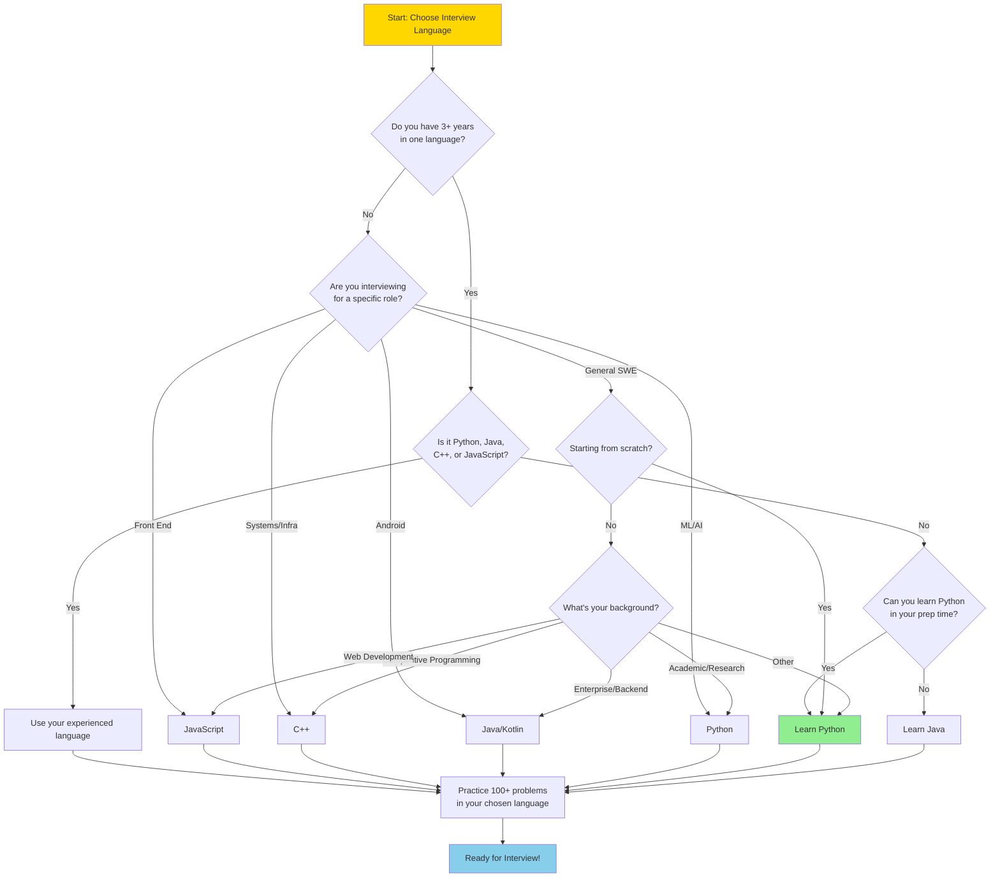

# Choosing the Right Language for Your Technical Interview

> **Select the optimal language to showcase your problem-solving skills**

---

## Overview

Your choice of programming language for a technical interview can significantly impact your performance, though perhaps not in the way you might expect. While the language itself rarely determines success or failure, selecting the right one allows you to:

- **Focus on problem-solving** rather than syntax details
- **Write cleaner, more readable code** under time pressure
- **Communicate your thought process** more effectively to interviewers
- **Leverage built-in data structures** to save precious interview time

The golden rule: **Use the language you know best.** Interviewers evaluate your problem-solving ability, algorithmic thinking, and code quality - not your language choice. However, understanding the tradeoffs between popular interview languages can help you make an informed decision.

### Google's Accepted Languages

Google specifically allows candidates to choose from:
- **Python**
- **Java**
- **C++**
- **JavaScript**
- **Go**

For domain-specific roles (Front End, iOS, Android), you may be required to use a specific language relevant to that platform.

---

## Language Comparison

### Python

**The Interview Favorite**

Python has become the de facto choice for algorithm coding interviews due to its succinct syntax and powerful built-in capabilities.

#### Pros

| Advantage | Description |
|-----------|-------------|
| **Concise Syntax** | Write more logic with fewer lines of code |
| **Readable Code** | Easy for both you and the interviewer to follow |
| **Powerful Built-ins** | Lists, dictionaries, sets, and tuples out of the box |
| **Consistent APIs** | `len()`, `for...in`, slicing work across data structures |
| **Quick Prototyping** | Translate ideas to code rapidly |
| **Lower Cognitive Load** | Focus on algorithms, not language mechanics |

#### Cons

| Disadvantage | Description |
|--------------|-------------|
| **Slower Runtime** | May timeout on edge cases for very large inputs |
| **No Native Heap/Queue** | Must use `heapq` module (less intuitive) |
| **Type Ambiguity** | Interviewers may probe your understanding of underlying types |
| **Whitespace Sensitivity** | Can cause issues in whiteboard interviews |

#### Common Libraries for Interviews

```python
from collections import defaultdict, Counter, deque, OrderedDict
from heapq import heappush, heappop, heapify
from bisect import bisect_left, bisect_right
from itertools import permutations, combinations
from functools import lru_cache
import math
```

#### Python Tips

```python
# Elegant slicing
arr[-1]          # Last element
arr[::-1]        # Reverse array
arr[::2]         # Every second element

# List comprehensions
squares = [x**2 for x in range(10) if x % 2 == 0]

# Dictionary defaults
graph = defaultdict(list)

# Tuple unpacking
for i, val in enumerate(arr):
    pass
```

#### When to Use Python

- You are starting fresh and need to learn a language for interviews
- You prioritize speed of implementation over raw performance
- You want to maximize the number of problems you can attempt
- The role does not specifically require another language

---

### Java

**The Enterprise Standard**

Java remains a strong choice, particularly for candidates with enterprise experience or those interviewing for backend roles.

#### Pros

| Advantage | Description |
|-----------|-------------|
| **Strong OOP Model** | Excellent for demonstrating design principles |
| **Robust Standard Library** | Rich collections framework |
| **Type Safety** | Compile-time error catching |
| **Widely Understood** | Almost every senior engineer can read Java |
| **Cross-Platform** | JVM ensures consistent behavior |
| **Great for System Design** | Natural transition to design discussions |

#### Cons

| Disadvantage | Description |
|--------------|-------------|
| **Verbose Syntax** | Extra keystrokes for type declarations |
| **Boilerplate Code** | Getters, setters, class definitions consume time |
| **Whiteboard Challenges** | Verbosity takes up valuable whiteboard space |
| **Slower Implementation** | More typing means fewer problems attempted |

#### Essential Java Collections

```java
// Key imports
import java.util.*;

// Common data structures
List<Integer> list = new ArrayList<>();
Set<String> set = new HashSet<>();
Map<String, Integer> map = new HashMap<>();
Queue<Integer> queue = new LinkedList<>();
PriorityQueue<Integer> minHeap = new PriorityQueue<>();
PriorityQueue<Integer> maxHeap = new PriorityQueue<>(Collections.reverseOrder());
Deque<Integer> deque = new ArrayDeque<>();
```

#### When to Use Java

- You have extensive Java experience in your career
- You are interviewing for backend or enterprise roles
- You want to demonstrate strong OOP understanding
- The position involves Android development

---

### C++

**The Performance Champion**

C++ offers unmatched performance and is often preferred for systems programming and competitive programming.

#### Pros

| Advantage | Description |
|-----------|-------------|
| **Superior Performance** | Fastest execution among interview languages |
| **Powerful STL** | Excellent algorithms (`std::sort`, `std::lower_bound`) |
| **Memory Control** | Demonstrate low-level programming skills |
| **Competitive Programming** | Language of choice for ICPC, Codeforces |
| **Systems Roles** | Essential for HFT, embedded, and kernel work |

#### Cons

| Disadvantage | Description |
|--------------|-------------|
| **Steep Learning Curve** | Complex syntax and features |
| **Memory Management** | Risk of segmentation faults and leaks |
| **Debugging Difficulty** | Obscure compiler errors |
| **Whiteboard Unfriendly** | Ugly syntax hard to write by hand |
| **Error-Prone** | More opportunities for subtle bugs |

#### Essential C++ STL

```cpp
#include <vector>
#include <string>
#include <unordered_map>
#include <unordered_set>
#include <queue>
#include <stack>
#include <algorithm>

// Common patterns
vector<int> vec;
unordered_map<string, int> map;
unordered_set<int> set;
priority_queue<int> maxHeap;
priority_queue<int, vector<int>, greater<int>> minHeap;

// Useful algorithms
sort(vec.begin(), vec.end());
reverse(vec.begin(), vec.end());
auto it = lower_bound(vec.begin(), vec.end(), target);
```

#### When to Use C++

- You are an experienced competitive programmer
- You are interviewing for systems/infrastructure roles
- The role requires performance optimization expertise
- You are targeting HFT, game development, or embedded systems

---

### JavaScript

**The Web Specialist**

JavaScript is essential for front-end roles and increasingly accepted for general algorithm interviews.

#### Pros

| Advantage | Description |
|-----------|-------------|
| **Required for Front End** | Mandatory for web development roles |
| **Flexible Typing** | Quick prototyping without type declarations |
| **Functional Features** | First-class functions, closures, callbacks |
| **Modern Syntax** | ES6+ offers clean, expressive code |
| **Demonstrate Depth** | Opportunity to discuss language tradeoffs |

#### Cons

| Disadvantage | Description |
|--------------|-------------|
| **Missing Data Structures** | No native Heap, Queue implementations |
| **Type Coercion Quirks** | Unexpected behavior with `==`, `+` |
| **Less Common Choice** | Most candidates prefer Python or Java |
| **Not Ideal for DSA** | Higher-level languages have advantages |

#### Useful JavaScript Patterns

```javascript
// Array methods
const arr = [1, 2, 3, 4, 5];
arr.map(x => x * 2);
arr.filter(x => x > 2);
arr.reduce((acc, x) => acc + x, 0);
arr.sort((a, b) => a - b);  // Numeric sort

// Set and Map
const set = new Set([1, 2, 3]);
const map = new Map();
map.set('key', 'value');

// Object as hash map
const obj = {};
obj['key'] = 'value';

// Destructuring
const [first, ...rest] = arr;
const { name, age } = person;
```

#### When to Use JavaScript

- You are interviewing for Front End Engineer roles
- Your primary experience is in web development
- The role specifically requires JavaScript knowledge
- You want to demonstrate full-stack capabilities

---

## Comparison Table

| Feature | Python | Java | C++ | JavaScript |
|---------|--------|------|-----|------------|
| **Syntax Verbosity** | Low | High | Medium-High | Low |
| **Lines of Code** | Fewest | Most | Medium | Few |
| **Built-in Data Structures** | Excellent | Excellent | Good (STL) | Limited |
| **Execution Speed** | Slowest | Medium | Fastest | Medium |
| **Learning Curve** | Gentle | Moderate | Steep | Moderate |
| **Whiteboard Friendly** | Yes | No | No | Yes |
| **Interviewer Familiarity** | High | High | Medium | Medium |
| **Debug Difficulty** | Easy | Medium | Hard | Medium |
| **Memory Management** | Automatic | Automatic | Manual | Automatic |
| **Type System** | Dynamic | Static | Static | Dynamic |
| **Heap Support** | Module | Native | Native | None |
| **Queue Support** | Module | Native | Native | None |
| **Most Common Usage** | 45% | 35% | 15% | 5% |
| **Google Internal Usage** | High | Medium | High | Medium |

---

## Google's Perspective

### What Google Accepts

Google officially accepts **Java, C++, Python, JavaScript, and Go** for algorithmic coding interviews. The company emphasizes that:

> "The primary focus is on your ability to solve problems, write clean and efficient code, and demonstrate a strong understanding of computer science fundamentals, rather than on any specific programming language."

### Google's Internal Language Culture

- **C/C++** - Historically core to Google's infrastructure
- **Python** - Widely used for scripting, ML/AI, and tooling
- **Java** - Backend services and Android development
- **Go** - Cloud infrastructure and distributed systems
- **JavaScript/TypeScript** - Front-end applications

### What Interviewers Actually Care About

1. **Problem-solving approach** - How you break down complex problems
2. **Code correctness** - Does your solution work for all cases?
3. **Time/space complexity** - Can you analyze and optimize?
4. **Code quality** - Is your code readable and maintainable?
5. **Communication** - Can you explain your thought process?

### Language-Specific Considerations

| Role Type | Recommended Language |
|-----------|---------------------|
| General SWE | Python or Java |
| Systems/Infrastructure | C++ |
| Front End | JavaScript |
| Android | Java or Kotlin |
| ML/AI | Python |
| Cloud/Distributed | Go or Java |

---

## Recommendation

### Decision Framework

```
IF you are new to interview preparation:
    USE Python (fastest to learn, most forgiving)

ELSE IF you have 3+ years experience in a specific language:
    USE that language (familiarity beats optimization)

ELSE IF you are targeting a domain-specific role:
    USE the domain's primary language

ELSE:
    USE Python (optimal for most candidates)
```

### The Verdict

**For most candidates, Python is the optimal choice** for coding interviews because:

1. **Minimum viable code** - Express solutions in fewer lines
2. **Maximum focus on algorithms** - Less time on syntax, more on logic
3. **Forgiving under pressure** - Dynamic typing reduces errors
4. **Interviewer-friendly** - Easy to read and discuss
5. **Versatile** - Works for any algorithm problem type

### Exceptions to Choose Another Language

| Scenario | Recommended Language |
|----------|---------------------|
| Deep Java/C++ expertise (5+ years) | Stick with your expertise |
| Competitive programming background | C++ |
| Front-end specific role | JavaScript |
| Systems programming role | C++ |
| Android development role | Java/Kotlin |
| Already practiced extensively in one language | Continue with that language |

### Final Advice

> "The interview isn't a battle of languages; it's a battle of problem-solving skills. The best language for a Google interview is the one you can code the cleanest, fastest, and most confidently."

---

## Past Interview Insights

### Real Candidate Experiences

#### Success Story: Python at Google

One candidate shared their experience with Google's secret recruiting tool:

> "While working on a project, I Googled 'python lambda function list comprehension.' The search results split and folded back to reveal a box that said 'You're speaking our language. Up for a challenge?'"

The candidate chose Python for the challenges and eventually received a recruiter email after solving the problems.

#### The Power of Consistency

A Google engineer reflected on their preparation:

> "When studying for my first ever coding interviews, I was in absolute dread. The only thing that kept me going was the hope that consistency is key to success. And it was true. It took about four months of studying, four hours a day on average."

#### Common Patterns from Successful Candidates

| Insight | Source |
|---------|--------|
| Most candidates pick Python or Java | [Tech Interview Handbook](https://www.techinterviewhandbook.org/programming-languages-for-coding-interviews/) |
| Focus on problem-solving, not language mastery | [Design Gurus](https://www.designgurus.io/answers/detail/which-language-is-best-for-google-coding-interview) |
| Use the language you are most comfortable with | [Interview Kickstart](https://interviewkickstart.com/blogs/articles/programming-languages-google-tech-interview) |
| Python's concise syntax is a significant advantage | [Free Code Camp](https://www.freecodecamp.org/news/coding-interviews-for-dummies-5e048933b82b/) |

### What Interviewers Say

> "FAANG interviewers care more about how you think than how many problems you solved. Focusing on fundamentals, problem patterns, and clear communication is far more effective than brute-forcing hundreds of questions."

---

## Language Selection Decision Tree



---

## Quick Reference Card

### Language at a Glance

| Criteria | Winner | Runner-up |
|----------|--------|-----------|
| **Fastest to Write** | Python | JavaScript |
| **Best Performance** | C++ | Java |
| **Easiest to Debug** | Python | Java |
| **Best for Beginners** | Python | Java |
| **Most Whiteboard Friendly** | Python | JavaScript |
| **Best Built-in DS** | Java | Python |
| **Most Versatile** | Python | Java |

### Essential Syntax Cheat Sheet

#### Reversing Collections
```python
# Python
arr[::-1]                    # List
s[::-1]                      # String

# Java
Collections.reverse(list);   // List
new StringBuilder(s).reverse().toString();  // String

# C++
reverse(v.begin(), v.end()); // Vector
reverse(s.begin(), s.end()); // String

# JavaScript
arr.reverse();               // Array
s.split('').reverse().join('');  // String
```

#### Sorting
```python
# Python
arr.sort()                   # In-place
sorted(arr)                  # Returns new
arr.sort(key=lambda x: x[1]) # Custom key

# Java
Collections.sort(list);
list.sort((a, b) -> a - b);

# C++
sort(v.begin(), v.end());
sort(v.begin(), v.end(), greater<int>());

# JavaScript
arr.sort((a, b) => a - b);
```

#### Hash Maps
```python
# Python
d = {}; d = defaultdict(list)

# Java
Map<K, V> map = new HashMap<>();

# C++
unordered_map<K, V> map;

# JavaScript
const map = new Map(); // or {}
```

### Time Allocation by Language

| Task | Python | Java | C++ |
|------|--------|------|-----|
| Problem Understanding | 5 min | 5 min | 5 min |
| Solution Design | 10 min | 10 min | 10 min |
| Coding | 10 min | 15 min | 15 min |
| Testing & Debug | 5 min | 8 min | 10 min |
| **Total** | **30 min** | **38 min** | **40 min** |

---

## Sources

- [Tech Interview Handbook - Programming Languages for Coding Interviews](https://www.techinterviewhandbook.org/programming-languages-for-coding-interviews/)
- [Interview Kickstart - Top Programming Languages for Google Tech Interviews](https://interviewkickstart.com/blogs/articles/programming-languages-google-tech-interview)
- [Design Gurus - Which Language is Best for Google Coding Interview](https://www.designgurus.io/answers/detail/which-language-is-best-for-google-coding-interview)
- [Free Code Camp - How to Rock the Coding Interview](https://www.freecodecamp.org/news/coding-interviews-for-dummies-5e048933b82b/)
- [Educative - Google Coding Interview: The Definitive Prep Guide](https://www.educative.io/blog/google-coding-interview)
- [Dev.to - Python vs. Java vs. C++: Best Language for Coding Interviews 2025](https://dev.to/alex_hunter_44f4c9ed6671e/python-vs-java-vs-c-the-best-language-for-coding-interviews-in-2025-3ak8)
- [LeetCopilot - Python vs Java vs C++ for Coding Interviews](https://leetcopilot.dev/blog/python-vs-java-cpp-best-language-coding-interviews-2025)
- [The Hustle - Google Has a Secret Interview Process](https://thehustle.co/the-secret-google-interview-that-landed-me-a-job)

---

*Last updated: January 2025*
