# Tips for Acing Technical Coding Interviews

> **Master the art of technical interviews with proven strategies from industry experts and successful candidates**

---

## Overview

Technical coding interviews at top tech companies like Google, Meta, Amazon, Apple, and Netflix (FAANG) are notoriously challenging. However, with the right preparation strategy, structured approach, and mindset, you can significantly increase your chances of success.

Research shows that candidates who complete **5 mock interviews** before their actual interview **double their chances of passing**. This guide compiles battle-tested strategies from successful candidates, interview experts, and hiring managers to help you ace your next technical interview.

::: tip Key Insight
Approximately 80% of candidates fail coding interviews, often due to preventable mistakes rather than a lack of technical knowledge. The strategies in this guide address both technical preparation and the soft skills that interviewers evaluate.
:::

---

## Before the Interview

### Technical Preparation

#### Master Data Structures & Algorithms

Your DSA knowledge will be tested in **70-100%** of your interview questions. Focus on:

| Data Structures | Algorithms | Patterns |
|----------------|------------|----------|
| Arrays & Strings | Sorting (Quick, Merge, Heap) | Sliding Window |
| Linked Lists | Binary Search | Two Pointers |
| Trees & Graphs | BFS / DFS | Fast & Slow Pointers |
| Hash Tables | Dynamic Programming | Merge Intervals |
| Stacks & Queues | Recursion & Backtracking | Cyclic Sort |
| Heaps & Tries | Greedy Algorithms | Topological Sort |
| Union-Find | Divide and Conquer | Binary Search variations |

#### Strategic Practice Plan

1. **Topic-Focused Approach**: Dedicate one week to each major topic. This ensures thorough understanding of all question variations (easy, medium, hard) within that category.

2. **LeetCode Strategy**: Practice around **50 medium-level problems** to build speed and confidence. For Google specifically, focus on the **top 50 latest Google-tagged problems**.

3. **Daily Commitment**: Dedicate **1-2 hours daily** to coding practice. Consistency is more valuable than marathon sessions.

4. **Pattern Recognition**: Build a mental map linking common problem cues to patterns. If you can quickly identify underlying patterns (dynamic programming, graph traversal, etc.) in new problems, you are interview-ready.

### Environment Preparation

::: warning Important
Google phone screens are conducted in **Google Docs** - not an IDE. Practice coding without:
- Auto-completion
- Syntax highlighting
- A compiler
:::

**Practice Tips:**
- Write code in Google Docs or on a whiteboard
- Time yourself (45 minutes per problem)
- Get comfortable with your chosen language without relying on IDE features
- Use Python, Java, or C++ - pick one and become fluent

### Mock Interviews

> "People who have experienced technical interviews before have a higher chance of clearing FAANG interviews because the interview environment helps you gain insights into your skill level."

**Recommended platforms:**
- [Pramp](https://www.pramp.com) - Free peer-to-peer mock interviews
- [Interviewing.io](https://interviewing.io) - Practice with engineers from top companies
- Practice with friends or mentors who can provide honest feedback

---

## During the Interview

### The Golden Rules

1. **Never Code Silently** - Explain your reasoning and assumptions step by step
2. **Never Jump to Code** - Even if you know the answer, discuss your approach first
3. **Treat It as Collaboration** - The interviewer is your teammate, not your adversary
4. **Stay Calm When Stuck** - Talk through what you understand, outline a brute-force approach, and identify challenges

### Communication Framework

```
1. LISTEN actively to the problem
2. CLARIFY by asking questions
3. DISCUSS your approach and get feedback
4. CODE while explaining your logic
5. TEST with examples including edge cases
6. ANALYZE time and space complexity
```

### When You Get Stuck

::: tip Pro Tip
Google interviewers value logical reasoning and a growth mindset even when you are stuck. Showing how you think through problems is as important as solving them.
:::

**Recovery Strategy:**
1. Acknowledge the challenge: "I'm working through this part..."
2. Share your partial understanding
3. Start with a brute-force solution
4. Ask clarifying questions that might unlock insights
5. Think out loud - the interviewer may provide hints

---

## The UMPIRE Framework

The **UMPIRE method** is a proven structured approach for solving coding interview problems, developed by CodePath.org.

### What is UMPIRE?

| Letter | Step | Description |
|--------|------|-------------|
| **U** | Understand | Explore constraints, ask questions, understand test cases |
| **M** | Match | Match to known problem categories and patterns |
| **P** | Plan | Discuss approach, data structures, get interviewer feedback |
| **I** | Implement | Write clean, working code |
| **R** | Review | Debug by stepping through code line by line |
| **E** | Evaluate | Analyze Big-O complexity and discuss trade-offs |

### UMPIRE in Action

```mermaid
flowchart TD
    A[Receive Problem] --> B[U: Understand]
    B --> B1[Read problem carefully]
    B1 --> B2[Ask clarifying questions]
    B2 --> B3[Create test cases]
    B3 --> C[M: Match]
    C --> C1[Identify problem category]
    C1 --> C2[Recall similar patterns]
    C2 --> D[P: Plan]
    D --> D1[Discuss approach with interviewer]
    D1 --> D2[Write pseudocode]
    D2 --> D3[Get feedback before coding]
    D3 --> E[I: Implement]
    E --> E1[Write clean code]
    E1 --> E2[Use clear variable names]
    E2 --> E3[Add comments if needed]
    E3 --> F[R: Review]
    F --> F1[Step through with test case]
    F1 --> F2[Track variable values]
    F2 --> F3[Fix bugs found]
    F3 --> G[E: Evaluate]
    G --> G1[State time complexity]
    G1 --> G2[State space complexity]
    G2 --> G3[Discuss optimizations]
    G3 --> H[Solution Complete]

    style A fill:#e1f5fe
    style H fill:#c8e6c9
    style B fill:#fff3e0
    style C fill:#fff3e0
    style D fill:#fff3e0
    style E fill:#fff3e0
    style F fill:#fff3e0
    style G fill:#fff3e0
```



### Step-by-Step Breakdown

#### 1. Understand (4-5 minutes)
- Read the problem statement carefully
- Ask clarifying questions about inputs, outputs, and constraints
- Create 2-3 test cases including edge cases
- Confirm your understanding with the interviewer

**Questions to ask:**
- "What is the expected input size?"
- "Can there be duplicate values?"
- "Should I handle empty inputs?"
- "What should I return if no solution exists?"

#### 2. Match (1-2 minutes)
Identify which category the problem belongs to:
- Is it a graph problem? (BFS/DFS)
- Does it involve optimization? (DP/Greedy)
- Is there a sorted array? (Binary Search)
- Do we need to track frequencies? (Hash Map)

#### 3. Plan (3-5 minutes)
- Explain your approach verbally
- Write pseudocode if helpful
- Discuss time/space complexity of your planned approach
- **Get interviewer buy-in before coding**

#### 4. Implement (15-20 minutes)
- Write clean, readable code
- Use meaningful variable names
- Implement one sub-problem at a time
- Use helper functions for modularity

#### 5. Review (3-5 minutes)
> "Most interviewees just skim through the code to say 'yeah that looks right,' but that IS NOT what review means. It means go through it as if you are debugging it, assuming there is a bug."

- Create a watchlist of variables
- Step through the code line by line
- Trace through with a simple test case
- Verify each step produces expected values

#### 6. Evaluate (2-3 minutes)
- State the time complexity (Big-O)
- State the space complexity
- Discuss any trade-offs
- Mention potential optimizations if time permits

---

## Common Mistakes to Avoid

### 1. Not Fully Understanding the Problem
**The Mistake:** Jumping into coding without clarifying requirements
**The Fix:** Spend 4-5 minutes asking questions and creating test cases

### 2. Staying Silent While Coding
**The Mistake:** Coding without explaining your thought process
**The Fix:** Narrate your approach - "I'm using a hash map here because..."

### 3. Ignoring Edge Cases
**The Mistake:** Code works for normal inputs but fails on empty arrays, single elements, or negative numbers
**The Fix:** Always discuss edge cases upfront and test for them

### 4. Rushing Into Code Without a Plan
**The Mistake:** Starting to code with a half-baked solution
**The Fix:** Write pseudocode first, get interviewer feedback, then implement

### 5. Poor Time Management
**The Mistake:** Spending 30 minutes on understanding, leaving 15 minutes for coding
**The Fix:** Follow UMPIRE time allocations strictly

### 6. Overcomplicating Solutions
**The Mistake:** Building overly complex solutions when simpler ones exist
**The Fix:** Start simple, optimize only if needed

### 7. Not Testing Your Code
**The Mistake:** Declaring "done" without running through test cases
**The Fix:** Always trace through at least one example manually

### 8. Forgetting Complexity Analysis
**The Mistake:** Not being able to explain Big-O when asked
**The Fix:** Make it a habit to analyze every solution you write

### 9. Not Researching the Company
**The Mistake:** Unable to answer "Why Google?" or similar questions
**The Fix:** Research the company, its products, culture, and recent news

### 10. Skipping Mock Interviews
**The Mistake:** Going into real interviews without practice
**The Fix:** Complete at least 5 mock interviews before the real thing

---

## Google-Specific Tips

### What Google Evaluates

Google uses **four key hiring criteria**, and each interviewer grades candidates on a scale of 1-4:

| Criterion | Description |
|-----------|-------------|
| **Cognitive Ability** | Problem-solving skills, ability to learn and adapt |
| **Technical Skills** | DSA knowledge, coding ability, system design |
| **Leadership** | Taking initiative, helping others, driving results |
| **Googleyness** | Cultural fit, collaboration, comfort with ambiguity |

::: info Passing Threshold
A score of **3 or higher** is typically required in each area for a hire recommendation.
:::

### Google Interview Format

| Stage | Duration | Focus |
|-------|----------|-------|
| Phone Screen | 45 min | 1-2 coding problems (Google Docs) |
| Onsite Round 1-2 | 45 min each | Medium/Hard DSA problems |
| Onsite Round 3 | 45 min | System Design (for mid/senior) |
| Googleyness Round | 45 min | Behavioral questions |

### The Googleyness Round

Prepare stories using the **STAR method** (Situation, Task, Action, Result) for:

- Your most cherished career accomplishment
- The most challenging moment you have faced
- A time you demonstrated strong leadership
- When you challenged the status quo
- How you have fostered inclusion in your team
- A situation where you dealt with conflict

### Google-Specific Best Practices

1. **Verbalize Everything**: Google interviewers explicitly want to hear your thought process

2. **Always State Complexity**: Even if not asked, explain time and space complexity

3. **Code Neatness Matters**: Good variable names, proper indentation, clean structure

4. **Be Authentic**: Google values diverse perspectives - be yourself

5. **Show Growth Mindset**: How you handle being stuck matters as much as solving the problem

6. **Tech Stack is Flexible**: Google cares about fundamentals, not specific languages/frameworks

---

## Past Google Interview Insights

### Real Candidate Experiences (2024)

Based on documented interview experiences from successful Google candidates:

#### Interview Structure Insights
> "The entire end-to-end process may take a couple of months. From the recruiter reaching out to receiving results of the onsite rounds took three months." - [Google Interview Experience 2024](https://medium.com/@sahilg.2931/google-interview-experience-2024-sde-2-4d56a88685bd)

#### What Worked for Successful Candidates

1. **From a Google L3 (SDE-2) Candidate:**
   > "In technical interviews, don't just code silently. Explain your reasoning and assumptions step by step to the interviewer." - [LeetCode Discussion](https://leetcode.com/discuss/interview-experience/4778433/Google-or-SDE-2-(L3)-or-Interview-Experience-India/)

2. **Communication is Key:**
   > "Always tell the interviewer about your approach and its time complexity even if they didn't ask. Never jump directly to coding even if you know the answer." - [GeeksforGeeks Interview Experience](https://www.geeksforgeeks.org/interview-experiences/google-interview-experience-for-sde-2024/)

3. **Team Matching Matters:**
   > "Managers want to know what kind of team you worked with and how you fit in, what work you did, and they want to see if you are a fit for their team." - [DEV Community](https://dev.to/rajeshroyal/interview-experience-at-google-sde-ii-n09)

#### Common Question Types Reported

- Graph traversal (BFS/DFS variations)
- Dynamic programming (medium difficulty)
- String manipulation with constraints
- Tree problems (especially binary trees)
- Array problems with optimization requirements

### Key Takeaways from Interview Experiences

::: tip Success Pattern
Candidates who succeeded consistently mentioned: **preparation time of 2-3 months**, **practicing 100+ LeetCode problems**, and **multiple mock interviews** before the onsite.
:::

---

## Quick Reference Card

```
+------------------------------------------------------------------+
|           TECHNICAL INTERVIEW QUICK REFERENCE                     |
+------------------------------------------------------------------+
|                                                                   |
|  BEFORE THE INTERVIEW                                             |
|  [ ] Master core DSA topics (arrays, trees, graphs, DP)          |
|  [ ] Practice 50+ medium LeetCode problems                       |
|  [ ] Complete 5+ mock interviews                                 |
|  [ ] Research the company thoroughly                             |
|  [ ] Prepare STAR stories for behavioral questions               |
|                                                                   |
+------------------------------------------------------------------+
|                                                                   |
|  THE UMPIRE FRAMEWORK (Time: 45 min total)                       |
|                                                                   |
|  U - Understand    [4-5 min]  Ask questions, create test cases   |
|  M - Match         [1-2 min]  Identify problem pattern           |
|  P - Plan          [3-5 min]  Discuss approach, get feedback     |
|  I - Implement    [15-20 min] Write clean, working code          |
|  R - Review        [3-5 min]  Debug with test cases              |
|  E - Evaluate      [2-3 min]  State Big-O, discuss trade-offs    |
|                                                                   |
+------------------------------------------------------------------+
|                                                                   |
|  DURING THE INTERVIEW - DO                                        |
|  [+] Think out loud constantly                                   |
|  [+] Ask clarifying questions first                              |
|  [+] Discuss approach before coding                              |
|  [+] Handle edge cases explicitly                                |
|  [+] Test your code with examples                                |
|  [+] State time/space complexity                                 |
|                                                                   |
|  DURING THE INTERVIEW - DON'T                                     |
|  [-] Code silently                                               |
|  [-] Jump straight to implementation                             |
|  [-] Ignore edge cases                                           |
|  [-] Skip testing your solution                                  |
|  [-] Panic when stuck - think out loud instead                   |
|  [-] Overcomplicate your solution                                |
|                                                                   |
+------------------------------------------------------------------+
|                                                                   |
|  GOOGLE EVALUATION CRITERIA                                       |
|  1. Cognitive Ability    - Problem-solving, learning             |
|  2. Technical Skills     - DSA, coding, system design            |
|  3. Leadership           - Initiative, driving results           |
|  4. Googleyness          - Culture fit, collaboration            |
|                                                                   |
+------------------------------------------------------------------+
|                                                                   |
|  COMPLEXITY CHEAT SHEET                                           |
|  O(1)       - Hash table lookup, array access                    |
|  O(log n)   - Binary search, balanced tree ops                   |
|  O(n)       - Linear scan, single loop                           |
|  O(n log n) - Efficient sorting (merge, heap, quick)             |
|  O(n^2)     - Nested loops, brute force                          |
|  O(2^n)     - Recursive subsets, backtracking                    |
|                                                                   |
+------------------------------------------------------------------+
```

---

## Additional Resources

### Recommended Preparation Guides
- [Google Coding Interview: The Definitive Prep Guide](https://www.educative.io/blog/google-coding-interview) - Educative
- [Google Software Engineer Interview Guide](https://igotanoffer.com/blogs/tech/google-software-engineer-interview) - IGotAnOffer
- [Crack the Google Interview in 2025](https://dev.to/avinash201199/crack-the-google-interview-in-2025-your-complete-preparation-guide-4bek) - DEV Community
- [UMPIRE Interview Strategy](https://guides.codepath.com/compsci/UMPIRE-Interview-Strategy) - CodePath

### Practice Platforms
- [LeetCode](https://leetcode.com) - Google-tagged problems
- [HackerRank](https://hackerrank.com) - Structured practice tracks
- [Pramp](https://pramp.com) - Free mock interviews
- [Interviewing.io](https://interviewing.io) - Anonymous practice with engineers

### Interview Experience Collections
- [GeeksforGeeks Interview Experiences](https://www.geeksforgeeks.org/interview-experiences/google-interview-experience-for-sde-2024/)
- [LeetCode Interview Discussions](https://leetcode.com/discuss/interview-experience/)
- [Glassdoor Google Reviews](https://www.glassdoor.com/Interview/Google-Interview-Questions-E9079.htm)

---

## Final Words

> "No matter how good you are in your job as a software developer, you may still fail to crack these taxing technical interviews. Cracking these interviews calls for a completely different skill-set which can be developed only through guided preparation and practice."

Technical interviews are a skill that can be learned and improved. The key is **consistent practice**, **structured problem-solving**, and **effective communication**. Follow the UMPIRE framework, avoid common mistakes, and remember that interviewers are evaluating not just your coding ability, but how you think, communicate, and collaborate.

Good luck with your interview preparation!

---

*Last updated: January 2025*
