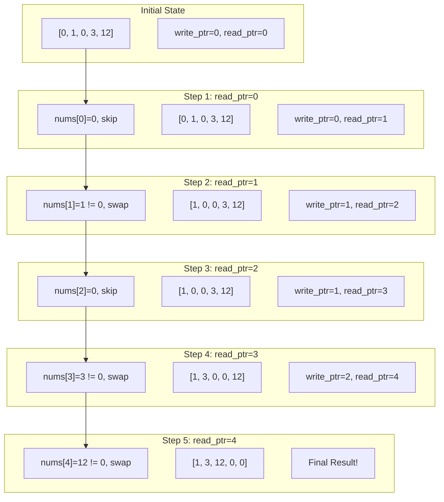
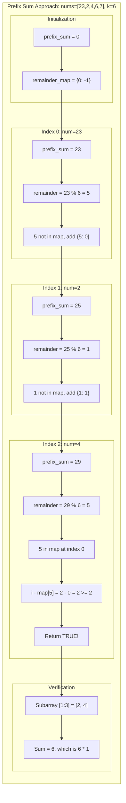
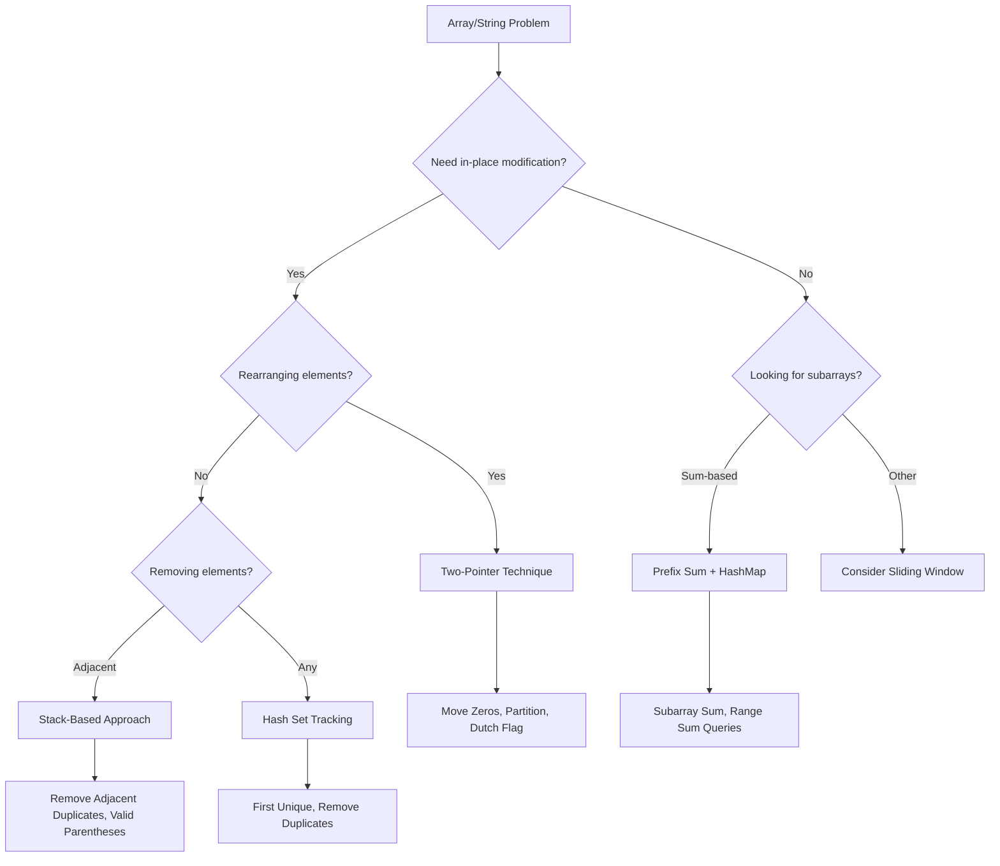

```mermaid
flowchart TB
    subgraph "Adjacent Duplicate Removal: 'abbaca'"
        direction TB

        subgraph "Process 'a'"
            S1["Stack: []"]
            S1A["Push 'a'"]
            S1B["Stack: ['a']"]
        end

        subgraph "Process 'b'"
            S2["Stack: ['a']"]
            S2A["'b' != 'a', Push 'b'"]
            S2B["Stack: ['a','b']"]
        end

        subgraph "Process 'b'"
            S3["Stack: ['a','b']"]
            S3A["'b' == 'b', Pop!"]
            S3B["Stack: ['a']"]
        end

        subgraph "Process 'a'"
            S4["Stack: ['a']"]
            S4A["'a' == 'a', Pop!"]
            S4B["Stack: []"]
        end

        subgraph "Process 'c'"
            S5["Stack: []"]
            S5A["Push 'c'"]
            S5B["Stack: ['c']"]
        end

        subgraph "Process 'a'"
            S6["Stack: ['c']"]
            S6A["'a' != 'c', Push 'a'"]
            S6B["Stack: ['c','a']"]
        end

        subgraph "Result"
            R["Output: 'ca'"]
        end
    end

    S1 --> S1A --> S1B --> S2
    S2 --> S2A --> S2B --> S3
    S3 --> S3A --> S3B --> S4
    S4 --> S4A --> S4B --> S5
    S5 --> S5A --> S5B --> S6
    S6 --> S6A --> S6B --> R
```

# Practice: Warm-Up Problems

> **Three essential problems to calibrate your interview readiness**

These warm-up problems cover fundamental patterns that appear repeatedly in technical interviews. Master these before moving to more complex challenges.

---

## 1. Move Zeros to End of Array

### Problem Statement

Given an integer array `nums`, move all `0`'s to the end of it while maintaining the relative order of the non-zero elements. You must do this **in-place** without making a copy of the array.

**Example:**
- Input: `nums = [0, 1, 0, 3, 12]`
- Output: `[1, 3, 12, 0, 0]`

**Constraints:**
- `1 <= nums.length <= 10^4`
- `-2^31 <= nums[i] <= 2^31 - 1`

### Approach

The **two-pointer technique** is optimal for this problem. We use two pointers:
- `write_ptr`: Tracks where the next non-zero element should be placed
- `read_ptr`: Iterates through the array to find non-zero elements

**Key Insight:** Instead of directly placing non-zero elements, we **swap** them with the element at `write_ptr`. This ensures zeros are pushed toward the end without being overwritten.

**Algorithm Steps:**
1. Initialize `write_ptr = 0`
2. Iterate through the array with `read_ptr`
3. When a non-zero element is found, swap it with `nums[write_ptr]`
4. Increment `write_ptr` after each swap
5. Continue until all elements are processed

### Solution (Python)

```python
def moveZeroes(nums: list[int]) -> None:
    """
    Move all zeros to the end while maintaining relative order of non-zeros.
    Modifies the array in-place.

    Time: O(n) - single pass through array
    Space: O(1) - only two pointers used
    """
    write_ptr = 0  # Position to place next non-zero element

    for read_ptr in range(len(nums)):
        if nums[read_ptr] != 0:
            # Swap non-zero element to the write position
            nums[write_ptr], nums[read_ptr] = nums[read_ptr], nums[write_ptr]
            write_ptr += 1

    # Array is now modified in-place with zeros at the end


# Alternative: Two-pass approach (easier to understand)
def moveZeroes_two_pass(nums: list[int]) -> None:
    """
    Alternative approach: First move all non-zeros, then fill remaining with zeros.
    """
    write_ptr = 0

    # Pass 1: Move all non-zero elements to the front
    for num in nums:
        if num != 0:
            nums[write_ptr] = num
            write_ptr += 1

    # Pass 2: Fill remaining positions with zeros
    while write_ptr < len(nums):
        nums[write_ptr] = 0
        write_ptr += 1
```

::: info Complexity: Time O(n) · Space O(1)
- **Time:** Single pass through the array of n elements, with O(1) swap operation per element
- **Space:** Only two integer pointer variables used regardless of input size (in-place modification)
:::

### Complexity Analysis

| Metric | Complexity | Explanation |
|--------|------------|-------------|
| **Time** | O(n) | Single pass through the array |
| **Space** | O(1) | Only two integer pointers used |

### Mermaid Diagram



### Google Interview Variant

**How Google might phrase this:**

> "You're processing a stream of sensor readings where `0` represents a failed reading. Design an in-place algorithm to compact all valid readings to the front while preserving their order. Discuss trade-offs between different approaches."

**Follow-up questions to expect:**
1. **Stability:** "What if we need to track the original indices of each element?"
2. **Parallelization:** "How would you parallelize this for a very large dataset?"
3. **Generalization:** "What if instead of zeros, we want to move all negative numbers to the end?"
4. **Memory constraints:** "What if the array is memory-mapped and swaps are expensive?"

**Extended variant solution:**

```python
def moveNegativesToEnd(nums: list[int]) -> None:
    """
    Google follow-up: Move all negative numbers to the end.
    Same two-pointer technique applies.
    """
    write_ptr = 0

    for read_ptr in range(len(nums)):
        if nums[read_ptr] >= 0:  # Only change: condition check
            nums[write_ptr], nums[read_ptr] = nums[read_ptr], nums[write_ptr]
            write_ptr += 1
```

::: info Complexity: Time O(n) · Space O(1)
- **Time:** Single pass through all n elements with constant-time swap operations
- **Space:** Two pointer variables only, modifies input array in-place
:::

---

## 2. Remove Duplicates in String

### Problem Statement

Given a string `s`, remove duplicate characters so that each character appears only once. Return the resulting string.

**Variations of this problem:**
- **Basic:** Keep first occurrence of each character
- **LeetCode 1047:** Remove all adjacent duplicate characters repeatedly
- **LeetCode 316:** Remove duplicates to get lexicographically smallest result

**Example (Basic version):**
- Input: `s = "abracadabra"`
- Output: `"abrcd"` (keeping first occurrence of each)

**Example (Adjacent duplicates - LeetCode 1047):**
- Input: `s = "abbaca"`
- Output: `"ca"` (remove "bb" -> "aaca", remove "aa" -> "ca")

### Approach

**For Basic Duplicate Removal (Hash Set):**
- Use a set to track seen characters
- Build result string with only first occurrences

**For Adjacent Duplicate Removal (Stack-based):**
- Use a stack to track characters
- If current character matches stack top, pop (remove pair)
- Otherwise, push current character
- The stack-based approach handles cascading removals automatically

**Key Insight:** "When it comes to removing duplicates, consider using a stack first!" The stack naturally handles the "undo" operation when duplicates are found.

### Solution (Python)

```python
def removeDuplicates_basic(s: str) -> str:
    """
    Remove duplicate characters, keeping first occurrence of each.

    Time: O(n) - single pass through string
    Space: O(k) - where k is the size of character set (at most 26 for lowercase)
    """
    seen = set()
    result = []

    for char in s:
        if char not in seen:
            seen.add(char)
            result.append(char)

    return ''.join(result)
```

::: info Complexity: Time O(n) · Space O(k)
- **Time:** Single pass through string of length n, with O(1) set lookup per character
- **Space:** Set stores at most k unique characters (k=26 for lowercase letters), result list stores up to k characters
:::

```python
def removeAdjacentDuplicates(s: str) -> str:
    """
    LeetCode 1047: Remove all adjacent duplicates repeatedly.
    Uses stack-based approach for elegant cascading removal.

    Example: "abbaca" -> "ca"
    - Process 'a': stack = ['a']
    - Process 'b': stack = ['a', 'b']
    - Process 'b': matches top, pop -> stack = ['a']
    - Process 'a': matches top, pop -> stack = []
    - Process 'c': stack = ['c']
    - Process 'a': stack = ['c', 'a']
    - Result: "ca"

    Time: O(n) - each character pushed and popped at most once
    Space: O(n) - stack can hold all characters in worst case
    """
    stack = []

    for char in s:
        if stack and stack[-1] == char:
            stack.pop()  # Remove adjacent duplicate
        else:
            stack.append(char)

    return ''.join(stack)
```

::: info Complexity: Time O(n) · Space O(n)
- **Time:** Each character is pushed and popped at most once, giving 2n operations worst case
- **Space:** Stack can hold all n characters when no adjacent duplicates exist (e.g., "abcdef")
:::

```python
def removeAdjacentDuplicates_k(s: str, k: int) -> str:
    """
    LeetCode 1209: Remove k adjacent duplicates.
    Track character and its consecutive count.

    Example: s = "deeedbbcccbdaa", k = 3 -> "aa"

    Time: O(n)
    Space: O(n)
    """
    # Stack stores [character, count] pairs
    stack = []

    for char in s:
        if stack and stack[-1][0] == char:
            stack[-1][1] += 1
            if stack[-1][1] == k:
                stack.pop()  # Remove k duplicates
        else:
            stack.append([char, 1])

    # Reconstruct string from stack
    return ''.join(char * count for char, count in stack)
```

::: info Complexity: Time O(n) · Space O(n)
- **Time:** Single pass through string; each character processed once with O(1) stack operations
- **Space:** Stack stores [char, count] pairs; worst case n/k entries when no k-duplicates found
:::

### Complexity Analysis

| Approach | Time | Space | Use Case |
|----------|------|-------|----------|
| **Basic (Set)** | O(n) | O(k) | Keep first occurrence only |
| **Adjacent (Stack)** | O(n) | O(n) | Remove adjacent pairs |
| **K-Adjacent (Stack)** | O(n) | O(n) | Remove k consecutive duplicates |

*where k = character set size (26 for lowercase letters)*

### Mermaid Diagram



### Google Interview Variant

**How Google might phrase this:**

> "You're building a text editor with an 'undo' feature. When a user types the same character twice consecutively, it should auto-delete both. Implement this efficiently for real-time input processing."

**Follow-up questions to expect:**
1. **Real-time processing:** "How would you handle this with streaming input?"
2. **Undo/Redo:** "How would you add undo functionality to restore deleted duplicates?"
3. **Case sensitivity:** "What if 'A' and 'a' should be considered duplicates?"
4. **K-duplicates:** "What if we want to remove exactly k consecutive duplicates?"

**Extended variant solution:**

```python
class TextEditor:
    """
    Google follow-up: Real-time duplicate removal with undo support.
    """
    def __init__(self):
        self.stack = []
        self.undo_stack = []  # Track removed pairs for undo

    def type_char(self, char: str) -> str:
        """Process a single character input."""
        if self.stack and self.stack[-1] == char:
            removed = self.stack.pop()
            self.undo_stack.append((removed, char))  # Save for undo
        else:
            self.stack.append(char)
            self.undo_stack.append((None, char))  # No removal occurred

        return ''.join(self.stack)

    def undo(self) -> str:
        """Undo last operation."""
        if not self.undo_stack:
            return ''.join(self.stack)

        removed, typed = self.undo_stack.pop()
        if removed:
            # Restore the removed pair
            self.stack.append(removed)
            self.stack.append(typed)
        else:
            # Remove the typed character
            if self.stack:
                self.stack.pop()

        return ''.join(self.stack)
```

::: info Complexity: Time O(1) per operation · Space O(n)
- **Time:** type_char and undo are both O(1) for stack operations (join is O(k) where k is current string length)
- **Space:** Two stacks storing up to n characters and n operation tuples for full undo history
:::

---

## 3. Contiguous Subarray Sum

### Problem Statement

Given an integer array `nums` and an integer `k`, return `true` if the array contains a **good subarray**, otherwise return `false`.

A **good subarray** is a subarray where:
- Its length is **at least two**, and
- The sum of its elements is a **multiple of k**

**Example:**
- Input: `nums = [23, 2, 4, 6, 7]`, `k = 6`
- Output: `true`
- Explanation: `[2, 4]` is a subarray of length 2 with sum 6, which is a multiple of 6.

**Constraints:**
- `1 <= nums.length <= 10^5`
- `0 <= nums[i] <= 10^9`
- `1 <= k <= 2^31 - 1`

### Approach

The **prefix sum with hash map** approach is optimal for this problem.

**Key Mathematical Insight:**
If two prefix sums have the **same remainder** when divided by `k`, the subarray between them has a sum that is a multiple of `k`.

**Why this works:**
- Let `prefix[i]` = sum of elements from index 0 to i
- Let `prefix[j]` = sum of elements from index 0 to j (where j > i)
- Subarray sum from i+1 to j = `prefix[j] - prefix[i]`
- If `prefix[i] % k == prefix[j] % k`, then `(prefix[j] - prefix[i]) % k == 0`

**Algorithm:**
1. Compute running prefix sum
2. Store first occurrence of each `prefix_sum % k` in a hash map
3. If we see the same remainder at indices that are at least 2 apart, return `true`

### Solution (Python)

```python
def checkSubarraySum(nums: list[int], k: int) -> bool:
    """
    Check if array has a contiguous subarray (length >= 2) whose sum is multiple of k.

    Uses prefix sum + hash map approach.
    Key insight: If prefix[i] % k == prefix[j] % k (where j > i + 1),
    then subarray from i+1 to j has sum divisible by k.

    Time: O(n) - single pass through array
    Space: O(min(n, k)) - hash map stores at most k different remainders
    """
    # Map: remainder -> first index where this remainder was seen
    # Initialize with 0: -1 to handle case where prefix sum itself is multiple of k
    remainder_to_index = {0: -1}

    prefix_sum = 0

    for i, num in enumerate(nums):
        prefix_sum += num
        remainder = prefix_sum % k

        if remainder in remainder_to_index:
            # Check if subarray length is at least 2
            if i - remainder_to_index[remainder] >= 2:
                return True
            # Don't update index - we want the FIRST occurrence
        else:
            remainder_to_index[remainder] = i

    return False
```

::: info Complexity: Time O(n) · Space O(min(n, k))
- **Time:** Single pass through n elements with O(1) hash map operations per element
- **Space:** Hash map stores at most min(n, k) entries since remainders are in range [0, k-1]
:::

```python
def subarraySumEqualsK(nums: list[int], k: int) -> int:
    """
    LeetCode 560: Count subarrays with sum exactly equal to k.
    Related problem using same prefix sum technique.

    Time: O(n)
    Space: O(n)
    """
    # Map: prefix_sum -> count of times we've seen this sum
    prefix_count = {0: 1}  # Empty prefix has sum 0

    prefix_sum = 0
    count = 0

    for num in nums:
        prefix_sum += num

        # If (prefix_sum - k) exists, those subarrays sum to k
        target = prefix_sum - k
        if target in prefix_count:
            count += prefix_count[target]

        # Update count for current prefix sum
        prefix_count[prefix_sum] = prefix_count.get(prefix_sum, 0) + 1

    return count
```

::: info Complexity: Time O(n) · Space O(n)
- **Time:** Single pass through array with O(1) hash map lookup and update per element
- **Space:** Hash map can store up to n distinct prefix sums (when all elements are unique)
:::

### Complexity Analysis

| Metric | Complexity | Explanation |
|--------|------------|-------------|
| **Time** | O(n) | Single pass through the array |
| **Space** | O(min(n, k)) | Hash map stores at most k unique remainders |

### Mermaid Diagram



### Google Interview Variant

**How Google might phrase this:**

> "You're analyzing user session data where each entry represents time spent on a page. Find if there's any contiguous sequence of pages (at least 2) where total time is exactly divisible by the session timeout interval. Optimize for streaming data."

**Follow-up questions to expect:**
1. **Count all:** "Instead of just checking existence, count ALL such subarrays."
2. **Return indices:** "Return the actual starting and ending indices of one such subarray."
3. **Maximum length:** "Find the longest subarray whose sum is divisible by k."
4. **Negative numbers:** "How does your solution change if numbers can be negative?"

**Extended variant solution:**

```python
def findLongestDivisibleSubarray(nums: list[int], k: int) -> tuple[int, int]:
    """
    Google follow-up: Find the longest subarray with sum divisible by k.
    Returns (start_index, end_index) or (-1, -1) if none exists.
    """
    remainder_to_index = {0: -1}
    prefix_sum = 0
    max_length = 0
    result = (-1, -1)

    for i, num in enumerate(nums):
        prefix_sum += num
        remainder = prefix_sum % k

        if remainder in remainder_to_index:
            start = remainder_to_index[remainder] + 1
            length = i - remainder_to_index[remainder]

            if length > max_length:
                max_length = length
                result = (start, i)
            # Don't update - keep first occurrence for longest subarray
        else:
            remainder_to_index[remainder] = i

    return result
```

::: info Complexity: Time O(n) · Space O(min(n, k))
- **Time:** Single pass through n elements; O(1) hash operations and comparisons per element
- **Space:** Hash map stores first occurrence of each remainder, bounded by min(n, k)
:::

```python
def countDivisibleSubarrays(nums: list[int], k: int) -> int:
    """
    Google follow-up: Count ALL subarrays (length >= 2) with sum divisible by k.
    """
    from collections import defaultdict

    # Store count and list of indices for each remainder
    remainder_info = defaultdict(list)
    remainder_info[0].append(-1)

    prefix_sum = 0
    count = 0

    for i, num in enumerate(nums):
        prefix_sum += num
        remainder = prefix_sum % k

        # Count how many previous indices have same remainder and are at least 2 apart
        for prev_idx in remainder_info[remainder]:
            if i - prev_idx >= 2:
                count += 1

        remainder_info[remainder].append(i)

    return count
```

::: info Complexity: Time O(n^2) worst case · Space O(n)
- **Time:** For each element, iterates through all previous indices with same remainder; worst case when all remainders equal
- **Space:** Stores all n indices across remainder lists
:::

---

## Key Patterns Demonstrated

### Pattern Summary Table

| Pattern | Problem | Core Technique | Time | Space |
|---------|---------|----------------|------|-------|
| **Two-Pointer** | Move Zeros | Read/Write pointers | O(n) | O(1) |
| **Hash Set** | Remove Duplicates (Basic) | Track seen elements | O(n) | O(k) |
| **Stack** | Remove Duplicates (Adjacent) | LIFO for undo operations | O(n) | O(n) |
| **Prefix Sum + HashMap** | Contiguous Subarray Sum | Remainder tracking | O(n) | O(k) |

### When to Use Each Pattern



### Key Takeaways for Google Interviews

1. **Two-Pointer Pattern**
   - Perfect for in-place array modifications
   - Often reduces O(n^2) brute force to O(n)
   - Common variants: fast/slow, left/right, read/write

2. **Hash Set Pattern**
   - O(1) lookup for "have we seen this before?"
   - Essential for duplicate detection
   - Consider space vs time trade-offs

3. **Stack Pattern**
   - Natural for "undo" or "matching" operations
   - Key for adjacent element problems
   - Think: "What if the last element changes things?"

4. **Prefix Sum Pattern**
   - Transforms range queries from O(n) to O(1)
   - Combined with hash map for sum-based problems
   - Key insight: same remainder means divisible difference

### Practice Checklist

Before your interview, ensure you can:

- [ ] Implement two-pointer swap without bugs
- [ ] Handle edge cases (empty arrays, single elements)
- [ ] Use stack for adjacent duplicate removal
- [ ] Explain prefix sum mathematics clearly
- [ ] Discuss time/space complexity trade-offs
- [ ] Extend basic solutions to follow-up variants

---

## References

- [LeetCode 283: Move Zeroes](https://leetcode.com/problems/move-zeroes/)
- [Move all Zeros to End of Array - GeeksforGeeks](https://www.geeksforgeeks.org/dsa/move-zeroes-end-array/)
- [Move Zeroes - Hello Interview](https://www.hellointerview.com/learn/code/two-pointers/move-zeroes)
- [LeetCode 1047: Remove All Adjacent Duplicates In String](https://leetcode.com/problems/remove-all-adjacent-duplicates-in-string/)
- [Remove All Adjacent Duplicates In String - Algo.Monster](https://algo.monster/liteproblems/1047)
- [LeetCode 316: Remove Duplicate Letters](https://leetcode.com/problems/remove-duplicate-letters/)
- [LeetCode 523: Continuous Subarray Sum](https://leetcode.com/problems/continuous-subarray-sum/)
- [LeetCode 560: Subarray Sum Equals K](https://leetcode.com/problems/subarray-sum-equals-k/)
- [Understanding Leetcode Prefix Sum Pattern](https://javabulletin.substack.com/p/understanding-leetcode-prefix-sum)
- [Prefix Sum Patterns for LeetCode Beginners](https://dev.to/alex_hunter_44f4c9ed6671e/prefix-sum-patterns-for-leetcode-beginners-6fe)
