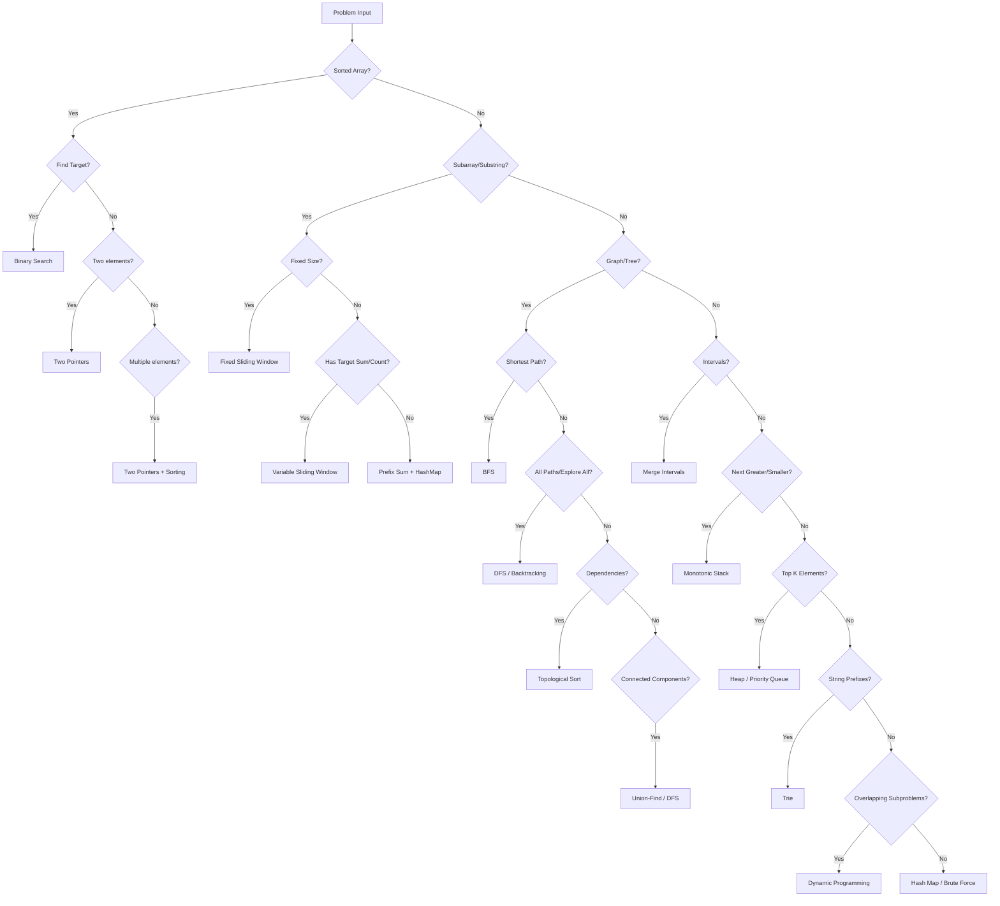

# Introduction to Coding Patterns

> **Recognize patterns to solve any problem systematically**

---

## Why Patterns Matter

The secret to acing coding interviews is not memorizing hundreds of LeetCode problems. Instead, it is about recognizing the underlying patterns that connect them. Recent data from hundreds of real interviews at Google, Meta, Apple, Netflix, and Amazon shows that **about 87% of questions are built around only 10 to 12 core problem-solving patterns**.

Interviewers are not testing your memory of specific problems. They want to see how well you:
- **Recognize underlying patterns** in new problems
- **Apply the correct algorithm** quickly and efficiently
- **Communicate your thought process** clearly

As one experienced interviewer noted: *"One skill that helps most during interview prep is the ability to map a new problem to an already known problem."*

### The Pattern-Based Approach

Instead of solving problems in isolation:

| Traditional Approach | Pattern-Based Approach |
|---------------------|------------------------|
| Solve 500+ random problems | Master 12-15 core patterns |
| Memorize solutions | Understand underlying techniques |
| Hope you see a familiar problem | Recognize patterns in new problems |
| Time-consuming and exhausting | Efficient and systematic |

---

## Document Structure

This section covers all essential coding patterns you need to master for Google SDE interviews. Each pattern includes theory, templates, and curated practice problems.

| Pattern | Key Insight | Common Problems | Difficulty |
|---------|-------------|-----------------|------------|
| **Two Pointers** | Use two indices to traverse from different positions/directions | Two Sum (sorted), 3Sum, Container With Most Water, Trapping Rain Water | Easy-Medium |
| **Sliding Window** | Maintain a window over contiguous elements for subarray/substring problems | Maximum Subarray, Longest Substring Without Repeating Characters, Minimum Window Substring | Medium |
| **Fast & Slow Pointers** | Two pointers moving at different speeds to detect cycles or find positions | Linked List Cycle, Find Middle of List, Happy Number, Find Duplicate Number | Easy-Medium |
| **Binary Search** | Divide search space in half each iteration for $O(\log n)$ lookup | Search in Rotated Sorted Array, Find Peak Element, Koko Eating Bananas | Medium |
| **BFS (Breadth-First Search)** | Level-by-level traversal using a queue | Level Order Traversal, Shortest Path, Rotting Oranges, Word Ladder | Medium |
| **DFS (Depth-First Search)** | Explore as deep as possible using recursion/stack | Path Sum, Number of Islands, Clone Graph, Word Search | Medium |
| **Backtracking** | Build solutions incrementally, abandon paths that fail constraints | Permutations, Combinations, N-Queens, Sudoku Solver | Medium-Hard |
| **Dynamic Programming** | Break into overlapping subproblems, store and reuse results | Climbing Stairs, Coin Change, Longest Common Subsequence, Edit Distance | Medium-Hard |
| **Merge Intervals** | Sort by start time, merge overlapping ranges | Merge Intervals, Insert Interval, Meeting Rooms II | Medium |
| **Monotonic Stack** | Stack maintaining increasing/decreasing order for next greater/smaller element | Next Greater Element, Daily Temperatures, Largest Rectangle in Histogram | Medium-Hard |
| **Union-Find (Disjoint Set)** | Track connected components with union and find operations | Number of Connected Components, Redundant Connection, Accounts Merge | Medium |
| **Topological Sort** | Order vertices in a DAG so all edges go from earlier to later | Course Schedule, Alien Dictionary, Task Scheduling | Medium-Hard |
| **Prefix Sum** | Precompute cumulative sums for $O(1)$ range queries | Range Sum Query, Subarray Sum Equals K, Product of Array Except Self | Easy-Medium |
| **Heap / Priority Queue** | Maintain min/max element efficiently for top-K problems | Kth Largest Element, Merge K Sorted Lists, Find Median from Data Stream | Medium |
| **Trie (Prefix Tree)** | Tree structure for efficient string prefix operations | Implement Trie, Word Search II, Autocomplete System | Medium-Hard |

---

## Pattern Recognition Flowchart

Use this decision tree to identify which pattern to apply based on problem characteristics:

### Quick Pattern Recognition Guide

| If you see... | Think... |
|---------------|----------|
| "Sorted array" + "find target" | Binary Search |
| "Sorted array" + "pair/triplet" | Two Pointers |
| "Contiguous subarray/substring" | Sliding Window |
| "Fixed-size window" | Fixed Sliding Window |
| "Shortest path" / "minimum steps" | BFS |
| "All paths" / "all combinations" | DFS / Backtracking |
| "Linked list" + "cycle" | Fast & Slow Pointers |
| "Next greater/smaller element" | Monotonic Stack |
| "Top K" / "Kth largest/smallest" | Heap |
| "Overlapping intervals" | Merge Intervals |
| "Connected components" | Union-Find or DFS |
| "Build order" / "prerequisites" | Topological Sort |
| "Prefix/suffix" / "autocomplete" | Trie |
| "Optimal substructure" + "overlapping subproblems" | Dynamic Programming |
| "Subarray sum equals K" | Prefix Sum + HashMap |

---

## How to Use This Section

### Recommended Study Order

For maximum efficiency, study patterns in this order:

**Week 1-2: Foundation Patterns**
1. Two Pointers (foundation for many techniques)
2. Sliding Window (builds on two pointers concept)
3. Binary Search (essential for efficiency)
4. Prefix Sum (simple but powerful)

**Week 3-4: Graph & Tree Patterns**
5. BFS (level-order, shortest path)
6. DFS (path finding, tree traversal)
7. Backtracking (generate all possibilities)

**Week 5-6: Advanced Patterns**
8. Dynamic Programming (optimization problems)
9. Monotonic Stack (next greater element problems)
10. Heap/Priority Queue (top-K, streaming data)

**Week 7-8: Specialized Patterns**
11. Union-Find (connectivity problems)
12. Topological Sort (ordering with dependencies)
13. Merge Intervals (scheduling problems)
14. Trie (string problems)

### For Each Pattern, You Should

1. **Understand the concept** - Read the theory and recognize when to apply it
2. **Study the template** - Memorize the generic code structure
3. **Solve example problems** - Start with 2-3 classic problems per pattern
4. **Practice variations** - Apply the pattern to 5-10 similar problems
5. **Time yourself** - Aim to recognize and implement within 20-30 minutes

### Navigation

Each pattern page includes:
- **Concept explanation** with visual diagrams
- **Code templates** in Python (with Java/C++ alternatives)
- **Time/Space complexity** analysis
- **Common variations** and edge cases
- **Curated problem list** (Easy/Medium/Hard)
- **Interview tips** specific to that pattern

---

## Pattern Frequency in Google Interviews

Based on analysis of reported Google interview questions and recruiter guidance, here are the most frequently tested patterns:

### Most Common Topics (Per Google Recruiters)

| Category | Patterns/Topics | Frequency |
|----------|-----------------|-----------|
| **Very High** | BFS/DFS/Flood Fill, Binary Search, Hash Tables | Asked in 70%+ of interviews |
| **High** | Two Pointers, Sliding Window, Tree Traversals | Asked in 50-70% of interviews |
| **Medium** | Dynamic Programming, Binary Heaps, Union-Find | Asked in 30-50% of interviews |
| **Occasional** | Trie, Segment Trees, Bitmasks | Asked in 10-30% of interviews |

### Top Problem Categories at Google

According to interview experience reports:

1. **Arrays & Strings** (30-35%)
   - Two pointers, sliding window, prefix sums
   - String manipulation and parsing

2. **Trees & Graphs** (25-30%)
   - BFS/DFS traversals, path finding
   - Tree construction and validation

3. **Dynamic Programming** (15-20%)
   - Optimization problems, sequence alignment
   - Grid-based DP problems

4. **System Design Elements** (10-15%)
   - Data structure design (LRU Cache, etc.)
   - Algorithm design with constraints

5. **Sorting & Searching** (10-15%)
   - Binary search variations
   - Custom sorting with comparators

### Google Interview Tips

- **Communicate constantly**: Talk through your thought process as you code
- **Clarify constraints**: Ask about input size, edge cases, and expected complexity
- **Start with brute force**: Explain the naive approach before optimizing
- **Test your solution**: Walk through examples and edge cases
- **Optimize iteratively**: Show how patterns improve your initial solution

---

## Additional Resources

### Recommended Practice Platforms
- [LeetCode](https://leetcode.com) - Filter by company tag "Google"
- [Sean Prashad's LeetCode Patterns](https://seanprashad.com/leetcode-patterns/) - Problems grouped by pattern
- [NeetCode](https://neetcode.io) - Curated problems with video explanations

### Courses & Guides
- [Grokking the Coding Interview](https://www.designgurus.io/course/grokking-the-coding-interview) - 28 patterns with detailed explanations
- [AlgoMaster - 15 LeetCode Patterns](https://blog.algomaster.io/p/15-leetcode-patterns) - Comprehensive pattern guide
- [LeetCode Explore Cards](https://leetcode.com/explore/) - Official structured learning paths

### Books
- *Coding Interview Patterns* by Alex Xu & Shaun Gunawardane - 24 patterns with 101 problems
- *Cracking the Coding Interview* by Gayle Laakmann McDowell - Classic interview prep

---

## Sources

- [Educative - 10+ Top LeetCode Patterns (2026)](https://www.educative.io/blog/coding-interview-leetcode-patterns)
- [Design Gurus - Mastering the 20 Coding Patterns](https://www.designgurus.io/blog/grokking-the-coding-interview-patterns)
- [AlgoMaster - 15 LeetCode Patterns](https://blog.algomaster.io/p/15-leetcode-patterns)
- [GeeksforGeeks - Google SDE Sheet](https://www.geeksforgeeks.org/dsa/google-sde-sheet-interview-questions-and-answers/)
- [Educative - Google Coding Interview Guide](https://www.educative.io/blog/google-coding-interview)
- [IGotAnOffer - Google Software Engineer Interview](https://igotanoffer.com/blogs/tech/google-software-engineer-interview)
- [Design Gurus - Top 20 Google Interview Questions](https://www.designgurus.io/blog/top-20-coding-questions-to-pass-google-interview)
- [Sean Prashad's LeetCode Patterns](https://seanprashad.com/leetcode-patterns/)
- [LeetCode Discussion - Important DSA Patterns](https://leetcode.com/discuss/study-guide/5908573/Important-DSA-Patterns-100-to-Crack-Coding-Interviews/)

---

*Next: Start with [Two Pointers](./two-pointers.md) - the foundation pattern for array problems*
