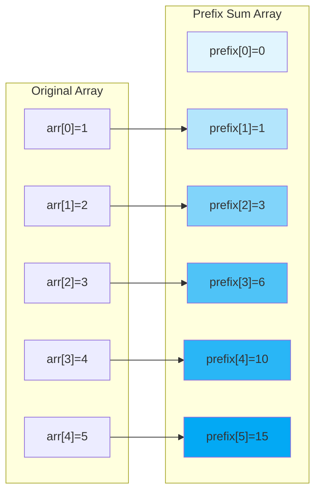
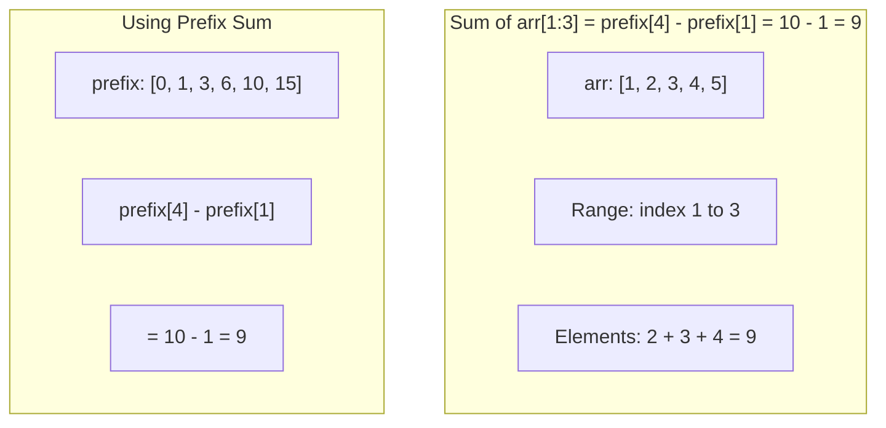
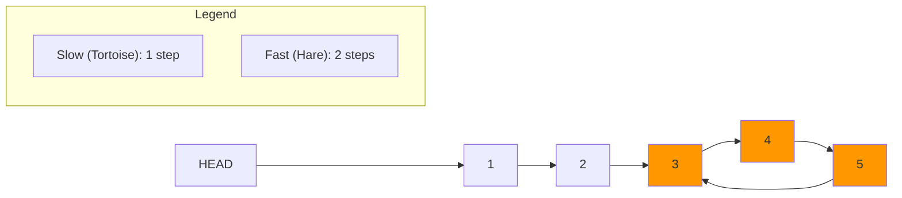
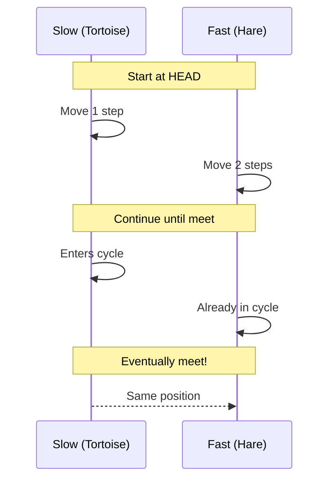
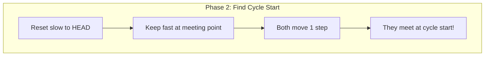

# Prefix Sum & Cycle Detection Patterns

> **Running sums and cycle detection for efficient queries**

---

## Prefix Sum Pattern

### Concept

The **Prefix Sum** (also called cumulative sum) is a powerful preprocessing technique that transforms O(n) range sum queries into O(1) lookups. Instead of recalculating the sum of elements in a range every time, you precompute cumulative sums and use simple subtraction.

**Why it matters:**
- Transforms O(n) range queries into O(1) lookups
- Enables O(n) solutions to subarray problems that would otherwise be O(n^2)
- Foundation for many advanced algorithms (2D prefix sums, difference arrays)
- Frequently tested in Google and big tech interviews

**Core Insight:** For any subarray `arr[left:right+1]`, the sum equals `prefix[right+1] - prefix[left]`.

### Mermaid Diagram



**Range Sum Query Example:**



### Template Code

```python
def build_prefix_sum(arr):
    """
    Build prefix sum array with extra 0 at the start.
    prefix[i] = sum of arr[0:i]

    Time: O(n), Space: O(n)
    """
    prefix = [0]  # Critical: Start with 0 for easier indexing
    for num in arr:
        prefix.append(prefix[-1] + num)
    return prefix


def range_sum(prefix, left, right):
    """
    Get sum of elements from arr[left] to arr[right] inclusive.

    Time: O(1)
    """
    return prefix[right + 1] - prefix[left]


# Example usage:
arr = [1, 2, 3, 4, 5]
prefix = build_prefix_sum(arr)  # [0, 1, 3, 6, 10, 15]
print(range_sum(prefix, 1, 3))  # Sum of arr[1:4] = 2+3+4 = 9
```

::: info Complexity: Time O(n) build, O(1) query · Space O(n)
- **Time:** O(n) to build prefix array; O(1) per range sum query using simple subtraction
- **Space:** O(n) - Prefix array stores n+1 cumulative sums
:::

### Prefix Sum + HashMap Pattern

This powerful combination solves "subarray with sum K" problems in O(n):

```python
def subarray_sum_equals_k(nums, k):
    """
    Count subarrays with sum equal to k.
    LeetCode 560: Subarray Sum Equals K

    Key insight: If prefix[j] - prefix[i] = k, then subarray [i+1, j] sums to k.
    We track how many times each prefix sum has occurred.

    Time: O(n), Space: O(n)
    """
    count = 0
    prefix_sum = 0
    # CRITICAL: Initialize with {0: 1} for subarrays starting at index 0
    seen = {0: 1}

    for num in nums:
        prefix_sum += num

        # Check if (prefix_sum - k) exists in our seen map
        # If yes, we found subarrays ending at current index with sum k
        if prefix_sum - k in seen:
            count += seen[prefix_sum - k]

        # Add current prefix_sum to seen
        seen[prefix_sum] = seen.get(prefix_sum, 0) + 1

    return count
```

::: info Complexity: Time O(n) · Space O(n)
- **Time:** O(n) - Single pass through array; HashMap operations are O(1) amortized
- **Space:** O(n) - HashMap stores at most n distinct prefix sums
:::

### 2D Prefix Sum

For matrix range queries:

```python
def build_2d_prefix_sum(matrix):
    """
    Build 2D prefix sum for O(1) submatrix sum queries.

    prefix[i][j] = sum of all elements in matrix[0:i][0:j]

    Time: O(m*n), Space: O(m*n)
    """
    if not matrix or not matrix[0]:
        return []

    m, n = len(matrix), len(matrix[0])
    prefix = [[0] * (n + 1) for _ in range(m + 1)]

    for i in range(1, m + 1):
        for j in range(1, n + 1):
            prefix[i][j] = (matrix[i-1][j-1] +
                          prefix[i-1][j] +
                          prefix[i][j-1] -
                          prefix[i-1][j-1])
    return prefix


def submatrix_sum(prefix, r1, c1, r2, c2):
    """
    Sum of submatrix from (r1, c1) to (r2, c2) inclusive.

    Time: O(1)
    """
    return (prefix[r2+1][c2+1] -
            prefix[r1][c2+1] -
            prefix[r2+1][c1] +
            prefix[r1][c1])
```

::: info Complexity: Time O(mn) build, O(1) query · Space O(mn)
- **Time:** O(mn) to build 2D prefix array; O(1) per submatrix query using inclusion-exclusion
- **Space:** O(mn) - 2D prefix array stores (m+1) x (n+1) cumulative sums
:::

### Classic Problems

| Problem | Difficulty | Key Technique |
|---------|------------|---------------|
| **Range Sum Query - Immutable** (LC 303) | Easy | Basic prefix sum |
| **Subarray Sum Equals K** (LC 560) | Medium | Prefix sum + HashMap |
| **Contiguous Array** (LC 525) | Medium | Transform 0->-1, find sum=0 |
| **Continuous Subarray Sum** (LC 523) | Medium | Prefix sum mod k |
| **Range Sum Query 2D** (LC 304) | Medium | 2D prefix sum |
| **Product of Array Except Self** (LC 238) | Medium | Prefix & suffix products |
| **Maximum Subarray** (LC 53) | Medium | Prefix sum variant (Kadane's) |

### Common Mistakes to Avoid

1. **Off-by-one errors**: Always use `prefix[right+1] - prefix[left]` not `prefix[right] - prefix[left-1]`
2. **Missing base case**: Initialize HashMap with `{0: 1}` for subarrays starting at index 0
3. **Forgetting the extra 0**: Start prefix array with 0 to simplify indexing
4. **Integer overflow**: In languages without arbitrary precision, watch for overflow in cumulative sums

---

## Tortoise & Hare (Floyd's Cycle Detection)

### Concept

**Floyd's Cycle Detection Algorithm** (also known as the Tortoise and Hare algorithm) uses two pointers moving at different speeds to detect cycles. Named after Robert W. Floyd, it's a memory-efficient alternative to hash-based detection.

**How it works:**
1. **Slow pointer (tortoise)**: Moves one step at a time
2. **Fast pointer (hare)**: Moves two steps at a time
3. If there's a cycle, they will eventually meet inside the cycle
4. If there's no cycle, the fast pointer reaches the end (null)

**Why it works mathematically:**
- If the cycle has length C and both pointers enter the cycle, the fast pointer gains 1 position per iteration relative to the slow pointer
- After at most C iterations, they must meet

**Complexity:**
- Time: O(n) - proportional to the length of the sequence
- Space: O(1) - only two pointers needed

### Mermaid Diagram

**Cycle Detection Phase:**



**Meeting Point Detection:**



**Finding Cycle Start (Phase 2):**



### Template Code

```python
class ListNode:
    def __init__(self, val=0, next=None):
        self.val = val
        self.next = next


def detect_cycle(head):
    """
    Detect if a cycle exists in a linked list.
    LeetCode 141: Linked List Cycle

    Time: O(n), Space: O(1)
    """
    slow = fast = head

    while fast and fast.next:
        slow = slow.next           # Move 1 step
        fast = fast.next.next      # Move 2 steps

        if slow == fast:
            return True  # Cycle exists

    return False  # No cycle (fast reached end)


def find_cycle_start(head):
    """
    Find the node where the cycle begins.
    LeetCode 142: Linked List Cycle II

    Mathematical proof:
    - Let distance from head to cycle start = a
    - Let distance from cycle start to meeting point = b
    - Let remaining cycle length = c (so cycle length = b + c)

    When they meet:
    - Slow traveled: a + b
    - Fast traveled: a + b + k(b + c) for some k >= 1
    - Since fast moves 2x: 2(a + b) = a + b + k(b + c)
    - Simplifying: a = c + (k-1)(b + c)
    - This means: distance from head = distance from meeting point to start

    Time: O(n), Space: O(1)
    """
    # Phase 1: Detect cycle (find meeting point)
    slow = fast = head

    while fast and fast.next:
        slow = slow.next
        fast = fast.next.next

        if slow == fast:
            break
    else:
        return None  # No cycle

    # Phase 2: Find cycle start
    # Reset slow to head, keep fast at meeting point
    # Both move 1 step - they meet at cycle start
    slow = head
    while slow != fast:
        slow = slow.next
        fast = fast.next

    return slow  # This is the cycle start node


def find_cycle_length(head):
    """
    Find the length of the cycle (if exists).

    Time: O(n), Space: O(1)
    """
    slow = fast = head

    while fast and fast.next:
        slow = slow.next
        fast = fast.next.next

        if slow == fast:
            # Found meeting point, count cycle length
            length = 1
            current = slow.next
            while current != slow:
                length += 1
                current = current.next
            return length

    return 0  # No cycle
```

::: info Complexity: Time O(n) · Space O(1)
- **Time:** O(n) - Fast pointer traverses at most 2n nodes; if cycle exists, meeting happens within cycle length iterations
- **Space:** O(1) - Only two pointers used regardless of list size
:::

### Array-Based Cycle Detection

The algorithm extends beyond linked lists to arrays:

```python
def find_duplicate(nums):
    """
    Find the duplicate number in array where n+1 integers are in range [1, n].
    LeetCode 287: Find the Duplicate Number

    Treat array as implicit linked list:
    - Index i points to nums[i]
    - A duplicate means two indices point to same value = cycle!

    Time: O(n), Space: O(1)
    """
    # Phase 1: Find intersection point
    slow = fast = nums[0]

    while True:
        slow = nums[slow]           # Move 1 step
        fast = nums[nums[fast]]     # Move 2 steps
        if slow == fast:
            break

    # Phase 2: Find cycle entrance (the duplicate)
    slow = nums[0]
    while slow != fast:
        slow = nums[slow]
        fast = nums[fast]

    return slow


def is_happy_number(n):
    """
    Determine if n is a happy number.
    LeetCode 202: Happy Number

    A happy number eventually reaches 1.
    Non-happy numbers enter a cycle.
    Use Floyd's algorithm to detect cycle vs reaching 1.

    Time: O(log n), Space: O(1)
    """
    def get_next(num):
        total = 0
        while num > 0:
            digit = num % 10
            total += digit * digit
            num //= 10
        return total

    slow = n
    fast = get_next(n)

    while fast != 1 and slow != fast:
        slow = get_next(slow)            # 1 step
        fast = get_next(get_next(fast))  # 2 steps

    return fast == 1
```

::: info Complexity: Time O(n) / O(log n) · Space O(1)
- **Time:** O(n) for find_duplicate (array traversal); O(log n) for is_happy_number (digit sum sequence converges quickly)
- **Space:** O(1) - Only two pointers used; no additional data structures
:::

### Classic Problems

| Problem | Difficulty | Key Technique |
|---------|------------|---------------|
| **Linked List Cycle** (LC 141) | Easy | Basic cycle detection |
| **Linked List Cycle II** (LC 142) | Medium | Find cycle start node |
| **Find the Duplicate Number** (LC 287) | Medium | Array as implicit linked list |
| **Happy Number** (LC 202) | Easy | Sequence cycle detection |
| **Circular Array Loop** (LC 457) | Medium | Directional cycle detection |
| **Find First Node of Loop** | Medium | Floyd's phase 2 |

### When to Use Floyd's Algorithm

- **Linked list cycle problems**: Direct application
- **Finding duplicates in constrained arrays**: When values are indices
- **Sequence-based cycles**: Any sequence that might loop (happy numbers)
- **Memory-constrained environments**: When O(1) space is required
- **Alternative to hash sets**: When you need to detect visited states without extra memory

---

## Google Interview Applications

### Common Google Interview Patterns

1. **Range Query Optimization**
   - Use prefix sums when you have multiple range queries on static data
   - Google loves asking about preprocessing vs query time tradeoffs

2. **Subarray Problems**
   - "Find subarray with property X" often maps to prefix sum + hashmap
   - Examples: subarray sum, max subarray, balanced parentheses count

3. **Cycle Detection in Systems**
   - Detecting circular dependencies in build systems
   - Finding loops in distributed systems (e.g., routing loops)
   - Memory leak detection (reference cycles)

4. **Space-Efficient Algorithms**
   - Google values O(1) space solutions when possible
   - Floyd's algorithm is preferred over hash-based approaches when applicable

### Interview Tips

**For Prefix Sum:**
- Always clarify if the array is mutable (might need segment trees instead)
- Mention the preprocessing time vs query time tradeoff
- Remember the `{0: 1}` initialization for subarray sum problems

**For Floyd's Algorithm:**
- Explain the mathematical proof for why it works
- Know both phases: detection AND finding the start
- Recognize problems that can be mapped to cycle detection

### Complexity Comparison Table

| Approach | Time | Space | Use Case |
|----------|------|-------|----------|
| Brute force range sum | O(n) per query | O(1) | Few queries |
| Prefix sum | O(n) build + O(1) query | O(n) | Many queries |
| Hash set cycle detection | O(n) | O(n) | General cycle detection |
| Floyd's algorithm | O(n) | O(1) | Space-constrained cycle detection |

---

## Practice Problems

### Prefix Sum (Start Here)

::: details Range Sum Query - Immutable (LeetCode 303)
**Problem:** Design a class to calculate the sum of elements between indices left and right inclusive, with multiple queries.

**Key Insight:** Precompute prefix sums so each query becomes a simple subtraction.

**Approach:** Build prefix sum array where prefix[i] = sum of elements 0 to i-1. Query answer is prefix[right+1] - prefix[left].

**Complexity:** Time O(n) preprocessing, O(1) per query. Space O(n)
:::

::: details Subarray Sum Equals K (LeetCode 560)
**Problem:** Count the total number of contiguous subarrays whose sum equals k.

**Key Insight:** If prefix[j] - prefix[i] = k, then subarray from i+1 to j has sum k. Track prefix sum frequencies in hash map.

**Approach:** For each position, check how many earlier positions have prefix sum equal to (current_prefix - k). Initialize hash map with {0: 1}.

**Complexity:** Time O(n), Space O(n)
:::

::: details Contiguous Array (LeetCode 525)
**Problem:** Find maximum length contiguous subarray with equal number of 0s and 1s in a binary array.

**Key Insight:** Replace 0 with -1, then finding equal 0s and 1s becomes finding subarray with sum 0.

**Approach:** Use prefix sum with hash map storing first occurrence of each sum. When same sum reappears, the subarray between has sum 0.

**Complexity:** Time O(n), Space O(n)
:::

::: details Continuous Subarray Sum (LeetCode 523)
**Problem:** Return true if there's a subarray of length >= 2 with sum that's a multiple of k.

**Key Insight:** If prefix[i] % k == prefix[j] % k with i < j-1, then subarray sum is divisible by k.

**Approach:** Store first index where each (prefix % k) value occurs. If same remainder seen at least 2 indices later, return true.

**Complexity:** Time O(n), Space O(min(n, k))
:::

::: details Range Sum Query 2D - Immutable (LeetCode 304)
**Problem:** Calculate sum of elements in a rectangle defined by (row1, col1) to (row2, col2) with multiple queries.

**Key Insight:** Use 2D prefix sum with inclusion-exclusion principle for O(1) queries.

**Approach:** Precompute prefix[i][j] = sum of all elements from (0,0) to (i-1,j-1). Use inclusion-exclusion to compute rectangle sum.

**Complexity:** Time O(mn) preprocessing, O(1) per query. Space O(mn)
:::

::: details Product of Array Except Self (LeetCode 238)
**Problem:** Return array where each element is product of all elements except itself, without division.

**Key Insight:** result[i] = (product of elements to the left) * (product of elements to the right).

**Approach:** Two-pass solution: first pass builds left products, second pass multiplies by right products. Can optimize to O(1) extra space.

**Complexity:** Time O(n), Space O(1) extra (output doesn't count)
:::

::: details Running Sum of 1d Array (LeetCode 1480)
**Problem:** Return running sum array where runningSum[i] = sum(nums[0] to nums[i]).

**Key Insight:** This is the basic prefix sum computation.

**Approach:** Iterate through array, maintaining cumulative sum. Can modify in-place: nums[i] += nums[i-1].

**Complexity:** Time O(n), Space O(1) if in-place
:::

### Floyd's Cycle Detection

::: details Linked List Cycle (LeetCode 141)
**Problem:** Determine if a linked list has a cycle.

**Key Insight:** Use slow (1 step) and fast (2 steps) pointers. If cycle exists, they will meet.

**Approach:** Move slow by 1 and fast by 2. If fast reaches null, no cycle. If slow == fast, cycle exists.

**Complexity:** Time O(n), Space O(1)
:::

::: details Linked List Cycle II (LeetCode 142)
**Problem:** Return the node where the cycle begins, or null if no cycle.

**Key Insight:** After detection, reset one pointer to head. Move both by 1 - they meet at cycle start.

**Approach:** Phase 1: Detect cycle with slow/fast. Phase 2: Reset slow to head, advance both by 1 until they meet.

**Complexity:** Time O(n), Space O(1)
:::

::: details Find the Duplicate Number (LeetCode 287)
**Problem:** Find the duplicate in array of n+1 integers in range [1, n], without modifying array, in O(1) space.

**Key Insight:** Treat array as implicit linked list: index i points to nums[i]. Duplicate creates a cycle.

**Approach:** Apply Floyd's algorithm. nums[0] is head, follow nums[i] as next pointer. Cycle entrance is the duplicate.

**Complexity:** Time O(n), Space O(1)
:::

::: details Happy Number (LeetCode 202)
**Problem:** Determine if a number eventually reaches 1 by repeatedly summing squares of digits.

**Key Insight:** The sequence either reaches 1 or enters a cycle. Use cycle detection.

**Approach:** Slow computes next once, fast computes next twice. If they meet at 1, happy. If they meet elsewhere, not happy.

**Complexity:** Time O(log n), Space O(1)
:::

::: details Circular Array Loop (LeetCode 457)
**Problem:** Detect if there's a cycle of length > 1 where all movements are in same direction.

**Key Insight:** Use Floyd's algorithm but ensure same direction throughout the cycle.

**Approach:** For each unvisited index, use slow/fast pointers. Check direction consistency. Mark visited to avoid reprocessing.

**Complexity:** Time O(n), Space O(1)
:::

---

## Two Pass Pattern

### Concept

The **Two Pass Pattern** is a powerful technique where you make two traversals through the data:
1. **First Pass**: Collect information (build auxiliary data)
2. **Second Pass**: Use the collected information to compute the result

This pattern is especially useful when computing each element's result depends on information from **both sides** of the array (elements before AND after it).

**When to Use:**
- Need information from both left and right sides
- Can't use a single running calculation
- Need to "look ahead" but don't want O(n^2) complexity

### Why Two Passes Work

```
Single Pass Problem:
  - At index i, you only know elements [0...i]
  - You don't know elements [i+1...n-1] yet!

Two Pass Solution:
  - Pass 1 (left to right): Build left[i] = info about [0...i-1]
  - Pass 2 (right to left): Build right[i] = info about [i+1...n-1]
  - Combine: result[i] = combine(left[i], right[i])
```

### Mermaid Diagram

```mermaid
flowchart TB
    subgraph "Two Pass Pattern"
        direction TB
        A[Original Array] --> B[Pass 1: Left to Right]
        B --> C[Left Array: info from left side]
        A --> D[Pass 2: Right to Left]
        D --> E[Right Array: info from right side]
        C --> F[Combine: result = f(left, right)]
        E --> F
    end
```

### Template Code

```python
def two_pass_template(arr: list[int]) -> list[int]:
    """
    Generic two-pass pattern template.

    Time: O(n) - two passes through the array
    Space: O(n) - storing left and right arrays
    """
    n = len(arr)
    if n == 0:
        return []

    # Pass 1: Build information from the left
    left = [0] * n
    left_accumulator = initial_value  # e.g., 1 for product, 0 for sum
    for i in range(n):
        left[i] = left_accumulator
        left_accumulator = combine(left_accumulator, arr[i])

    # Pass 2: Build information from the right
    right = [0] * n
    right_accumulator = initial_value
    for i in range(n - 1, -1, -1):
        right[i] = right_accumulator
        right_accumulator = combine(right_accumulator, arr[i])

    # Combine left and right
    result = [0] * n
    for i in range(n):
        result[i] = combine(left[i], right[i])

    return result
```

::: info Complexity: Time O(n) · Space O(n)
- **Time:** O(n) - Two linear passes through the array; each element processed twice
- **Space:** O(n) - Two auxiliary arrays (left and right) each of size n
:::

### Classic Problem 1: Product of Array Except Self

**LeetCode 238**: Given an array `nums`, return an array where `result[i]` equals the product of all elements except `nums[i]`.

**Constraint**: Solve without division and in O(n) time.

```python
def productExceptSelf(nums: list[int]) -> list[int]:
    """
    Product of Array Except Self using Two Pass Pattern.

    Key insight: result[i] = (product of all left) * (product of all right)

    Time: O(n)
    Space: O(1) extra (output array doesn't count)
    """
    n = len(nums)
    result = [1] * n

    # Pass 1: Calculate left products
    # result[i] = product of nums[0] * nums[1] * ... * nums[i-1]
    left_product = 1
    for i in range(n):
        result[i] = left_product
        left_product *= nums[i]

    # Pass 2: Multiply by right products
    # result[i] *= product of nums[i+1] * ... * nums[n-1]
    right_product = 1
    for i in range(n - 1, -1, -1):
        result[i] *= right_product
        right_product *= nums[i]

    return result


# Example walkthrough:
# nums = [1, 2, 3, 4]
#
# After Pass 1 (left products):
# result = [1, 1, 2, 6]
#   result[0] = 1 (nothing to the left)
#   result[1] = 1 (only nums[0]=1 to the left)
#   result[2] = 1*2 = 2
#   result[3] = 1*2*3 = 6
#
# After Pass 2 (multiply by right products):
# result = [24, 12, 8, 6]
#   result[3] *= 1 (nothing to the right) = 6
#   result[2] *= 4 = 8
#   result[1] *= 4*3 = 12
#   result[0] *= 4*3*2 = 24
```

::: info Complexity: Time O(n) · Space O(1)
- **Time:** O(n) - Two linear passes through the array
- **Space:** O(1) extra - Only two accumulator variables; output array does not count toward space complexity
:::

### Classic Problem 2: Trapping Rain Water

**LeetCode 42**: Given elevation map `height[]`, compute how much water can be trapped.

```python
def trap(height: list[int]) -> int:
    """
    Trapping Rain Water using Two Pass Pattern.

    Key insight: Water at index i = min(max_left, max_right) - height[i]

    Time: O(n)
    Space: O(n)
    """
    if not height:
        return 0

    n = len(height)

    # Pass 1: Calculate max height to the left of each position
    left_max = [0] * n
    left_max[0] = height[0]
    for i in range(1, n):
        left_max[i] = max(left_max[i - 1], height[i])

    # Pass 2: Calculate max height to the right of each position
    right_max = [0] * n
    right_max[n - 1] = height[n - 1]
    for i in range(n - 2, -1, -1):
        right_max[i] = max(right_max[i + 1], height[i])

    # Calculate water at each position
    water = 0
    for i in range(n):
        # Water level is determined by the shorter wall
        water_level = min(left_max[i], right_max[i])
        # Water trapped = water level - ground height (if positive)
        water += max(0, water_level - height[i])

    return water


# Space-optimized version using two pointers (O(1) space):
def trap_optimized(height: list[int]) -> int:
    """
    Trapping Rain Water - Space Optimized with Two Pointers.

    Instead of storing left_max and right_max arrays,
    we use two pointers and track max values on the fly.

    Time: O(n)
    Space: O(1)
    """
    if not height:
        return 0

    left, right = 0, len(height) - 1
    left_max, right_max = 0, 0
    water = 0

    while left < right:
        if height[left] < height[right]:
            if height[left] >= left_max:
                left_max = height[left]
            else:
                water += left_max - height[left]
            left += 1
        else:
            if height[right] >= right_max:
                right_max = height[right]
            else:
                water += right_max - height[right]
            right -= 1

    return water
```

::: info Complexity: Time O(n) · Space O(n) or O(1)
- **Time:** O(n) - Both versions make linear passes through the array
- **Space:** O(n) for two-pass version (stores left_max and right_max arrays); O(1) for two-pointer optimized version
:::

### Visual Walkthrough: Trapping Rain Water

```
height = [0, 1, 0, 2, 1, 0, 1, 3, 2, 1, 2, 1]

Building left_max (max height seen so far from left):
height:    [0, 1, 0, 2, 1, 0, 1, 3, 2, 1, 2, 1]
left_max:  [0, 1, 1, 2, 2, 2, 2, 3, 3, 3, 3, 3]

Building right_max (max height seen so far from right):
height:    [0, 1, 0, 2, 1, 0, 1, 3, 2, 1, 2, 1]
right_max: [3, 3, 3, 3, 3, 3, 3, 3, 2, 2, 2, 1]

Water at each position = min(left_max, right_max) - height:
Position 2: min(1, 3) - 0 = 1 unit
Position 4: min(2, 3) - 1 = 1 unit
Position 5: min(2, 3) - 0 = 2 units
Position 6: min(2, 3) - 1 = 1 unit
Position 9: min(3, 2) - 1 = 1 unit

Total water = 1 + 1 + 2 + 1 + 1 = 6 units

Visual representation:
       #
   #   ##_#
 #_##_#####_#
[0,1,0,2,1,0,1,3,2,1,2,1]

Water fills the gaps (shown as ~):
       #
   #~~~##~#
 #~##~######~
[0,1,0,2,1,0,1,3,2,1,2,1]
```

### More Two Pass Problems

| Problem | First Pass | Second Pass | Combination |
|---------|------------|-------------|-------------|
| **Product Except Self** | Left products | Right products | Multiply |
| **Trapping Rain Water** | Max from left | Max from right | min - height |
| **Candy** (LC 135) | Satisfy left neighbor | Satisfy right neighbor | Max of both |
| **Gas Station** (LC 134) | Check total feasibility | Find starting point | - |
| **Best Time Buy Sell II** | Track min so far | Track max so far | Max profit |

### Candy Problem (LeetCode 135)

```python
def candy(ratings: list[int]) -> int:
    """
    Each child must have at least 1 candy.
    Children with higher rating than neighbor get more candy.

    Time: O(n)
    Space: O(n)
    """
    n = len(ratings)
    candies = [1] * n

    # Pass 1: Left to right - satisfy right > left neighbor
    for i in range(1, n):
        if ratings[i] > ratings[i - 1]:
            candies[i] = candies[i - 1] + 1

    # Pass 2: Right to left - satisfy left > right neighbor
    for i in range(n - 2, -1, -1):
        if ratings[i] > ratings[i + 1]:
            candies[i] = max(candies[i], candies[i + 1] + 1)

    return sum(candies)
```

::: info Complexity: Time O(n) · Space O(n)
- **Time:** O(n) - Two linear passes plus final summation
- **Space:** O(n) - Array to store candy counts for each child
:::

### When to Recognize Two Pass Pattern

**Signal phrases in problem:**
- "For each element, considering elements on both sides..."
- "Without using division..."
- "Product/sum of all except current..."
- "Maximum/minimum from both directions..."
- "Water/sand/liquid between walls..."

**Pattern indicators:**
- Need left context AND right context
- Single pass would require O(n) lookback
- Result depends on "surrounding" elements

### Complexity Analysis

| Approach | Time | Space | Notes |
|----------|------|-------|-------|
| Two Pass (two arrays) | O(n) | O(n) | Most intuitive |
| Two Pass (single array) | O(n) | O(1)* | Reuse result array |
| Two Pointer (optimized) | O(n) | O(1) | For specific problems |

*Output array typically doesn't count toward space complexity

---

## Sources & Further Reading

- [Prefix Sum Patterns for LeetCode Beginners - DEV Community](https://dev.to/alex_hunter_44f4c9ed6671e/prefix-sum-patterns-for-leetcode-beginners-6fe)
- [LeetCode Prefix Sum Problem List](https://leetcode.com/problem-list/prefix-sum/)
- [The Complete Prefix Sum Guide - LeetCopilot](https://leetcopilot.dev/leetcode-pattern/prefix-sum/guide)
- [Prefix Sum Array - GeeksforGeeks](https://www.geeksforgeeks.org/dsa/prefix-sum-array-implementation-applications-competitive-programming/)
- [Intro to Floyd's Cycle Detection Algorithm - LeetCode Discuss](https://leetcode.com/discuss/general-discussion/1116359/intro-to-floyds-cycle-detection-algorithm/)
- [Tortoise and Hare Algorithm - CP Algorithms](https://cp-algorithms.com/others/tortoise_and_hare.html)
- [Floyd's Cycle Finding Algorithm - GeeksforGeeks](https://www.geeksforgeeks.org/dsa/floyds-cycle-finding-algorithm/)
- [Cycle Detection - Wikipedia](https://en.wikipedia.org/wiki/Cycle_detection)
