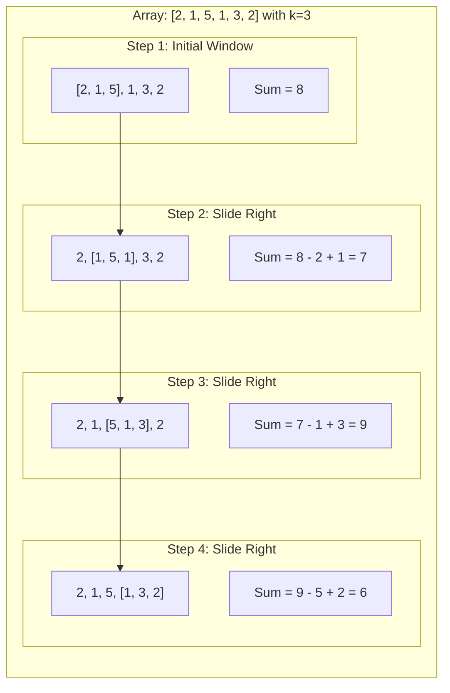
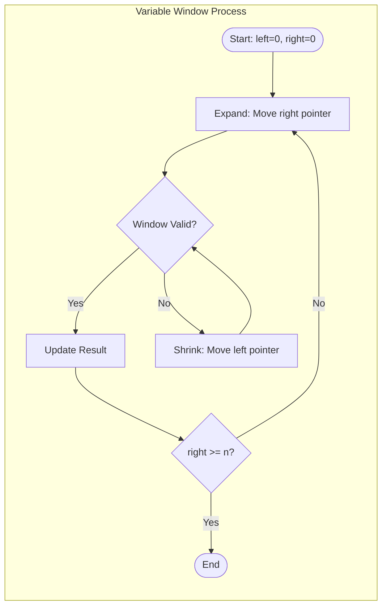
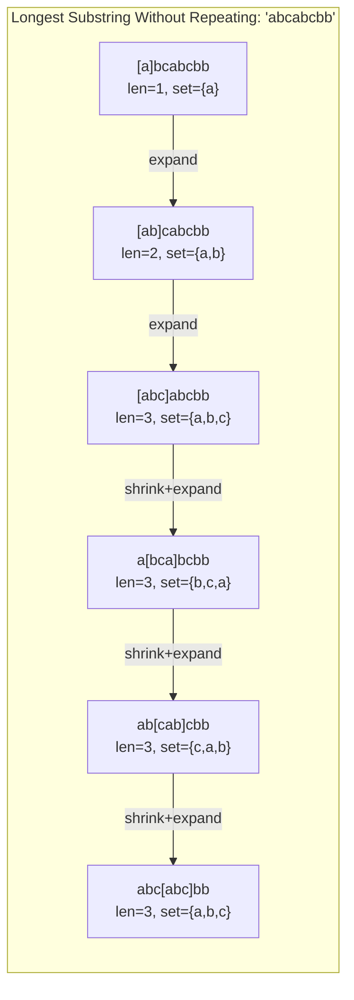

# Sliding Window Pattern

> **Process contiguous subarrays/substrings efficiently**

---

## Pattern Overview

The **Sliding Window** technique is a powerful algorithmic pattern used to solve problems involving contiguous subarrays or substrings. Instead of repeatedly iterating over the same elements with nested loops, the sliding window maintains a range (or "window") that moves step-by-step through the data, updating results incrementally.

### Why Sliding Window?

| Approach | Time Complexity | Description |
|----------|-----------------|-------------|
| Brute Force | O(n²) or O(n³) | Check every possible subarray |
| Sliding Window | O(n) | Process each element at most twice |

The key insight is that when the window slides, we only need to:
1. **Add** the new element entering the window
2. **Remove** the element leaving the window
3. **Update** our result based on the new window state

This converts two nested loops into a single pass, dramatically improving efficiency.

### When to Use Sliding Window

- Problems involving **contiguous** sequences (subarrays, substrings)
- Finding **maximum/minimum** values in subarrays
- Counting subarrays that satisfy certain conditions
- String pattern matching and anagram detection
- Running averages or sums over fixed intervals

---

## Visual Guides

### Fixed Size Window
<!-- TODO: Add visualization  -->

### Variable Window (Expand/Contract)
<!-- TODO: Add visualization  -->

### Sliding Window vs Two Pointers
<!-- TODO: Add visualization  -->

### Longest Substring Without Repeating
<!-- TODO: Add visualization  -->

---

## Types of Sliding Window

### 1. Fixed Size Window

Use when the **window size k is explicitly given** in the problem.

**Characteristics:**
- Window size remains constant throughout
- Simpler to implement
- Typically involves sum, average, or max/min in each window

**Example Problems:**
- Maximum sum of subarray of size k
- Maximum average subarray of size k
- Find all anagrams in a string (window = pattern length)
- Sliding window maximum/minimum

**Algorithm Flow:**
1. Initialize window with first k elements
2. Slide window one position at a time
3. Add new element, remove old element
4. Update result

### 2. Variable Size Window

Use when **finding the optimal window size** that satisfies a condition.

**Characteristics:**
- Window expands and shrinks dynamically
- Uses two pointers: `left` (start) and `right` (end)
- More complex but handles optimization problems

**Two Sub-types:**

#### a) Shrinkable Window (Find Maximum)
- Expand right pointer to grow window
- Shrink from left when condition is violated
- Track maximum valid window size

#### b) Non-shrinkable Window (Find Minimum)
- Expand right pointer to grow window
- Shrink from left when condition is satisfied
- Track minimum valid window size

**Example Problems:**
- Longest substring without repeating characters
- Minimum window substring
- Longest substring with at most k distinct characters
- Smallest subarray with sum >= target

---

## Mermaid Diagram

### Fixed Window Sliding Animation



### Variable Window Mechanism



### Window State Visualization



---

## Template Code

### Fixed Window Template

```python
def fixed_sliding_window(arr, k):
    """
    Template for fixed-size sliding window problems.

    Args:
        arr: Input array
        k: Fixed window size

    Returns:
        Result based on problem (max sum, count, etc.)
    """
    n = len(arr)
    if n < k:
        return None  # Handle edge case

    # Initialize first window
    window_sum = sum(arr[:k])
    max_sum = window_sum

    # Slide the window
    for i in range(k, n):
        # Add new element, remove old element
        window_sum += arr[i] - arr[i - k]
        max_sum = max(max_sum, window_sum)

    return max_sum


def fixed_window_with_hashmap(s, k):
    """
    Fixed window with frequency counting (for strings).

    Args:
        s: Input string
        k: Fixed window size

    Returns:
        Result based on problem requirements
    """
    from collections import Counter

    if len(s) < k:
        return None

    # Initialize first window
    window = Counter(s[:k])
    result = []

    # Process first window
    # ... (problem-specific logic)

    # Slide the window
    for i in range(k, len(s)):
        # Add new character
        window[s[i]] += 1

        # Remove old character
        window[s[i - k]] -= 1
        if window[s[i - k]] == 0:
            del window[s[i - k]]

        # Process current window
        # ... (problem-specific logic)

    return result
```

::: info Complexity: Time O(n) · Space O(1) or O(k)
- **Time:** O(n) - Single pass through array; each element added and removed exactly once
- **Space:** O(1) for sum tracking, O(k) for hashmap variant where k is window size or character set size
:::

### Variable Window Template (Shrinkable - Find Maximum)

```python
def variable_sliding_window_max(s):
    """
    Template for variable-size sliding window (finding maximum).
    Use when: Finding longest/largest valid window.

    Args:
        s: Input string or array

    Returns:
        Maximum window size satisfying condition
    """
    left = 0
    window = {}  # or set, counter, etc.
    result = 0

    for right in range(len(s)):
        # EXPAND: Add element at right pointer to window
        window[s[right]] = window.get(s[right], 0) + 1

        # SHRINK: Contract window while invalid
        while is_invalid(window):  # Define based on problem
            window[s[left]] -= 1
            if window[s[left]] == 0:
                del window[s[left]]
            left += 1

        # UPDATE: Current window is valid, update result
        result = max(result, right - left + 1)

    return result


def is_invalid(window):
    """
    Define invalidity condition based on problem.
    Examples:
    - Repeating characters: any count > 1
    - More than k distinct: len(window) > k
    - Sum exceeds target: sum > target
    """
    pass  # Implement based on problem
```

::: info Complexity: Time O(n) · Space O(k)
- **Time:** O(n) - Each element added once (right pointer) and removed at most once (left pointer)
- **Space:** O(k) - HashMap stores at most k distinct elements where k depends on problem constraints
:::

### Variable Window Template (Find Minimum)

```python
def variable_sliding_window_min(s, target):
    """
    Template for variable-size sliding window (finding minimum).
    Use when: Finding shortest/smallest valid window.

    Args:
        s: Input string or array
        target: Target condition to satisfy

    Returns:
        Minimum window size satisfying condition
    """
    left = 0
    window = {}
    result = float('inf')

    for right in range(len(s)):
        # EXPAND: Add element at right pointer
        window[s[right]] = window.get(s[right], 0) + 1

        # SHRINK: Contract window while VALID (to find minimum)
        while is_valid(window, target):  # Define based on problem
            # Update result with current valid window
            result = min(result, right - left + 1)

            # Try to shrink
            window[s[left]] -= 1
            if window[s[left]] == 0:
                del window[s[left]]
            left += 1

    return result if result != float('inf') else 0
```

::: info Complexity: Time O(n) · Space O(k)
- **Time:** O(n) - Each element enters window once and leaves at most once
- **Space:** O(k) - HashMap stores elements in current window; k is constraint-dependent
:::

### Sliding Window with Deque (for Max/Min in Window)

```python
from collections import deque

def sliding_window_maximum(nums, k):
    """
    Find maximum in each window of size k.
    Uses monotonic deque for O(n) complexity.

    Args:
        nums: Input array
        k: Window size

    Returns:
        List of maximums for each window position
    """
    result = []
    dq = deque()  # Stores indices, monotonically decreasing values

    for i in range(len(nums)):
        # Remove indices outside current window
        while dq and dq[0] <= i - k:
            dq.popleft()

        # Remove smaller elements (maintain decreasing order)
        while dq and nums[dq[-1]] < nums[i]:
            dq.pop()

        dq.append(i)

        # Window is complete, record maximum
        if i >= k - 1:
            result.append(nums[dq[0]])

    return result
```

::: info Complexity: Time O(n) · Space O(k)
- **Time:** O(n) - Each element added and removed from deque at most once (amortized O(1) per element)
- **Space:** O(k) - Deque stores at most k indices at any time
:::

---

## Classic Problems

### 1. Maximum Sum Subarray of Size K (Fixed)

**LeetCode Reference:** Maximum Average Subarray I (643)

**Problem:** Given an array of integers and a number k, find the maximum sum of any contiguous subarray of size k.

```python
def max_sum_subarray(arr, k):
    """
    Find maximum sum of subarray of size k.

    Time: O(n), Space: O(1)

    Example:
        arr = [2, 1, 5, 1, 3, 2], k = 3
        Subarrays: [2,1,5]=8, [1,5,1]=7, [5,1,3]=9, [1,3,2]=6
        Output: 9
    """
    if len(arr) < k:
        return None

    # Calculate sum of first window
    window_sum = sum(arr[:k])
    max_sum = window_sum

    # Slide window and track maximum
    for i in range(k, len(arr)):
        # Slide: add new element, remove leftmost
        window_sum += arr[i] - arr[i - k]
        max_sum = max(max_sum, window_sum)

    return max_sum


# Test
arr = [2, 1, 5, 1, 3, 2]
k = 3
print(max_sum_subarray(arr, k))  # Output: 9
```

::: info Complexity: Time O(n) · Space O(1)
- **Time:** O(n) - Single pass through array after O(k) initialization; each slide is O(1)
- **Space:** O(1) - Only two variables (window_sum, max_sum) regardless of input size
:::

---

### 2. Longest Substring Without Repeating Characters (Variable)

**LeetCode 3** - Classic Google/FAANG interview question

**Problem:** Given a string s, find the length of the longest substring without repeating characters.

```python
def length_of_longest_substring(s):
    """
    Find longest substring without repeating characters.

    Time: O(n), Space: O(min(m, n)) where m is charset size

    Example:
        s = "abcabcbb"
        "abc" is the longest substring -> length 3
    """
    char_index = {}  # Character -> last seen index
    left = 0
    max_length = 0

    for right, char in enumerate(s):
        # If character seen and within current window
        if char in char_index and char_index[char] >= left:
            # Move left pointer past the duplicate
            left = char_index[char] + 1

        # Update last seen index
        char_index[char] = right

        # Update maximum length
        max_length = max(max_length, right - left + 1)

    return max_length


# Alternative using set
def length_of_longest_substring_set(s):
    """Using set to track characters in window."""
    char_set = set()
    left = 0
    max_length = 0

    for right in range(len(s)):
        # Shrink window while duplicate exists
        while s[right] in char_set:
            char_set.remove(s[left])
            left += 1

        # Add current character
        char_set.add(s[right])
        max_length = max(max_length, right - left + 1)

    return max_length


# Test cases
print(length_of_longest_substring("abcabcbb"))  # 3 ("abc")
print(length_of_longest_substring("bbbbb"))      # 1 ("b")
print(length_of_longest_substring("pwwkew"))     # 3 ("wke")
```

::: info Complexity: Time O(n) · Space O(min(m, n))
- **Time:** O(n) - Each character visited at most twice (once by right pointer, once when left jumps past it)
- **Space:** O(min(m, n)) - HashMap stores at most min(character set size, string length) entries
:::

---

### 3. Minimum Window Substring (Variable)

**LeetCode 76** - Hard, frequently asked in interviews

**Problem:** Given strings s and t, find the minimum window substring of s that contains all characters of t (including duplicates).

```python
from collections import Counter

def min_window(s, t):
    """
    Find minimum window in s containing all characters of t.

    Time: O(|s| + |t|), Space: O(|s| + |t|)

    Example:
        s = "ADOBECODEBANC", t = "ABC"
        Output: "BANC" (minimum window containing A, B, C)
    """
    if not t or not s:
        return ""

    # Count characters needed from t
    need = Counter(t)
    have = {}

    # Track how many unique characters we've satisfied
    required = len(need)
    formed = 0

    # Result: (window_length, left, right)
    result = (float('inf'), 0, 0)
    left = 0

    for right in range(len(s)):
        char = s[right]

        # Add character to current window
        have[char] = have.get(char, 0) + 1

        # Check if current character satisfies requirement
        if char in need and have[char] == need[char]:
            formed += 1

        # Try to shrink window while all requirements met
        while formed == required:
            # Update result if current window is smaller
            if right - left + 1 < result[0]:
                result = (right - left + 1, left, right)

            # Remove leftmost character
            left_char = s[left]
            have[left_char] -= 1

            # Check if removal breaks requirement
            if left_char in need and have[left_char] < need[left_char]:
                formed -= 1

            left += 1

    # Return result
    length, start, end = result
    return s[start:end + 1] if length != float('inf') else ""


# Test
s = "ADOBECODEBANC"
t = "ABC"
print(min_window(s, t))  # Output: "BANC"
```

::: info Complexity: Time O(|s| + |t|) · Space O(|s| + |t|)
- **Time:** O(|s| + |t|) - Build Counter for t is O(|t|); each character in s visited at most twice
- **Space:** O(|s| + |t|) - Two hashmaps storing character frequencies; worst case stores all unique characters
:::

---

### 4. Longest Repeating Character Replacement

**LeetCode 424** - Medium, commonly asked at FAANG

**Problem:** Given a string s and an integer k, find the length of the longest substring that can be obtained by replacing at most k characters.

```python
def character_replacement(s, k):
    """
    Longest substring with same characters after at most k replacements.

    Time: O(n), Space: O(26) = O(1)

    Example:
        s = "AABABBA", k = 1
        Replace one 'B' in "AABA" to get "AAAA" -> length 4
    """
    count = {}
    max_count = 0  # Count of most frequent character in window
    max_length = 0
    left = 0

    for right in range(len(s)):
        # Add character to window
        count[s[right]] = count.get(s[right], 0) + 1

        # Track the most frequent character count
        max_count = max(max_count, count[s[right]])

        # Window is invalid if we need more than k replacements
        # (window_size - max_count) = characters to replace
        while (right - left + 1) - max_count > k:
            count[s[left]] -= 1
            left += 1

        max_length = max(max_length, right - left + 1)

    return max_length


# Optimized version (no shrinking, just don't expand result)
def character_replacement_optimized(s, k):
    """
    Optimized: Never shrink window, just don't update result when invalid.

    Key insight: We only care about finding a LONGER valid window,
    so we can keep window size and slide it forward.
    """
    count = {}
    max_count = 0
    left = 0

    for right in range(len(s)):
        count[s[right]] = count.get(s[right], 0) + 1
        max_count = max(max_count, count[s[right]])

        # If invalid, slide window (don't shrink, maintain size)
        if (right - left + 1) - max_count > k:
            count[s[left]] -= 1
            left += 1

    # Final window size is the answer
    return len(s) - left


# Test
print(character_replacement("ABAB", 2))     # 4 (replace 2 A's or 2 B's)
print(character_replacement("AABABBA", 1))  # 4 (AABA -> AAAA)
```

::: info Complexity: Time O(n) · Space O(1)
- **Time:** O(n) - Single pass through string; each character processed once
- **Space:** O(26) = O(1) - HashMap stores at most 26 uppercase English letters
:::

---

### 5. Sliding Window Maximum

**LeetCode 239** - Hard, interview favorite

**Problem:** Given an array nums and window size k, return the maximum element in each sliding window.

```python
from collections import deque

def max_sliding_window(nums, k):
    """
    Find maximum in each sliding window of size k.

    Time: O(n), Space: O(k)

    Example:
        nums = [1,3,-1,-3,5,3,6,7], k = 3
        Windows: [1,3,-1], [3,-1,-3], [-1,-3,5], [-3,5,3], [5,3,6], [3,6,7]
        Output: [3, 3, 5, 5, 6, 7]
    """
    if not nums:
        return []

    result = []
    dq = deque()  # Stores indices in decreasing order of values

    for i in range(len(nums)):
        # Remove indices outside current window
        while dq and dq[0] <= i - k:
            dq.popleft()

        # Remove smaller elements (they can never be maximum)
        while dq and nums[dq[-1]] < nums[i]:
            dq.pop()

        dq.append(i)

        # Start recording results once first window is complete
        if i >= k - 1:
            result.append(nums[dq[0]])

    return result


# Test
nums = [1, 3, -1, -3, 5, 3, 6, 7]
k = 3
print(max_sliding_window(nums, k))  # [3, 3, 5, 5, 6, 7]
```

::: info Complexity: Time O(n) · Space O(k)
- **Time:** O(n) - Each element added and removed from deque at most once (amortized O(1) per operation)
- **Space:** O(k) - Monotonic deque stores at most k indices representing the current window
:::

---

### 6. Permutation in String

**LeetCode 567** - Check if s1's permutation is substring of s2

```python
from collections import Counter

def check_inclusion(s1, s2):
    """
    Check if any permutation of s1 exists in s2.

    Time: O(n), Space: O(26) = O(1)

    Example:
        s1 = "ab", s2 = "eidbaooo"
        "ba" is permutation of "ab" and exists in s2 -> True
    """
    if len(s1) > len(s2):
        return False

    need = Counter(s1)
    have = Counter(s2[:len(s1)])

    if have == need:
        return True

    for i in range(len(s1), len(s2)):
        # Add new character
        have[s2[i]] += 1

        # Remove old character
        old_char = s2[i - len(s1)]
        have[old_char] -= 1
        if have[old_char] == 0:
            del have[old_char]

        if have == need:
            return True

    return False


# Test
print(check_inclusion("ab", "eidbaooo"))  # True
print(check_inclusion("ab", "eidboaoo"))  # False
```

::: info Complexity: Time O(n) · Space O(1)
- **Time:** O(n) - Single pass through s2 with fixed-size window; Counter comparison is O(26) = O(1)
- **Space:** O(26) = O(1) - Both Counters store at most 26 lowercase English letters
:::

---

### 7. Find All Anagrams in a String

**LeetCode 438** - Return all starting indices of anagrams

```python
from collections import Counter

def find_anagrams(s, p):
    """
    Find all start indices of p's anagrams in s.

    Time: O(n), Space: O(1)

    Example:
        s = "cbaebabacd", p = "abc"
        Output: [0, 6] (anagrams at indices 0 and 6)
    """
    result = []
    if len(p) > len(s):
        return result

    need = Counter(p)
    have = Counter(s[:len(p)])

    if have == need:
        result.append(0)

    for i in range(len(p), len(s)):
        # Slide window
        have[s[i]] += 1
        have[s[i - len(p)]] -= 1

        if have[s[i - len(p)]] == 0:
            del have[s[i - len(p)]]

        if have == need:
            result.append(i - len(p) + 1)

    return result


# Test
print(find_anagrams("cbaebabacd", "abc"))  # [0, 6]
```

::: info Complexity: Time O(n) · Space O(1)
- **Time:** O(n) - Single pass through s with fixed-size window equal to pattern length
- **Space:** O(26) = O(1) - Counters store at most 26 lowercase letters; result array not counted
:::

---

## Pattern Recognition Signs

### Keywords That Suggest Sliding Window

| Keyword | Example Problem |
|---------|-----------------|
| **"contiguous"** | Find contiguous subarray with maximum sum |
| **"subarray"** | Minimum size subarray sum >= target |
| **"substring"** | Longest substring without repeating characters |
| **"window"** | Sliding window maximum |
| **"consecutive"** | Max consecutive ones |
| **"k elements"** | Maximum average subarray of size k |
| **"at most k"** | Longest substring with at most k distinct chars |
| **"exactly k"** | Subarrays with exactly k distinct integers |

### Decision Framework

```
Is it about contiguous elements (subarray/substring)?
├── YES
│   ├── Is window size fixed (k given)?
│   │   ├── YES → Use FIXED sliding window
│   │   └── NO
│   │       ├── Finding MAXIMUM valid window? → Variable window (shrink when invalid)
│   │       └── Finding MINIMUM valid window? → Variable window (shrink when valid)
│   └── Need max/min in each window? → Use DEQUE
└── NO → Consider other patterns (Two Pointers, DP, etc.)
```

### Common Constraints

- **Fixed Window:** Window size k is explicitly given
- **Variable Window (Max):** "longest", "maximum length", "at most k"
- **Variable Window (Min):** "shortest", "minimum length", "at least k"

---

## Interview Applications

### Frequently Asked

Based on interview reports, these sliding window problems are commonly asked in interviews:

1. **Sliding Window Maximum** (LeetCode 239)
   - Given window size K and array of size N, find maximum/minimum of each window
   - Requires understanding of monotonic deque

2. **Minimum Window Substring** (LeetCode 76)
   - Classic string manipulation with hashmaps
   - Tests understanding of variable window shrinking

3. **Longest Substring with K Distinct Characters**
   - Variable window with constraint tracking
   - Often extended with follow-up questions

4. **Permutation in String** (LeetCode 567)
   - Fixed window with character frequency matching
   - Tests efficient comparison techniques

### Interview Tips from Senior Engineers

1. **Clarify the Problem**
   - Ask about edge cases: empty input, k > array length
   - Confirm if window size is fixed or variable
   - Ask about constraints on values

2. **Start with Brute Force**
   - Explain the O(n²) approach first
   - Then optimize to O(n) with sliding window
   - Shows problem-solving process

3. **Verbalize Your Approach**
   - "I'll use a sliding window because we need contiguous elements..."
   - "The window needs to shrink when [condition]..."
   - "I'll track [what] to know when the window is valid..."

4. **Handle Edge Cases**
   - Empty arrays/strings
   - k = 0 or k > n
   - All same elements
   - No valid window exists

### Real-World Applications

- **Network Traffic Monitoring:** Track data rates over time intervals
- **Stock Price Analysis:** Calculate moving averages
- **Text Processing:** Find patterns in documents
- **Performance Monitoring:** Track CPU/memory usage
- **Rate Limiting:** Count requests in time windows

---

## Complexity Summary

| Problem Type | Time | Space | Key Data Structure |
|-------------|------|-------|-------------------|
| Fixed Sum/Avg | O(n) | O(1) | Variables |
| Fixed with Frequency | O(n) | O(k) | HashMap/Counter |
| Variable (Max/Min) | O(n) | O(n) | HashMap + Two Pointers |
| Window Max/Min | O(n) | O(k) | Monotonic Deque |
| Pattern Matching | O(n) | O(1) | Counter (fixed 26 chars) |

---

## Practice Problems by Difficulty

### Easy

::: details Maximum Average Subarray I (LeetCode 643)
**Problem:** Find a contiguous subarray of length k that has the maximum average value.

**Key Insight:** Use a fixed-size sliding window to compute sums efficiently.

**Approach:** Calculate sum of first k elements, then slide window by adding new element and removing old element. Track maximum sum and divide by k at the end.

**Complexity:** Time O(n), Space O(1)
:::

::: details Contains Duplicate II (LeetCode 219)
**Problem:** Return true if there are two distinct indices i and j such that nums[i] == nums[j] and abs(i - j) <= k.

**Key Insight:** Maintain a sliding window of size k+1 using a hash set for O(1) duplicate detection.

**Approach:** Use a set to track elements in current window. When window exceeds k elements, remove the oldest element. Check for duplicates as you add each element.

**Complexity:** Time O(n), Space O(min(n, k))
:::

::: details Minimum Difference Between Highest and Lowest of K Scores (LeetCode 1984)
**Problem:** Pick k students' scores to minimize the difference between highest and lowest scores.

**Key Insight:** After sorting, the minimum difference will be between consecutive elements in a window of size k.

**Approach:** Sort the array, then use a sliding window of size k. The difference is simply window[right] - window[left].

**Complexity:** Time O(n log n) for sorting, Space O(1)
:::

### Medium

::: details Longest Substring Without Repeating Characters (LeetCode 3)
**Problem:** Find the length of the longest substring without duplicate characters.

**Key Insight:** Use a variable sliding window with a hash map/set to track characters in current window.

**Approach:** Expand window by moving right pointer. When duplicate found, shrink from left until no duplicates. Track maximum window size.

**Complexity:** Time O(n), Space O(min(m, n)) where m is charset size
:::

::: details Permutation in String (LeetCode 567)
**Problem:** Return true if s2 contains a permutation of s1 as a substring.

**Key Insight:** A permutation has the same character frequency. Use fixed-size window equal to s1's length.

**Approach:** Count character frequencies in s1. Slide a window of same length over s2, comparing frequency counts at each position.

**Complexity:** Time O(n), Space O(1) - only 26 lowercase letters
:::

::: details Find All Anagrams in a String (LeetCode 438)
**Problem:** Return all start indices of p's anagrams in s.

**Key Insight:** Similar to permutation check, but collect all matching indices.

**Approach:** Use fixed-size sliding window with frequency counting. Compare window frequency with pattern frequency at each position.

**Complexity:** Time O(n), Space O(1)
:::

::: details Longest Repeating Character Replacement (LeetCode 424)
**Problem:** Find longest substring with same characters after at most k replacements.

**Key Insight:** Window is valid if (window_size - max_frequency) <= k.

**Approach:** Track frequency of each character in window. If replacements needed exceed k, shrink window. The characters to replace are those that aren't the most frequent.

**Complexity:** Time O(n), Space O(1)
:::

::: details Max Consecutive Ones III (LeetCode 1004)
**Problem:** Return maximum consecutive 1's if you can flip at most k 0's.

**Key Insight:** Reframe as finding longest subarray with at most k zeros.

**Approach:** Use sliding window tracking zero count. Expand right, count zeros. When zeros exceed k, shrink from left until zeros <= k.

**Complexity:** Time O(n), Space O(1)
:::

::: details Fruit Into Baskets (LeetCode 904)
**Problem:** Find the maximum number of fruits you can collect with only 2 baskets (2 types).

**Key Insight:** Find longest contiguous subarray with at most 2 distinct elements.

**Approach:** Use sliding window with hash map tracking fruit types. When third type appears, shrink window until only 2 types remain.

**Complexity:** Time O(n), Space O(1)
:::

::: details Subarray Product Less Than K (LeetCode 713)
**Problem:** Count contiguous subarrays where product of all elements is less than k.

**Key Insight:** For each valid window ending at right, there are (right - left + 1) new subarrays.

**Approach:** Expand window multiplying product. When product >= k, divide by left element and shrink. Add (right - left + 1) to count for each position.

**Complexity:** Time O(n), Space O(1)
:::

### Hard

::: details Minimum Window Substring (LeetCode 76)
**Problem:** Find the minimum window substring of s containing all characters of t.

**Key Insight:** Use variable window with two hash maps: one for required characters, one for current window.

**Approach:** Expand window until all required characters are present. Then shrink from left to find minimum while maintaining validity. Track minimum window found.

**Complexity:** Time O(n), Space O(k) where k is charset size
:::

::: details Sliding Window Maximum (LeetCode 239)
**Problem:** Return the maximum element in each sliding window of size k.

**Key Insight:** Use monotonic decreasing deque to track potential maximums.

**Approach:** Maintain deque of indices where values are in decreasing order. Remove indices outside window and smaller values. Front of deque is always the maximum.

**Complexity:** Time O(n), Space O(k)
:::

::: details Substring with Concatenation of All Words (LeetCode 30)
**Problem:** Find all starting indices where the concatenation of all words in any order appears.

**Key Insight:** Each word has same length, so use sliding window with word-level granularity.

**Approach:** Use hash map for word counts. Slide window of total words length, checking if all words are present exactly once. Start from each of the first word_length positions.

**Complexity:** Time O(n * m) where m is word length, Space O(k) for word counts
:::

::: details Minimum Window Subsequence (LeetCode 727)
**Problem:** Find minimum contiguous substring of S where T is a subsequence.

**Key Insight:** Use two-pointer technique with forward and backward passes.

**Approach:** Find each character of T in order (forward pass), then trace back to find the start of minimum window. Continue searching for potentially shorter windows.

**Complexity:** Time O(n * m), Space O(1)
:::

::: details Subarrays with K Different Integers (LeetCode 992)
**Problem:** Count subarrays with exactly k different integers.

**Key Insight:** exactly(k) = atMost(k) - atMost(k-1).

**Approach:** Write helper function to count subarrays with at most k distinct elements using sliding window. Subtract results to get exactly k.

**Complexity:** Time O(n), Space O(k)
:::

---

## Sources

- [LeetCode Sliding Window Problem List](https://leetcode.com/problem-list/sliding-window/)
- [Sliding Window Technique: A Comprehensive Guide - LeetCode Discuss](https://leetcode.com/discuss/post/3722472/sliding-window-technique-a-comprehensive-ix2k/)
- [GeeksforGeeks - Sliding Window Technique](https://www.geeksforgeeks.org/dsa/window-sliding-technique/)
- [Top Problems on Sliding Window Technique for Interviews - GeeksforGeeks](https://www.geeksforgeeks.org/dsa/top-problems-on-sliding-window-technique-for-interviews/)
- [Sliding Window Interview Questions & Tips - interviewing.io](https://interviewing.io/sliding-window-interview-questions)
- [Sliding Window Maximum Interview Question for Google - Taro](https://www.jointaro.com/interviews/google/sliding-window-maximum/)
- [10 Sliding Window Patterns For Coding Interviews - LeetCode Discuss](https://leetcode.com/discuss/post/7344963/10-sliding-window-patterns-for-coding-in-pokf/)
