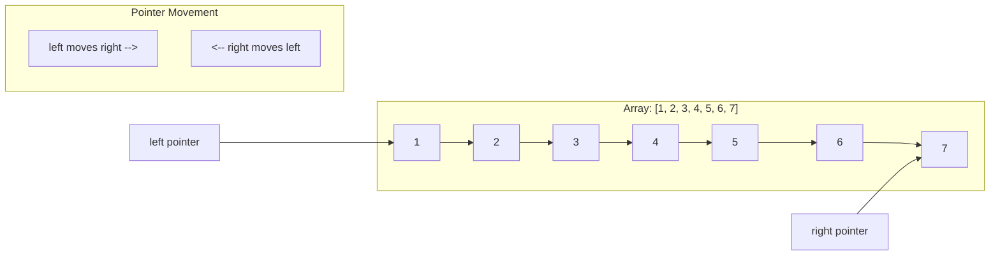
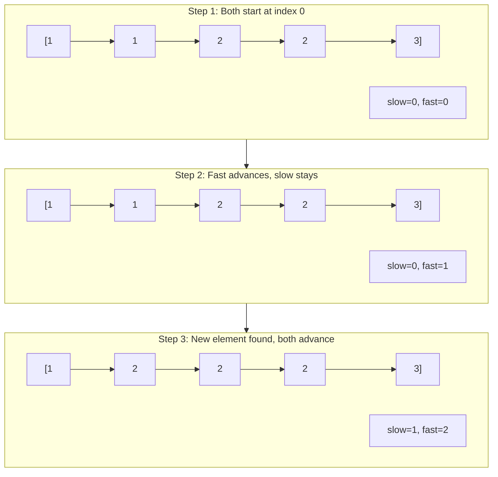
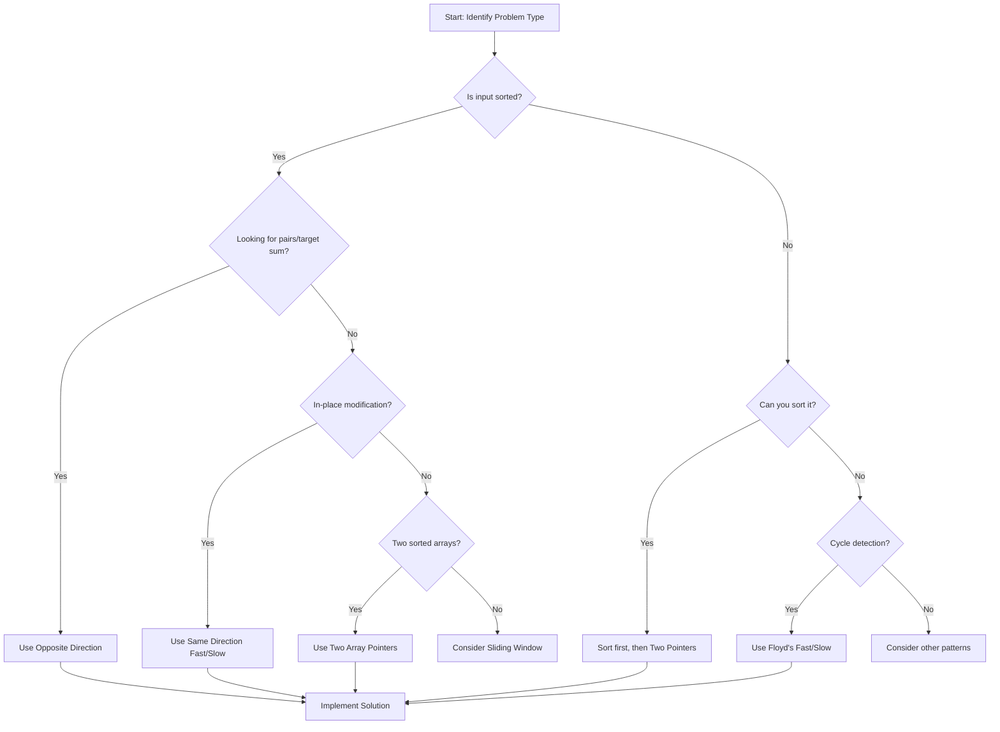

# Two Pointer Pattern

> **Efficiently traverse arrays from both ends or with synchronized pointers**

---

## Pattern Overview

The **Two Pointer Technique** is one of the most powerful and versatile algorithmic patterns used in coding interviews. It involves using two indices (pointers) that traverse a data structure—such as an array, list, or string—either toward each other or in the same direction to solve problems more efficiently.

### Why Use Two Pointers?

- **Time Complexity Reduction**: Converts O(n^2) brute force solutions to O(n)
- **Space Efficiency**: Typically requires O(1) extra space
- **In-Place Operations**: Enables modifications without extra data structures
- **Simplicity**: Once mastered, provides clean and elegant solutions

### When to Use Two Pointers

**Strong Signals:**
- Input is **sorted** or has some ordering property
- Need to find **pairs** or **triplets** satisfying a condition
- Problem involves **comparing elements** at different positions
- Need to **partition** an array in-place
- Working with **palindromes** or **symmetric** structures
- Need to **remove duplicates** or specific elements
- Merging or comparing **two sorted arrays**

---

## Types of Two Pointer

### 1. Opposite Direction (Converging)

Both pointers start at opposite ends and move toward each other until they meet.

```
Initial:    [1, 2, 3, 4, 5, 6, 7]
             ^                 ^
            left             right

Step 1:     [1, 2, 3, 4, 5, 6, 7]
                ^           ^
               left       right

Step 2:     [1, 2, 3, 4, 5, 6, 7]
                   ^     ^
                  left  right

Final:      [1, 2, 3, 4, 5, 6, 7]
                      ^
                 left = right (converged)
```

**Use Cases:**
- Two Sum in sorted array
- Container with Most Water
- Valid Palindrome
- Trapping Rain Water
- Three Sum (outer loop + two pointers)

### 2. Same Direction (Fast/Slow)

Both pointers start at the same position but move at different speeds or under different conditions.

```
Remove Duplicates Example:
Initial:    [1, 1, 2, 2, 3]
             ^
          slow,fast

Step 1:     [1, 1, 2, 2, 3]    (arr[fast] == arr[slow], skip)
             ^  ^
           slow fast

Step 2:     [1, 2, 2, 2, 3]    (arr[fast] != arr[slow], copy)
                ^  ^
              slow fast

Step 3:     [1, 2, 2, 2, 3]    (arr[fast] == arr[slow], skip)
                ^     ^
              slow   fast

Step 4:     [1, 2, 3, 2, 3]    (arr[fast] != arr[slow], copy)
                   ^     ^
                 slow   fast

Result:     [1, 2, 3] (first 3 elements)
```

**Use Cases:**
- Remove Duplicates from Sorted Array
- Move Zeroes
- Remove Element
- Cycle Detection (Floyd's Algorithm)
- Finding middle of linked list

### 3. Two Arrays

One pointer in each of two different arrays, useful for merging or comparing.

```
Merge Two Sorted Arrays:
Array A:    [1, 3, 5]
             ^
             i

Array B:    [2, 4, 6]
             ^
             j

Compare A[i] and B[j], take smaller, advance that pointer.

Result:     [1, 2, 3, 4, 5, 6]
```

**Use Cases:**
- Merge Sorted Arrays
- Intersection of Two Arrays
- Compare Version Numbers

---

## Mermaid Diagram

### Opposite Direction (Converging) Visualization



### Same Direction (Fast/Slow) Visualization



### Algorithm Decision Flowchart



---

## Template Code

### Opposite Direction Template

:::code-group

```python [Python]
def two_pointer_opposite(arr: list, target: int) -> list:
    """
    Template for problems where pointers converge from both ends.
    Examples: Two Sum II, Valid Palindrome, Container With Most Water

    Time: O(n), Space: O(1)
    """
    left, right = 0, len(arr) - 1

    while left < right:
        current_sum = arr[left] + arr[right]

        if current_sum == target:
            return [left, right]  # Found the answer
        elif current_sum < target:
            left += 1   # Need larger sum, move left pointer right
        else:
            right -= 1  # Need smaller sum, move right pointer left

    return []  # No solution found
```

```java [Java]
int[] twoPointerOpposite(int[] arr, int target) {
    // Template: converging pointers. Time: O(n), Space: O(1)
    int left = 0, right = arr.length - 1;
    while (left < right) {
        int sum = arr[left] + arr[right];
        if (sum == target) return new int[]{left, right};
        else if (sum < target) left++;
        else right--;
    }
    return new int[]{};
}
```

:::

::: info Complexity: Time O(n) · Space O(1)
- **Time:** O(n) - Each pointer moves at most n times total, and they never backtrack
- **Space:** O(1) - Only two integer pointers are used regardless of input size
:::

### Same Direction Template

:::code-group

```python [Python]
def two_pointer_same_direction(arr: list) -> int:
    """
    Template for problems where both pointers move in same direction.
    Examples: Remove Duplicates, Move Zeroes, Remove Element

    Time: O(n), Space: O(1)
    """
    if not arr:
        return 0

    slow = 0  # Points to position for next unique element

    for fast in range(len(arr)):
        if condition(arr[fast], arr[slow]):  # Define your condition
            slow += 1
            arr[slow] = arr[fast]  # Write unique element

    return slow + 1  # Length of processed array
```

```java [Java]
int twoPointerSameDirection(int[] arr) {
    // Template: slow writes, fast scans. Time: O(n), Space: O(1)
    if (arr.length == 0) return 0;
    int slow = 0;
    for (int fast = 0; fast < arr.length; fast++) {
        if (/* condition */ arr[fast] != arr[slow]) {
            slow++;
            arr[slow] = arr[fast];
        }
    }
    return slow + 1;
}
```

:::

::: info Complexity: Time O(n) · Space O(1)
- **Time:** O(n) - Fast pointer iterates through array once, slow pointer advances conditionally
- **Space:** O(1) - In-place modification using only two integer pointers
:::

### Fast/Slow Pointer (Cycle Detection) Template

:::code-group

```python [Python]
def floyd_cycle_detection(head: 'ListNode') -> bool:
    """
    Template for cycle detection in linked lists.
    Also known as Floyd's Tortoise and Hare algorithm.

    Time: O(n), Space: O(1)
    """
    if not head or not head.next:
        return False

    slow = head       # Tortoise: moves 1 step
    fast = head.next  # Hare: moves 2 steps

    while fast and fast.next:
        if slow == fast:
            return True  # Cycle detected
        slow = slow.next
        fast = fast.next.next

    return False  # No cycle
```

```java [Java]
boolean floydCycleDetection(ListNode head) {
    // Template: fast/slow cycle detection. Time: O(n), Space: O(1)
    if (head == null || head.next == null) return false;
    ListNode slow = head, fast = head.next;
    while (fast != null && fast.next != null) {
        if (slow == fast) return true;
        slow = slow.next;
        fast = fast.next.next;
    }
    return false;
}
```

:::

::: info Complexity: Time O(n) · Space O(1)
- **Time:** O(n) - If cycle exists, fast catches slow within cycle length iterations; if not, fast reaches end in n/2 steps
- **Space:** O(1) - Only two pointers used regardless of list length
:::

### Two Arrays Template

:::code-group

```python [Python]
def merge_two_sorted(arr1: list, arr2: list) -> list:
    """
    Template for problems involving two sorted arrays.
    Examples: Merge Sorted Array, Intersection of Two Arrays

    Time: O(n + m), Space: O(n + m) for result
    """
    result = []
    i, j = 0, 0

    while i < len(arr1) and j < len(arr2):
        if arr1[i] <= arr2[j]:
            result.append(arr1[i])
            i += 1
        else:
            result.append(arr2[j])
            j += 1

    # Append remaining elements
    result.extend(arr1[i:])
    result.extend(arr2[j:])

    return result
```

```java [Java]
int[] mergeTwoSorted(int[] arr1, int[] arr2) {
    // Template: two sorted arrays. Time: O(n+m), Space: O(n+m)
    int[] result = new int[arr1.length + arr2.length];
    int i = 0, j = 0, k = 0;
    while (i < arr1.length && j < arr2.length) {
        if (arr1[i] <= arr2[j]) result[k++] = arr1[i++];
        else result[k++] = arr2[j++];
    }
    while (i < arr1.length) result[k++] = arr1[i++];
    while (j < arr2.length) result[k++] = arr2[j++];
    return result;
}
```

:::

::: info Complexity: Time O(n + m) · Space O(n + m)
- **Time:** O(n + m) - Each element from both arrays is processed exactly once
- **Space:** O(n + m) - Result array stores all elements from both input arrays
:::

---

## Classic Problems

### Two Sum II - Input Array Is Sorted

**Problem:** Given a 1-indexed sorted array and a target, find two numbers that add up to the target.

**LeetCode:** [167. Two Sum II - Input Array Is Sorted](https://leetcode.com/problems/two-sum-ii-input-array-is-sorted/)

:::code-group

```python [Python]
def twoSum(numbers: list[int], target: int) -> list[int]:
    """
    Two pointers approach for sorted array two sum.

    Key Insight: Since array is sorted, if sum < target, we need larger
    numbers (move left pointer right). If sum > target, we need smaller
    numbers (move right pointer left).

    Time: O(n) - single pass through array
    Space: O(1) - only two pointers used
    """
    left, right = 0, len(numbers) - 1

    while left < right:
        current_sum = numbers[left] + numbers[right]

        if current_sum == target:
            return [left + 1, right + 1]  # 1-indexed
        elif current_sum < target:
            left += 1
        else:
            right -= 1

    return []  # Should never reach here per problem constraints

# Example:
# Input: numbers = [2, 7, 11, 15], target = 9
# Output: [1, 2] (indices of 2 and 7)
```

```java [Java]
int[] twoSum(int[] numbers, int target) {
    // LeetCode 167. Time: O(n), Space: O(1)
    int left = 0, right = numbers.length - 1;
    while (left < right) {
        int sum = numbers[left] + numbers[right];
        if (sum == target) return new int[]{left + 1, right + 1}; // 1-indexed
        else if (sum < target) left++;
        else right--;
    }
    return new int[]{};
}
```

:::

::: info Complexity: Time O(n) · Space O(1)
- **Time:** O(n) - Each element visited at most once as pointers converge from both ends
- **Space:** O(1) - Only two integer pointers used, no additional data structures
:::

---

### Remove Duplicates from Sorted Array

**Problem:** Remove duplicates in-place from a sorted array and return the new length.

**LeetCode:** [26. Remove Duplicates from Sorted Array](https://leetcode.com/problems/remove-duplicates-from-sorted-array/)

:::code-group

```python [Python]
def removeDuplicates(nums: list[int]) -> int:
    """
    Fast/slow pointer approach for removing duplicates.

    Key Insight: Slow pointer marks the position for the next unique element.
    Fast pointer scans through the array looking for new unique values.

    Time: O(n) - single pass through array
    Space: O(1) - in-place modification
    """
    if not nums:
        return 0

    slow = 0  # Position of last unique element

    for fast in range(1, len(nums)):
        if nums[fast] != nums[slow]:
            slow += 1
            nums[slow] = nums[fast]

    return slow + 1  # Length of unique portion

# Example:
# Input: nums = [1, 1, 2, 2, 3, 3, 4]
# Output: 4 (array becomes [1, 2, 3, 4, ...])
```

```java [Java]
int removeDuplicates(int[] nums) {
    // LeetCode 26. Time: O(n), Space: O(1)
    if (nums.length == 0) return 0;
    int slow = 0;
    for (int fast = 1; fast < nums.length; fast++) {
        if (nums[fast] != nums[slow]) {
            slow++;
            nums[slow] = nums[fast];
        }
    }
    return slow + 1;
}
```

:::

::: info Complexity: Time O(n) · Space O(1)
- **Time:** O(n) - Single pass through array with fast pointer; slow pointer only advances when unique element found
- **Space:** O(1) - In-place modification, no extra space used
:::

---

### Container With Most Water

**Problem:** Given heights representing vertical lines, find two lines that form a container holding the most water.

**LeetCode:** [11. Container With Most Water](https://leetcode.com/problems/container-with-most-water/)

:::code-group

```python [Python]
def maxArea(height: list[int]) -> int:
    """
    Two pointers approach to maximize water container.

    Key Insight: Water contained = min(height[left], height[right]) * (right - left)
    Always move the pointer pointing to the shorter line, because:
    - Moving the taller line can only decrease or maintain the width
    - The height is limited by the shorter line anyway
    - Moving the shorter line might find a taller line to increase area

    Time: O(n) - single pass through array
    Space: O(1) - only two pointers
    """
    left, right = 0, len(height) - 1
    max_water = 0

    while left < right:
        # Calculate current area
        width = right - left
        current_height = min(height[left], height[right])
        current_area = width * current_height
        max_water = max(max_water, current_area)

        # Move the pointer at shorter height
        if height[left] < height[right]:
            left += 1
        else:
            right -= 1

    return max_water

# Example:
# Input: height = [1, 8, 6, 2, 5, 4, 8, 3, 7]
# Output: 49 (between index 1 and 8, heights 8 and 7)
```

```java [Java]
int maxArea(int[] height) {
    // LeetCode 11. Time: O(n), Space: O(1)
    int left = 0, right = height.length - 1, maxWater = 0;
    while (left < right) {
        int area = Math.min(height[left], height[right]) * (right - left);
        maxWater = Math.max(maxWater, area);
        if (height[left] < height[right]) left++;
        else right--;
    }
    return maxWater;
}
```

:::

::: info Complexity: Time O(n) · Space O(1)
- **Time:** O(n) - Each pointer moves at most n times total as they converge toward center
- **Space:** O(1) - Only two pointers and a max tracker variable used
:::

**Visual Explanation:**
```
    8           8
    |           |   7
    |   6       |   |
    |   |   5   |   |
    |   |   | 4 |   |
    |   |   | | | 3 |
    |   | 2 | | | | |
  1 |   | | | | | | |
  | |   | | | | | | |
  0 1 2 3 4 5 6 7 8

  Max area = min(8, 7) * (8 - 1) = 7 * 7 = 49
```

**Complexity Analysis:**
- Time: O(n) - each pointer moves at most n times total
- Space: O(1) - constant extra space

---

### Trapping Rain Water

**Problem:** Given elevation map heights, compute how much water can be trapped after raining.

**LeetCode:** [42. Trapping Rain Water](https://leetcode.com/problems/trapping-rain-water/)

:::code-group

```python [Python]
def trap(height: list[int]) -> int:
    """
    Two pointers approach to calculate trapped rain water.

    Key Insight: Water at any position = min(left_max, right_max) - height[i]
    We use two pointers and track max heights from both directions.
    Process the side with smaller max height (that's the bottleneck).

    Time: O(n) - single pass through array
    Space: O(1) - only pointers and max trackers
    """
    if not height:
        return 0

    left, right = 0, len(height) - 1
    left_max, right_max = height[left], height[right]
    water = 0

    while left < right:
        if left_max < right_max:
            # Left side is the bottleneck
            left += 1
            left_max = max(left_max, height[left])
            water += left_max - height[left]
        else:
            # Right side is the bottleneck
            right -= 1
            right_max = max(right_max, height[right])
            water += right_max - height[right]

    return water

# Example:
# Input: height = [0, 1, 0, 2, 1, 0, 1, 3, 2, 1, 2, 1]
# Output: 6
```

```java [Java]
int trap(int[] height) {
    // LeetCode 42. Two-pointer O(1) space. Time: O(n), Space: O(1)
    int left = 0, right = height.length - 1;
    int leftMax = height[0], rightMax = height[height.length - 1];
    int water = 0;
    while (left < right) {
        if (leftMax < rightMax) {
            left++;
            leftMax = Math.max(leftMax, height[left]);
            water += leftMax - height[left];
        } else {
            right--;
            rightMax = Math.max(rightMax, height[right]);
            water += rightMax - height[right];
        }
    }
    return water;
}
```

:::

::: info Complexity: Time O(n) · Space O(1)
- **Time:** O(n) - Single pass with two pointers converging from both ends
- **Space:** O(1) - Only two pointers and two max trackers, no auxiliary arrays needed
:::

**Visual Explanation:**
```
              3
          2   |   2
      2   | 1 | | | 1
  1   | 1 | | | | | |
  | 0 | 0 | | 0 | | | |
  0 1 2 3 4 5 6 7 8 9 10 11

  Water fills the gaps:
  - Index 2: min(1, 2) - 0 = 1
  - Index 4: min(2, 3) - 1 = 1
  - Index 5: min(2, 3) - 0 = 2
  - Index 6: min(2, 3) - 1 = 1
  - Index 9: min(3, 2) - 1 = 1
  Total: 6 units
```

**Complexity Analysis:**
- Time: O(n) - single pass
- Space: O(1) - constant space

---

### 3Sum

**Problem:** Find all unique triplets in the array that sum to zero.

**LeetCode:** [15. 3Sum](https://leetcode.com/problems/3sum/)

:::code-group

```python [Python]
def threeSum(nums: list[int]) -> list[list[int]]:
    """
    Sort + Two Pointers approach for 3Sum.

    Key Insight: Fix one number, then use two pointers to find pairs
    that sum to the negative of the fixed number.

    Time: O(n^2) - outer loop O(n) * inner two pointers O(n)
    Space: O(1) or O(n) depending on sorting implementation
    """
    nums.sort()
    result = []
    n = len(nums)

    for i in range(n - 2):
        # Skip duplicates for first element
        if i > 0 and nums[i] == nums[i - 1]:
            continue

        # Early termination: if smallest is positive, no solution
        if nums[i] > 0:
            break

        target = -nums[i]
        left, right = i + 1, n - 1

        while left < right:
            current_sum = nums[left] + nums[right]

            if current_sum == target:
                result.append([nums[i], nums[left], nums[right]])

                # Skip duplicates for second element
                while left < right and nums[left] == nums[left + 1]:
                    left += 1
                # Skip duplicates for third element
                while left < right and nums[right] == nums[right - 1]:
                    right -= 1

                left += 1
                right -= 1
            elif current_sum < target:
                left += 1
            else:
                right -= 1

    return result

# Example:
# Input: nums = [-1, 0, 1, 2, -1, -4]
# Output: [[-1, -1, 2], [-1, 0, 1]]
```

```java [Java]
List<List<Integer>> threeSum(int[] nums) {
    // LeetCode 15. Time: O(n²), Space: O(1) extra
    Arrays.sort(nums);
    List<List<Integer>> result = new ArrayList<>();
    int n = nums.length;
    for (int i = 0; i < n - 2; i++) {
        if (i > 0 && nums[i] == nums[i - 1]) continue;
        if (nums[i] > 0) break;
        int left = i + 1, right = n - 1;
        while (left < right) {
            int sum = nums[i] + nums[left] + nums[right];
            if (sum == 0) {
                result.add(Arrays.asList(nums[i], nums[left], nums[right]));
                while (left < right && nums[left] == nums[left + 1]) left++;
                while (left < right && nums[right] == nums[right - 1]) right--;
                left++; right--;
            } else if (sum < 0) left++;
            else right--;
        }
    }
    return result;
}
```

:::

::: info Complexity: Time O(n^2) · Space O(1) to O(n)
- **Time:** O(n^2) - Outer loop iterates n times, inner two-pointer scan is O(n) each iteration
- **Space:** O(1) to O(n) - Depends on sorting algorithm; in-place sort uses O(1), otherwise O(n)
:::

---

### Valid Palindrome

**Problem:** Determine if a string is a palindrome, considering only alphanumeric characters.

**LeetCode:** [125. Valid Palindrome](https://leetcode.com/problems/valid-palindrome/)

:::code-group

```python [Python]
def isPalindrome(s: str) -> bool:
    """
    Two pointers approach for palindrome check.

    Key Insight: Compare characters from both ends, skipping non-alphanumeric.

    Time: O(n) - single pass through string
    Space: O(1) - only two pointers
    """
    left, right = 0, len(s) - 1

    while left < right:
        # Skip non-alphanumeric from left
        while left < right and not s[left].isalnum():
            left += 1
        # Skip non-alphanumeric from right
        while left < right and not s[right].isalnum():
            right -= 1

        # Compare characters (case-insensitive)
        if s[left].lower() != s[right].lower():
            return False

        left += 1
        right -= 1

    return True

# Example:
# Input: s = "A man, a plan, a canal: Panama"
# Output: True
```

```java [Java]
boolean isPalindrome(String s) {
    // LeetCode 125. Time: O(n), Space: O(1)
    int left = 0, right = s.length() - 1;
    while (left < right) {
        while (left < right && !Character.isLetterOrDigit(s.charAt(left))) left++;
        while (left < right && !Character.isLetterOrDigit(s.charAt(right))) right--;
        if (Character.toLowerCase(s.charAt(left)) != Character.toLowerCase(s.charAt(right)))
            return false;
        left++; right--;
    }
    return true;
}
```

:::

::: info Complexity: Time O(n) · Space O(1)
- **Time:** O(n) - Each character visited at most once by either pointer
- **Space:** O(1) - Only two integer pointers used, no string copies created
:::

---

### Move Zeroes

**Problem:** Move all zeroes to the end while maintaining relative order of non-zero elements.

**LeetCode:** [283. Move Zeroes](https://leetcode.com/problems/move-zeroes/)

:::code-group

```python [Python]
def moveZeroes(nums: list[int]) -> None:
    """
    Fast/slow pointer approach for moving zeroes.

    Key Insight: Slow pointer tracks position for next non-zero.
    Fast pointer finds non-zero elements.

    Time: O(n) - single pass
    Space: O(1) - in-place
    """
    slow = 0  # Position for next non-zero element

    # Move all non-zero elements to the front
    for fast in range(len(nums)):
        if nums[fast] != 0:
            nums[slow], nums[fast] = nums[fast], nums[slow]
            slow += 1

    # All elements after slow are already zero due to swaps

# Example:
# Input: nums = [0, 1, 0, 3, 12]
# Output: nums = [1, 3, 12, 0, 0] (in-place)
```

```java [Java]
void moveZeroes(int[] nums) {
    // LeetCode 283. Time: O(n), Space: O(1)
    int slow = 0;
    for (int fast = 0; fast < nums.length; fast++) {
        if (nums[fast] != 0) {
            int tmp = nums[slow]; nums[slow] = nums[fast]; nums[fast] = tmp;
            slow++;
        }
    }
}
```

:::

::: info Complexity: Time O(n) · Space O(1)
- **Time:** O(n) - Single pass with fast pointer; swaps are O(1) operations
- **Space:** O(1) - In-place modification using only two pointers
:::

---

### Linked List Cycle

**Problem:** Detect if a linked list has a cycle.

**LeetCode:** [141. Linked List Cycle](https://leetcode.com/problems/linked-list-cycle/)

:::code-group

```python [Python]
def hasCycle(head: 'ListNode') -> bool:
    """
    Floyd's Cycle Detection (Tortoise and Hare).

    Key Insight: If there's a cycle, fast pointer will eventually
    catch up to slow pointer. If no cycle, fast reaches end.

    Why it works: In a cycle, fast gains 1 step per iteration on slow.
    Eventually they must meet.

    Time: O(n) - at most 2n steps before detection
    Space: O(1) - only two pointers
    """
    if not head or not head.next:
        return False

    slow = head
    fast = head

    while fast and fast.next:
        slow = slow.next        # Move 1 step
        fast = fast.next.next   # Move 2 steps

        if slow == fast:
            return True  # Cycle detected

    return False  # Fast reached end, no cycle
```

```java [Java]
boolean hasCycle(ListNode head) {
    // LeetCode 141. Time: O(n), Space: O(1)
    ListNode slow = head, fast = head;
    while (fast != null && fast.next != null) {
        slow = slow.next;
        fast = fast.next.next;
        if (slow == fast) return true;
    }
    return false;
}
```

:::

::: info Complexity: Time O(n) · Space O(1)
- **Time:** O(n) - Fast pointer travels at most 2n nodes before either reaching end or catching slow in cycle
- **Space:** O(1) - Only two pointers used, independent of list size
:::

---

### Sort Colors (Dutch National Flag)

**Problem:** Sort an array containing only 0, 1, and 2 in-place.

**LeetCode:** [75. Sort Colors](https://leetcode.com/problems/sort-colors/)

:::code-group

```python [Python]
def sortColors(nums: list[int]) -> None:
    """
    Three pointers approach (Dutch National Flag algorithm).

    Key Insight: Partition array into three sections:
    [0...low-1] = 0s, [low...high] = 1s, [high+1...n-1] = 2s

    Time: O(n) - single pass
    Space: O(1) - in-place
    """
    low, mid, high = 0, 0, len(nums) - 1

    while mid <= high:
        if nums[mid] == 0:
            nums[low], nums[mid] = nums[mid], nums[low]
            low += 1
            mid += 1
        elif nums[mid] == 1:
            mid += 1
        else:  # nums[mid] == 2
            nums[mid], nums[high] = nums[high], nums[mid]
            high -= 1
            # Don't increment mid, need to check swapped value

# Example:
# Input: nums = [2, 0, 2, 1, 1, 0]
# Output: nums = [0, 0, 1, 1, 2, 2] (in-place)
```

```java [Java]
void sortColors(int[] nums) {
    // LeetCode 75. Dutch National Flag. Time: O(n), Space: O(1)
    int low = 0, mid = 0, high = nums.length - 1;
    while (mid <= high) {
        if (nums[mid] == 0) {
            int tmp = nums[low]; nums[low] = nums[mid]; nums[mid] = tmp;
            low++; mid++;
        } else if (nums[mid] == 1) {
            mid++;
        } else {
            int tmp = nums[mid]; nums[mid] = nums[high]; nums[high] = tmp;
            high--; // don't increment mid
        }
    }
}
```

:::

::: info Complexity: Time O(n) · Space O(1)
- **Time:** O(n) - Each element is examined at most twice (once by mid, possibly once after swap from high)
- **Space:** O(1) - In-place partitioning using only three pointers
:::

---

## Pattern Recognition

### Key Indicators for Two Pointer Pattern

| Signal | Pattern Type | Example Problem |
|--------|--------------|-----------------|
| Sorted array + find pair | Opposite Direction | Two Sum II |
| Palindrome check | Opposite Direction | Valid Palindrome |
| Find maximum/minimum with constraints | Opposite Direction | Container With Most Water |
| Remove/deduplicate in-place | Same Direction | Remove Duplicates |
| Partition array | Same Direction | Move Zeroes, Sort Colors |
| Cycle detection | Fast/Slow | Linked List Cycle |
| Two sorted arrays | Two Arrays | Merge Sorted Array |
| Sum equals target (sorted) | Opposite Direction | 3Sum, 4Sum |

### Questions to Ask Yourself

1. **Is the input sorted?** -> Strong signal for two pointers
2. **Am I looking for pairs/triplets?** -> Consider opposite direction
3. **Do I need to modify in-place?** -> Consider same direction
4. **Is this about a cycle?** -> Use fast/slow
5. **Are there two arrays to merge/compare?** -> Use two array pointers

### Complexity Comparison

| Approach | Time | Space | When to Use |
|----------|------|-------|-------------|
| Brute Force (nested loops) | O(n^2) | O(1) | Never for two pointer problems |
| Hash Map | O(n) | O(n) | When order doesn't matter |
| Two Pointers | O(n) | O(1) | When input has structure (sorted) |
| Sort + Two Pointers | O(n log n) | O(1) | When can afford sorting |

---

## Interview Applications

Two pointer problems are frequently asked in interviews and other top tech companies. Here are common problem types and practice recommendations:

### Frequently Asked

1. **Container With Most Water** - Classic opposite direction problem
2. **Trapping Rain Water** - Advanced two pointer with running max
3. **3Sum / 4Sum** - Sort + nested two pointer
4. **Two Sum II** - Foundation problem for the pattern
5. **Merge Sorted Array** - Two array pointer problem
6. **Valid Palindrome II** - Allow one deletion variant
7. **Remove Duplicates from Sorted Array** - In-place modification

### Interview Tips

**Before Coding:**
- Clarify if the input is sorted
- Ask about duplicates and how to handle them
- Confirm space complexity requirements
- Discuss whether in-place modification is acceptable

**During Implementation:**
- Start with pointer initialization
- Clearly define loop termination condition
- Handle edge cases (empty array, single element)
- Be careful with off-by-one errors

**Common Mistakes to Avoid:**
- Using `<=` instead of `<` in while condition
- Not handling duplicates properly in 3Sum/4Sum
- Forgetting to move pointers inside the loop
- Not updating max/min values correctly

### Practice Resources

- [LeetCode Two Pointers Problem List](https://leetcode.com/problem-list/two-pointers/)
- [GeeksforGeeks - Top Two Pointer Problems](https://www.geeksforgeeks.org/dsa/top-problems-on-two-pointers-technique-for-interviews/)
- [InterviewBit - Two Pointers](https://www.interviewbit.com/courses/programming/two-pointers/)
- [interviewing.io - Two Pointers Questions](https://interviewing.io/two-pointers-interview-questions)
- [Educative - Google Coding Interview Questions](https://www.educative.io/blog/google-coding-interview-questions)

---

## Quick Reference Card

```
+------------------------------------------------------------------+
|                    TWO POINTER QUICK REFERENCE                    |
+------------------------------------------------------------------+

PATTERN TYPES:
--------------
1. Opposite Direction: left=0, right=n-1, converge to center
2. Same Direction:     slow=0, fast moves ahead, both go forward
3. Two Arrays:         i in arr1, j in arr2, process together

TEMPLATE - OPPOSITE DIRECTION:
------------------------------
left, right = 0, len(arr) - 1
while left < right:
    if condition_met:
        return result
    elif need_larger:
        left += 1
    else:
        right -= 1

TEMPLATE - SAME DIRECTION:
--------------------------
slow = 0
for fast in range(len(arr)):
    if should_keep(arr[fast]):
        arr[slow] = arr[fast]
        slow += 1
return slow

TEMPLATE - CYCLE DETECTION:
---------------------------
slow = fast = head
while fast and fast.next:
    slow = slow.next
    fast = fast.next.next
    if slow == fast:
        return True  # cycle found
return False

WHEN TO USE:
------------
[x] Sorted array                    -> Two pointers likely optimal
[x] Find pairs summing to target    -> Opposite direction
[x] Remove duplicates in-place      -> Same direction (fast/slow)
[x] Check palindrome                -> Opposite direction
[x] Cycle in linked list            -> Fast/slow pointers
[x] Merge two sorted arrays         -> Two array pointers
[x] Partition array (0s, 1s, 2s)   -> Three pointers (Dutch flag)

COMPLEXITY:
-----------
Time:  O(n) for single pass, O(n^2) for nested (like 3Sum)
Space: O(1) typically (main advantage over hash-based solutions)

COMMON PROBLEMS:
----------------
- Two Sum II              - Container With Most Water
- 3Sum / 4Sum            - Trapping Rain Water
- Remove Duplicates      - Valid Palindrome
- Move Zeroes            - Linked List Cycle
- Sort Colors            - Merge Sorted Array

EDGE CASES TO CHECK:
--------------------
[ ] Empty array
[ ] Single element
[ ] All same elements
[ ] Already sorted (ascending/descending)
[ ] Negative numbers
[ ] Duplicates

+------------------------------------------------------------------+
```

---

## Additional Practice Problems

### Easy
- [344. Reverse String](https://leetcode.com/problems/reverse-string/)
- [977. Squares of a Sorted Array](https://leetcode.com/problems/squares-of-a-sorted-array/)
- [88. Merge Sorted Array](https://leetcode.com/problems/merge-sorted-array/)
- [27. Remove Element](https://leetcode.com/problems/remove-element/)

### Medium
- [167. Two Sum II](https://leetcode.com/problems/two-sum-ii-input-array-is-sorted/)
- [15. 3Sum](https://leetcode.com/problems/3sum/)
- [11. Container With Most Water](https://leetcode.com/problems/container-with-most-water/)
- [75. Sort Colors](https://leetcode.com/problems/sort-colors/)
- [142. Linked List Cycle II](https://leetcode.com/problems/linked-list-cycle-ii/)
- [287. Find the Duplicate Number](https://leetcode.com/problems/find-the-duplicate-number/)

### Hard
- [42. Trapping Rain Water](https://leetcode.com/problems/trapping-rain-water/)
- [76. Minimum Window Substring](https://leetcode.com/problems/minimum-window-substring/)
- [18. 4Sum](https://leetcode.com/problems/4sum/)

---

## Sources

- [LeetCode - Two Pointers Problem List](https://leetcode.com/problem-list/two-pointers/)
- [GeeksforGeeks - Two Pointers Technique](https://www.geeksforgeeks.org/dsa/two-pointers-technique/)
- [GeeksforGeeks - Top Problems on Two Pointers](https://www.geeksforgeeks.org/dsa/top-problems-on-two-pointers-technique-for-interviews/)
- [interviewing.io - Two Pointers Interview Questions](https://interviewing.io/two-pointers-interview-questions)
- [InterviewBit - Two Pointers](https://www.interviewbit.com/courses/programming/two-pointers/)
- [Medium - Leetcode is Easy! The Two Pointer Pattern](https://medium.com/@timpark0807/leetcode-is-easy-two-pointers-90b9b0f2eb43)
- [Design Gurus - Introduction to Two Pointers Pattern](https://www.designgurus.io/course-play/grokking-the-coding-interview/doc/638c9e2788f1e1c16f41c35c)
- [AlgoMonster - Two Pointers Introduction](https://algo.monster/problems/two_pointers_intro)
- [Educative - Google Coding Interview Questions](https://www.educative.io/blog/google-coding-interview-questions)
