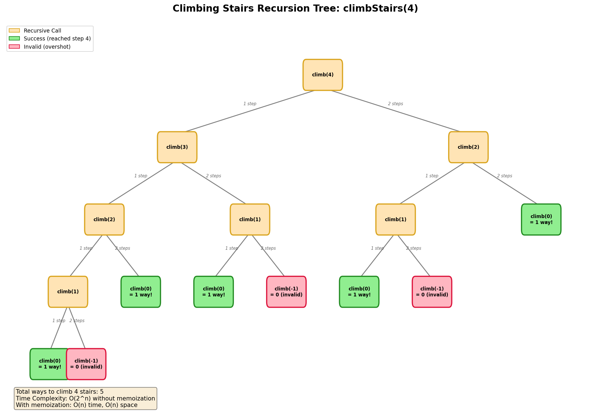

# Climbing Stairs

> **LeetCode**: [70. Climbing Stairs](https://leetcode.com/problems/climbing-stairs/)
> **Difficulty**: Easy
> **Pattern**: Recursion + Memoization, Dynamic Programming

---

## Problem Statement

You are climbing a staircase. It takes `n` steps to reach the top.

Each time you can either climb **1** or **2** steps. In how many distinct ways can you climb to the top?

---

## Examples

### Example 1
```text
Input: n = 2
Output: 2
Explanation: There are two ways to climb to the top.
1. 1 step + 1 step
2. 2 steps
```

### Example 2
```text
Input: n = 3
Output: 3
Explanation: There are three ways to climb to the top.
1. 1 step + 1 step + 1 step
2. 1 step + 2 steps
3. 2 steps + 1 step
```

### Example 3
```text
Input: n = 5
Output: 8
Explanation:
1. 1+1+1+1+1
2. 1+1+1+2
3. 1+1+2+1
4. 1+2+1+1
5. 2+1+1+1
6. 1+2+2
7. 2+1+2
8. 2+2+1
```

---

## Constraints

- `1 <= n <= 45`

---

## Recursion Tree Visualization



### Understanding the Decision Tree

At each step, you have two choices:
1. Take **1 step** (remaining = n - 1)
2. Take **2 steps** (remaining = n - 2)

The number of ways to reach the top from step `i` is:
```text
ways(i) = ways(i + 1) + ways(i + 2)
```

Or equivalently, working backwards:
```text
climbStairs(n) = climbStairs(n - 1) + climbStairs(n - 2)
```

**This is the same recurrence as Fibonacci!**

---

## Recursive Template

```python
def climbStairs(n):
    """
    Climbing stairs recursive template.

    Key Insight: This is Fibonacci in disguise!
    - ways(n) = ways(n-1) + ways(n-2)
    - Base: ways(1) = 1, ways(2) = 2
    """
    # BASE CASES
    if n <= 2:
        return n

    # RECURSIVE CASE
    return climbStairs(n - 1) + climbStairs(n - 2)
```

---

## Solutions

### Solution 1: Naive Recursion (TLE)

```python
def climbStairs_naive(n: int) -> int:
    """
    Naive recursive solution - will TLE for large n.

    Time Complexity: O(2^n)
    Space Complexity: O(n) - call stack
    """
    if n <= 2:
        return n
    return climbStairs_naive(n - 1) + climbStairs_naive(n - 2)


# Test (slow for large n)
print(climbStairs_naive(10))  # Output: 89
```

::: info Complexity: Time O(2^n) · Space O(n)
- **Time:** Each call branches into two recursive calls without memoization, creating a full binary tree with approximately 2^n nodes.
- **Space:** Maximum recursion depth is n (from climbStairs(n) down to base case), determining the call stack size.
:::

### Solution 2: Memoization (Top-Down DP)

```python
def climbStairs_memo(n: int, memo: dict = None) -> int:
    """
    Memoized recursive solution.

    Time Complexity: O(n) - each subproblem solved once
    Space Complexity: O(n) - memo + call stack
    """
    if memo is None:
        memo = {}

    if n in memo:
        return memo[n]

    if n <= 2:
        return n

    memo[n] = climbStairs_memo(n - 1, memo) + climbStairs_memo(n - 2, memo)
    return memo[n]


# Test
print(climbStairs_memo(45))  # Output: 1836311903
```

::: info Complexity: Time O(n) · Space O(n)
- **Time:** Each subproblem from 1 to n is computed exactly once and cached, eliminating redundant recursive calls.
- **Space:** Memo dictionary stores n entries, plus the call stack can reach depth n before hitting cached values.
:::

### Solution 3: Using @lru_cache

```python
from functools import lru_cache

@lru_cache(maxsize=None)
def climbStairs_cached(n: int) -> int:
    """
    Memoized with Python decorator.

    Time Complexity: O(n)
    Space Complexity: O(n)
    """
    if n <= 2:
        return n
    return climbStairs_cached(n - 1) + climbStairs_cached(n - 2)


# Test
print(climbStairs_cached(45))  # Output: 1836311903
```

::: info Complexity: Time O(n) · Space O(n)
- **Time:** The decorator automatically memoizes results; each unique input from 1 to n is computed once.
- **Space:** Cache stores n entries internally, with call stack depth up to n during first computation.
:::

### Solution 4: Tabulation (Bottom-Up DP)

```python
def climbStairs_dp(n: int) -> int:
    """
    Bottom-up dynamic programming.

    Time Complexity: O(n)
    Space Complexity: O(n)
    """
    if n <= 2:
        return n

    dp = [0] * (n + 1)
    dp[1] = 1
    dp[2] = 2

    for i in range(3, n + 1):
        dp[i] = dp[i - 1] + dp[i - 2]

    return dp[n]


# Test
print(climbStairs_dp(45))  # Output: 1836311903
```

::: info Complexity: Time O(n) · Space O(n)
- **Time:** Single loop from 3 to n, computing each dp value in O(1) by summing two previous values.
- **Space:** The dp array of size n+1 stores all intermediate results for the bottom-up computation.
:::

### Solution 5: Space-Optimized (BEST)

::: code-group
```python [Python]
def climbStairs(n: int) -> int:
    """
    Space-optimized solution - BEST FOR INTERVIEW.

    Time Complexity: O(n)
    Space Complexity: O(1)
    """
    if n <= 2:
        return n

    prev, curr = 1, 2
    for _ in range(3, n + 1):
        prev, curr = curr, prev + curr

    return curr


# Test
print(climbStairs(45))  # Output: 1836311903
```

```java [Java]
public int climbStairs(int n) {
    if (n <= 2) return n;
    int prev = 1, curr = 2;
    for (int i = 3; i <= n; i++) {
        int next = prev + curr;
        prev = curr;
        curr = next;
    }
    return curr;
}
```
:::

::: info Complexity: Time O(n) · Space O(1)
- **Time:** Single loop from 3 to n with constant-time swap and addition operations per iteration.
- **Space:** Only two variables (prev, curr) are maintained throughout, regardless of input size.
:::

### Solution 6: Matrix Exponentiation (O(log n))

```python
def climbStairs_matrix(n: int) -> int:
    """
    Matrix exponentiation for O(log n) time.

    Based on: [[F(n+1), F(n)], [F(n), F(n-1)]] = [[1,1],[1,0]]^n
    """
    if n <= 2:
        return n

    def matrix_mult(A, B):
        return [
            [A[0][0]*B[0][0] + A[0][1]*B[1][0], A[0][0]*B[0][1] + A[0][1]*B[1][1]],
            [A[1][0]*B[0][0] + A[1][1]*B[1][0], A[1][0]*B[0][1] + A[1][1]*B[1][1]]
        ]

    def matrix_pow(M, p):
        result = [[1, 0], [0, 1]]
        while p:
            if p & 1:
                result = matrix_mult(result, M)
            M = matrix_mult(M, M)
            p >>= 1
        return result

    base = [[1, 1], [1, 0]]
    result = matrix_pow(base, n)
    return result[0][0]


# Test
print(climbStairs_matrix(45))  # Output: 1836311903
```

::: info Complexity: Time O(log n) · Space O(1)
- **Time:** Matrix exponentiation using binary method halves the exponent each iteration, requiring only O(log n) matrix multiplications.
- **Space:** Uses fixed-size 2x2 matrices with no recursion, constant memory regardless of n.
:::

---

## Complexity Analysis

| Approach | Time | Space | Notes |
|----------|------|-------|-------|
| Naive Recursion | O(2^n) | O(n) | TLE for n > 30 |
| Memoization | O(n) | O(n) | Top-down DP |
| @lru_cache | O(n) | O(n) | Pythonic |
| Tabulation | O(n) | O(n) | Bottom-up DP |
| Space-Optimized | O(n) | O(1) | **Best for interview** |
| Matrix Expo | O(log n) | O(1) | Advanced |

---

## Pattern Recognition: Fibonacci Connection

### Climbing Stairs Values
| n | Ways | Fibonacci |
|---|------|-----------|
| 1 | 1 | F(2) = 1 |
| 2 | 2 | F(3) = 2 |
| 3 | 3 | F(4) = 3 |
| 4 | 5 | F(5) = 5 |
| 5 | 8 | F(6) = 8 |

**Pattern**: `climbStairs(n) = Fibonacci(n + 1)`

---

## Variations

### Variation 1: K Steps

```python
def climbStairs_k(n: int, k: int) -> int:
    """
    You can take 1 to k steps at a time.

    Time: O(n * k)
    Space: O(n)
    """
    dp = [0] * (n + 1)
    dp[0] = 1

    for i in range(1, n + 1):
        for j in range(1, min(k, i) + 1):
            dp[i] += dp[i - j]

    return dp[n]


# Test: n=5 steps, can take 1-3 steps at a time
print(climbStairs_k(5, 3))  # Output: 13
```

### Variation 2: With Cost (Min Cost Climbing Stairs)

```python
def minCostClimbingStairs(cost: list) -> int:
    """
    LeetCode 746: Min Cost Climbing Stairs

    Time: O(n)
    Space: O(1)
    """
    n = len(cost)
    prev, curr = cost[0], cost[1]

    for i in range(2, n):
        prev, curr = curr, cost[i] + min(prev, curr)

    return min(prev, curr)


# Test
print(minCostClimbingStairs([10, 15, 20]))  # Output: 15
```

---

## Common Mistakes

### 1. Wrong Base Case
```python
# WRONG
def wrong(n):
    if n == 0:
        return 0  # Should be: if n <= 2: return n
    return wrong(n-1) + wrong(n-2)

# CORRECT
def correct(n):
    if n <= 2:
        return n  # 1 way for n=1, 2 ways for n=2
    return correct(n-1) + correct(n-2)
```

### 2. Off-by-One Error
```python
# WRONG - range doesn't include n
def wrong(n):
    dp = [0] * n  # Should be n+1
    for i in range(3, n):  # Should be n+1

# CORRECT
def correct(n):
    dp = [0] * (n + 1)
    for i in range(3, n + 1):
```

---

## Related Problems

::: details Fibonacci Number (LeetCode 509)
**Problem:** Calculate F(n), where F(0)=0, F(1)=1, and F(n)=F(n-1)+F(n-2).

**Key Insight:** Climbing Stairs IS Fibonacci! climbStairs(n) = Fibonacci(n+1).

```mermaid
graph LR
    A[Climbing Stairs] --> B[F(n) = F(n-1) + F(n-2)]
    C[Fibonacci] --> B
```

**Approach:** Same recurrence, different base cases.

**Complexity:** O(n) time, O(1) space

**Link:** [Local Solution](./fibonacci.md)
:::

::: details Min Cost Climbing Stairs (LeetCode 746)
**Problem:** Given an array cost where cost[i] is the cost of step i, find minimum cost to reach the top (can start from step 0 or 1).

**Key Insight:** Add cost consideration to the basic climbing stairs DP.

```mermaid
graph TD
    A[Step i] --> B{Min cost to reach?}
    B --> C[min(dp[i-1], dp[i-2]) + cost[i]]
```

**Approach:** dp[i] = cost[i] + min(dp[i-1], dp[i-2])

**Complexity:** O(n) time, O(1) space

**Link:** [LeetCode 746](https://leetcode.com/problems/min-cost-climbing-stairs/)
:::

::: details House Robber (LeetCode 198)
**Problem:** Rob houses for maximum money without robbing adjacent houses.

**Key Insight:** Same DP structure - at each position, choose between two options.

```mermaid
graph TD
    A[House i] --> B{Decision}
    B -->|Rob| C[nums[i] + dp[i-2]]
    B -->|Skip| D[dp[i-1]]
```

**Approach:** dp[i] = max(dp[i-1], dp[i-2] + nums[i])

**Complexity:** O(n) time, O(1) space

**Link:** [LeetCode 198](https://leetcode.com/problems/house-robber/)
:::

::: details Decode Ways (LeetCode 91)
**Problem:** A message encoded with A=1, B=2, ..., Z=26. Count ways to decode a digit string.

**Key Insight:** Similar branching - can decode 1 digit or 2 digits (if valid).

```mermaid
graph TD
    A[Position i] --> B{Can decode?}
    B -->|1 digit| C[dp[i-1]]
    B -->|2 digits valid| D[+ dp[i-2]]
```

**Approach:** Similar to climbing stairs but with validity checks for 2-digit decoding.

**Complexity:** O(n) time, O(1) space

**Link:** [LeetCode 91](https://leetcode.com/problems/decode-ways/)
:::

---

## Interview Tips

1. **Recognize the Fibonacci pattern** immediately
2. **Start with recursive solution** to show understanding
3. **Add memoization** when asked about optimization
4. **Present space-optimized** as the final solution
5. **Discuss variations** (k steps, with costs) if time permits

---

## Key Takeaways

1. **Climbing Stairs = Fibonacci** - same recurrence relation
2. **Think in terms of the last step**: To reach step n, you either came from n-1 or n-2
3. **Overlapping subproblems** make memoization essential
4. **O(1) space is achievable** since we only need the last two values
5. **Pattern extends to k steps**: sum of last k values

---

*Last updated: January 2026*
