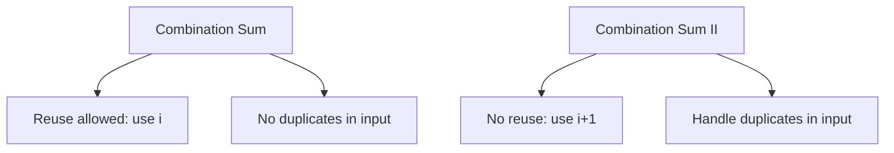
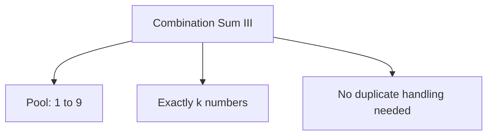

# Combination Sum II

> **LeetCode**: [40. Combination Sum II](https://leetcode.com/problems/combination-sum-ii/)
> **Difficulty**: Medium
> **Pattern**: Backtracking with Duplicate Handling

---

## Problem Statement

Given a collection of candidate numbers (`candidates`) and a target number (`target`), find all unique combinations in `candidates` where the candidate numbers sum to `target`.

Each number in `candidates` may only be used **once** in the combination.

**Note:** The solution set must not contain duplicate combinations.

---

## Examples

### Example 1
```
Input: candidates = [10, 1, 2, 7, 6, 1, 5], target = 8
Output: [[1, 1, 6], [1, 2, 5], [1, 7], [2, 6]]
```

### Example 2
```
Input: candidates = [2, 5, 2, 1, 2], target = 5
Output: [[1, 2, 2], [5]]
```

---

## Constraints

- `1 <= candidates.length <= 100`
- `1 <= candidates[i] <= 50`
- `1 <= target <= 30`

---

## Key Differences from Combination Sum

| Aspect | Combination Sum | Combination Sum II |
|--------|----------------|-------------------|
| Element reuse | Allowed | **Not allowed** |
| Duplicates in input | No | **Yes** |
| Recursive index | `i` (stay) | `i + 1` (move forward) |
| Skip condition | None | Skip duplicates at same level |

---

## Backtracking Strategy

1. **Sort the array** to group duplicates together
2. **Use `i + 1`** in recursive call (no reuse)
3. **Skip duplicates at same decision level**: `if i > start and nums[i] == nums[i-1]`

```
For candidates = [1, 1, 2, 5], target = 8:

Sorted: [1, 1, 2, 5]

At level 0 (start=0):
- i=0: Try 1, recurse with start=1
- i=1: nums[1]==nums[0] AND i>start -> SKIP (avoids duplicate [1,...])
- i=2: Try 2, recurse with start=3
- i=3: Try 5, recurse with start=4
```

---

## Backtracking Template

```python
def combinationSum2(candidates, target):
    """
    Template for combination sum without reuse and with duplicates.

    Two key changes from Combination Sum:
    1. Use i+1 (no reuse)
    2. Skip duplicates at same level
    """
    result = []
    candidates.sort()  # CRITICAL: Sort for duplicate handling!

    def backtrack(start, path, remaining):
        if remaining == 0:
            result.append(path[:])
            return

        if remaining < 0:
            return

        for i in range(start, len(candidates)):
            # Skip duplicates at same decision level
            if i > start and candidates[i] == candidates[i - 1]:
                continue

            path.append(candidates[i])
            backtrack(i + 1, path, remaining - candidates[i])  # i+1, not i!
            path.pop()

    backtrack(0, [], target)
    return result
```

---

## Solutions

### Solution 1: Backtracking (Recommended)

```python
def combinationSum2(candidates: list, target: int) -> list:
    """
    Find all unique combinations (each element used once).

    Time Complexity: O(2^n) in worst case
    Space Complexity: O(n) for recursion depth
    """
    result = []
    candidates.sort()

    def backtrack(start, path, remaining):
        if remaining == 0:
            result.append(path[:])
            return

        if remaining < 0:
            return

        for i in range(start, len(candidates)):
            # Skip duplicates at same level
            if i > start and candidates[i] == candidates[i - 1]:
                continue

            # Early termination if sorted
            if candidates[i] > remaining:
                break

            path.append(candidates[i])
            backtrack(i + 1, path, remaining - candidates[i])
            path.pop()

    backtrack(0, [], target)
    return result


# Test
print(combinationSum2([10, 1, 2, 7, 6, 1, 5], 8))
# Output: [[1, 1, 6], [1, 2, 5], [1, 7], [2, 6]]
```

::: info Complexity: Time O(2^n) · Space O(n)
- **Time:** In the worst case, each element can be included or excluded, giving 2^n combinations to explore. Sorting adds O(n log n), dominated by the exponential factor.
- **Space:** Recursion depth is at most n (one element considered per level), plus the path storage.
:::

### Solution 2: With Counter (Alternative)

```python
from collections import Counter

def combinationSum2_counter(candidates: list, target: int) -> list:
    """
    Use Counter to handle duplicates naturally.

    Time Complexity: O(2^n)
    Space Complexity: O(n)
    """
    result = []
    counter = Counter(candidates)
    unique_candidates = sorted(counter.keys())

    def backtrack(index, path, remaining):
        if remaining == 0:
            result.append(path[:])
            return

        if remaining < 0 or index >= len(unique_candidates):
            return

        candidate = unique_candidates[index]

        if candidate > remaining:
            return

        # Try using 0, 1, 2, ... count copies of this candidate
        max_count = min(counter[candidate], remaining // candidate)

        for count in range(max_count + 1):
            if count > 0:
                path.extend([candidate] * count)

            backtrack(index + 1, path, remaining - candidate * count)

            if count > 0:
                for _ in range(count):
                    path.pop()

    # Alternative: choose not to use, then move on
    def backtrack_v2(index, path, remaining):
        if remaining == 0:
            result.append(path[:])
            return

        if index >= len(unique_candidates):
            return

        candidate = unique_candidates[index]

        if candidate > remaining:
            return

        # Don't use this candidate, move to next
        backtrack_v2(index + 1, path, remaining)

        # Use this candidate (if we have count available)
        if counter[candidate] > 0:
            counter[candidate] -= 1
            path.append(candidate)
            backtrack_v2(index, path, remaining - candidate)  # Stay at same index
            path.pop()
            counter[candidate] += 1

    backtrack(0, [], target)
    return result


# Test
print(combinationSum2_counter([10, 1, 2, 7, 6, 1, 5], 8))
```

::: info Complexity: Time O(2^n) · Space O(n)
- **Time:** For each unique candidate, we try using 0, 1, 2, ... up to available count copies. This explores all valid combinations.
- **Space:** Counter stores unique elements (at most n), plus O(n) recursion depth for the path.
:::

### Solution 3: Iterative with Pruning

```python
def combinationSum2_iterative(candidates: list, target: int) -> list:
    """
    Iterative BFS-like approach.

    Time Complexity: O(2^n)
    Space Complexity: O(2^n) for queue
    """
    candidates.sort()
    result = []
    stack = [(0, [], target)]  # (start_index, path, remaining)

    while stack:
        start, path, remaining = stack.pop()

        if remaining == 0:
            result.append(path)
            continue

        for i in range(start, len(candidates)):
            if i > start and candidates[i] == candidates[i - 1]:
                continue

            if candidates[i] > remaining:
                break

            stack.append((i + 1, path + [candidates[i]], remaining - candidates[i]))

    return result


# Test
print(combinationSum2_iterative([10, 1, 2, 7, 6, 1, 5], 8))
```

::: info Complexity: Time O(2^n) · Space O(2^n)
- **Time:** Same exploration pattern as recursive backtracking, but implemented with explicit stack.
- **Space:** The stack can hold multiple partial states; in the worst case, this can grow exponentially before solutions are found.
:::

---

## Visual: Skip Condition Explained

```
candidates = [1, 1, 2, 5], target = 4
sorted: [1, 1, 2, 5]

backtrack(start=0, path=[], rem=4):
    i=0 (val=1): path=[1], rem=3
        backtrack(start=1, path=[1], rem=3):
            i=1 (val=1): path=[1,1], rem=2
                backtrack(start=2, path=[1,1], rem=2):
                    i=2 (val=2): path=[1,1,2], rem=0 -> SUCCESS!

            i=2 (val=2): path=[1,2], rem=1
                (nothing sums to 1)

    i=1 (val=1): i > start (0) AND nums[1]==nums[0]? YES -> SKIP!
        (This prevents generating another path starting with 1)

    i=2 (val=2): path=[2], rem=2
        backtrack(start=3, path=[2], rem=2):
            i=3 (val=5): 5 > 2 -> BREAK

Result: [[1, 1, 2]]
```

---

## Common Mistakes

### 1. Using Wrong Index in Recursion
```python
# WRONG - allows reuse
backtrack(i, path, remaining - candidates[i])

# CORRECT - no reuse allowed
backtrack(i + 1, path, remaining - candidates[i])
```

### 2. Skip Condition Without Sort
```python
# WRONG - skip condition won't work correctly
def wrong(candidates, target):
    def backtrack(start, path, remaining):
        for i in range(start, len(candidates)):
            if i > start and candidates[i] == candidates[i-1]:
                continue  # Won't catch non-adjacent duplicates!

# CORRECT - sort first
def correct(candidates, target):
    candidates.sort()  # Groups duplicates together!
    def backtrack(start, path, remaining):
        # Now skip condition works
```

### 3. Skip Condition at Wrong Position
```python
# WRONG - skips too aggressively
if i > 0 and candidates[i] == candidates[i-1]:  # Uses 0 instead of start
    continue

# CORRECT - only skip at same level
if i > start and candidates[i] == candidates[i-1]:
    continue
```

---

## Comparison Table

| Problem | Reuse? | Duplicates? | Index | Skip Condition |
|---------|--------|-------------|-------|----------------|
| Combination Sum | Yes | No | `i` | None |
| **Combination Sum II** | **No** | **Yes** | **`i+1`** | **`i > start and nums[i] == nums[i-1]`** |
| Subsets | No | No | `i+1` | None |
| Subsets II | No | Yes | `i+1` | `i > start and nums[i] == nums[i-1]` |

---

## Related Problems

::: details Combination Sum (LeetCode 39)
**Problem:** Find combinations that sum to target. Same number can be used unlimited times.

**Key Insight:** Element reuse allowed - use index i instead of i+1.



**Approach:** Backtracking passing index i (not i+1) to allow reusing same element.

**Complexity:** O(n^(target/min)) time, O(target/min) space

**Link:** [Local Solution](./combination-sum.md)
:::

::: details Combination Sum III (LeetCode 216)
**Problem:** Find k numbers from 1-9 that sum to n.

**Key Insight:** Fixed element pool, fixed count, no duplicates - simpler than Combination Sum II.



**Approach:** Backtracking with two constraints: count == k AND sum == n.

**Complexity:** O(C(9,k) * k) time, O(k) space

**Link:** [LeetCode 216](https://leetcode.com/problems/combination-sum-iii/)
:::

::: details Subsets II (LeetCode 90)
**Problem:** Return all unique subsets from array that may contain duplicates.

**Key Insight:** Exact same duplicate handling pattern, just no target sum constraint.

```mermaid
graph TD
    A[Same Skip Logic] --> B[Sort first]
    B --> C{i > start AND nums[i] == nums[i-1]?}
    C -->|Yes| D[Skip]
    C -->|No| E[Include]
```

**Approach:** Sort + skip duplicates at same level. Pattern is identical!

**Complexity:** O(n * 2^n) time, O(n) space

**Link:** [Local Solution](./subsets-ii.md)
:::

::: details Permutations II (LeetCode 47)
**Problem:** Return all unique permutations from array that may contain duplicates.

**Key Insight:** Different skip condition - uses used[] array instead of start index.

```mermaid
graph TD
    A[Subsets/Combinations] --> B[Skip: i > start AND same as prev]
    C[Permutations] --> D[Skip: !used[i-1] AND same as prev]
```

**Approach:** Sort + skip if same as previous AND previous not used in current path.

**Complexity:** O(n * n!) time, O(n) space

**Link:** [Local Solution](./permutations-ii.md)
:::

---

## Interview Tips

1. **Clarify both aspects**: "No reuse AND input has duplicates?"
2. **Mention the two changes** from Combination Sum:
   - `i + 1` instead of `i`
   - Skip duplicates at same level
3. **Sort first** - always mention this for duplicate handling
4. **Draw example** with [1, 1, 2] to show skip condition
5. **Early termination** with sorted array is a nice optimization

---

## Key Takeaways

1. **Two modifications from Combination Sum**:
   - Use `i + 1` (elements used once)
   - Skip duplicates at same level
2. **Sort is essential** for grouping duplicates
3. **Skip condition: `i > start and nums[i] == nums[i-1]`**
   - `i > start` ensures we use at least one of each duplicate
   - `nums[i] == nums[i-1]` detects duplicates
4. **Same pattern as Subsets II** - learn one, know both!
5. **Early `break`** when candidate > remaining (with sorted array)

---

*Last updated: January 2026*
