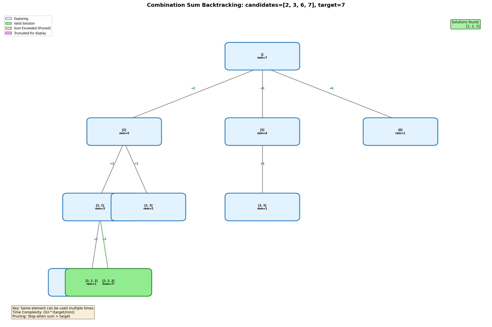
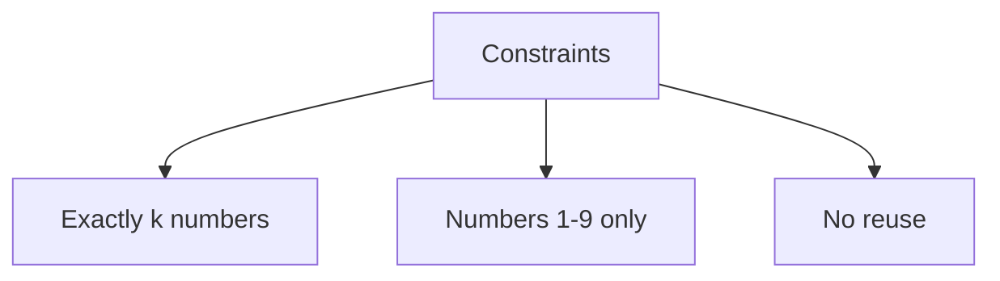
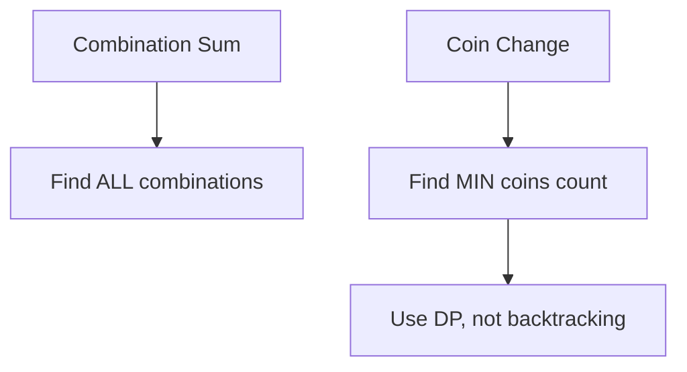

# Combination Sum

> **LeetCode**: [39. Combination Sum](https://leetcode.com/problems/combination-sum/)
> **Difficulty**: Medium
> **Pattern**: Backtracking with Repetition

---

## Problem Statement

Given an array of **distinct** integers `candidates` and a target integer `target`, return a list of all **unique combinations** of `candidates` where the chosen numbers sum to `target`. You may return the combinations in **any order**.

The **same** number may be chosen from `candidates` an **unlimited number of times**. Two combinations are unique if the frequency of at least one of the chosen numbers is different.

The test cases are generated such that the number of unique combinations that sum up to `target` is less than 150 combinations for the given input.

---

## Examples

### Example 1
```text
Input: candidates = [2, 3, 6, 7], target = 7
Output: [[2, 2, 3], [7]]
Explanation:
- 2 + 2 + 3 = 7
- 7 = 7
Both are valid combinations.
```

### Example 2
```text
Input: candidates = [2, 3, 5], target = 8
Output: [[2, 2, 2, 2], [2, 3, 3], [3, 5]]
```

### Example 3
```text
Input: candidates = [2], target = 1
Output: []
Explanation: No combination sums to 1.
```

---

## Constraints

- `1 <= candidates.length <= 30`
- `2 <= candidates[i] <= 40`
- All elements of `candidates` are **distinct**
- `1 <= target <= 40`

---

## Backtracking Tree Visualization



### Key Insight: Reuse Elements

Unlike standard combinations, the same element can be used multiple times.

```text
For candidates = [2, 3], target = 7:

                    []  (remaining=7)
                  /    \
              [2]       [3]
            (rem=5)   (rem=4)
           /    \        \
        [2,2]  [2,3]    [3,3]
       (rem=3) (rem=2)  (rem=1)
       /    \    \
    [2,2,2] [2,2,3] [2,3,3]
   (rem=1)  (rem=-1) (rem=-1)
     |        X        X
   [2,2,2,2]
   (rem=-1)
     X

Backtrack! No valid continuation...

Continue with [2,3] path -> [2,2,3] works!
```

---

## Backtracking Template

```python
def combinationSum(candidates, target):
    """
    Template for combination sum with reuse allowed.

    Key difference: Use index `i` (not `i+1`) in recursive call
    to allow reusing the same element.
    """
    result = []

    def backtrack(start, path, remaining):
        # BASE CASE: found valid combination
        if remaining == 0:
            result.append(path[:])
            return

        # PRUNING: exceeded target
        if remaining < 0:
            return

        for i in range(start, len(candidates)):
            # CHOOSE
            path.append(candidates[i])

            # EXPLORE: use `i` (not i+1) to allow reuse
            backtrack(i, path, remaining - candidates[i])

            # UNCHOOSE
            path.pop()

    backtrack(0, [], target)
    return result
```

---

## Solutions

### Solution

::: code-group
```python [Python]
def combinationSum(candidates: list, target: int) -> list:
    """
    Find all combinations that sum to target (reuse allowed).

    Time Complexity: O(n^(target/min)) where min is smallest candidate
    Space Complexity: O(target/min) for recursion depth
    """
    result = []

    def backtrack(start, path, remaining):
        if remaining == 0:
            result.append(path[:])
            return

        if remaining < 0:
            return

        for i in range(start, len(candidates)):
            path.append(candidates[i])
            # Use i (not i+1) to allow reusing same element
            backtrack(i, path, remaining - candidates[i])
            path.pop()

    backtrack(0, [], target)
    return result


# Test
print(combinationSum([2, 3, 6, 7], 7))
# Output: [[2, 2, 3], [7]]
```

```java [Java]
public List<List<Integer>> combinationSum(int[] candidates, int target) {
    List<List<Integer>> result = new ArrayList<>();
    backtrack(result, new ArrayList<>(), candidates, 0, target);
    return result;
}

private void backtrack(List<List<Integer>> result,
                       List<Integer> path,
                       int[] candidates,
                       int start,
                       int remaining) {
    if (remaining == 0) {
        result.add(new ArrayList<>(path)); // deep copy
        return;
    }
    if (remaining < 0) return;
    for (int i = start; i < candidates.length; i++) {
        path.add(candidates[i]);
        // Pass i (not i+1) to allow reusing the same element
        backtrack(result, path, candidates, i, remaining - candidates[i]);
        path.remove(path.size() - 1);
    }
}
```
:::

::: info Complexity: Time O(n^(T/M)) · Space O(T/M)
- **Time:** In the worst case, we branch n ways at each level, and the tree depth is target/min(candidates). Each valid combination takes O(T/M) to copy.
- **Space:** Maximum recursion depth is target divided by the smallest candidate (how many times we can reuse the smallest element).
:::

### Solution 2: Backtracking with Sorting and Pruning

```python
def combinationSum_optimized(candidates: list, target: int) -> list:
    """
    Optimized with sorting and early termination.

    Sorting allows us to break early when candidate > remaining.

    Time Complexity: O(n^(target/min)) but with better pruning
    Space Complexity: O(target/min)
    """
    result = []
    candidates.sort()  # Sort for pruning optimization

    def backtrack(start, path, remaining):
        if remaining == 0:
            result.append(path[:])
            return

        for i in range(start, len(candidates)):
            # Early termination: if current candidate > remaining,
            # all subsequent candidates will also be > remaining
            if candidates[i] > remaining:
                break

            path.append(candidates[i])
            backtrack(i, path, remaining - candidates[i])
            path.pop()

    backtrack(0, [], target)
    return result


# Test
print(combinationSum_optimized([2, 3, 6, 7], 7))
# Output: [[2, 2, 3], [7]]
```

::: info Complexity: Time O(n^(T/M)) · Space O(T/M)
- **Time:** Same worst-case complexity, but sorting enables early termination (break instead of continue) when candidate exceeds remaining.
- **Space:** Recursion depth is still bounded by target/min(candidates); sorting is O(n log n) which is dominated by the exponential work.
:::

### Solution 3: Dynamic Programming

```python
def combinationSum_dp(candidates: list, target: int) -> list:
    """
    DP approach: Build combinations bottom-up.

    dp[i] = list of all combinations that sum to i

    Time Complexity: O(target * n * average_combination_length)
    Space Complexity: O(target * num_combinations)
    """
    dp = [[] for _ in range(target + 1)]
    dp[0] = [[]]  # One way to sum to 0: empty combination

    for candidate in candidates:
        for i in range(candidate, target + 1):
            for combination in dp[i - candidate]:
                dp[i].append(combination + [candidate])

    return dp[target]


# Test
print(combinationSum_dp([2, 3, 6, 7], 7))
# Output: [[2, 2, 3], [7]]
```

::: info Complexity: Time O(T * n * L) · Space O(T * C)
- **Time:** For each value from 1 to target, we iterate through n candidates, and extending combinations takes O(L) where L is average combination length.
- **Space:** dp array stores all combinations for each sum from 0 to target; C is the total number of combinations across all sums.
:::

### Solution 4: BFS Approach

```python
from collections import deque

def combinationSum_bfs(candidates: list, target: int) -> list:
    """
    BFS approach using a queue.

    Time Complexity: O(n^(target/min))
    Space Complexity: O(n^(target/min)) for queue
    """
    result = []
    candidates.sort()
    queue = deque([(0, [], target)])  # (start_idx, path, remaining)

    while queue:
        start, path, remaining = queue.popleft()

        if remaining == 0:
            result.append(path)
            continue

        for i in range(start, len(candidates)):
            if candidates[i] > remaining:
                break
            queue.append((i, path + [candidates[i]], remaining - candidates[i]))

    return result


# Test
print(combinationSum_bfs([2, 3, 6, 7], 7))
```

::: info Complexity: Time O(n^(T/M)) · Space O(n^(T/M))
- **Time:** Similar to backtracking; BFS explores the same search space level by level instead of depth-first.
- **Space:** The queue can hold all partial combinations at the current BFS level, which can be exponential in size.
:::

---

## Complexity Analysis

| Approach | Time | Space | Notes |
|----------|------|-------|-------|
| Basic Backtracking | O(n^(T/M)) | O(T/M) | T=target, M=min candidate |
| With Sorting | O(n^(T/M)) | O(T/M) | Better pruning |
| DP | O(T * n * L) | O(T * C) | L=avg length, C=num combinations |

### Understanding the Time Complexity

The worst case is when we can reuse the smallest element many times:
- If `min(candidates) = 2` and `target = 10`
- We could have combinations like [2,2,2,2,2]
- Maximum depth of recursion: `target / min(candidates)`
- At each level, we try up to `n` candidates

---

## Pruning Visualization

```text
Without sorting (candidates = [7, 3, 2], target = 5):
- Try 7: 7 > 5, continue...
- Try 3: [3], remaining = 2
  - Try 7: 7 > 2, continue...
  - Try 3: 3 > 2, continue...
  - Try 2: [3,2], remaining = 0, SUCCESS!
- Try 2: [2], remaining = 3
  - ...continues exploring...

With sorting (candidates = [2, 3, 7], target = 5):
- Try 2: [2], remaining = 3
  - Try 2: [2,2], remaining = 1
    - Try 2: 2 > 1, BREAK! (skip 3, 7 too)
  - Try 3: [2,3], remaining = 0, SUCCESS!
  - Try 7: 7 > 3, BREAK!
- Try 3: [3], remaining = 2
  - Try 3: 3 > 2, BREAK! (skip 7 too)
- Try 7: 7 > 5, BREAK!

Sorting allows `break` instead of `continue`!
```

---

## Common Mistakes

### 1. Using i+1 Instead of i
```python
# WRONG - doesn't allow reusing elements
def wrong(candidates, target):
    def backtrack(start, path, remaining):
        for i in range(start, len(candidates)):
            path.append(candidates[i])
            backtrack(i + 1, path, remaining - candidates[i])  # i+1 is wrong!
            path.pop()

# CORRECT - use i to allow reuse
def correct(candidates, target):
    def backtrack(start, path, remaining):
        for i in range(start, len(candidates)):
            path.append(candidates[i])
            backtrack(i, path, remaining - candidates[i])  # i allows reuse!
            path.pop()
```

### 2. Forgetting Pruning Base Case
```python
# INEFFICIENT - continues even when remaining < 0
def inefficient(candidates, target):
    def backtrack(start, path, remaining):
        if remaining == 0:
            result.append(path[:])
            return
        # Missing: if remaining < 0: return
        for i in range(start, len(candidates)):
            path.append(candidates[i])
            backtrack(i, path, remaining - candidates[i])  # Goes negative!
            path.pop()

# CORRECT - prune when remaining < 0
def correct(candidates, target):
    def backtrack(start, path, remaining):
        if remaining == 0:
            result.append(path[:])
            return
        if remaining < 0:  # Pruning!
            return
```

---

## Comparison: Combination Problems

| Problem | Reuse Allowed? | Duplicates in Input? | Index in Recursion |
|---------|---------------|---------------------|-------------------|
| Combination Sum | Yes | No | `i` |
| Combination Sum II | No | Yes | `i + 1` + skip duplicates |
| Combination Sum III | No | No | `i + 1` |
| Subsets | No | No | `i + 1` |

---

## Related Problems

::: details Combination Sum II (LeetCode 40)
**Problem:** Find unique combinations that sum to target. Each number used once, input may have duplicates.

**Key Insight:** Two changes: use i+1 (no reuse) and skip duplicates at same level.

```mermaid
graph TD
    A[Combination Sum] --> B[Use index i - allow reuse]
    A --> C[No duplicate handling]
    D[Combination Sum II] --> E[Use index i+1 - no reuse]
    D --> F[Skip duplicates: i > start AND nums[i] == nums[i-1]]
```

**Approach:** Sort + skip duplicates + track remaining sum + use i+1.

**Complexity:** O(2^n) time, O(n) space

**Link:** [Local Solution](./combination-sum-ii.md)
:::

::: details Combination Sum III (LeetCode 216)
**Problem:** Find k numbers from 1-9 that sum to n. Each number used at most once.

**Key Insight:** Fixed pool (1-9), fixed count (k), no duplicates in input.



**Approach:** Backtracking with two termination conditions: count == k AND sum == n.

**Complexity:** O(C(9,k) * k) time, O(k) space

**Link:** [LeetCode 216](https://leetcode.com/problems/combination-sum-iii/)
:::

::: details Coin Change (LeetCode 322)
**Problem:** Find minimum number of coins needed to make amount.

**Key Insight:** Optimization problem (min count) vs enumeration (all combinations).



**Approach:** DP with dp[amount] = min coins. dp[i] = min(dp[i], dp[i-coin] + 1).

**Complexity:** O(amount * n) time, O(amount) space

**Link:** [LeetCode 322](https://leetcode.com/problems/coin-change/)
:::

::: details Coin Change 2 (LeetCode 518)
**Problem:** Count the number of combinations that sum to amount.

**Key Insight:** Counting problem vs listing problem. Use DP instead of backtracking.

```mermaid
graph TD
    A[Combination Sum] --> B[List all combinations]
    C[Coin Change 2] --> D[Count combinations]
    D --> E[DP: dp[i] += dp[i-coin]]
```

**Approach:** DP counting. Process coins in outer loop to avoid duplicate counts.

**Complexity:** O(amount * n) time, O(amount) space

**Link:** [LeetCode 518](https://leetcode.com/problems/coin-change-ii/)
:::

---

## Interview Tips

1. **Clarify reuse**: "Can I use the same element multiple times?"
2. **Explain the key insight**: Use `i` instead of `i+1` for reuse
3. **Mention pruning**: Sort + early termination optimization
4. **Draw the tree**: Shows understanding of branching factor
5. **Discuss complexity**: Explain why it's exponential

---

## Key Takeaways

1. **Use `i` in recursive call** to allow element reuse
2. **Two base cases**: `remaining == 0` (success) and `remaining < 0` (prune)
3. **Sorting enables better pruning** with early `break`
4. **Start index prevents duplicates** like [2,3] and [3,2]
5. **Complexity is exponential** in target/min(candidates)

---

*Last updated: January 2026*
