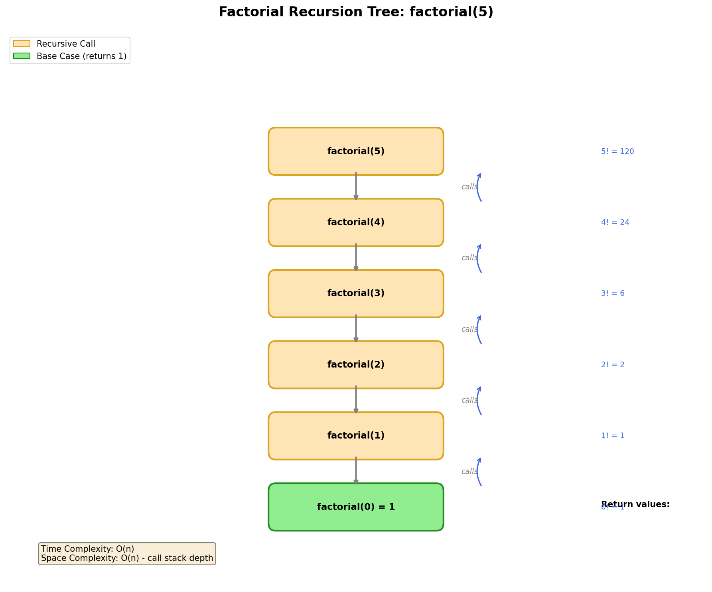

# Factorial

> **LeetCode**: N/A (Fundamental recursion problem)
> **Difficulty**: Easy
> **Pattern**: Basic Recursion

---

## Problem Statement

Calculate the factorial of a non-negative integer `n`.

The factorial of `n` (denoted as `n!`) is the product of all positive integers less than or equal to `n`.

**Mathematical Definition:**
- `n! = n * (n-1) * (n-2) * ... * 2 * 1`
- `0! = 1` (by definition)
- `1! = 1`

---

## Examples

### Example 1
```
Input: n = 5
Output: 120
Explanation: 5! = 5 * 4 * 3 * 2 * 1 = 120
```

### Example 2
```
Input: n = 0
Output: 1
Explanation: 0! = 1 by definition
```

### Example 3
```
Input: n = 3
Output: 6
Explanation: 3! = 3 * 2 * 1 = 6
```

---

## Constraints

- `0 <= n <= 12` (to avoid integer overflow in 32-bit systems)
- For larger values, use 64-bit integers or arbitrary precision libraries

---

## Recursion Tree Visualization



### Call Stack Trace

```
factorial(5) called
|
+-- factorial(4) called
|   |
|   +-- factorial(3) called
|   |   |
|   |   +-- factorial(2) called
|   |   |   |
|   |   |   +-- factorial(1) called
|   |   |   |   |
|   |   |   |   +-- factorial(0) called
|   |   |   |   |   |
|   |   |   |   |   +-- return 1  (BASE CASE)
|   |   |   |   |
|   |   |   |   +-- return 1 * 1 = 1
|   |   |   |
|   |   |   +-- return 2 * 1 = 2
|   |   |
|   |   +-- return 3 * 2 = 6
|   |
|   +-- return 4 * 6 = 24
|
+-- return 5 * 24 = 120

RESULT: factorial(5) = 120
```

---

## Recursive Template

```python
def factorial(n):
    """
    Recursive factorial template.

    Components:
    1. BASE CASE: Stop condition (n <= 1)
    2. RECURSIVE CASE: n * factorial(n-1)
    """
    # BASE CASE
    if n <= 1:
        return 1

    # RECURSIVE CASE
    return n * factorial(n - 1)
```

---

## Solutions

### Solution 1: Basic Recursion

```python
def factorial(n: int) -> int:
    """
    Calculate factorial using basic recursion.

    Time Complexity: O(n) - n recursive calls
    Space Complexity: O(n) - call stack depth

    Args:
        n: Non-negative integer

    Returns:
        n! (factorial of n)
    """
    # Base case: 0! = 1! = 1
    if n <= 1:
        return 1

    # Recursive case: n! = n * (n-1)!
    return n * factorial(n - 1)


# Test
print(factorial(5))  # Output: 120
print(factorial(0))  # Output: 1
print(factorial(10)) # Output: 3628800
```

::: info Complexity: Time O(n) · Space O(n)
- **Time:** Exactly n recursive calls, each performing one multiplication operation.
- **Space:** Call stack grows to depth n, with each frame storing the return address and local variable n.
:::

### Solution 2: Tail Recursion (Optimized for some languages)

```python
def factorial_tail(n: int, accumulator: int = 1) -> int:
    """
    Tail-recursive factorial.

    Note: Python doesn't optimize tail recursion, but this pattern
    is useful in languages that do (Scheme, Scala, etc.)

    Time Complexity: O(n)
    Space Complexity: O(n) in Python, O(1) in tail-call optimized languages
    """
    if n <= 1:
        return accumulator
    return factorial_tail(n - 1, n * accumulator)


# Test
print(factorial_tail(5))  # Output: 120
```

::: info Complexity: Time O(n) · Space O(n) in Python, O(1) with TCO
- **Time:** Still makes n recursive calls with one multiplication each.
- **Space:** Python does not optimize tail calls, so stack still grows to depth n. Languages with tail-call optimization (Scheme, Scala) can reuse the same stack frame, achieving O(1) space.
:::

### Solution 3: Iterative (Best for Python)

```python
def factorial_iterative(n: int) -> int:
    """
    Iterative factorial - most efficient for Python.

    Time Complexity: O(n)
    Space Complexity: O(1)
    """
    result = 1
    for i in range(2, n + 1):
        result *= i
    return result


# Test
print(factorial_iterative(5))  # Output: 120
```

::: info Complexity: Time O(n) · Space O(1)
- **Time:** Single loop from 2 to n, performing n-1 multiplications.
- **Space:** Only one variable (result) is used, no recursion stack needed.
:::

### Solution 4: Using math library

```python
import math

def factorial_builtin(n: int) -> int:
    """
    Using Python's built-in factorial.

    Time Complexity: O(n)
    Space Complexity: O(1)
    """
    return math.factorial(n)


# Test
print(factorial_builtin(5))  # Output: 120
```

::: info Complexity: Time O(n) · Space O(1)
- **Time:** Built-in implementation uses optimized iterative approach with n multiplications.
- **Space:** Internally uses constant extra space for the computation.
:::

### Solution 5: Using reduce

```python
from functools import reduce

def factorial_reduce(n: int) -> int:
    """
    Factorial using reduce.

    Time Complexity: O(n)
    Space Complexity: O(1)
    """
    if n <= 1:
        return 1
    return reduce(lambda x, y: x * y, range(1, n + 1))


# Test
print(factorial_reduce(5))  # Output: 120
```

::: info Complexity: Time O(n) · Space O(1)
- **Time:** Reduce applies the lambda function n-1 times across the range, performing n-1 multiplications.
- **Space:** Reduce processes elements sequentially, accumulating the result without storing intermediate values.
:::

---

## Complexity Analysis

| Approach | Time Complexity | Space Complexity | Notes |
|----------|----------------|------------------|-------|
| Basic Recursion | O(n) | O(n) | Call stack depth |
| Tail Recursion | O(n) | O(n)* | *O(1) with TCO |
| Iterative | O(n) | O(1) | Most efficient |
| Built-in (math) | O(n) | O(1) | Recommended |

### Why O(n) Time?
- We perform exactly `n` multiplications
- Each multiplication is O(1) for bounded integers

### Why O(n) Space for Recursion?
- Maximum call stack depth is `n`
- Each stack frame stores local variables and return address

---

## Common Mistakes

### 1. Missing Base Case
```python
# WRONG - infinite recursion!
def factorial_wrong(n):
    return n * factorial_wrong(n - 1)

# CORRECT
def factorial_correct(n):
    if n <= 1:  # BASE CASE is essential!
        return 1
    return n * factorial_correct(n - 1)
```

### 2. Wrong Base Case Value
```python
# WRONG - returns 0 for any input
def factorial_wrong(n):
    if n == 0:
        return 0  # Should be 1!
    return n * factorial_wrong(n - 1)
```

### 3. Not Handling Negative Input
```python
def factorial_safe(n: int) -> int:
    """Handle edge cases properly."""
    if n < 0:
        raise ValueError("Factorial not defined for negative numbers")
    if n <= 1:
        return 1
    return n * factorial_safe(n - 1)
```

---

## Related Problems

::: details Fibonacci Number (LeetCode 509)
**Problem:** Calculate F(n), where F(0)=0, F(1)=1, and F(n)=F(n-1)+F(n-2) for n>1.

**Key Insight:** Unlike factorial's single recursive call, Fibonacci has two calls - introducing overlapping subproblems.

```mermaid
graph TD
    A[Factorial: Single Path] --> B[n * factorial(n-1)]
    C[Fibonacci: Binary Tree] --> D[fib(n-1)]
    C --> E[fib(n-2)]
```

**Approach:** Requires memoization for efficiency due to overlapping subproblems.

**Complexity:** O(n) with memoization, O(2^n) without

**Link:** [Local Solution](./fibonacci.md)
:::

::: details Climbing Stairs (LeetCode 70)
**Problem:** Count distinct ways to climb n stairs taking 1 or 2 steps at a time.

**Key Insight:** Same recurrence as Fibonacci but with different base cases.

**Approach:** ways(n) = ways(n-1) + ways(n-2), where ways(1)=1, ways(2)=2.

**Complexity:** O(n) time, O(1) space with optimization

**Link:** [Local Solution](./climbing-stairs.md)
:::

::: details Pow(x, n) (LeetCode 50)
**Problem:** Implement pow(x, n), which calculates x raised to the power n.

**Key Insight:** Use divide and conquer - x^n = (x^(n/2))^2, reducing O(n) to O(log n).

```mermaid
graph TD
    A[pow(x, n)] --> B{n is even?}
    B -->|Yes| C[pow(x, n/2) * pow(x, n/2)]
    B -->|No| D[x * pow(x, n-1)]
    E[Optimization: half = pow(x, n/2), return half * half]
```

**Approach:** Binary exponentiation - square the half result.

**Complexity:** O(log n) time, O(log n) space

**Link:** [LeetCode 50](https://leetcode.com/problems/powx-n/)
:::

---

## Interview Tips

1. **Start with the recurrence relation**: `n! = n * (n-1)!`
2. **Identify the base case**: `0! = 1! = 1`
3. **Discuss time/space complexity**: Both O(n) for recursion
4. **Mention iterative alternative**: More efficient in Python
5. **Handle edge cases**: Negative numbers, large inputs

---

## Key Takeaways

1. **Factorial is the simplest recursion example** - perfect for understanding the pattern
2. **Base case is essential** - prevents infinite recursion
3. **Each recursive call reduces the problem size** - n becomes n-1
4. **Call stack grows linearly** - O(n) space
5. **Iterative is often better** - avoid stack overflow for large inputs

---

*Last updated: January 2026*
