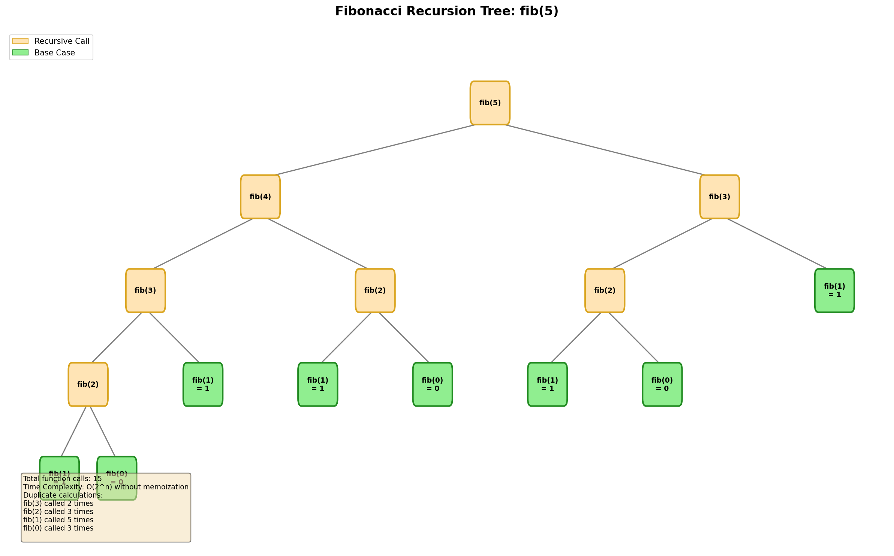
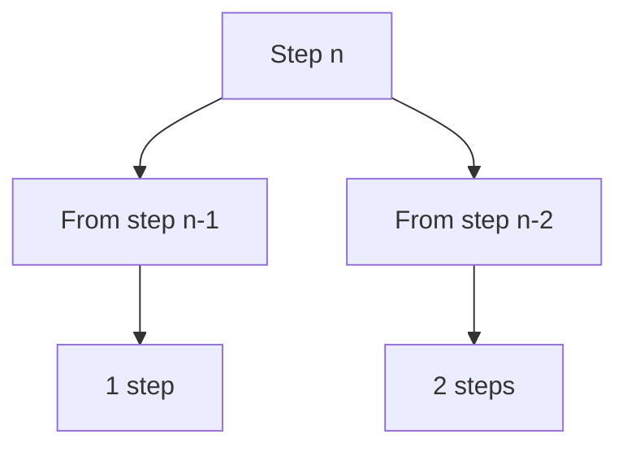

# Fibonacci Sequence

> **LeetCode**: [509. Fibonacci Number](https://leetcode.com/problems/fibonacci-number/)
> **Difficulty**: Easy
> **Pattern**: Basic Recursion, Memoization

---

## Problem Statement

The **Fibonacci numbers**, commonly denoted `F(n)` form a sequence, called the **Fibonacci sequence**, such that each number is the sum of the two preceding ones, starting from 0 and 1.

```
F(0) = 0
F(1) = 1
F(n) = F(n - 1) + F(n - 2), for n > 1
```

Given `n`, calculate `F(n)`.

---

## Examples

### Example 1
```
Input: n = 2
Output: 1
Explanation: F(2) = F(1) + F(0) = 1 + 0 = 1
```

### Example 2
```
Input: n = 3
Output: 2
Explanation: F(3) = F(2) + F(1) = 1 + 1 = 2
```

### Example 3
```
Input: n = 4
Output: 3
Explanation: F(4) = F(3) + F(2) = 2 + 1 = 3
```

### Example 4
```
Input: n = 10
Output: 55
```

---

## Constraints

- `0 <= n <= 30`

---

## Recursion Tree Visualization



### Key Insight: Overlapping Subproblems

Notice how the same subproblems are computed multiple times:
- `fib(3)` is computed 2 times
- `fib(2)` is computed 3 times
- `fib(1)` is computed 5 times

This exponential redundancy is why naive recursion is O(2^n)!

### Call Trace for fib(5)

```
fib(5)
├── fib(4)
│   ├── fib(3)
│   │   ├── fib(2)
│   │   │   ├── fib(1) -> 1
│   │   │   └── fib(0) -> 0
│   │   └── fib(1) -> 1
│   └── fib(2)
│       ├── fib(1) -> 1
│       └── fib(0) -> 0
└── fib(3)
    ├── fib(2)
    │   ├── fib(1) -> 1
    │   └── fib(0) -> 0
    └── fib(1) -> 1

Total calls: 15
Result: 5
```

---

## Recursive Template

```python
def fib(n):
    """
    Fibonacci recursive template.

    Components:
    1. BASE CASES: F(0) = 0, F(1) = 1
    2. RECURSIVE CASE: F(n) = F(n-1) + F(n-2)
    """
    # BASE CASES
    if n <= 1:
        return n

    # RECURSIVE CASE (two recursive calls)
    return fib(n - 1) + fib(n - 2)
```

---

## Solutions

### Solution 1: Naive Recursion (O(2^n) - DON'T USE!)

```python
def fib_naive(n: int) -> int:
    """
    Naive recursive Fibonacci - exponential time!

    Time Complexity: O(2^n) - each call branches into 2
    Space Complexity: O(n) - maximum call stack depth

    WARNING: Very slow for n > 30
    """
    if n <= 1:
        return n
    return fib_naive(n - 1) + fib_naive(n - 2)


# Test (slow for large n)
print(fib_naive(10))  # Output: 55
```

::: info Complexity: Time O(2^n) · Space O(n)
- **Time:** Each call branches into two recursive calls, creating a binary tree with 2^n nodes. Overlapping subproblems are recomputed, leading to exponential redundancy.
- **Space:** Maximum recursion depth is n (the call stack grows linearly from fib(n) to fib(1)).
:::

### Solution 2: Memoization (Top-Down DP)

```python
def fib_memo(n: int, memo: dict = None) -> int:
    """
    Fibonacci with memoization.

    Time Complexity: O(n) - each subproblem solved once
    Space Complexity: O(n) - memo dict + call stack

    This is the KEY optimization for recursion with overlapping subproblems!
    """
    if memo is None:
        memo = {}

    # Check if already computed
    if n in memo:
        return memo[n]

    # Base cases
    if n <= 1:
        return n

    # Compute and store result
    memo[n] = fib_memo(n - 1, memo) + fib_memo(n - 2, memo)
    return memo[n]


# Test
print(fib_memo(50))  # Output: 12586269025 (fast!)
```

::: info Complexity: Time O(n) · Space O(n)
- **Time:** Each subproblem from 0 to n is computed exactly once and stored in the memo dictionary, eliminating redundant calculations.
- **Space:** The memo dictionary stores n entries, and the call stack can grow up to depth n.
:::

### Solution 3: Using @lru_cache (Pythonic)

```python
from functools import lru_cache

@lru_cache(maxsize=None)
def fib_cached(n: int) -> int:
    """
    Fibonacci with Python's built-in memoization.

    Time Complexity: O(n)
    Space Complexity: O(n)

    Most Pythonic solution for interview!
    """
    if n <= 1:
        return n
    return fib_cached(n - 1) + fib_cached(n - 2)


# Test
print(fib_cached(50))  # Output: 12586269025
```

::: info Complexity: Time O(n) · Space O(n)
- **Time:** The @lru_cache decorator memoizes results, so each value from 0 to n is computed once.
- **Space:** Cache stores n entries, plus O(n) call stack depth for the recursive calls.
:::

### Solution 4: Tabulation (Bottom-Up DP)

```python
def fib_dp(n: int) -> int:
    """
    Fibonacci with bottom-up dynamic programming.

    Time Complexity: O(n)
    Space Complexity: O(n) - can be optimized to O(1)
    """
    if n <= 1:
        return n

    dp = [0] * (n + 1)
    dp[1] = 1

    for i in range(2, n + 1):
        dp[i] = dp[i - 1] + dp[i - 2]

    return dp[n]


# Test
print(fib_dp(50))  # Output: 12586269025
```

::: info Complexity: Time O(n) · Space O(n)
- **Time:** Single pass from 2 to n, filling the dp array with one O(1) operation per iteration.
- **Space:** The dp array stores n+1 values to build up the solution iteratively.
:::

### Solution 5: Space-Optimized (O(1) Space)

::: code-group
```python [Python]
def fib_optimized(n: int) -> int:
    """
    Space-optimized Fibonacci - BEST SOLUTION.

    Time Complexity: O(n)
    Space Complexity: O(1) - only two variables!
    """
    if n <= 1:
        return n

    prev, curr = 0, 1
    for _ in range(2, n + 1):
        prev, curr = curr, prev + curr

    return curr


# Test
print(fib_optimized(50))  # Output: 12586269025
```

```java [Java]
public int fib(int n) {
    if (n <= 1) return n;
    int prev = 0, curr = 1;
    for (int i = 2; i <= n; i++) {
        int next = prev + curr;
        prev = curr;
        curr = next;
    }
    return curr;
}
```
:::

::: info Complexity: Time O(n) · Space O(1)
- **Time:** Single loop from 2 to n with constant-time operations per iteration.
- **Space:** Only two variables (prev, curr) are maintained, regardless of input size.
:::

### Solution 6: Matrix Exponentiation (O(log n))

```python
def fib_matrix(n: int) -> int:
    """
    Fibonacci using matrix exponentiation.

    Time Complexity: O(log n)
    Space Complexity: O(1)

    Based on: [[F(n+1), F(n)], [F(n), F(n-1)]] = [[1,1],[1,0]]^n
    """
    if n <= 1:
        return n

    def matrix_mult(A, B):
        """Multiply two 2x2 matrices."""
        return [
            [A[0][0]*B[0][0] + A[0][1]*B[1][0], A[0][0]*B[0][1] + A[0][1]*B[1][1]],
            [A[1][0]*B[0][0] + A[1][1]*B[1][0], A[1][0]*B[0][1] + A[1][1]*B[1][1]]
        ]

    def matrix_pow(M, p):
        """Matrix exponentiation using binary method."""
        result = [[1, 0], [0, 1]]  # Identity matrix
        while p:
            if p & 1:
                result = matrix_mult(result, M)
            M = matrix_mult(M, M)
            p >>= 1
        return result

    base = [[1, 1], [1, 0]]
    result = matrix_pow(base, n)
    return result[0][1]


# Test
print(fib_matrix(50))  # Output: 12586269025
```

::: info Complexity: Time O(log n) · Space O(1)
- **Time:** Matrix exponentiation uses binary method, halving the exponent each iteration, resulting in O(log n) matrix multiplications.
- **Space:** Only 2x2 matrices are used (constant size), no recursion stack needed.
:::

---

## Complexity Analysis

| Approach | Time | Space | Notes |
|----------|------|-------|-------|
| Naive Recursion | O(2^n) | O(n) | DON'T USE - exponential |
| Memoization | O(n) | O(n) | Top-down DP |
| @lru_cache | O(n) | O(n) | Pythonic memoization |
| Tabulation | O(n) | O(n) | Bottom-up DP |
| Space-Optimized | O(n) | O(1) | **Best for interviews** |
| Matrix Expo | O(log n) | O(1) | Optimal but complex |

### Recursion Call Count Comparison

| n | Naive Calls | Memoized Calls |
|---|-------------|----------------|
| 5 | 15 | 9 |
| 10 | 177 | 19 |
| 20 | 21,891 | 39 |
| 30 | 2,692,537 | 59 |

---

## Why Memoization Works

```
WITHOUT MEMOIZATION:              WITH MEMOIZATION:
       fib(5)                           fib(5)
      /      \                         /      \
   fib(4)   fib(3)                 fib(4)   fib(3) [cached]
   /    \   /    \                 /    \
fib(3) fib(2) ...               fib(3) fib(2) [cached]
                                /    \
                            fib(2) fib(1) [cached]

15 calls total                  9 calls total
```

**Key Insight**: Memoization transforms the recursion tree into a DAG (Directed Acyclic Graph), eliminating redundant computations.

---

## Common Mistakes

### 1. Forgetting Memoization
```python
# SLOW - O(2^n)
def fib_slow(n):
    if n <= 1:
        return n
    return fib_slow(n-1) + fib_slow(n-2)

# FAST - O(n) with @lru_cache
@lru_cache(maxsize=None)
def fib_fast(n):
    if n <= 1:
        return n
    return fib_fast(n-1) + fib_fast(n-2)
```

### 2. Mutable Default Argument
```python
# DANGEROUS - memo persists across calls!
def fib_bad(n, memo={}):  # Don't do this!
    pass

# SAFE - initialize inside function
def fib_good(n, memo=None):
    if memo is None:
        memo = {}
```

---

## Related Problems

::: details Climbing Stairs (LeetCode 70)
**Problem:** You are climbing a staircase with n steps. Each time you can climb 1 or 2 steps. How many distinct ways can you climb to the top?

**Key Insight:** This is Fibonacci in disguise! ways(n) = ways(n-1) + ways(n-2).



**Approach:** Apply the same memoization/DP techniques as Fibonacci.

**Complexity:** O(n) time, O(1) space with optimization

**Link:** [Local Solution](./climbing-stairs.md)
:::

::: details House Robber (LeetCode 198)
**Problem:** Given an array of non-negative integers representing money in houses, determine the maximum amount you can rob without robbing adjacent houses.

**Key Insight:** At each house, decide: rob it (add value + skip previous) or skip it (keep previous max).

```mermaid
graph TD
    A[House i] --> B{Rob house i?}
    B -->|Yes| C[nums[i] + dp[i-2]]
    B -->|No| D[dp[i-1]]
    E[dp[i] = max of both]
```

**Approach:** DP with recurrence: dp[i] = max(dp[i-1], dp[i-2] + nums[i])

**Complexity:** O(n) time, O(1) space

**Link:** [LeetCode 198](https://leetcode.com/problems/house-robber/)
:::

::: details N-th Tribonacci Number (LeetCode 1137)
**Problem:** The Tribonacci sequence: T(0)=0, T(1)=1, T(2)=1, and T(n) = T(n-1) + T(n-2) + T(n-3) for n >= 3. Return T(n).

**Key Insight:** Extension of Fibonacci - sum of three previous terms instead of two.

```mermaid
graph LR
    A[T(n-3)] --> D[T(n)]
    B[T(n-2)] --> D
    C[T(n-1)] --> D
```

**Approach:** Track three variables instead of two. Same space optimization applies.

**Complexity:** O(n) time, O(1) space

**Link:** [LeetCode 1137](https://leetcode.com/problems/n-th-tribonacci-number/)
:::

---

## Interview Tips

1. **Start with naive recursion** to show understanding
2. **Identify overlapping subproblems** - draw the tree
3. **Add memoization** to optimize
4. **Discuss space optimization** if asked
5. **Mention matrix exponentiation** for bonus points

---

## Key Takeaways

1. **Fibonacci is the classic example of overlapping subproblems**
2. **Naive recursion is O(2^n)** - never use in production
3. **Memoization reduces to O(n)** - essential technique
4. **@lru_cache is the Pythonic way** to memoize
5. **Space-optimized iterative is best** for interviews
6. **Matrix exponentiation achieves O(log n)** for advanced scenarios

---

*Last updated: January 2026*
